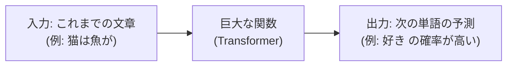
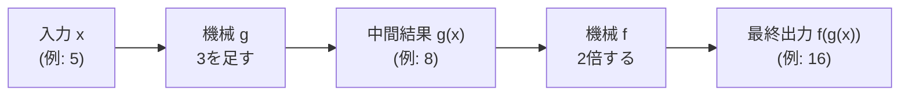
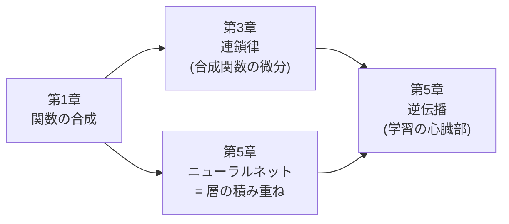

# 第1章 数学の準備(1)— 関数と記号に慣れる

## この章で学ぶこと

- **関数**とは何か。$f(x)$ という記法の読み方と意味
- グラフで関数を「見る」方法(一次関数・二次関数の復習)
- **累乗**と**指数関数**($2^x$ など)、そして「爆発的な増加」の感覚
- **対数**($\log$)— 指数の逆演算。なぜ機械学習は対数だらけなのか
- 自然対数の底 $e$ と $\ln$ の意味
- **$\Sigma$(シグマ)記法** — 「たくさん足す」を1つの記号で書く方法
- **$\max$** と **$\arg\max$** の違い
- **添字**($x_1, x_2, \dots, x_n$)と「$n$ 個のデータ」という考え方
- **関数の合成** $f(g(x))$ — 後の章(微分の連鎖律、ニューラルネットワークの層)への布石

## この章の前提

- 中学数学(文字式、正負の数、簡単な方程式)
- 文系高校数学の基礎(一次関数・二次関数のグラフを見たことがある程度)

これ以上の知識は必要ありません。忘れていても大丈夫なように、必要なことはすべてこの章で復習します。

---

## 1.1 なぜ数学の準備から始めるのか

本書のゴールは、ChatGPTなどの対話AIの心臓部である **Transformer(トランスフォーマー)** という仕組みを、ゼロから理解することです。

ところが、Transformerの解説を開くと、いきなりこんな式が目に飛び込んできます。

$$
\mathrm{Attention}(Q, K, V) = \mathrm{softmax}\!\left(\frac{QK^\top}{\sqrt{d_k}}\right)V
$$

(読み下し: この式は第8章の主役です。今は「なんだか記号だらけで怖い」と思ってもらえれば十分です)

この式、実は使われている数学の部品は多くありません。**関数、行列、内積、指数関数、割り算**。それだけです。部品を1つずつ手に取って、触って、慣れてしまえば、この式は「読める」ようになります。

本書の第1〜3章は、そのための数学の準備体操です。この第1章では、いちばん土台になる「関数」と「数学の記号の読み方」に慣れます。

> **この章の心構え**: 数学は「暗記科目」ではなく「言語」です。英語を学ぶときに単語と文法を覚えるように、数式という言語の「単語」(記号)と「文法」(読み方)に慣れることがこの章の目的です。計算がスラスラできる必要はありません。「読める」ようになれば十分です。

---

## 1.2 関数とは何か — 「入れると出てくる機械」

### 1.2.1 自動販売機のたとえ

**関数(function)** とは、ひとことで言えば「**何かを入れると、決まったルールで何かが出てくる機械**」です。

身近な例で考えましょう。自動販売機は「お金とボタンの選択」を入れると「飲み物」が出てくる機械です。同じボタンを押せば必ず同じ飲み物が出てきます。この「**同じ入力には必ず同じ出力**」というのが関数の大事な性質です。

数学の関数は、入れるものも出てくるものも「数」である機械です。

```text
          +-----------+
  入力 x  |           |  出力 f(x)
 ──────▶ |  関数 f   | ──────▶
          |           |
          +-----------+
```

たとえば「入れた数を2倍して1を足す」という機械を考えます。

- 3 を入れると → 2×3 + 1 = **7** が出てくる
- 0 を入れると → 2×0 + 1 = **1** が出てくる
- −1 を入れると → 2×(−1) + 1 = **−1** が出てくる

### 1.2.2 $f(x)$ という書き方

この機械を数学では次のように書きます。

$$
f(x) = 2x + 1
$$

(読み下し: 「エフ・エックスは、2エックス足す1」と読みます。「$f$ という名前の機械に $x$ を入れると、$2x+1$ が出てくる」という意味です)

記号の意味を分解しましょう。

| 記号 | 読み方 | 意味 |
|---|---|---|
| $f$ | エフ | 機械(関数)の**名前**。$g$ や $h$ など別の名前でもよい |
| $x$ | エックス | 機械に入れるもの(**入力**)。何を入れるかはまだ決めていない「空欄」 |
| $f(x)$ | エフ・エックス | 機械 $f$ に $x$ を入れたときの**出力** |

「$f(3)$」と書いたら「機械 $f$ に 3 を入れた結果」という意味です。

$$
f(3) = 2 \times 3 + 1 = 7
$$

(読み下し: $f$ に 3 を入れると、2掛ける3足す1で、7 が出てくる)

**大事な注意**: $f(x)$ は「$f$ 掛ける $x$」では**ありません**。カッコは掛け算ではなく「機械への投入口」です。ここは初学者が最初につまずくポイントなので、強調しておきます。

### 1.2.3 なぜ「関数」がそんなに大事なのか

先に本書の結論めいたことを言ってしまうと、

> **ChatGPTのような言語モデルの正体は、巨大な関数です。**

「これまでの文章」を入力すると、「次に来る単語の予測」が出力される、とてつもなく大きな関数。それがTransformerです。入力と出力の間には膨大な計算が詰まっていますが、「入れると出てくる機械」という構図自体は $f(x) = 2x+1$ と何も変わりません。

だからこそ、まず関数に慣れることが、本書のすべての出発点になります。



(図: 言語モデルは「文章を入れると次の単語の予測が出てくる」関数。この見方は第3章と第7章で詳しく育てていきます)

---

## 1.3 グラフで関数を「見る」

### 1.3.1 一次関数の復習

関数は式だけでなく**グラフ**でも表せます。グラフとは「入力 $x$ を横軸に、出力 $f(x)$ を縦軸にとって、入出力の対応を絵にしたもの」です。

さきほどの $f(x) = 2x + 1$ をグラフにしてみましょう。まず、いくつかの入力と出力を表にします。

| 入力 $x$ | −2 | −1 | 0 | 1 | 2 |
|---|---|---|---|---|---|
| 出力 $f(x)$ | −3 | −1 | 1 | 3 | 5 |

これを点として打ち、つなぐと直線になります。

```text
 f(x)
  5 |                    ●   f(x) = 2x + 1
  4 |                 /
  3 |              ●
  2 |           /
  1 |        ●              ← x=0 のとき f(x)=1(切片)
  0 +-----/-------------→ x
 -1 |  ●
 -2 |/
 -3 ●
    -2  -1   0   1   2
```

(図: 一次関数 $f(x)=2x+1$ のグラフ。まっすぐな直線で、$x$ が 1 増えるごとに $f(x)$ が 2 ずつ増える)

このように、出力が一直線に増えたり減ったりする関数を **一次関数(linear function)** と呼びます。一般形は次のとおりです。

$$
f(x) = ax + b
$$

(読み下し: 出力は、入力 $x$ を $a$ 倍して $b$ を足したもの)

- $a$ は **傾き(slope)**: $x$ が 1 増えたとき $f(x)$ がいくつ増えるか
- $b$ は **切片(intercept)**: $x = 0$ のときの出力

**具体例**: $a = 2, b = 1$ なら $f(x) = 2x+1$。$x$ が 1 増えるたびに出力は 2 増え、$x=0$ では出力 1 です。上の表とグラフで確かめられます。

この「傾き」という言葉は、第3章の**微分**でそのまま主役になります。覚えておいてください。

### 1.3.2 二次関数の復習 — 「谷」の形

次は **二次関数(quadratic function)** です。いちばん簡単な例で見ます。

$$
f(x) = x^2
$$

(読み下し: 出力は、入力 $x$ を2乗したもの。$x^2$ は「エックスの2乗」= $x \times x$)

表を作ります。

| 入力 $x$ | −3 | −2 | −1 | 0 | 1 | 2 | 3 |
|---|---|---|---|---|---|---|---|
| 出力 $f(x)$ | 9 | 4 | 1 | 0 | 1 | 4 | 9 |

```text
 f(x)
  9 ●                       ●   f(x) = x²
  8 |\                     /
  7 | \                   /
  6 |  \                 /
  5 |   \               /
  4 |    ●             ●
  3 |     \           /
  2 |      \         /
  1 |       ●       ●
  0 +--------\--●--/---------→ x
    -3  -2  -1  0  1   2   3
              谷底(最小値)
```

(図: 二次関数 $f(x)=x^2$ のグラフ。左右対称の「谷」の形。$x=0$ で最小値 0 をとる)

注目してほしいのは、このグラフが「**谷**」の形をしていて、**谷底(いちばん低い点)がある**ことです。

なぜこれが大事なのか。実は機械学習の「学習」とは、

> 「モデルの間違い度合い」を表す関数(損失関数と呼びます)の**谷底を探すこと**

だからです。谷の形をした関数の底を、坂を転がり降りるようにして探す——これが第4章で学ぶ**勾配降下法**の正体です。二次関数の「谷」の絵は、本書で何度も戻ってくる原風景なので、ここでしっかり目に焼き付けておいてください。

---

## 1.4 累乗と指数関数 — 爆発的な増加

### 1.4.1 累乗の復習

**累乗(power)** は「同じ数を繰り返し掛ける」ことです。

$$
2^3 = 2 \times 2 \times 2 = 8
$$

(読み下し: 「2の3乗」は、2を3回掛け合わせたもので、8)

- $2^1 = 2$
- $2^2 = 4$
- $2^3 = 8$
- $2^4 = 16$
- $2^{10} = 1024$(約1000)

右肩の小さい数($3$ など)を **指数(exponent)**、掛けられる数($2$)を **底(てい、base)** と呼びます。

ついでに、後で使う約束事を2つ紹介します。

- $2^0 = 1$(どんな数でも「0乗は1」と決めます)
- $2^{-1} = \frac{1}{2}$、$2^{-2} = \frac{1}{4}$(マイナス乗は「逆数」= 1をその数で割ったもの)

「0乗が1?」と不思議に感じるかもしれませんが、表を見ると自然です。

| $x$ | 3 | 2 | 1 | 0 | −1 | −2 |
|---|---|---|---|---|---|---|
| $2^x$ | 8 | 4 | 2 | **1** | 1/2 | 1/4 |

右に1つ進むごとに「÷2」されています。$2^1 = 2$ の右隣は $2 \div 2 = 1$。だから $2^0 = 1$。その右隣は $1 \div 2 = 1/2$。だから $2^{-1} = 1/2$。ルールが一直線につながっているのです。

### 1.4.2 指数関数 — 増え方が「加速」する

指数の部分を変数 $x$ にした関数

$$
f(x) = 2^x
$$

(読み下し: 出力は、2の $x$ 乗)

を **指数関数(exponential function)** と呼びます。グラフを見てみましょう。

```text
 f(x)
 16 |                          ●   f(x) = 2^x
 14 |                         /
 12 |                        /
 10 |                       /
  8 |                     ●
  6 |                    /
  4 |                 ●
  2 |             ●
  1 |        ●
0.5 |   ●
  0 +--●----------------------→ x
   -2  -1    0    1    2    3    4
```

(図: 指数関数 $f(x)=2^x$ のグラフ。右に行くほど急激に立ち上がる。左側は 0 に近づくが決して 0 にはならない)

一次関数 $f(x) = 2x$ と比べてみると、違いは歴然です。

| $x$ | 1 | 2 | 3 | 5 | 10 | 20 |
|---|---|---|---|---|---|---|
| $2x$(一次関数) | 2 | 4 | 6 | 10 | 20 | 40 |
| $2^x$(指数関数) | 2 | 4 | 8 | 32 | 1024 | 1,048,576 |

$x = 20$ の時点で、一次関数は 40 なのに、指数関数は **100万超え**。これが「**指数的な増加**」「爆発的な増加」と呼ばれるものです。紙を42回折ると月に届く(厚さが $2^{42}$ 倍になるから)、という有名な話もこの性質によるものです。

### 1.4.3 なぜ指数関数が本書に必要なのか

指数関数は本書で2回、重要な場面に登場します。

1. **softmax関数**(第5章): Transformerが「次の単語の確率」を計算するとき、$e^x$ という指数関数を使います。指数関数の「大きい値をさらに大きく引き伸ばす」性質が、「有力候補を際立たせる」働きをします。
2. **組み合わせ爆発**(第7章): 「単語の並びのパターン数」は文が長くなると指数的に爆発します。これが昔の言語モデル(n-gram)の限界の原因でした。

「指数 = とんでもない勢いで増える」という体感を持っておいてください。

---

## 1.5 対数 — 指数の「逆」

### 1.5.1 対数とは「何乗?」に答える数

**対数(logarithm、ログ)** は、指数の逆の質問に答えるものです。

- 指数の質問: 「2 を 3 乗したらいくつ?」 → 答え 8($2^3 = 8$)
- 対数の質問: 「2 を **何乗** したら 8 になる?」 → 答え 3

この「何乗?」の答えを、次のように書きます。

$$
\log_2 8 = 3
$$

(読み下し: 「ログ、底2の8」は3。意味は「2を何乗したら8になるか? その答えは3」)

具体例をいくつか並べます。声に出して「2を何乗したら○○?」と読んでみてください。

- $\log_2 2 = 1$(2を1乗したら2)
- $\log_2 4 = 2$(2を2乗したら4)
- $\log_2 1024 = 10$(2を10乗したら1024)
- $\log_2 1 = 0$(2を0乗したら1。さっきの「0乗は1」がここで効きます)
- $\log_2 \frac{1}{2} = -1$(2をマイナス1乗したら1/2)

グラフにすると、指数関数を横倒しにしたような、ゆるやかに増える曲線になります。

```text
 log₂(x)
  3 |                                    ●  (x=8)
  2 |                    ●  (x=4)
  1 |          ●  (x=2)
  0 +-----●--------------------------------→ x   ← この ● が (x=1)
 -1 |  ●                                          ← この ● が (x=0.5)
    0    1    2    3    4    5    6    7    8
```

(図: 対数関数 $\log_2 x$ のグラフ。増えるには増えるが、どんどん増え方がゆるやかになる。$x=1$ でちょうど 0 を通る)

指数関数が「爆発」なら、対数は「**爆発を飼いならすもの**」です。1024 という大きな数も、対数を通すと 10 というおとなしい数になります。100万を超える $2^{20}$ も、対数を通せばただの 20 です。

### 1.5.2 なぜ機械学習は対数だらけなのか

機械学習の教科書や論文を開くと、$\log$ が至るところに出てきます。理由は大きく2つあります。

**理由1: 掛け算を足し算に変えられる**

対数には次の美しい性質があります。

$$
\log(a \times b) = \log a + \log b
$$

(読み下し: 「掛け算のログ」は「ログの足し算」に分解できる)

**具体例**で確かめます。$\log_2 (4 \times 8) = \log_2 32 = 5$。一方、$\log_2 4 + \log_2 8 = 2 + 3 = 5$。確かに一致しました。なぜ成り立つかも簡単で、$4 \times 8 = 2^2 \times 2^3 = 2^{2+3} = 2^5$、つまり**掛け算は指数の世界では足し算**だからです。

機械学習では「確率をたくさん掛け合わせる」計算が頻出します(例:「文全体の確率 = 各単語の確率の掛け算」— 第7章で登場します)。掛け算の連続は扱いにくいのですが、対数をとれば全部足し算になり、計算も分析も楽になります。

**理由2: 極端に小さい数・大きい数を扱いやすくする**

確率は 1 より小さい数です。それを100個も掛け合わせると、$0.1^{100} = 10^{-100}$ のような、コンピュータでもまともに表現できない微小な数になります。対数をとると $10^{-100}$ は「$-100$」というただの負の数になり、安全に扱えます。

| 元の数 | 対数($\log_{10}$)をとった値 |
|---|---|
| 1,000,000 | 6 |
| 1,000 | 3 |
| 1 | 0 |
| 0.001 | −3 |
| 0.000001 | −6 |

(表: 桁違いの数たちが、対数の世界では「6, 3, 0, −3, −6」と等間隔に並ぶ。対数は「桁数を数えるものさし」)

この性質は、第5章の**交差エントロピー**(モデルの採点法)や、第13章の**スケーリング則**(両対数グラフ)でそのまま効いてきます。

### 1.5.3 自然対数 $e$ と $\ln$

対数の底には 2 や 10 のほか、数学で特別扱いされる数 $e$(**ネイピア数**、約 2.718)がよく使われます。底を $e$ とする対数を **自然対数(natural logarithm)** と呼び、$\ln x$ または単に $\log x$ と書きます(機械学習の文脈で底の書いていない $\log$ は、たいてい自然対数です)。

$e$ とは何者か。厳密な定義には踏み込みませんが、直感だけ述べます。

> $e$ は「**増え方が、いまの自分の大きさに比例する**」ような自然な成長(利息が利息を生む複利、細胞分裂など)を記述するときに、必然的に現れる数です。$f(x) = e^x$ という関数は「どの瞬間も、増える勢いが自分自身の値とぴったり等しい」という際立った性質を持ちます(この性質の意味は第3章の微分でもう一度触れます)。

本書では「$e \approx 2.718$ という定数で、$e^x$ は $2^x$ と同じく爆発的に増える指数関数。$\ln$ はその逆」という理解で十分です。softmax(第5章)では $e^x$ が、交差エントロピー(第5章)では $\ln$ が主役になります。

**具体例**: $e^0 = 1$、$e^1 \approx 2.718$、$e^2 \approx 7.389$、$\ln 1 = 0$、$\ln e = 1$、$\ln 7.389 \approx 2$。

---

## 1.6 $\Sigma$(シグマ)記法 — 「たくさん足す」を短く書く

### 1.6.1 読み方

機械学習の数式でおそらく最頻出の記号が、ギリシャ文字の **$\Sigma$(シグマ)** です。意味はただひとつ、「**足し算の繰り返し**」です。

$$
\sum_{i=1}^{5} i = 1 + 2 + 3 + 4 + 5 = 15
$$

(読み下し: 「$i$ を 1 から 5 まで動かしながら、$i$ を全部足す」。つまり 1+2+3+4+5 で 15)

記号の各部分はこう読みます。

```text
        上端: i をどこまで動かすか(5 まで)
         ↓
         5
        Σ   i   ← 足すもの(この式を i を変えながら足す)
       i=1
         ↑
        下端: カウンタの名前は i、1 からスタート
```

プログラミングを知っている方なら「forループで合計を計算する」ことと完全に同じです。知らない方は「$i$ に 1, 2, 3, … と順に数を入れて、出てきた値を全部足す作業の指示書」と思ってください。

### 1.6.2 具体例を3つ

**例1: 2乗の和**

$$
\sum_{i=1}^{4} i^2 = 1^2 + 2^2 + 3^2 + 4^2 = 1 + 4 + 9 + 16 = 30
$$

(読み下し: $i$ を 1 から 4 まで動かし、それぞれの2乗を足す。答えは30)

**例2: データの平均**

$x_1 = 2, x_2 = 5, x_3 = 8$ という3つのデータの平均は、

$$
\frac{1}{3} \sum_{i=1}^{3} x_i = \frac{1}{3}(x_1 + x_2 + x_3) = \frac{2 + 5 + 8}{3} = 5
$$

(読み下し: 3つのデータを全部足して、データの個数3で割る。つまり平均。答えは5)

見慣れた「平均」も、シグマで書くとこうなります。$n$ 個に一般化すれば $\frac{1}{n}\sum_{i=1}^{n} x_i$ です。

**例3: 「確率の合計は1」**

サイコロの各目が出る確率を $p_1, p_2, \dots, p_6$(それぞれ $\frac{1}{6}$)とすると、

$$
\sum_{i=1}^{6} p_i = \frac{1}{6} + \frac{1}{6} + \frac{1}{6} + \frac{1}{6} + \frac{1}{6} + \frac{1}{6} = 1
$$

(読み下し: 全部の目の確率を足すと1になる)

この「確率を全部足すと1」は第3章で確率を学ぶときの大原則で、シグマを使うとこのように1行で書けます。Transformerが出力する「次の単語の確率分布」も、語彙5万語分の確率をシグマで全部足すと1になります。

### 1.6.3 シグマを恐れないコツ

シグマの式に出会ったら、**必ず小さい具体例で展開してみる**こと。$\sum_{i=1}^{n}$ と書いてあったら、頭の中で $n=3$ にして「1番目 + 2番目 + 3番目」と書き下す。それだけで、たいていの式は正体を現します。本書でもシグマが出てくるたびに、必ず展開した形を添えます。

---

## 1.7 $\max$ と $\arg\max$ — 「最大値」と「最大にする場所」

### 1.7.1 $\max$: いちばん大きい値そのもの

**$\max$(マックス)** は「並んでいるものの中でいちばん大きい**値**」を返します。

$$
\max(3, 8, 5) = 8
$$

(読み下し: 3, 8, 5 のうち最大の値は 8)

### 1.7.2 $\arg\max$: 最大値が「どこで」出たか

一方、**$\arg\max$(アーグマックス)** は「いちばん大きい値が出た**場所(番号・引数)**」を返します。arg は argument(引数)の略です。

$x_1 = 3,\; x_2 = 8,\; x_3 = 5$ とすると、

$$
\operatorname*{arg\,max}_{i} \; x_i = 2
$$

(読み下し: $x_i$ を最大にする番号 $i$ は 2。つまり「2番目が優勝」)

$\max$ は「優勝スコア(8点)」、$\arg\max$ は「優勝者(2番の選手)」。この違いをはっきりさせておきましょう。

| 記号 | 質問 | 上の例での答え |
|---|---|---|
| $\max$ | 最大の**値**はいくつ? | 8 |
| $\arg\max$ | 最大値を出したのは**どれ**? | 2番目 |

### 1.7.3 本書での使いどころ

言語モデルは「次の単語」として語彙中の全単語に確率を割り当てます。たとえば「猫は魚が」の続きとして、

| 候補の単語 | 好き | 嫌い | 食べ | 走る |
|---|---|---|---|---|
| 確率 | 0.6 | 0.1 | 0.25 | 0.05 |

このとき、

- $\max = 0.6$(最有力候補の確率の値)
- $\arg\max =$「好き」(最有力候補の単語そのもの)

「いちばん確率の高い単語を選んで出力する」という操作は「確率の $\arg\max$ をとる」と表現されます(第14章の文章生成で正式に登場します)。

---

## 1.8 添字と「$n$ 個のデータ」という考え方

### 1.8.1 添字は「背番号」

データが3個くらいなら $a, b, c$ と別々の文字で呼べますが、機械学習ではデータが数百万・数十億個あります。そこで、**添字(そえじ、index / subscript)** を使います。

$$
x_1, \; x_2, \; x_3, \; \dots, \; x_n
$$

(読み下し: エックス・イチ、エックス・ニ、…、エックス・エヌ。「$x$ という名前のデータが $n$ 個あって、それぞれに背番号が付いている」)

- $x_1$ は「1番のデータ」、$x_i$ は「$i$ 番のデータ」(番号をまだ決めていない代表選手)
- $n$ は「データの総数」。$n = 5$ なら5個、$n = 1{,}000{,}000$ なら100万個

**具体例**: 文「猫は魚が好き」を単語に区切ると `[猫, は, 魚, が, 好き]` の5個。これを

$$
w_1 = \text{猫}, \; w_2 = \text{は}, \; w_3 = \text{魚}, \; w_4 = \text{が}, \; w_5 = \text{好き} \quad (n = 5)
$$

(読み下し: 1番目の単語は「猫」、2番目は「は」、…、5番目は「好き」。単語の総数は $n = 5$)

と書けます($w$ は word の頭文字)。「文とは単語の列 $w_1, w_2, \dots, w_n$ である」— この表記は本書全体で使い続けます。

### 1.8.2 添字が2つ付くこともある

第2章で学ぶ**行列**では、$x_{ij}$ のように添字が2つ付きます。「$i$ 行目・$j$ 列目の値」という意味で、座席表の「$i$ 列目の前から $j$ 番目の席」のようなものです。今は「添字は背番号。2つ付いたら縦横の座席番号」とだけ覚えておいてください。

### 1.8.3 シグマとの合わせ技

添字とシグマを組み合わせると、「$n$ 個のデータ全部について何かをして足す」が書けます。

$$
\frac{1}{n} \sum_{i=1}^{n} x_i
$$

(読み下し: $n$ 個のデータを全部足して $n$ で割る。つまり「データの平均」)

機械学習で頻出する「全データについての損失の平均」(第4章)、「全単語についての重み付き平均」(第8章のAttention!)は、すべてこの形の式です。この形に見慣れておくと、後の章がぐっと楽になります。

---

## 1.9 関数の合成 — 機械を直列につなぐ

### 1.9.1 合成とは「出力を次の入力にする」こと

この章の締めくくりは、本書の設計思想に直結する **関数の合成(function composition)** です。

2つの関数(機械)を用意します。

- $g(x) = x + 3$(3を足す機械)
- $f(x) = 2x$(2倍する機械)

この2つを**直列につなぐ**とどうなるでしょうか。まず $g$ に入れて、その出力をそのまま $f$ に入れるのです。

```text
        +---------+          +---------+
  x     |  g      |  g(x)    |  f      |  f(g(x))
─────▶ | (+3する) | ──────▶ | (2倍する)| ──────▶
        +---------+          +---------+

  例:  5  →  (5+3)=8  →  (8×2)=16
```

(図: 関数の合成。1台目の機械の出力が、そのまま2台目の機械の入力になる)

同じことをMermaidの図でも描いておきます(この「機械の直列つなぎ」はこの章の最重要図です)。



(図: 上のASCII図と同じ内容。合成 $f(g(x))$ とは、機械 $g$ と機械 $f$ をベルトコンベアでつないだ1つの大きな機械のこと)

これを数式では

$$
f(g(x)) = 2(x + 3) = 2x + 6
$$

(読み下し: 「エフ・オブ・ジー・オブ・エックス」。まず $g$ に $x$ を入れ、その結果を $f$ に入れる。中身を計算すると $2x+6$ という1つの新しい関数になる)

と書きます。**内側の $g$ が先、外側の $f$ が後**。カッコの内側から順に処理する、と覚えてください。

**具体例**: $x = 5$ のとき。
1. まず内側: $g(5) = 5 + 3 = 8$
2. 次に外側: $f(8) = 2 \times 8 = 16$
3. 検算: 合成した式 $2x + 6$ に $x=5$ を入れると $2 \times 5 + 6 = 16$。一致しました。

### 1.9.2 順番を変えると結果が変わる

つなぐ順番を逆にしてみます。先に2倍、後で3を足す:

$$
g(f(x)) = (2x) + 3 = 2x + 3
$$

(読み下し: まず $f$ で2倍し、その結果に $g$ で3を足す)

$x = 5$ なら $g(f(5)) = 10 + 3 = 13$。さきほどの 16 と違います。**合成は順番が大事**——料理で「切ってから焼く」と「焼いてから切る」が別物なのと同じです。この事実は、第2章の行列の掛け算(こちらも順番で結果が変わります)への伏線になっています。

### 1.9.3 なぜ合成が本書の鍵なのか

理由を2つ、はっきり予告しておきます。

**その1: ニューラルネットワークは「関数の合成」そのもの**(第5章)

ニューラルネットワークの「層を重ねる」という操作は、関数を合成することに他なりません。

$$
\text{出力} = f_3(f_2(f_1(\text{入力})))
$$

(読み下し: 入力を関数 $f_1$ に通し、その結果を $f_2$ に通し、さらに $f_3$ に通す。「3層のネットワーク」とはこういう意味)

Transformerが「96層」などと言われるのは、96台の機械が直列につながっているということです。1台1台は単純でも、直列につなぐと驚くほど複雑な変換ができる——これが深層学習の核心のアイデアです。

**その2: 合成された関数の微分には「連鎖律」が使える**(第3章)

96台も直列につないだ機械を「学習」させるには、「最後の出力の誤差に対して、各機械がどれだけ責任を負っているか」を計算する必要があります。それを可能にするのが、合成関数の微分ルール=**連鎖律(chain rule)** です。第3章で登場し、第5章の**逆伝播**で花開きます。



(図: この節で学んだ「関数の合成」が、後の章でどうつながっていくかの地図)

---

## 1.10 この章の記号一覧(チートシート)

この章で登場した記号を一覧にまとめます。以降の章で迷子になったら、ここに戻ってきてください。

| 記号 | 読み方 | 意味 | 例 |
|---|---|---|---|
| $f(x)$ | エフ・エックス | 関数 $f$ に $x$ を入れた出力 | $f(x)=2x+1$ なら $f(3)=7$ |
| $a^n$ | エーの $n$ 乗 | $a$ を $n$ 回掛ける | $2^3 = 8$ |
| $a^0$ | エーの0乗 | 必ず 1 | $2^0 = 1$ |
| $a^{-n}$ | エーのマイナス $n$ 乗 | $\frac{1}{a^n}$ | $2^{-1} = \frac{1}{2}$ |
| $\log_a x$ | ログ、底 $a$ の $x$ | 「$a$ を何乗したら $x$?」の答え | $\log_2 8 = 3$ |
| $e$ | イー(ネイピア数) | 約2.718。自然な成長の底 | $e^1 \approx 2.718$ |
| $\ln x$ | ナチュラルログ | 底が $e$ の対数 | $\ln e = 1$ |
| $\sum_{i=1}^{n}$ | シグマ | $i$ を1から $n$ まで動かして全部足す | $\sum_{i=1}^{3} i = 6$ |
| $\max$ | マックス | 最大の値 | $\max(3,8,5)=8$ |
| $\arg\max$ | アーグマックス | 最大値を出した場所・番号 | $\operatorname{arg\,max}(3,8,5)=2$番目 |
| $x_i$ | エックス・アイ | $i$ 番目のデータ(添字=背番号) | $w_1=$猫, $w_2=$は, … |
| $f(g(x))$ | エフ・オブ・ジー・オブ・エックス | 合成: $g$ が先、$f$ が後 | $g(x)=x+3, f(x)=2x$ なら $f(g(5))=16$ |

---

## この章のまとめ

- **関数**は「入れると決まったルールで出てくる機械」。$f(x)$ のカッコは掛け算ではなく投入口。言語モデルの正体も巨大な関数である
- **一次関数** $f(x)=ax+b$ の $a$ は「傾き」。**二次関数** $x^2$ のグラフは「谷」の形で、「谷底を探す」発想が機械学習の学習の原型になる
- **指数関数** $2^x$ は爆発的に増える。**対数** $\log$ はその逆で、「何乗?」に答え、掛け算を足し算に変え、桁違いの数を飼いならす。だから機械学習は対数だらけ
- $e \approx 2.718$ は自然な成長の底。$\ln$ は底 $e$ の対数
- **$\Sigma$** は「足し算の繰り返し」。迷ったら小さい $n$ で展開して読む
- **$\max$** は最大の値、**$\arg\max$** は最大値が出た場所(番号)
- **添字** $x_1, \dots, x_n$ は「$n$ 個のデータの背番号」。文は単語の列 $w_1, \dots, w_n$ と書ける
- **関数の合成** $f(g(x))$ は機械の直列つなぎ。順番が大事。ニューラルネットワークの「層」と微分の「連鎖律」への布石

## 次の章へ

次の章では、**ベクトルと行列**を学びます。Transformerの中では、単語も文も「数の並び(ベクトル)」として扱われます。そして本書全体で最も重要な直感——「**内積は類似度である**」——がいよいよ登場します。この直感ひとつが、第8章のAttentionを理解する鍵そのものになります。

→ [第2章 数学の準備(2)— ベクトルと行列](02-vectors-and-matrices.md)
