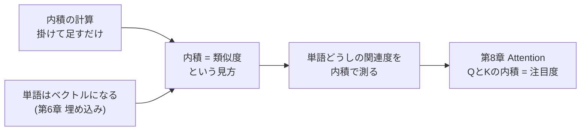
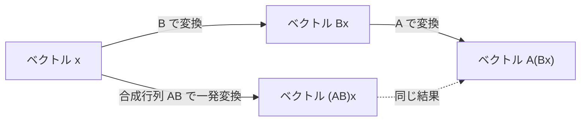

# 第2章 数学の準備(2)— ベクトルと行列

## この章で学ぶこと

- **ベクトル**とは何か — 「数の並び」であり「矢印」でもある、という2つの顔
- ベクトルの足し算と**スカラー倍**
- **内積(dot product)** — 本書で最も重要な演算。計算方法と幾何的な意味
- **「内積 = 類似度」という考え方** — 第8章のAttentionを理解する鍵(本書全体の最重要ポイント)
- **ノルム**(ベクトルの長さ)と**コサイン類似度**
- **行列**とは何か — 数の表であり、ベクトルの束でもある
- 行列 × ベクトル、行列 × 行列の計算方法(手計算で完全に)
- なぜ行列の掛け算はあんな定義なのか — 「行列はベクトルを変換する機械、行列積は変換の合成」
- **転置** $X^\top$
- 「 $n$ 個の $d$ 次元ベクトルは $n \times d$ 行列にまとめられる」— 文章の数値表現の形(第6章への布石)

## この章の前提

- [第1章 数学の準備(1)— 関数と記号に慣れる](01-functions-and-symbols.md)
  - 関数 $f(x)$ の読み方、添字 $x_1, \dots, x_n$ 、 $\Sigma$ 記法、関数の合成 $f(g(x))$ を使います

---

## 2.1 ベクトルとは何か — 2つの顔を持つ数

### 2.1.1 顔その1: 「数の並び」としてのベクトル

**ベクトル(vector)** の1つめの顔は、とても単純です。

> [!IMPORTANT]
> **ベクトルとは、数を順番に並べたもの(数のリスト)である。**

たとえば、ある人の健康診断の結果を「身長170cm、体重60kg」とまとめたとします。この2つの数をセットにして

$$
\mathbf{x} = \begin{pmatrix} 170 \\ 60 \end{pmatrix}
$$

(読み下し: ベクトル $\mathbf{x}$ は、170 と 60 という2つの数を縦に並べたもの)

と書いたもの、これがベクトルです。並んでいる数の個数を **次元(dimension)** と呼びます。上の例は **2次元ベクトル** です。

記法の約束を確認します。

- ベクトルは **太字の小文字** で書きます: $\mathbf{x}, \mathbf{a}, \mathbf{v}$(ただの数 $x$ と区別するため)
- 中身の1つ1つを **成分(component)** と呼び、添字で指します: $\mathbf{x} = \begin{pmatrix} x_1 \\ x_2 \end{pmatrix}$ なら $x_1 = 170$ 、 $x_2 = 60$
- 本書では縦に並べる(**縦ベクトル**)を基本にしますが、紙面の都合で $\mathbf{x} = (170, 60)$ と横に書くこともあります。中身は同じです
- ベクトルでないただの1個の数(3 とか −0.5 とか)は **スカラー(scalar)** と呼びます

3次元なら数が3個、100次元なら数が100個並びます。「100次元」と聞くとSFめいて怖いですが、実体は「**数が100個並んだリスト**」にすぎません。怖がる必要はまったくありません。

### 2.1.2 顔その2: 「矢印」としてのベクトル

ベクトルの2つめの顔は、**矢印**です。2次元ベクトル $\mathbf{a} = \begin{pmatrix} 3 \\ 2 \end{pmatrix}$ を、「原点(0,0)から出発して、右に3、上に2だけ進む矢印」として絵に描くことができます。

```text
  y
  2 |        o          <- 点 (3, 2)
    |      /
  1 |    /              ベクトル a = (3, 2)
    |  /                「右に3、上に2」の矢印
  0 +------------> x
    0  1  2  3  4
```

(図: ベクトル $\mathbf{a} = (3,2)$ を矢印として描いたもの。原点から右に3、上に2進む)

矢印には「**向き**」と「**長さ**」があります。この幾何的なイメージこそが、このあと学ぶ「内積 = 類似度」という見方を支えます。

> [!TIP]
> **2つの顔の使い分け**: 計算するときは「数の並び」の顔で、意味を考えるときは「矢印」の顔で見る。この行き来が自由にできることが、ベクトルに慣れるということです。

### 2.1.3 なぜ本書にベクトルが必要なのか

先回りして言ってしまいます。

> [!IMPORTANT]
> **Transformerの中では、単語1つ1つがベクトル(数の並び)で表されます。**

たとえば「猫」という単語が $(1.2, -0.3, 0.8, 0.1)$ のような4次元(実際のモデルでは数千次元)のベクトルになります。「単語を数の並びにする」方法そのものは第6章(埋め込み)で学びますが、ここで大事な予告をひとつ。

> [!IMPORTANT]
> **意味が似ている単語は、似た向きの矢印(ベクトル)になるように作られます。**

「猫」と「犬」の矢印は近い向きを向き、「猫」と「銀行」の矢印はバラバラの向きを向く。だとすると、「**2つの矢印がどれくらい同じ向きを向いているか**」を数で測れれば、「**2つの単語がどれくらい意味的に近いか**」を計算できることになります。その測る道具が、この章の主役 **内積** です。

---

## 2.2 ベクトルの足し算とスカラー倍

内積に進む前に、ベクトルの基本操作を2つだけ押さえます。どちらも拍子抜けするほど簡単です。

### 2.2.1 足し算: 成分ごとに足すだけ

$$
\begin{pmatrix} 3 \\ 2 \end{pmatrix} + \begin{pmatrix} 1 \\ 2 \end{pmatrix} = \begin{pmatrix} 3+1 \\ 2+2 \end{pmatrix} = \begin{pmatrix} 4 \\ 4 \end{pmatrix}
$$

(読み下し: ベクトルの足し算は、同じ位置の成分どうしを足すだけ。1番目どうし 3+1=4、2番目どうし 2+2=4)

矢印の顔で見ると、足し算は「**矢印をつなげて進む**」ことに対応します。

```text
  y
  4 |           o       <- 到着点 (4, 4)。ここが和 a + b
    |          /
  3 |         /         b = (1, 2) の矢印でさらに進む
    |        /
  2 |        o          <- 中継点 (3, 2)
    |      /
  1 |    /              まず a = (3, 2) の矢印で進み…
    |  /
  0 +------------> x
    0  1  2  3  4
```

(図: $\mathbf{a}+\mathbf{b}$ は「まず $\mathbf{a}$ の矢印で進み、続けて $\mathbf{b}$ の矢印で進む」こと。到着点が和のベクトル)

Transformerの中では「単語の意味ベクトル + 位置の情報ベクトル」(第9章)や「元の入力 + 変換結果」(残差接続、第9章)のように、ベクトルの足し算が「**情報を合流させる**」操作として頻繁に登場します。

### 2.2.2 スカラー倍: 全成分を同じ数で伸び縮み

ベクトルにスカラー(ただの数)を掛けることを **スカラー倍(scalar multiplication)** といいます。全成分にその数を掛けるだけです。

$$
2 \times \begin{pmatrix} 3 \\ 2 \end{pmatrix} = \begin{pmatrix} 6 \\ 4 \end{pmatrix}, \qquad 0.5 \times \begin{pmatrix} 3 \\ 2 \end{pmatrix} = \begin{pmatrix} 1.5 \\ 1 \end{pmatrix}
$$

(読み下し: 2倍すれば各成分が2倍、0.5倍すれば各成分が半分になる)

矢印の顔で見ると、スカラー倍は「**向きを変えずに長さだけ伸び縮みさせる**」操作です(負の数を掛けると向きが真逆になります)。

第8章のAttentionでは「各単語のベクトルに重み(0.7 とか 0.1 とかのスカラー)を掛けて足し合わせる」= **重み付き平均** という操作が中核になります。その部品は、いま学んだ「スカラー倍」と「足し算」だけです。

**具体例(重み付き平均の先取り)**: $\mathbf{a} = \begin{pmatrix} 2 \\ 0 \end{pmatrix}$ に重み 0.8、 $\mathbf{b} = \begin{pmatrix} 0 \\ 2 \end{pmatrix}$ に重み 0.2 を付けて混ぜると、

$$
0.8\,\mathbf{a} + 0.2\,\mathbf{b} = \begin{pmatrix} 1.6 \\ 0 \end{pmatrix} + \begin{pmatrix} 0 \\ 0.4 \end{pmatrix} = \begin{pmatrix} 1.6 \\ 0.4 \end{pmatrix}
$$

(読み下し: $\mathbf{a}$ を8割、 $\mathbf{b}$ を2割の配合で混ぜたベクトル。結果は $\mathbf{a}$ 寄りの位置になる)

「配合率を変えてベクトルをブレンドする」。このイメージは、第8章まで持っていてください。

---

## 2.3 内積 — 本書で最も重要な演算

いよいよ本書全体の**最重要ポイント**に入ります。ここから先の数節は、特に丁寧に読んでください。ここでつかむ考え方が、第8章のAttention(Transformerの中核)を理解できるかどうかを左右します。

### 2.3.1 計算方法: 成分どうしを掛けて、足す

**内積(ないせき、dot product / inner product)** は、**同じ次元の2つのベクトルから、1つのスカラー(ただの数)を作る**演算です。計算ルールはこうです。

**同じ位置の成分どうしを掛けて、全部足す。**

$$
\mathbf{a} \cdot \mathbf{b} = a_1 b_1 + a_2 b_2 + \cdots + a_n b_n = \sum_{i=1}^{n} a_i b_i
$$

(読み下し: ベクトル $\mathbf{a}$ と $\mathbf{b}$ の内積は、1番目の成分どうしの積、2番目の成分どうしの積、…を全部足したもの。第1章のシグマ記法がさっそく登場)

**具体例1**: $\mathbf{a} = \begin{pmatrix} 3 \\ 2 \end{pmatrix}$ 、 $\mathbf{b} = \begin{pmatrix} 1 \\ 4 \end{pmatrix}$ のとき、

$$
\mathbf{a} \cdot \mathbf{b} = 3 \times 1 + 2 \times 4 = 3 + 8 = 11
$$

(読み下し: 1番目どうし 3×1、2番目どうし 2×4 を掛けて、足す。答えは 11 という「ただの数」)

**具体例2**(4次元でも同じこと): $\mathbf{a} = (1, 0, 2, -1)$ 、 $\mathbf{b} = (2, 3, 1, 0)$ のとき、

$$
\mathbf{a} \cdot \mathbf{b} = 1 \times 2 + 0 \times 3 + 2 \times 1 + (-1) \times 0 = 2 + 0 + 2 + 0 = 4
$$

(読み下し: 4組の掛け算をして全部足すと 4)

計算自体は小学生の算数です。**ベクトル2本を入れると、数が1個出てくる**。この「出てきた1個の数」に豊かな意味が宿っています。それをこれから見ていきます。

なお、内積には2つの書き方があります。

$$
\mathbf{a} \cdot \mathbf{b} \quad \text{と} \quad \mathbf{a}^\top \mathbf{b}
$$

(読み下し: 「エー・ドット・ビー」と「エー・転置・ビー」。**どちらも同じ内積**を表します。 $\top$ の記号(転置)は2.7節で説明しますが、先に「同じものの別表記」とだけ約束しておきます。論文では後者が多用されます)

### 2.3.2 幾何的な意味: 内積は「向きの揃い具合 × 長さ」

さて、この「掛けて足すだけ」の計算が、矢印の世界では何を意味するのか。結論から言います。

> [!IMPORTANT]
> **内積は、2つの矢印の「向きがどれくらい揃っているか」を(長さも加味して)測る数である。**
>
> - 同じ向きを向いているほど → 内積は**大きな正の数**
> - 直角(無関係な向き)なら → 内積は**ちょうど 0**
> - 逆向きなら → 内積は**負の数**

まずこの3パターンを、2次元の具体例と図で確かめます。

**パターン1: 向きが揃っている → 内積は大きい**

$\mathbf{a} = \begin{pmatrix} 3 \\ 1 \end{pmatrix}$ 、 $\mathbf{b} = \begin{pmatrix} 2 \\ 1 \end{pmatrix}$ 。どちらも「右上」を向いています。

$$
\mathbf{a} \cdot \mathbf{b} = 3 \times 2 + 1 \times 1 = 7
$$

(読み下し: 似た向きの2本の内積は 7 という大きめの正の数)

```text
  y
  1 |       o   o       <- 左: b = (2,1)、右: a = (3,1)
    |   / /             2本ともほぼ同じ「右上」向き
  0 +------------> x
    0   1   2   3       内積 = 7(大きい正)
```

**パターン2: 直角 → 内積は 0**

$\mathbf{a} = \begin{pmatrix} 2 \\ 0 \end{pmatrix}$(真横)、 $\mathbf{c} = \begin{pmatrix} 0 \\ 2 \end{pmatrix}$(真上)。

$$
\mathbf{a} \cdot \mathbf{c} = 2 \times 0 + 0 \times 2 = 0
$$

(読み下し: 直角に交わる2本の内積はちょうど 0)

```text
  y
  2 o                    <- 縦の線が c = (0,2) 真上向き
    |
  1 |                    c と a は直角に交わる
    |
  0 +=========o-----> x
    0    1    2          <- 「=」の線が a = (2,0) 真横向き。内積 = 0
```

**パターン3: 逆向き → 内積は負**

$\mathbf{a} = \begin{pmatrix} 2 \\ 1 \end{pmatrix}$ 、 $\mathbf{d} = \begin{pmatrix} -2 \\ -1 \end{pmatrix}$(真逆)。

$$
\mathbf{a} \cdot \mathbf{d} = 2 \times (-2) + 1 \times (-1) = -4 - 1 = -5
$$

(読み下し: 正反対を向いた2本の内積は −5 という負の数)

```text
            y
            |       o       <- a = (2,1) 右上向き
            |   /
  ----------+----------> x
        /   |
    o       |               d = (-2,-1) は正反対向き。内積 = -5(負)
```

まとめの表にします。

| 2本の矢印の関係 | 内積の符号・大きさ | イメージ |
|---|---|---|
| ほぼ同じ向き | 大きな正の数 | 「仲間」「似ている」 |
| やや同じ向き | 小さめの正の数 | 「ちょっと似ている」 |
| 直角 | 0 | 「無関係」 |
| やや逆向き | 小さめの負の数 | 「ちょっと反対」 |
| 正反対 | 大きな負の数 | 「正反対」 |

### 2.3.3 なぜ「掛けて足す」と向きの揃い具合が測れるのか

「計算ルールと幾何的意味がなぜ結びつくのか」を、腑に落ちる形で確認しておきましょう(厳密な証明ではなく、イメージの確認です)。

内積 $a_1 b_1 + a_2 b_2$ は「 $x$ 方向の積」と「 $y$ 方向の積」の合計です。

- 2本が**同じ向き**なら、 $x$ 成分の符号も $y$ 成分の符号も揃います(両方プラス、または両方マイナス)。すると各項 $a_i b_i$ はどれも**正**になり、足すとどんどん大きくなる。
- 2本が**逆向き**なら、成分の符号がことごとく食い違い、各項は**負**になり、足すと大きな負になる。
- 2本が**直角**だと、「一方がプラスに効く分を、もう一方の食い違いが打ち消す」形になり、正の項と負の項が**ちょうど相殺**して 0 になる。

**具体例で相殺を確認**: $\mathbf{a} = (1, 1)$(右上45°)と $\mathbf{c} = (-1, 1)$(左上45°)は直角です。内積は

$$
1 \times (-1) + 1 \times 1 = -1 + 1 = 0
$$

(読み下し: $x$ 方向の食い違い(−1)と $y$ 方向の一致(+1)がちょうど打ち消し合って 0)

「方向ごとの一致度を集計している」。これが内積の計算の正体です。

### 2.3.4 【本書最重要】内積 = 類似度

以上を、本書全体を貫く合言葉としてまとめます。本書で何度も立ち戻る大事な一文です。

> [!IMPORTANT]
> **内積は、2つのベクトルの「類似度」を測るものさしである。**
> **内積が大きい = 似ている。内積が 0 に近い = 無関係。負 = 逆方向。**

そして2.1.3節の予告を思い出してください。単語はベクトルで表され、**意味が似た単語は似た向きのベクトルになる**のでした。つなげると、こうなります。

**単語ベクトルどうしの内積を計算すれば、「単語どうしの意味の近さ」が1個の数として手に入る。**

ミニチュアの例で体感しましょう。いま、仮に単語たちが次の2次元ベクトルで表されているとします(値は説明用に作ったものです)。

| 単語 | ベクトル | イメージ |
|---|---|---|
| 猫 | $(2, 1)$ | 動物っぽい方向 |
| 犬 | $(2, 2)$ | 動物っぽい方向 |
| 魚 | $(1, 2)$ | 動物(食べ物寄り)方向 |
| 銀行 | $(-2, 1)$ | まったく別の方向 |

```text
                y
  2             |    o    o     <- 左: 魚 (1,2)、右: 犬 (2,2)
                |
  1   o         |         o     <- 左端: 銀行 (-2,1)、右端: 猫 (2,1)
                |
  0 ------------+------------> x
     -2   -1    0    1    2
```

(図: 単語ベクトルの見取り図。猫・犬・魚は右上のご近所さん、銀行は左上の別世界)

内積(=類似度)を計算してみます。

$$
\text{猫} \cdot \text{犬} = 2 \times 2 + 1 \times 2 = 6
$$

(読み下し: 猫と犬の類似度は 6。高い)

$$
\text{猫} \cdot \text{魚} = 2 \times 1 + 1 \times 2 = 4
$$

(読み下し: 猫と魚の類似度は 4。そこそこ高い)

$$
\text{猫} \cdot \text{銀行} = 2 \times (-2) + 1 \times 1 = -3
$$

(読み下し: 猫と銀行の類似度は −3。むしろ逆方向)

| ペア | 内積 | 解釈 |
|---|---|---|
| 猫・犬 | 6 | とても似ている |
| 猫・魚 | 4 | まあまあ似ている |
| 猫・銀行 | −3 | 似ていない(逆方向) |

**「掛けて足す」だけの計算で、意味の近さがランキングできてしまいました。** これが内積の力です。

### 2.3.5 第8章への予告 — Attentionは内積でできている

なぜここまで内積にこだわるのか。種明かしをします。

Transformerの中核である **Attention(注意機構)** は、「文中のある単語が、他のどの単語に注目すべきか」を決める仕組みです。そして、その「注目度」の計算方法が、まさに **ベクトルどうしの内積をとる** ことなのです。第8章で学ぶ式 $QK^\top$ の実体は、「クエリというベクトルと、キーというベクトルの、**総当たりの内積**」にすぎません。つまり、

- 内積の計算ができて(2.3.1節)
- 内積 = 類似度という意味が分かっていれば(2.3.4節)

Attentionの核心はもう半分理解できたも同然です。**「第2章で学んだ内積が、第8章で効いてくる」**。これが本書でいちばん大事な伏線だと、ここではっきり宣言しておきます。



(図: この章の内積が第8章へつながる道筋。本書最重要の伏線)

---

## 2.4 ノルム — ベクトルの「長さ」

### 2.4.1 定義と計算

矢印には向きだけでなく長さがあります。ベクトルの長さを **ノルム(norm)** と呼び、 $\|\mathbf{a}\|$ と書きます。2次元なら、三平方の定理(直角三角形の斜辺の長さ)そのものです。

$$
\|\mathbf{a}\| = \sqrt{a_1^2 + a_2^2 + \cdots + a_n^2}
$$

(読み下し: ノルムは、各成分を2乗して全部足し、最後にルート(平方根)をとったもの)

**具体例**: $\mathbf{a} = \begin{pmatrix} 3 \\ 4 \end{pmatrix}$ のノルムは、

$$
\|\mathbf{a}\| = \sqrt{3^2 + 4^2} = \sqrt{9 + 16} = \sqrt{25} = 5
$$

(読み下し: 右に3、上に4進む矢印の長さは5。3:4:5の直角三角形でおなじみの値)

```text
  y
  4 |           o           <- 点 (3,4)
    |          /|
  3 |        /  |           斜辺 = ベクトル (3,4) の長さ = 5
    |       /   |
  2 |     /     |           右の縦線: 高さ 4
    |    /      |
  1 |  /        |           下の横線: 底辺 3
    | /         |
  0 +-----------+---> x
    0   1   2   3
```

(図: ベクトル $(3,4)$ の長さ。底辺3・高さ4の直角三角形の斜辺なので5)

ちなみに、**自分自身との内積**をとると $\mathbf{a} \cdot \mathbf{a} = a_1^2 + \cdots + a_n^2$ となり、ノルムの2乗に一致します。つまり $\|\mathbf{a}\| = \sqrt{\mathbf{a} \cdot \mathbf{a}}$ 。内積とノルムは親戚なのです。

### 2.4.2 内積の弱点: 長さに引きずられる

内積を「類似度」として使うとき、1つ注意があります。内積の値は**向きの揃い具合だけでなく、矢印の長さにも比例する**のです。

**具体例**: $\mathbf{a} = (2, 1)$ と $\mathbf{b} = (2, 2)$ の内積は $2 \times 2 + 1 \times 2 = 6$ でした。ここで $\mathbf{b}$ を10倍した $\mathbf{b}' = (20, 20)$ を考えると、向きは全く同じなのに、

$$
\mathbf{a} \cdot \mathbf{b}' = 2 \times 20 + 1 \times 20 = 60
$$

(読み下し: 向きは同じでも、相手が10倍長いと内積も10倍になる)

「向きの近さ」だけを純粋に測りたい場合、長さの影響が邪魔になることがあります。そこで登場するのが次のコサイン類似度です。

---

## 2.5 コサイン類似度 — 長さの影響を消した類似度

### 2.5.1 定義

**コサイン類似度(cosine similarity)** は、内積を両者のノルムで割ったものです。

$$
\cos(\mathbf{a}, \mathbf{b}) = \frac{\mathbf{a} \cdot \mathbf{b}}{\|\mathbf{a}\| \, \|\mathbf{b}\|}
$$

(読み下し: コサイン類似度は、内積を「 $\mathbf{a}$ の長さ × $\mathbf{b}$ の長さ」で割ったもの。長さの寄与を割り算で打ち消して、純粋に「向きの揃い具合」だけを取り出す)

この値は必ず **−1 から +1 の間** に収まり、次のように読めます。

| コサイン類似度 | 意味 |
|---|---|
| 1 | 完全に同じ向き |
| 0.7前後 | かなり似た向き |
| 0 | 直角(無関係) |
| −1 | 正反対 |

名前の由来は、この値が2本の矢印のなす角度 $\theta$(シータ)の「コサイン $\cos\theta$ 」に一致するからです。三角関数を忘れていても大丈夫です。「**−1〜+1に正規化された、向きだけの類似度**」と理解すれば十分です。

### 2.5.2 手計算してみる

2.3.4節の単語ベクトルで、猫と犬のコサイン類似度を計算します。

- 猫 $= (2, 1)$ 、ノルムは $\sqrt{2^2 + 1^2} = \sqrt{5} \approx 2.236$
- 犬 $= (2, 2)$ 、ノルムは $\sqrt{2^2 + 2^2} = \sqrt{8} \approx 2.828$
- 内積は $6$(計算済み)

$$
\cos(\text{猫}, \text{犬}) = \frac{6}{2.236 \times 2.828} \approx \frac{6}{6.325} \approx 0.949
$$

(読み下し: 猫と犬のコサイン類似度は約0.95。ほぼ同じ向き=とても似ている)

同様に猫と銀行($(-2,1)$ 、ノルム $\sqrt{5} \approx 2.236$)では、

$$
\cos(\text{猫}, \text{銀行}) = \frac{-3}{2.236 \times 2.236} = \frac{-3}{5} = -0.6
$$

(読み下し: 猫と銀行は −0.6。向きがかなり食い違っている)

さらに、さきほどの「10倍に伸ばした犬 $\mathbf{b}' = (20,20)$ 」で計算しても、分子も分母も10倍になるので答えは **0.949 のまま変わりません**。長さの影響が消えていることが確認できました。

### 2.5.3 内積とコサイン類似度の使い分け

| | 内積 | コサイン類似度 |
|---|---|---|
| 値の範囲 | 制限なし | −1 〜 +1 |
| 長さの影響 | 受ける | 受けない |
| 計算コスト | 掛けて足すだけ(軽い) | ノルム計算と割り算が追加 |
| 本書での主な登場場面 | 第8章 Attention のスコア計算 | 第6章 単語の意味の近さの測定 |

Transformerの内部(Attention)では、シンプルで高速な**内積**がそのまま使われます(長さの影響が暴れる問題には、第8章で「 $\sqrt{d_k}$ で割る」という別の対処が登場します。これも実は今の話の親戚です)。一方、「この2つの単語はどれくらい似ているか」を人間が調べるときは**コサイン類似度**がよく使われます。

---

## 2.6 行列 — 数の表、そしてベクトルの束

### 2.6.1 行列とは

**行列(matrix)** とは、数を長方形の表の形に並べたものです。

$$
A = \begin{pmatrix} 1 & 2 \\ 3 & 4 \\ 5 & 6 \end{pmatrix}
$$

(読み下し: 行列 $A$ は、数を縦3段・横2列に並べた表)

- 横の並びを **行(row)**、縦の並びを **列(column)** と呼びます。「行は横、列は縦」。漢字の形で覚えるなら「**行**の字は横棒が並び、**列**の字は縦棒(リ)で終わる」
- 上の $A$ は「3行2列の行列」「 $3 \times 2$ 行列」と言います(**行 × 列** の順。縦の段数が先)
- 行列は **大文字イタリック**($A, W, X$ など)で書きます
- 成分は $a_{ij}$(「 $i$ 行 $j$ 列目」)と添字2つで指します。上の例では $a_{12} = 2$ 、 $a_{31} = 5$ です(第1章の「座席番号」の話がここで回収されました)

### 2.6.2 行列の2つの見方

行列には、機械的な「数の表」以上の見方が2つあります。

**見方1: ベクトルを束ねたもの**

$3 \times 2$ 行列は、「2次元の横ベクトルを3本、縦に積んだもの」と見ることができます。

$$
A = \begin{pmatrix} 1 & 2 \\ 3 & 4 \\ 5 & 6 \end{pmatrix}
= \begin{pmatrix} \text{— 1本目の行ベクトル } (1,2) \text{ —} \\ \text{— 2本目の行ベクトル } (3,4) \text{ —} \\ \text{— 3本目の行ベクトル } (5,6) \text{ —} \end{pmatrix}
$$

(読み下し: 行列は「ベクトルの束」。各行が1本のベクトル)

この見方が、本章の最後(2.8節)で「文章 = 単語ベクトルを積んだ行列」という形で具体化します。

**見方2: ベクトルを変換する機械**

もう1つは「行列は、ベクトルを入れると別のベクトルが出てくる**変換機械**」という見方です。これは次の2.6.3節と2.6.5節でじっくり説明します。第1章の「関数 = 機械」の、ベクトル版だと思ってください。

### 2.6.3 行列 × ベクトル — 「行と列の内積を並べる」

行列とベクトルの掛け算を定義します。ここは手を動かすのがいちばんの近道です。

$$
\begin{pmatrix} 1 & 2 \\ 3 & 4 \end{pmatrix} \begin{pmatrix} 5 \\ 6 \end{pmatrix} = \begin{pmatrix} 1 \times 5 + 2 \times 6 \\ 3 \times 5 + 4 \times 6 \end{pmatrix} = \begin{pmatrix} 17 \\ 39 \end{pmatrix}
$$

(読み下し: 結果の1番目の成分は「行列の**1行目**とベクトルの内積」、2番目の成分は「**2行目**とベクトルの内積」)

計算手順を分解します。

> [!TIP]
> **手順: 行列の各行を1本のベクトルとみなし、入力ベクトルとの内積を上から順に計算して並べる。**

```text
  A = [ 1  2 ]        x = [ 5 ]
      [ 3  4 ]            [ 6 ]

  1行目 (1,2) と (5,6) の内積:  1x5 + 2x6 = 17
  2行目 (3,4) と (5,6) の内積:  3x5 + 4x6 = 39

  Ax = [ 17 ]
       [ 39 ]
```

(図: 行列×ベクトルは「各行との内積を並べる」作業。内積がここでも主役)

つまり、**行列 × ベクトルとは「内積の詰め合わせ」** です。2.3節で内積をマスターした皆さんは、もう行列の掛け算の本質を知っていることになります。

**もう1つ具体例**($2 \times 3$ 行列 × 3次元ベクトル):

$$
\begin{pmatrix} 1 & 0 & 2 \\ 0 & 1 & -1 \end{pmatrix} \begin{pmatrix} 3 \\ 4 \\ 1 \end{pmatrix} = \begin{pmatrix} 1 \times 3 + 0 \times 4 + 2 \times 1 \\ 0 \times 3 + 1 \times 4 + (-1) \times 1 \end{pmatrix} = \begin{pmatrix} 5 \\ 3 \end{pmatrix}
$$

(読み下し: 3次元ベクトルを入れると2次元ベクトルが出てきた。 $2 \times 3$ 行列は「3次元→2次元」の変換機械)

この例から大事なルールが見えます。

- $m \times n$ 行列は「 $n$ 次元ベクトルを入れると $m$ 次元ベクトルが出る機械」
- 行列の**列の数**と、入力ベクトルの**次元**が一致していないと掛けられない(機械の投入口のサイズが合わない)

### 2.6.4 「変換機械」としての行列を目で見る

行列がベクトルを「変換」するとはどういうことか、2次元の例で目に見せます。行列 $R = \begin{pmatrix} 0 & -1 \\ 1 & 0 \end{pmatrix}$ に、いくつかのベクトルを入れてみます。

$$
R \begin{pmatrix} 1 \\ 0 \end{pmatrix} = \begin{pmatrix} 0 \\ 1 \end{pmatrix}, \qquad
R \begin{pmatrix} 1 \\ 1 \end{pmatrix} = \begin{pmatrix} -1 \\ 1 \end{pmatrix}
$$

(読み下し: 「右向き」の矢印を入れると「上向き」が出てくる。「右上向き」を入れると「左上向き」が出てくる)

```text
  変換前:
  y
  1 |   o            <- 点 (1,1)
    | /
  0 +---o---> x      <- 軸上の o は点 (1,0)
    0   1

  変換後(90度回転):
        y
  1 o   o            <- 左: 点 (-1,1)、右: 点 (0,1)
      \ |
  ------+---> x
   -1   0   1
```

(図: 行列 $R$ はどんなベクトルも反時計回りに90°回転させる機械だった)

この $R$ は「**90°回転マシン**」だったのです。行列によって、回転させるもの、引き伸ばすもの、押しつぶすもの、いろいろな変換機械が作れます。

そしてこれが、Transformerを理解する上で決定的に重要な見方につながります。

> [!IMPORTANT]
> Transformerの内部にある $W_Q, W_K, W_V$ などの行列(第8章)は、すべて「単語ベクトルを、目的に合った別のベクトルに変換する機械」です。しかも、その変換のしかた(行列の中身の数値)は**学習によって獲得**されます。「学習とは、良い変換機械を作り上げること」なのです。

### 2.6.5 行列 × 行列 — 小さい例で全要素を手計算

次は行列どうしの掛け算です。ルールは行列×ベクトルの自然な拡張です。

**結果の $i$ 行 $j$ 列の成分 = 左の行列の第 $i$ 行と、右の行列の第 $j$ 列の内積。**

$2 \times 2$ どうしの例で、**4つの成分すべて**を手計算します。

$$
AB = \begin{pmatrix} 1 & 2 \\ 3 & 4 \end{pmatrix} \begin{pmatrix} 5 & 6 \\ 7 & 8 \end{pmatrix}
$$

(読み下し: 行列 $A$ と行列 $B$ の積を求める)

1つずつ計算します。

- 結果の (1行, 1列): $A$ の1行目 $(1,2)$ と $B$ の1列目 $(5,7)$ の内積 $= 1 \times 5 + 2 \times 7 = 19$
- 結果の (1行, 2列): $A$ の1行目 $(1,2)$ と $B$ の2列目 $(6,8)$ の内積 $= 1 \times 6 + 2 \times 8 = 22$
- 結果の (2行, 1列): $A$ の2行目 $(3,4)$ と $B$ の1列目 $(5,7)$ の内積 $= 3 \times 5 + 4 \times 7 = 43$
- 結果の (2行, 2列): $A$ の2行目 $(3,4)$ と $B$ の2列目 $(6,8)$ の内積 $= 3 \times 6 + 4 \times 8 = 50$

$$
AB = \begin{pmatrix} 19 & 22 \\ 43 & 50 \end{pmatrix}
$$

(読み下し: 結果も $2 \times 2$ 行列。各マスは「左の行、右の列、その内積」で埋まっている)

```text
            [  5    6 ]      <- 右上: 行列 B(1列目は 5,7、2列目は 6,8)
            [  7    8 ]
  [ 1  2 ]  [ 19   22 ]      <- 上の行: A の1行目 (1,2) と B の各列の内積
  [ 3  4 ]  [ 43   50 ]      <- 下の行: A の2行目 (3,4) と B の各列の内積

  例: 左上のマス 19 は、A の1行目 (1,2) と B の1列目 (5,7) の内積 1x5 + 2x7
```

(図: 行列積の各マスの埋め方。「左から行を、右から列を持ってきて内積」の総当たり表)

サイズのルールも押さえます: $(m \times n)$ 行列 × $(n \times p)$ 行列 $= (m \times p)$ 行列。**内側の $n$ が一致しているときだけ掛けられます**(左の行の長さと右の列の長さが同じでないと内積がとれないから)。

> [!IMPORTANT]
> **ここで気づいてほしいこと**: 行列積の正体は「**内積の総当たり表**」です。第8章に登場する $QK^\top$ という行列積は、「すべてのクエリベクトルと、すべてのキーベクトルの、内積(=類似度)を総当たりで並べた表」、つまり**単語どうしの関連度の一覧表**を一発で作る計算なのです。行列積を学んだ今、あの式の意味はもう半分見えています。

### 2.6.6 なぜこんな定義なのか — 行列積は「変換の合成」

「行と列の内積を並べる」という一見ややこしい定義には、ちゃんと理由があります。

**行列 $A$ と $B$ の積 $AB$ は、「まず $B$ で変換し、続けて $A$ で変換する」という2段変換を、1つの行列にまとめたものになっている。**

第1章の関数の合成 $f(g(x))$ を思い出してください。「 $g$ が先、 $f$ が後」で、合成結果 $f(g(x))$ は1つの新しい関数でした。行列でも全く同じことが起きます。

$$
A(B\mathbf{x}) = (AB)\,\mathbf{x}
$$

(読み下し: 「 $B$ でベクトルを変換してから $A$ で変換する」のと、「先に $AB$ という1個の行列を作っておいて一発で変換する」のは、同じ結果になる)

**具体例で検証**します。 $A = \begin{pmatrix} 1 & 2 \\ 3 & 4 \end{pmatrix}$ 、 $B = \begin{pmatrix} 5 & 6 \\ 7 & 8 \end{pmatrix}$ 、 $\mathbf{x} = \begin{pmatrix} 1 \\ 1 \end{pmatrix}$ 。

**経路1: 2段階で変換**

1. $B\mathbf{x} = \begin{pmatrix} 5 \times 1 + 6 \times 1 \\ 7 \times 1 + 8 \times 1 \end{pmatrix} = \begin{pmatrix} 11 \\ 15 \end{pmatrix}$
2. $A \begin{pmatrix} 11 \\ 15 \end{pmatrix} = \begin{pmatrix} 1 \times 11 + 2 \times 15 \\ 3 \times 11 + 4 \times 15 \end{pmatrix} = \begin{pmatrix} 41 \\ 93 \end{pmatrix}$

**経路2: 先に合成してから一発変換**

さきほど計算した $AB = \begin{pmatrix} 19 & 22 \\ 43 & 50 \end{pmatrix}$ を使って、

$$
(AB)\mathbf{x} = \begin{pmatrix} 19 \times 1 + 22 \times 1 \\ 43 \times 1 + 50 \times 1 \end{pmatrix} = \begin{pmatrix} 41 \\ 93 \end{pmatrix}
$$

(読み下し: 経路1と経路2の結果が $\begin{pmatrix} 41 \\ 93 \end{pmatrix}$ で完全に一致した)

一致しました。**行列積の定義は、「変換の合成が行列1個にまとまる」ように逆算して作られている**のです。「行と列の内積」という手順は、そのための必然だったわけです。



(図: 2段変換と合成行列による一発変換は同じ結果になる。第1章の「関数の合成」の行列版)

なお、関数の合成と同じく、**行列積も順番を入れ替えると結果が変わります**($AB \neq BA$ が普通)。実際、 $BA = \begin{pmatrix} 5 \times 1 + 6 \times 3 & 5 \times 2 + 6 \times 4 \\ 7 \times 1 + 8 \times 3 & 7 \times 2 + 8 \times 4 \end{pmatrix} = \begin{pmatrix} 23 & 34 \\ 31 & 46 \end{pmatrix}$ となり、 $AB = \begin{pmatrix} 19 & 22 \\ 43 & 50 \end{pmatrix}$ とは別物です。

この「行列 = 変換機械、行列積 = 変換の合成」という見方は、第5章で「ニューラルネットの層を重ねる」ことの意味を理解するときの土台になります(そこでは「行列を何個掛けても1個の行列にまとまってしまう=線形だけでは深くする意味がない」という重要な話につながります)。

---

## 2.7 転置 — 行と列をひっくり返す

**転置(てんち、transpose)** は、行列の行と列を入れ替える操作です。記号は右肩の $\top$ で、 $X^\top$(「エックス・転置」「エックス・トランスポーズ」)と読みます。

$$
X = \begin{pmatrix} 1 & 2 \\ 3 & 4 \\ 5 & 6 \end{pmatrix}
\quad \Longrightarrow \quad
X^\top = \begin{pmatrix} 1 & 3 & 5 \\ 2 & 4 & 6 \end{pmatrix}
$$

(読み下し: $3 \times 2$ 行列を転置すると $2 \times 3$ 行列になる。元の1行目 $(1,2)$ が転置後の1列目に、元の2行目 $(3,4)$ が2列目に…と、行が列に生まれ変わる)

```text
   X (3x2)               X^T (2x3)

  [ 1  2 ]
  [ 3  4 ]    ==>    [ 1  3  5 ]
  [ 5  6 ]           [ 2  4  6 ]

  斜めの対角線でパタンと折り返すイメージ
```

(図: 転置は表の縦横をひっくり返す操作)

規則として、 $i$ 行 $j$ 列の成分が $j$ 行 $i$ 列に移ります。ベクトルも転置できます: 縦ベクトル $\mathbf{a} = \begin{pmatrix} 3 \\ 2 \end{pmatrix}$ を転置すると横ベクトル $\mathbf{a}^\top = (3, 2)$ になります。

ここで、2.3.1節で予告した記法の約束を回収します。横ベクトル $\mathbf{a}^\top$(1×2)と縦ベクトル $\mathbf{b}$(2×1)の行列積を、行列のルールどおり計算すると、

$$
\mathbf{a}^\top \mathbf{b} = (3 \quad 2) \begin{pmatrix} 1 \\ 4 \end{pmatrix} = 3 \times 1 + 2 \times 4 = 11
$$

(読み下し: 1×2 行列と 2×1 行列の積は 1×1、つまりただの数。そして中身は内積の計算と完全に同じ)

つまり **$\mathbf{a}^\top \mathbf{b}$ という行列積の記法は、内積 $\mathbf{a} \cdot \mathbf{b}$ と同じもの**です。論文や第8章の式($QK^\top$ など)で転置が出てくるのは、多くの場合「内積をとるために向きを揃えている」だけなのです。「 $\top$ を見たら内積の準備だな」と思えるようになれば、数式への恐怖はだいぶ薄れます。

---

## 2.8 文章を行列にする — 「 $n$ 個の $d$ 次元ベクトル = $n \times d$ 行列」

この章の総仕上げとして、本書の後半につながる最重要の「形」を導入します。

### 2.8.1 単語がベクトルなら、文は行列

2.1.3節で「単語1つ = 1本のベクトル」になると予告しました。では、単語が5個並んだ文はどうなるでしょうか?

通し例の文「猫は魚が好き」をトークン列 `[猫, は, 魚, が, 好き]` に分け、各単語が $d_{\text{model}} = 4$ 次元のベクトルで表されるとします(値は説明用の架空のものです)。

| トークン | ベクトル(4次元) |
|---|---|
| 猫 | $(1, 0, 2, -1)$ |
| は | $(0, 1, 0, 0)$ |
| 魚 | $(2, 0, 1, -1)$ |
| が | $(0, 1, 0, 1)$ |
| 好き | $(1, 2, 0, 1)$ |

この5本の行ベクトルを、上から順に**縦に積み重ねる**と、 $5 \times 4$ の行列になります。

$$
X = \begin{pmatrix} 1 & 0 & 2 & -1 \\ 0 & 1 & 0 & 0 \\ 2 & 0 & 1 & -1 \\ 0 & 1 & 0 & 1 \\ 1 & 2 & 0 & 1 \end{pmatrix}
\begin{matrix} \leftarrow \text{猫} \\ \leftarrow \text{は} \\ \leftarrow \text{魚} \\ \leftarrow \text{が} \\ \leftarrow \text{好き} \end{matrix}
$$

(読み下し: 文「猫は魚が好き」の数値表現。 $i$ 行目が $i$ 番目のトークンのベクトル。行数 5 = トークン数 $n$ 、列数 4 = ベクトルの次元 $d_{\text{model}}$)

一般化すると、次のようになります。

> [!IMPORTANT]
> **トークン数 $n$ 、各トークンが $d$ 次元ベクトルの文は、 $n \times d$ 行列 $X$ で表せる。**
> **「 $i$ 行目を取り出す」=「 $i$ 番目のトークンのベクトルを取り出す」。**

```text
      [  1    0    2   -1 ]     <- 1行目 = 「猫」のベクトル
      [  0    1    0    0 ]     <- 2行目 = 「は」のベクトル
  X = [  2    0    1   -1 ]     <- 3行目 = 「魚」のベクトル
      [  0    1    0    1 ]     <- 4行目 = 「が」のベクトル
      [  1    2    0    1 ]     <- 5行目 = 「好き」のベクトル

  縦方向: 行の数 = トークン数 n = 5
  横方向: 列の数 = 意味を表す次元 d_model = 4

  文 = ベクトルを縦に積んだ n x d 行列 X
```

(図: 本書で最も頻繁に登場する「形」。Transformerの中を流れるデータは、常にこの形の行列)


(図: 文が行列になるまでの流れ。この行列 $X$ が本書後半のすべての議論の出発点になる)

### 2.8.2 なぜ「行列にまとめる」ことがそんなに嬉しいのか

単なる整理整頓に見えるかもしれませんが、これには計算上の決定的な利点があります。

**5個のトークン全部に同じ変換(行列 $W$)を適用したい**とします。1本ずつ $W\mathbf{x}_1, W\mathbf{x}_2, \dots$ と5回計算する代わりに、行列積 $XW$ を**1回**計算すれば、全トークンの変換が同時に終わります(行列積の各行が、各トークンの変換結果になるからです。2.6.5節の「総当たり」計算を思い出してください)。

そしてGPU(画像処理装置)というハードウェアは、まさにこの「大きな行列積を一発で計算する」ことが桁外れに得意です。

> [!IMPORTANT]
> **文を行列にまとめる → 全単語の処理が行列積1回になる → GPUで一気に並列計算できる。**

実はこれこそが、Transformerが以前の技術(RNN、第7章)に取って代わった大きな理由の1つです。RNNは単語を1個ずつ順番に処理するしかありませんでしたが、Transformerは文全体を1つの行列として同時に処理できるのです。この伏線は第7章・第8章で回収します。

---

## 2.9 この章の記号一覧(チートシート)

| 記号 | 読み方 | 意味 | 例 |
|---|---|---|---|
| $\mathbf{a}, \mathbf{x}$ | ベクトル(太字小文字) | 数の並び/矢印 | $\mathbf{a} = (3, 2)$ |
| $a_i$ | エー・アイ | ベクトルの第 $i$ 成分 | $\mathbf{a}=(3,2)$ なら $a_2 = 2$ |
| $\mathbf{a} \cdot \mathbf{b}$ | エー・ドット・ビー | 内積 = 掛けて足す = 類似度 | $(3,2)\cdot(1,4) = 11$ |
| $\|\mathbf{a}\|$ | ノルム | ベクトルの長さ | $\|(3,4)\| = 5$ |
| $\cos(\mathbf{a},\mathbf{b})$ | コサイン類似度 | 長さの影響を消した類似度(−1〜1) | 猫と犬で約0.95 |
| $A, W, X$ | 行列(大文字) | 数の表/ベクトルの束/変換機械 | $2\times2$ 行列など |
| $a_{ij}$ | エー・アイ・ジェー | 行列の $i$ 行 $j$ 列成分 | 座席番号 |
| $AB$ | 行列積 | 内積の総当たり表/変換の合成 | 順番を変えると別物 |
| $X^\top$ | エックス・転置 | 行と列の入れ替え | $\mathbf{a}^\top\mathbf{b}$ = 内積 |
| $n \times d$ 行列 | — | $n$ 個の $d$ 次元ベクトルの束 | 文「猫は魚が好き」= $5 \times 4$ |

---

## この章のまとめ

- **ベクトル**は「数の並び」であり「矢印」でもある。計算は数の並びで、意味は矢印で考える。単語はベクトルで表される(詳細は第6章)
- 足し算は「成分ごと」、**スカラー倍**は「全成分を伸縮」。組み合わせると「重み付き平均(ブレンド)」ができる — 第8章Attentionの部品
- **内積**は「同じ位置の成分を掛けて全部足す」演算で、ベクトル2本から数1個を作る。幾何的には「**向きの揃い具合**」を測っている
- **【本書最重要】内積 = 類似度**。大きい=似ている、0=無関係、負=逆方向。第8章のAttentionは、この内積で「単語どうしの注目度」を計算する
- **ノルム**はベクトルの長さ。**コサイン類似度**は内積をノルムで割って長さの影響を消した、−1〜+1の純粋な「向きの類似度」
- **行列**は数の表であり、「ベクトルの束」とも「ベクトルの変換機械」とも見られる
- **行列 × ベクトル**は「各行との内積を並べる」。**行列 × 行列**は「内積の総当たり表」で、意味は「**変換の合成**」(第1章の関数合成の行列版)。順番を変えると結果が変わる
- **転置** $X^\top$ は行と列の入れ替え。 $\mathbf{a}^\top\mathbf{b}$ は内積と同じもの
- **$n$ 個の $d$ 次元ベクトル = $n \times d$ 行列**。文はこの形の行列 $X$ になり、行列積1回で全単語を同時処理できる(GPU並列化、Transformerの強みの源泉)

## 次の章へ

次の章では、数学の準備の最終回として**微分・勾配・確率**を学びます。「機械が学習する」とは、損失(間違い度合い)という関数の谷底を、傾きを頼りに下っていくことです。その「傾き」を教えてくれるのが微分と勾配。そして「次に来る単語を確率で予測する」という、本書全体の核心となるものの見方も、この次の章で手に入れます。

→ [第3章 数学の準備(3)— 微分・勾配・確率](03-derivatives-gradients-probability.md)
