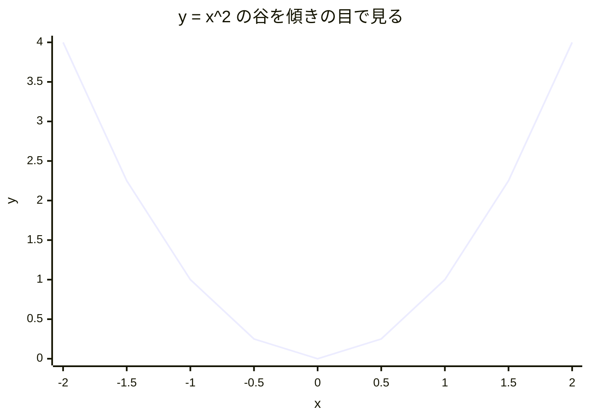
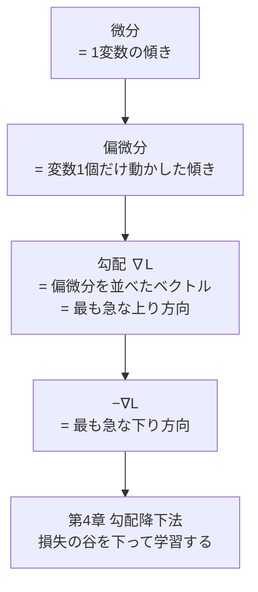
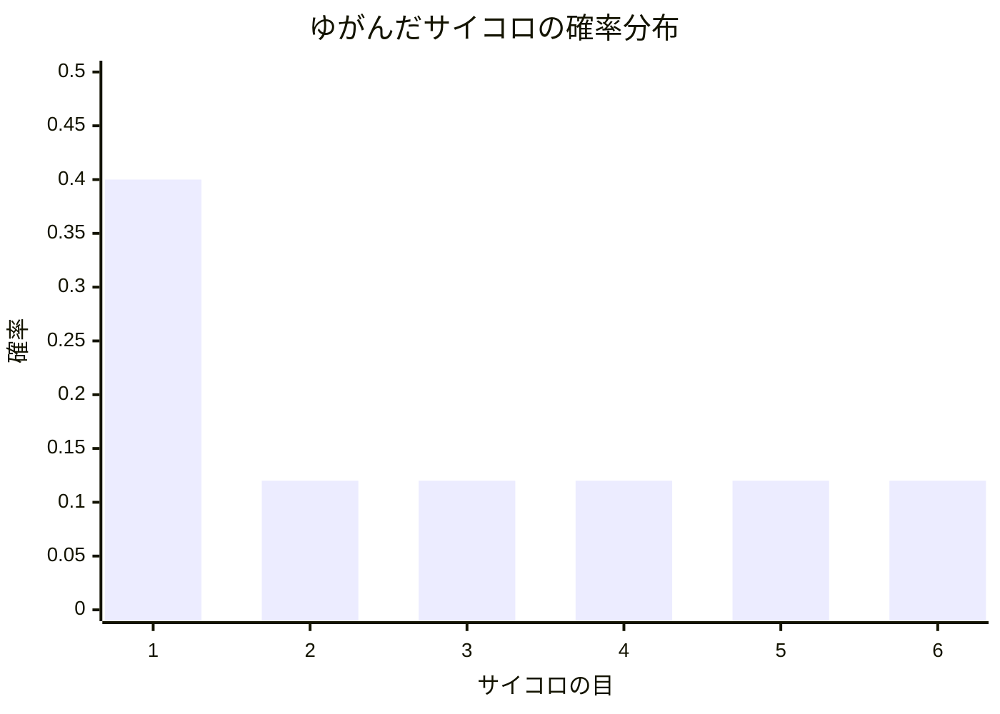
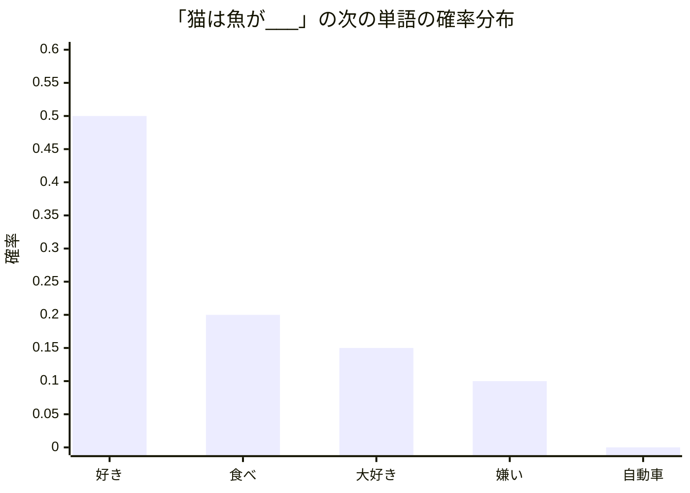
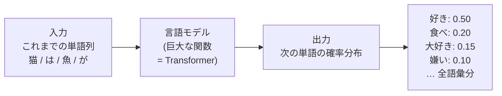

# 第3章 数学の準備(3)— 微分・勾配・確率

## この章で学ぶこと

- **微分**とは何か — 「変化率」であり「グラフの傾き」である
- 基本的な微分の計算例($x^2$ など、2〜3個だけ)
- 「**傾きが0の場所が谷底**」という、機械学習の学習を支える発想
- **偏微分** — 変数が2個以上あるとき、1個だけ動かして傾きを測る。記号 $\partial$ の読み方
- **勾配(gradient)** $\nabla L$ — 「最も急な上り方向」を指す矢印。マイナスを付ければ下り方向(第4章の勾配降下法への布石)
- **連鎖律(chain rule)** — 合成関数の微分は「変化率の掛け算」(第5章の逆伝播への布石)
- 確率の基礎の復習 — 確率の和は1、**条件付き確率** $P(A \mid B)$
- **確率分布**(離散)と棒グラフでの見方
- **期待値** = 重み付き平均
- 「**文の次に来る単語」を確率分布と見る発想** — 本書全体の核心となるものの見方

## この章の前提

- [第1章 数学の準備(1)— 関数と記号に慣れる](01-functions-and-symbols.md)
  - 関数 $f(x)$ 、グラフ、「傾き」という言葉、 $\Sigma$ 記法、関数の合成 $f(g(x))$ を使います
- [第2章 数学の準備(2)— ベクトルと行列](02-vectors-and-matrices.md)
  - ベクトル(数の並び)の考え方を「勾配」のところで使います

---

## 3.1 なぜ微分と確率を学ぶのか

数学の準備もいよいよ最終回です。この章で扱う2つの道具は、本書の中で次の役割を担います。

- **微分・勾配** → 「モデルを**学習させる**」ための道具。モデルの間違い(損失)を減らす方向を教えてくれるコンパス(第4・5・10章で大活躍)
- **確率** → 「モデルの**出力**」を理解するための道具。言語モデルの出力は「次の単語の確率分布」そのものです(第7章以降のすべてで前提になる見方)

つまり、微分は「AIの育て方」、確率は「AIの話し方」の言葉です。順番に見ていきましょう。

---

## 3.2 微分 — 変化率であり、グラフの傾きである

### 3.2.1 「変化率」という考え方

車で高速道路を走っているとしましょう。「いま時速何キロ?」という問いは、「**いまこの瞬間、位置がどれくらいの勢いで変化しているか**」を聞いています。1時間待って移動距離を測らなくても、スピードメーターは「いまの瞬間の変化の勢い」を教えてくれます。

**微分(びぶん、derivative)** とは、まさにこれです。

> [!IMPORTANT]
> **微分とは、関数の「いまこの瞬間の変化率」(入力をほんの少し動かしたとき、出力がその何倍動くか)を求めることである。**

第1章の一次関数 $f(x) = 2x + 1$ を思い出してください。 $x$ が 1 増えると $f(x)$ は必ず 2 増えました。この「2」が傾きであり、一次関数の変化率です。一次関数の変化率はどこでも一定です。

ところが、二次関数 $f(x) = x^2$ のような曲線では、**場所によって変化の勢いが違います**。

| $x$ の区間 | $f(x)=x^2$ の変化 | 平均の変化率 |
|---|---|---|
| 0 → 1 | 0 → 1(+1) | 1 |
| 1 → 2 | 1 → 4(+3) | 3 |
| 2 → 3 | 4 → 9(+5) | 5 |
| 3 → 4 | 9 → 16(+7) | 7 |

(表: $x^2$ は右に行くほど変化が激しくなる。「変化率」が場所ごとに違う)

だから、曲線に対しては「**その地点での**変化率」を場所ごとに求める必要があります。それが微分です。

### 3.2.2 グラフで見る: 微分 = 接線の傾き

グラフの言葉で言い直すと、ある点での微分とは、**その点でグラフに接する直線(接線)の傾き**のことです。

```text
 f(x) = x^2 のグラフと、x = 1 での接線

  4 |               o   /       <- o は曲線上の点 (2,4)
    |              *  /
  3 |             * /           「/」の直線: x=1 で曲線に接する接線
    |            */
  2 |          */                「*」の曲線: y = x^2
    |         *
  1 |       o                   <- 接点 (1,1)。ここでの接線の傾きは 2
    |     *
  0 +---/-------------> x
    | /
 -1 |/
    0       1       2
```

(図: $x=1$ の点にピタッと寄り添う直線(接線)。その傾きが「 $x=1$ における微分の値」。この接線は $x$ が 1 増えると 2 上がる、傾き 2 の直線)

「その瞬間の変化率」を厳密に定義するには「限りなく小さい変化」(極限)の議論が必要ですが、本書では次のイメージで十分です。

> [!TIP]
> **その点のごくごく近くだけを虫めがねで拡大すると、曲線はほとんど直線に見える。その「見えた直線」の傾きが、その点での微分の値。**

**数値で体感してみましょう**。 $f(x) = x^2$ の $x = 1$ 付近を、どんどん小さい幅で見てみます。

| 区間 | 変化率の計算 | 値 |
|---|---|---|
| $x: 1 \to 2$ | $(4 - 1) / (2 - 1)$ | 3 |
| $x: 1 \to 1.1$ | $(1.21 - 1) / 0.1$ | 2.1 |
| $x: 1 \to 1.01$ | $(1.0201 - 1) / 0.01$ | 2.01 |
| $x: 1 \to 1.001$ | $(1.002001 - 1) / 0.001$ | 2.001 |

(表: 幅を小さくするほど、変化率が **2** に吸い寄せられていく。この行き着く先「2」が $x=1$ での微分の値)

### 3.2.3 記法と基本的な計算例

関数 $f(x)$ の微分(導関数)は、 $f'(x)$(エフ・ダッシュ)または $\frac{df}{dx}$(ディーエフ・ディーエックス)と書きます。 $\frac{df}{dx}$ は「 $x$ の微小な変化 $dx$ に対する $f$ の微小な変化 $df$ の比」という気持ちを表した記法です。

覚えるべき計算例は、本書ではたった3つで足ります。

**例1: $f(x) = x^2$ の微分は $f'(x) = 2x$**

$$
f(x) = x^2 \quad \Longrightarrow \quad f'(x) = 2x
$$

(読み下し: $x^2$ の各点での傾きは $2x$ という関数で与えられる。地点 $x$ を決めれば傾きが決まる)

さきほど数値実験で見た「 $x=1$ での傾きは 2」は、 $f'(1) = 2 \times 1 = 2$ と一致します。ほかの点も見てみると、

- $f'(2) = 4$: $x=2$ では傾き4(もっと急な上り坂)
- $f'(0) = 0$: $x=0$ では傾き0(**平ら!** — これが次節の主役)
- $f'(-1) = -2$: $x=-1$ では傾きが負(下り坂。左側では曲線が下っている)

グラフの形(左で下り、底で平ら、右で上り)と完全に対応しています。

**例2: 一次関数 $f(x) = ax + b$ の微分は $f'(x) = a$**

$$
f(x) = ax + b \quad \Longrightarrow \quad f'(x) = a
$$

(読み下し: 直線の傾きはどこでも $a$ で一定。切片 $b$ は傾きに関係しないので消える)

**例3: 定数 $f(x) = 5$ の微分は $f'(x) = 0$**

$$
f(x) = 5 \quad \Longrightarrow \quad f'(x) = 0
$$

(読み下し: 入力を動かしても出力がまったく変わらない関数の変化率は0)

これ以外の微分公式(たとえば $x^3$ なら $3x^2$ 、一般に $x^n$ なら $nx^{n-1}$)もありますが、本書を読むのに公式の暗記は不要です。「**微分と言われたら傾きのこと**」。この一点だけは、必ず持ち帰ってください。

ちなみに第1章で紹介した $e^x$ は「微分しても $e^x$ のまま」という唯一無二の性質を持ちます。「増える勢いが自分自身の値と等しい」と述べたのはこのことでした。

### 3.2.4 「傾きが0の場所が谷底」— 学習の原理の芽

ここからが本題です。第1章で「機械学習の学習とは、間違い度合いを表す関数の**谷底を探すこと**」と予告しました。微分は、その谷底探しの決定的な手がかりをくれます。

$f(x) = x^2$ の谷を、傾き(微分)の目で眺め直します。



(図: 谷の左側では傾きが負(下り)、右側では正(上り)、そして谷底ではちょうど0(平ら)。たとえば $x=-2$ では傾き −4(急な下り)、 $x=-1$ では傾き −2、 $x=0$ では傾き 0 = 谷底、 $x=1$ では傾き +2、 $x=2$ では傾き +4(急な上り)。傾きの符号と大きさが「谷底はどっちで、どれくらい遠いか」を教えてくれる)

この図から、大事な事実が2つ読み取れます。

> [!IMPORTANT]
> **事実1: 谷底では傾きが 0 になる。**
> 「 $f'(x) = 0$ となる場所を探せ」が「最小値を探せ」の手がかりになる。
>
> **事実2: 傾きの符号を見れば、谷底が「どちら側」にあるか分かる。**
> - いまの地点の傾きが**正**(上り坂)なら、谷底は**左**にある → $x$ を減らすべき
> - いまの地点の傾きが**負**(下り坂)なら、谷底は**右**にある → $x$ を増やすべき
>
> つまり「**傾きと逆の方向に動けば、必ず谷を下れる**」。

事実2を一行にまとめると「**傾きの逆方向に進め**」。実はこれこそ、機械学習の学習アルゴリズム(第4章の**勾配降下法**)の全思想です。あとはこれを「変数がたくさんある場合」に拡張するだけです。それが次の偏微分と勾配です。

---

## 3.3 偏微分 — 変数が2個以上あるとき

### 3.3.1 つまみが2個ある機械

ここまでの関数は入力が1個($x$ だけ)でした。しかし現実の機械学習モデルは、調整できる数(パラメータ)を数百万〜数千億個持っています。まず2個から始めましょう。

$$
f(x, y) = x^2 + 3y^2
$$

(読み下し: 入力が $x$ と $y$ の2個ある関数。出力は「 $x$ の2乗」足す「 $y$ の2乗の3倍」)

ラジオに「音量」と「周波数」の2つのつまみがあるように、この関数には $x$ と $y$ の2つのつまみがあります。「傾き」を考えたいのですが、つまみが2個あると「どちらを回したときの傾き?」を区別する必要があります。

### 3.3.2 偏微分 = 1個だけ動かし、残りは固定

そこで、**偏微分(へんびぶん、partial derivative)** の登場です。考え方は単純そのもの。

**注目する変数を1個だけ動かし、他の変数は固定して(定数とみなして)、普通に微分する。**

記号は $\partial$ を使います。読み方は「ラウンド」や「パーシャル」(本書では「ラウンド」と読みます)。普通の微分の $d$ を丸めた形で、「他の変数は止めてありますよ」という目印です。

$f(x, y) = x^2 + 3y^2$ で実際にやってみます。

**$x$ での偏微分**($y$ は固定して定数扱い):

$$
\frac{\partial f}{\partial x} = 2x
$$

(読み下し: 「ラウンド・エフ、ラウンド・エックス」。 $y$ を止めたまま $x$ だけ動かしたときの傾きは $2x$ 。 $3y^2$ は定数扱いなので微分すると消える — 3.2.3節の例3)

**$y$ での偏微分**($x$ は固定):

$$
\frac{\partial f}{\partial y} = 6y
$$

(読み下し: $x$ を止めたまま $y$ だけ動かしたときの傾きは $6y$ 。 $x^2$ は定数扱いで消え、 $3y^2$ の微分は $3 \times 2y = 6y$)

**具体的な数値で確認**: 地点 $(x, y) = (1, 2)$ に立っているとします。

- $\frac{\partial f}{\partial x} = 2 \times 1 = 2$ → 「 $x$ のつまみを少し回すと、出力は約2倍の勢いで増える」
- $\frac{\partial f}{\partial y} = 6 \times 2 = 12$ → 「 $y$ のつまみを少し回すと、出力は約12倍の勢いで増える」

つまりこの地点では、**$y$ のつまみのほうが6倍「効きが強い」** ことが分かりました。偏微分とは「各つまみの効き具合を、1個ずつ測ったもの」なのです。

### 3.3.3 イメージ: 山の斜面を東西・南北に測る

$f(x, y)$ は「地図上の位置 $(x, y)$ を入れると標高が出てくる関数」= 山の地形だと思えます。

- $\frac{\partial f}{\partial x}$ = その地点から**東西方向**に一歩踏み出したときの斜面の傾き
- $\frac{\partial f}{\partial y}$ = その地点から**南北方向**に一歩踏み出したときの斜面の傾き

東西と南北、2方向の傾きが分かれば、その地点の斜面の様子はつかめます。この2つをセットにしたものが、次の「勾配」です。

---

## 3.4 勾配 — 「最も急な上り方向」を指す矢印

### 3.4.1 定義: 偏微分を並べたベクトル

**勾配(こうばい、gradient)** とは、**すべての変数についての偏微分を1本のベクトルに並べたもの**です。記号は $\nabla$(**ナブラ**と読みます)。

$$
\nabla f = \begin{pmatrix} \dfrac{\partial f}{\partial x} \\ \dfrac{\partial f}{\partial y} \end{pmatrix}
$$

(読み下し: 「ナブラ・エフ」。 $x$ 方向の傾きと $y$ 方向の傾きを縦に並べたベクトル。第2章で学んだ「ベクトル = 数の並び」がここで登場)

**具体例**: $f(x, y) = x^2 + 3y^2$ 、地点 $(1, 2)$ では、

$$
\nabla f(1, 2) = \begin{pmatrix} 2 \\ 12 \end{pmatrix}
$$

(読み下し: 地点 $(1,2)$ での勾配は、 $x$ 方向の効き2、 $y$ 方向の効き12を並べたベクトル)

### 3.4.2 勾配の重要な性質: 最も急な上り方向を指す

勾配はただの「傾きの詰め合わせ」ではありません。ベクトル(矢印)として見ると、重要な性質を持っています。

> [!IMPORTANT]
> **勾配ベクトル $\nabla f$ は、その地点から見て「関数の値が最も急に増える方向」(最も急な上り方向)を指す。**
> **そして矢印の長さは「その方向の坂のきつさ」を表す。**

さきほどの例で言えば、地点 $(1,2)$ で出力を手っ取り早く増やしたければ、 $x$ を 2 の割合、 $y$ を 12 の割合で同時に増やす方向、つまり矢印 $(2, 12)$ の方向に進むのが一番の近道、ということです($y$ の効きが強いぶん、矢印も $y$ 方向に大きく傾いています)。

山にたとえた図で見てみましょう。すり鉢状の谷 $f(x,y) = x^2 + 3y^2$ を真上から見下ろした図です(等高線 = 同じ高さの地点を結んだ輪)。

```text
   y                   ^
   2 |    ,------------o---,         <- ^ が勾配 ∇f の向き(最急上昇)。o = 地点 (1,2)
     |   /                  \
   1 |  |     ,-------,      |       輪(等高線)は同じ高さの地点。内側ほど低い
     |  |    /         \     |
   0 |  |   |     x     |    |       <- x = 谷底 (0,0)
     |  |    \         /     |
  -1 |  |     '-------'      |       -∇f(勾配の逆向き)は谷底 x へ向かう
     |   \                  /
  -2 |    '----------------'
     +------------------------> x
       -2   -1    0    1    2
```

(図: 谷を真上から見た等高線図。勾配 $\nabla f$ は輪の外側(上り)へ、 $-\nabla f$ は輪の内側の谷底へ向かう)

### 3.4.3 マイナスを付ければ「最も急な下り方向」

矢印を真逆にすれば、意味も真逆になります。

> [!IMPORTANT]
> **$-\nabla f$(勾配にマイナスを付けたもの)は、「関数の値が最も急に減る方向」を指す。**

3.2.4節の「傾きの逆方向に進めば谷を下れる」(1変数)の、多変数バージョンがこれです。

そして、機械学習への応用がいよいよ目前に見えてきます。

> [!IMPORTANT]
> モデルの間違い度合いを表す関数を **損失関数(loss function)** $L$ と呼びます(正式な導入は第4章)。 $L$ の変数は、モデルの持つ膨大なパラメータたちです。
>
> 勾配 $\nabla L$ を計算すれば、「パラメータをどちら向きに動かすと損失が最も急に減るか」= $-\nabla L$ の方向が分かります。あとは**その方向にパラメータを少しずつ動かし続ければ、損失の谷を下っていけます**。これが第4章で学ぶ**勾配降下法(gradient descent)** です。数式もここで一目だけ予告しておきます: $\theta \leftarrow \theta - \eta \nabla L$(意味は第4章でじっくり)。

パラメータが100万個あっても話は同じです。勾配は100万次元のベクトル(偏微分を100万個並べたもの)になるだけで、「 $-\nabla L$ の方向に進めば損失が減る」という原理は一切変わりません。**1変数の「傾きの逆に進め」が理解できていれば、最先端のLLMの学習原理の核心はすでに押さえられています。**



(図: 微分から勾配降下法までの一本道。この章はEの一歩手前まで来た)

---

## 3.5 連鎖律 — 合成関数の微分は「変化率の掛け算」

### 3.5.1 歯車のたとえ

第1章の最後で学んだ**関数の合成**(機械の直列つなぎ)を思い出してください。合成した関数の微分には、**連鎖律(れんさりつ、chain rule)** というシンプルなルールがあります。まずたとえ話から。

3つの歯車が噛み合っているとします。

```text
   [A] --> [B] --> [C]      A, B, C は歯車

   AがBを回し、BがCを回す

   ・Aが1回転すると、Bは 2回転する(比率 2倍)
   ・Bが1回転すると、Cは 3回転する(比率 3倍)

   では、Aが1回転すると、Cは何回転する?

   答え: 2 × 3 = 6回転(比率の掛け算!)
```

(図: 歯車の連鎖。全体の変換比率は、各段の比率の掛け算になる)

当たり前に感じられるでしょうか。実はこの「当たり前」こそが連鎖律です。

### 3.5.2 連鎖律の式

関数の言葉に翻訳します。 $y = g(x)$ 、 $z = f(y)$ という合成(入力 $x$ → 中間 $y$ → 出力 $z$)を考えると、

$$
\frac{dz}{dx} = \frac{dz}{dy} \times \frac{dy}{dx}
$$

(読み下し: 「 $x$ を動かしたとき $z$ がどれだけ動くか」は、「 $y$ を動かしたとき $z$ がどれだけ動くか」と「 $x$ を動かしたとき $y$ がどれだけ動くか」の**掛け算**)

歯車と対応させると、 $x$ = 歯車A、 $y$ = 歯車B、 $z$ = 歯車C。 $\frac{dy}{dx}$ が「A→Bの比率」、 $\frac{dz}{dy}$ が「B→Cの比率」、そして全体の比率はその積、というわけです。

**具体例で検算**します。 $y = g(x) = 3x$(3倍する機械)、 $z = f(y) = y^2$(2乗する機械)とします。

- 各段の変化率: $\frac{dy}{dx} = 3$(例2の公式)、 $\frac{dz}{dy} = 2y$(例1の公式)
- 連鎖律: $\frac{dz}{dx} = 2y \times 3 = 6y = 6 \times 3x = 18x$

一方、合成を先に計算すると $z = (3x)^2 = 9x^2$ で、これを直接微分すると $\frac{dz}{dx} = 9 \times 2x = 18x$ 。

**一致しました。** 「一段ずつの変化率を掛け合わせる」ルートと、「合成してから微分する」ルートは、必ず同じ答えになります。

$x = 1$ という具体点でも確かめましょう。 $\frac{dz}{dx} = 18 \times 1 = 18$ 。実際、 $x = 1$ のとき $z = 9$ 、 $x = 1.01$ のとき $z = 9 \times 1.0201 = 9.1809$ 。変化率は $(9.1809 - 9)/0.01 = 18.09 \approx 18$ 。ちゃんと合っています。

### 3.5.3 なぜ連鎖律が本書の鍵なのか — 逆伝播への布石

第1章で予告したとおり、**ニューラルネットワークは何十層もの関数の合成**です(第5章)。

$$
\text{損失 } L = f_{96}(f_{95}(\cdots f_2(f_1(\text{入力})) \cdots))
$$

(読み下し: 入力が96台の機械を順に通り抜けて、最後に損失(間違い度合い)が計算される)

学習には「1台目の機械のパラメータを動かすと、最終的な損失がどれだけ動くか」(= 偏微分)が必要です。96段も先の影響なんて計算できるのか、と思うかもしれませんが、できます。**連鎖律で、各段の変化率を掛け合わせればいい**のです。歯車が96個並んでいても、比率を96回掛け算するだけです。

出力側(損失側)から入力側に向かって、変化率を順々に掛けながら「誤差の責任」を配っていく。このアルゴリズムが第5章で学ぶ **逆伝播(backpropagation)** です。**「第3章で学んだ連鎖律が、第5章の逆伝播で効いてくる」**。これがこの節の伏線です。ChatGPTの数千億のパラメータも、すべてこの連鎖律の掛け算で訓練されています。

なお、第7章では「同じ数を何十回も掛け続けると、爆発するか消えるかしてしまう」($0.5^{30} \approx 0.000000001$ 、 $2^{30} \approx 10$ 億)という連鎖律の掛け算ゆえの深刻な問題(**勾配消失**)も登場します。連鎖律は主役であると同時に、古い技術(RNN)の泣き所の原因でもあったのです。

---

## 3.6 確率の基礎 — 復習と記法

ここからは道具を切り替えて、**確率**の世界に入ります。高校で習った内容の復習から始めますので、肩の力を抜いてください。

### 3.6.1 確率の2つの約束

**確率(probability)** は「起こりやすさ」を 0 から 1 の数で表したものです。確率 0 は「絶対起こらない」、確率 1 は「必ず起こる」、確率 0.5 は「五分五分」。パーセントで言えば 0%〜100% を 0〜1 に読み替えたものです。

確率には絶対の約束が2つあります。

> [!IMPORTANT]
> **約束1: どの確率も 0 以上 1 以下。**
> **約束2: 起こりうるすべての場合の確率を足すと、ちょうど 1 になる。**

約束2を、第1章のシグマ記法で書いてみます。起こりうる場合が $n$ 通りあり、それぞれの確率を $p_1, p_2, \dots, p_n$ とすると、

$$
\sum_{i=1}^{n} p_i = 1
$$

(読み下し: 全部の場合の確率を足すと1。サイコロなら $\frac{1}{6}$ を6個足して1)

**具体例**: 明日の天気が「晴れ 0.6、くもり 0.3、雨 0.1」なら、 $0.6 + 0.3 + 0.1 = 1$ 。約束2を満たしています。もし合計が 0.9 や 1.2 になったら、それは確率として壊れています。

この「合計1」の約束は、第5章で学ぶ **softmax**(どんな数の並びでも「合計1の確率」に変換してくれる関数)の存在理由になります。頭の片隅に置いておいてください。

### 3.6.2 記法: $P(A)$

事象 $A$ の確率を $P(A)$ と書きます。読み方は「ピー・オブ・エー」または「 $A$ の確率」。

$$
P(\text{明日晴れ}) = 0.6
$$

(読み下し: 「明日晴れる」という事象の確率は 0.6)

### 3.6.3 条件付き確率 $P(A \mid B)$ — 本書で最重要の確率記法

次が、本書の確率パートで**最も重要な記法**です。

$$
P(A \mid B)
$$

(読み下し: 「ピー・オブ・エー・ギブン・ビー」。「**$B$ が起こったと分かっている状況で**、 $A$ が起こる確率」。縦棒 $\mid$ の右側が「分かっている前提条件」、左側が「知りたい事柄」)

これを **条件付き確率(conditional probability)** と呼びます。

**直感的な例**で感覚をつかみましょう。

- $P(\text{傘を持って出る}) = 0.2$ — ふだん傘を持つ確率は2割
- $P(\text{傘を持って出る} \mid \text{朝から雨}) = 0.95$ — **朝から雨だと知っていれば**、傘を持つ確率は95%に跳ね上がる

**条件(情報)が増えると、確率は変わる。** これが条件付き確率の心です。同じ「傘を持つ」という事象でも、手元にある情報次第で見積もりが 0.2 にも 0.95 にもなります。

もう1つ、数を数える例も見ておきます。トランプの山(52枚)から1枚引くとき、

- $P(\text{ハートのエース}) = \frac{1}{52}$ — 何の情報もなければ52分の1
- $P(\text{ハートのエース} \mid \text{引いた札はハート}) = \frac{1}{13}$ — 「ハートだ」と分かった時点で、候補は13枚に絞られるので13分の1

(読み下し: 条件が付くと「分母の世界」が52枚からハート13枚に狭まる。条件付き確率とは「世界を条件で絞り込んでから測り直した確率」)

### 3.6.4 なぜ条件付き確率が言語モデルの中核なのか

種明かしを先にしてしまいます。言語モデルが計算しているものの正体は、まさに条件付き確率です。

$$
P(\text{次の単語} \mid \text{これまでの文})
$$

(読み下し: 「これまでの文がこうだった」という条件のもとで、「次に来る単語」の確率)

たとえば $P(\text{好き} \mid \text{猫は魚が})$ は「『猫は魚が』まで読んだという条件のもとで、次が『好き』である確率」です。「傘の例」と構造は同じです。**手元の情報(文脈)が、次の見積もりを変える**のです。「が」の後には動詞や形容詞が来やすい、「魚」の話をしているなら「好き」や「食べ」が来やすい……そうした絞り込みを、条件付き確率という形で表現します。この式は第7章であらためて登場します。ここでは読み方が分かれば十分です。

---

## 3.7 確率分布 — 「全候補の確率の一覧表」

### 3.7.1 定義と例

**確率分布(probability distribution)** とは、**起こりうるすべての候補それぞれに確率を割り当てた一覧**のことです。「どれか1つの確率」ではなく「全員分の確率の表」を指します。

**例: ゆがんだサイコロ**(1が出やすいように細工されたサイコロ)の確率分布:

| 目 | 1 | 2 | 3 | 4 | 5 | 6 |
|---|---|---|---|---|---|---|
| 確率 | 0.40 | 0.12 | 0.12 | 0.12 | 0.12 | 0.12 |

合計は $0.40 + 0.12 \times 5 = 1$ 。約束2もちゃんと満たしています。

確率分布は**棒グラフ**で描くと一目瞭然です。



(図: ゆがんだサイコロの確率分布。1の棒だけ突出している。「分布を見る」とは、この棒の並びの形を見ること)

このように、候補が「1, 2, 3…」と数えられる(飛び飛びの)分布を **離散的な確率分布** と呼びます。本書で扱う分布は基本的にすべて離散です。なぜなら「単語」は数えられるものだからです。

### 3.7.2 分布の「形」を読む

分布の形にはそれぞれ意味があります。3つの典型を見比べてください。

```text
 (a) 一様な分布 = 自信なし
 0.6 |
     |
 0.4 |
     |
 0.2 |  #   #   #   #   #
     |  #   #   #   #   #
   0 +----------------------
        A   B   C   D   E

 (b) 尖った分布 = 自信あり
 0.6 |          #
     |          #
 0.4 |          #
     |          #
 0.2 |          #
     |  #   #   #   #   #
   0 +----------------------
        A   B   C   D   E

 (c) 2つの山 = 迷い
 0.6 |
     |
 0.4 |      #       #
     |      #       #
 0.2 |      #       #
     |  #   #       #   #
   0 +----------------------
        A   B   C   D   E
```

(図: (a) どの候補も同じ確率=まったく決め手がない状態。(b) 1候補に集中=確信がある状態。(c) 2候補が拮抗=どちらかで迷っている状態)

言語モデルの出力もこの目で読めます。「次の単語」の分布が (b) のように尖っていればモデルは自信満々、(a) のように平らなら途方に暮れている、というわけです。この「分布の尖り具合」を人為的に調整するのが第14章の**温度(temperature)** というテクニックです(予告だけ)。

### 3.7.3 確率分布はベクトルで書ける

気づいた方もいるかもしれません。確率分布(確率の一覧)は、第2章で学んだ**ベクトル**そのものです。

$$
\mathbf{p} = (0.40, \; 0.12, \; 0.12, \; 0.12, \; 0.12, \; 0.12)
$$

(読み下し: ゆがんだサイコロの分布を6次元ベクトルとして書いたもの。成分がすべて0以上で、合計が1のベクトル = 確率分布)

言語モデルの出力も「語彙の全単語(たとえば5万語)それぞれの確率を並べた、5万次元のベクトル」です。数学の準備の第2章(ベクトル)と第3章(確率)は、ここで合流します。

---

## 3.8 期待値 — 重み付き平均

### 3.8.1 定義

**期待値(expected value)** とは、確率分布に従って値が出てくるとき、「**平均的に見てどれくらいの値が出るか**」を表す数です。計算は「各値 × その確率」の総和、つまり**確率を重みにした重み付き平均**です。

$$
\mathbb{E}[X] = \sum_{i=1}^{n} x_i \, p_i
$$

(読み下し: 期待値(記号は $\mathbb{E}$ 、Expectation の E)は、「 $i$ 番目の値 $x_i$ に、その出やすさ $p_i$ を掛けたもの」を全候補について足し合わせたもの)

### 3.8.2 具体例: くじ引き

賞金くじがあるとします。

| 賞金 $x_i$ | 0円 | 100円 | 1000円 |
|---|---|---|---|
| 確率 $p_i$ | 0.7 | 0.25 | 0.05 |

期待値は、

$$
\mathbb{E}[X] = 0 \times 0.7 + 100 \times 0.25 + 1000 \times 0.05 = 0 + 25 + 50 = 75
$$

(読み下し: このくじは平均的には1回あたり75円もらえる。もし1回100円の参加費なら、平均的には損)

「よく出る値は大きい重みで、めったに出ない値は小さい重みで混ぜ込んだ平均」。これが期待値の考え方です。普通の平均は「全員の重みが等しい($p_i = \frac{1}{n}$)」という特殊ケースにすぎません。

### 3.8.3 「確率で重み付けして混ぜる」という発想の再登場予告

実はこの「重み付き平均」という操作、第2章の2.2.2節で「ベクトルのブレンド」として一度登場しています(重み0.8と0.2でベクトルを混ぜた例)。そして本書の山場・第8章のAttentionの正体は、**「注目度(合計1の重み)で、単語ベクトルたちを重み付き平均する」** という操作です。つまりAttentionとは「単語ベクトルの期待値をとる」ことに他なりません。期待値の計算に慣れておくことが、そのまま第8章の準備になります。

---

## 3.9 【本書の核心】「次に来る単語」を確率分布と見る

数学の準備の最後に、本書全体を貫く**ものの見方**を正式に導入します。この節がこの章の中心です。

### 3.9.1 穴埋め問題を確率で答える

次の穴埋め問題を考えてください。

**「猫は魚が ___」**

ほとんどの方は「好き」を思い浮かべたはずです。でも「食べたい」かもしれないし、「嫌い」の可能性もゼロではありません。一方「自動車」はまず来ないでしょう。

ここで大事なのは、この問題の答えが「1つに決まる」のではなく、**「候補ごとの起こりやすさ」として表現できる**ということです。つまり、穴埋めの答えは**確率分布**なのです。

| 次の単語の候補 | 好き | 食べ | 嫌い | 大好き | 自動車 | …(語彙の残り全部) |
|---|---|---|---|---|---|---|
| 確率 | 0.50 | 0.20 | 0.10 | 0.15 | 0.0001 | …(合計で残り0.0499) |



(図: 「猫は魚が___」の次の単語の確率分布。本来は語彙の全単語が横軸に並ぶが、図では上位の候補と「自動車」(ほぼ0)のみ表示。棒の高さの合計はちょうど1)

これを条件付き確率の記法(3.6.3節)で書けば、

$$
P(w \mid \text{猫, は, 魚, が})
$$

(読み下し: 「猫・は・魚・が、と続いた」という条件のもとでの、次の単語 $w$ の確率分布。 $w$ に「好き」を入れれば0.50、「自動車」を入れればほぼ0が返ってくる)

### 3.9.2 言語モデル = この分布を出力する関数

そして、これが本書の核心宣言です。

> [!IMPORTANT]
> **言語モデルとは、「これまでの単語列」を入力すると、「次の単語の確率分布」を出力する関数である。**
>
> ChatGPTも、その中核にあるTransformerも、突き詰めればこの関数です。文章の生成も、質問への回答も、翻訳も、すべて「次の単語の分布を出す → 1語選ぶ → それを文脈に加えてまた分布を出す」の繰り返しで実現されています。

第1章の「言語モデルは巨大な関数」という話(1.2.3節)が、ここでようやく正確な形になりました。入力は単語列、出力は確率分布(=合計1のベクトル)。この見方は第7章で正式に「言語モデル」として定義され、第10章(訓練)、第14章(生成)まで、本書のすべての議論の土台になります。**この1つの見方さえ手放さなければ、本書で道に迷うことはありません。**



(図: 本書の核心となる見方。「言語モデル = 単語列を入れると次の単語の確率分布が出てくる関数」。この図は第7章以降、繰り返し戻ってくる)

入力は単語列、出力は「合計1の確率のベクトル」。第1章で見た「関数 = 機械」の考え方が、そのまま言語モデルの形になっています。

### 3.9.3 この見方と、この章の道具たちのつながり

この章(と準備編全体)で学んだ道具が、この核心の見方にどう接続するかを整理します。

| 道具 | 核心の見方との接続 |
|---|---|
| 関数(第1章) | 言語モデルは「単語列 → 分布」の関数 |
| $\arg\max$(第1章) | 分布から「最有力の単語」を選ぶ操作(第14章) |
| ベクトル・行列(第2章) | 入力の単語列は行列 $X$ 、出力の分布は語彙サイズのベクトル |
| 内積 = 類似度(第2章) | 分布を計算する途中で単語どうしの関連度を測る(第8章) |
| 条件付き確率(この章) | 「文脈という条件のもとでの次の単語」という定式化そのもの |
| 確率分布(この章) | モデルの出力の正体 |
| 期待値 = 重み付き平均(この章) | Attentionの実体(第8章) |
| 微分・勾配・連鎖律(この章) | 「良い分布を出せるようにパラメータを調整する」= 学習(第4・5章) |

数学の準備はこれで完了です。道具はそろいました。

---

## 3.10 この章の記号一覧(チートシート)

| 記号 | 読み方 | 意味 | 例 |
|---|---|---|---|
| $f'(x)$ 、 $\frac{df}{dx}$ | エフ・ダッシュ/ディーエフ・ディーエックス | 微分 = その点での傾き | $(x^2)' = 2x$ |
| $\frac{\partial f}{\partial x}$ | ラウンド・エフ、ラウンド・エックス | 偏微分 = 他を固定し $x$ だけ動かした傾き | $f = x^2+3y^2$ なら $\frac{\partial f}{\partial x} = 2x$ |
| $\nabla f$ | ナブラ・エフ | 勾配 = 偏微分を並べたベクトル = 最急上昇方向 | $\nabla f(1,2) = (2, 12)$ |
| $-\nabla f$ | マイナス・ナブラ・エフ | 最急降下方向(谷を下る向き) | 第4章の勾配降下法へ |
| $\frac{dz}{dx} = \frac{dz}{dy}\frac{dy}{dx}$ | 連鎖律 | 合成関数の変化率 = 各段の変化率の掛け算 | 歯車の比の掛け算 |
| $P(A)$ | ピー・オブ・エー | 事象 $A$ の確率(0〜1) | $P(\text{晴れ}) = 0.6$ |
| $P(A \mid B)$ | ピー・オブ・エー・ギブン・ビー | $B$ を知ったうえでの $A$ の確率 | $P(\text{好き} \mid \text{猫は魚が})$ |
| $\sum_i p_i = 1$ | — | 確率の合計は1 | softmaxの存在理由(第5章) |
| $\mathbb{E}[X]$ | 期待値 | 確率を重みにした重み付き平均 | くじの平均賞金75円 |

---

## この章のまとめ

- **微分 = 変化率 = グラフの接線の傾き**。「限りなく小さい変化での変化率」というイメージで十分。 $x^2$ の微分は $2x$
- **谷底では傾きが0**。そして「**傾きの逆方向に進めば谷を下れる**」。これが機械学習の学習の原理の芽
- **偏微分** $\frac{\partial f}{\partial x}$ は「他の変数を固定して1個だけ動かした傾き」= 各つまみの効き具合
- **勾配** $\nabla f$ は偏微分を並べたベクトルで、「**最も急な上り方向**」を指す。 $-\nabla f$ が最急降下方向で、第4章の勾配降下法 $\theta \leftarrow \theta - \eta\nabla L$ につながる
- **連鎖律**: 合成関数の変化率は各段の変化率の**掛け算**(歯車の比)。何十層のニューラルネットの学習(第5章の逆伝播)を可能にする仕掛け
- 確率は0〜1で**合計は必ず1**。**条件付き確率** $P(A \mid B)$ は「 $B$ を知ったうえでの $A$ の確率」で、情報が確率を変える
- **確率分布**は「全候補の確率の一覧」で、棒グラフの形(平ら/尖り/2山)がモデルの自信を語る。分布は「合計1のベクトル」として書ける
- **期待値 = 確率を重みにした重み付き平均**。第8章Attentionの「重み付き平均」の原型
- **【核心】言語モデルとは「これまでの単語列 → 次の単語の確率分布」を出力する関数**。 $P(w \mid \text{猫, は, 魚, が})$ 。本書のすべてはこの見方の上に建つ

## 次の章へ

数学の準備が整いました。次の章からいよいよ機械学習そのものに入ります。「ルールを人間が書く」のではなく「データから機械が学ぶ」とはどういうことか。モデル・損失関数・勾配降下法という三点セットを、実際に数値を動かしながら体験します。この章で学んだ「 $-\nabla L$ の方向に谷を下る」が、ついに実戦投入されます。

→ [第4章 機械学習入門 — データから学ぶとはどういうことか](04-machine-learning-basics.md)
