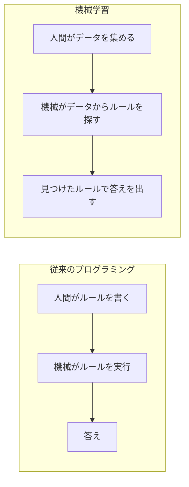
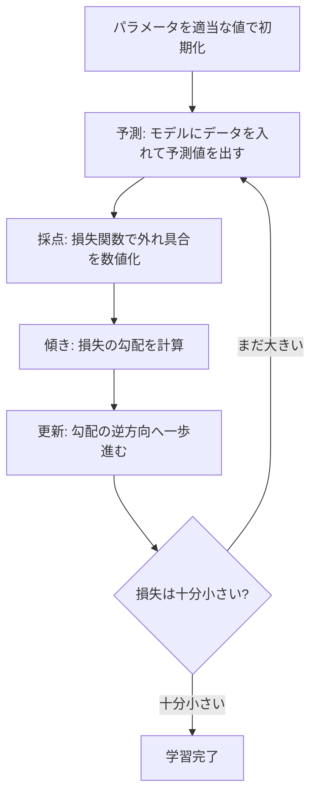
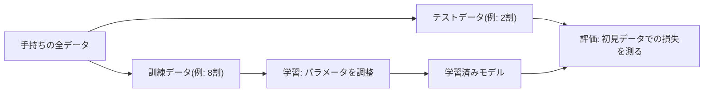
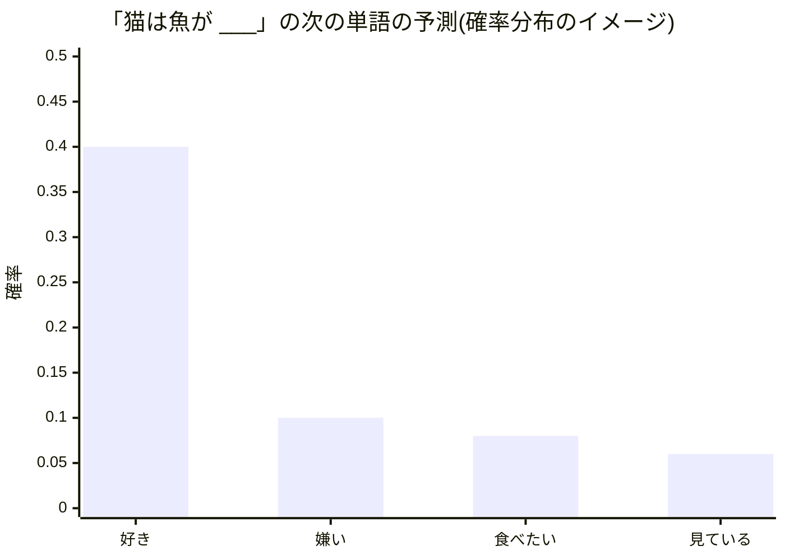

# 第4章 機械学習入門 — データから学ぶとはどういうことか

## この章で学ぶこと

- 「ルールを人が書く」プログラミングと「データから機械が学ぶ」機械学習の違い
- モデルとは「パラメータ付きの関数 $f_\theta(x)$ 」であり、学習とは「良いパラメータ探し」であること
- 損失関数 — 「どれくらい外しているか」を1つの数値にする仕組み
- 勾配降下法 — 損失の谷を一歩ずつ下ってパラメータを改善する方法(具体的な数値で手計算します)
- 学習率 $\eta$(イータ)の意味と、大きすぎ・小さすぎるとどうなるか
- 訓練データとテストデータ、過学習と汎化
- 分類問題では「確率分布」を出力するという考え方
- 「特徴量を人が設計する時代」から「表現も学習する深層学習」への流れ

## この章の前提

- [第1章 数学の準備(1)— 関数と記号に慣れる](01-functions-and-symbols.md) — 関数 $f(x)$ の読み方、 $\Sigma$ 記法
- [第2章 数学の準備(2)— ベクトルと行列](02-vectors-and-matrices.md) — ベクトルという「数の並び」
- [第3章 数学の準備(3)— 微分・勾配・確率](03-derivatives-gradients-probability.md) — 微分 = 傾き、勾配 $\nabla L$ 、「傾きが0の場所が谷底」という発想、確率分布

ここまでの3章で揃えた道具が、この章からいよいよ実戦投入されます。特に第3章の「勾配はいちばん急な上り方向。マイナスを付ければ下り方向」という話は、この章の主役です。

---

## 4.1 ルールを人が書く vs データから機械が学ぶ

### 4.1.1 従来のプログラミング: ルールは人間が書く

コンピュータに何かをさせる伝統的な方法は、人間が手順(ルール)をすべて書き下すことです。たとえば「消費税込みの価格を計算する」なら、「入力された価格に 1.1 を掛けて出力せよ」というルールを人間が考え、機械はそれを忠実に実行します。第1章の言葉で言えば、人間が関数 $f(x) = 1.1x$ を**自分で設計して**機械に渡すわけです。

これは、ルールが明確に書き下せる問題では完璧に機能します。ところが世の中には、**人間はできるのに、ルールとして書き下せない**仕事がたくさんあります。

- 写真を見て「これは猫だ」と判定する
- 手書きの文字を読む
- 「猫は魚が好き」の次に来そうな言葉を予想する

あなたは猫の写真を一瞬で見分けられますが、「耳が三角で、ヒゲがあって……」とルールを書き始めると、すぐに破綻します。後ろ向きの猫は? 毛布に包まった猫は? 例外に次ぐ例外で、ルールは無限に増えていきます。

### 4.1.2 機械学習: ルールをデータから見つけさせる

そこで発想を逆転させます。ルールを書くのをあきらめて、**大量の実例(データ)を見せて、ルールに相当するものを機械自身に見つけさせる**のです。これが**機械学習(machine learning)** です。

| | 従来のプログラミング | 機械学習 |
|---|---|---|
| 人間が用意するもの | ルール(手順) | データ(実例)と「学び方の枠組み」 |
| 機械がやること | ルールを実行する | データに合うルールを探し出す |
| 得意な問題 | 手順が明確な問題 | 手順を書き下せないが実例は豊富な問題 |
| 例 | 税込価格の計算 | 猫の画像認識、次の単語の予測 |



本書の主役であるTransformerも、この機械学習の産物です。「言葉のルール」を誰かが書いたのではなく、大量の文章データから機械が見つけ出したのです。では、「機械がルールを探す」とは具体的に何をすることなのでしょうか。それがこの章の残り全部のテーマです。

## 4.2 モデル = パラメータ付きの関数

### 4.2.1 「調整つまみ付きの関数」を用意する

機械学習では、まず**モデル(model)** と呼ばれるものを用意します。モデルの正体は、第1章で学んだ「関数」です。ただし普通の関数と違って、**調整可能なつまみ(数値)が付いた関数**です。このつまみのことを**パラメータ(parameter)** と呼びます。

パラメータをまとめて $\theta$(シータ、と読みます)という記号で表し、モデルを次のように書きます。第2章ではベクトルのなす角度に $\theta$ を使いましたが、それとは別物です(ギリシャ文字は数が限られているため、分野の慣例で使い回されます。以降の章で $\theta$ と書いたら「パラメータ一式」のことです)。

$$
y = f_\theta(x)
$$

読み下し: 「入力 $x$ を、パラメータ $\theta$ を持つ関数 $f$ に入れると、出力 $y$ が出てくる」。 $f$ の右下に付いた $\theta$ は、「この関数の振る舞いは $\theta$ の値次第で変わりますよ」という印です。

たとえば一次関数

$$
f_\theta(x) = wx + b
$$

読み下し: 「入力 $x$ に重み $w$ を掛けて、 $b$ を足したものを出力する」。この場合、パラメータは $\theta = (w, b)$ の2個です。 $w$ を**重み(weight)**、 $b$ を**バイアス(bias)** と呼びます(この名前は第5章のニューラルネットワークでもそのまま使います)。

- $w = 2, b = 1$ なら $f_\theta(3) = 2 \times 3 + 1 = 7$
- $w = 0.5, b = 4$ なら $f_\theta(3) = 0.5 \times 3 + 4 = 5.5$

同じ「一次関数」という枠組みでも、つまみの設定次第でまったく違う関数になる。これがモデルです。

### 4.2.2 学習 = 良いパラメータ探し

ここが機械学習の核心です。

> [!IMPORTANT]
> **学習とは、手元のデータに最もよく合うパラメータ $\theta$ を探すことである。**

関数の「形の枠組み」(一次関数にするか、もっと複雑な形にするか)は人間が決めます。しかし、つまみの値そのものはデータに決めさせる。これが「データから学ぶ」の正体です。

ちなみに、本書の最終目的地であるLLM(大規模言語モデル)も、まったく同じ枠組みの上にあります。違いはつまみの数だけです。この章の例ではつまみは2個ですが、LLMではつまみが**数十億〜数兆個**あります。「学習=良いパラメータ探し」という原理は、つまみが2個でも2兆個でも変わりません。

## 4.3 例: 一次関数をデータに当てはめる

具体例で考えましょう。あなたが引っ越し先を探していて、「部屋の広さから家賃を予測したい」とします。

不動産サイトで集めたデータがこうだったとします。

| 部屋の広さ $x$ (m²) | 家賃 $y$ (万円) |
|---|---|
| 20 | 8.1 |
| 25 | 9.0 |
| 30 | 10.2 |
| 40 | 11.8 |
| 50 | 14.1 |

このデータを眺めると、「広いほど高い」というおおまかな傾向が見えます。そこで、モデルとして一次関数を選びます。

$$
\hat{y} = wx + b
$$

読み下し: 「広さ $x$ に $w$ を掛けて $b$ を足したものを、家賃の予測値 $\hat{y}$ とする」。 $\hat{y}$ は「ワイハット」と読み、**モデルの予測値**を表します(帽子なしの $y$ は実際の観測値、帽子付きの $\hat{y}$ は予測値、と区別する慣習です)。

グラフで見ると、やりたいことはこうです。

```text
 家賃 y (万円)
 15 |                              *        <- データ点
    |                        ___---
    |                 *___---
 12 |          ___*---                      <- 引きたい直線 y = wx + b
    |    ___---
  9 |  *---
    | *
  6 |
    +----+----+----+----+----+----->  広さ x (m^2)
        20   30   40   50   60
```

ばらばらに散らばったデータ点(*)のなるべく近くを通る直線を1本引きたい。直線は $w$(傾き)と $b$(切片)の2つのつまみで決まりますから、**「良い直線を引く」= 「良い $(w, b)$ を見つける」** です。

では「良い」とは何でしょうか。感覚的には「どの点からも大きく外れていない」ことですが、機械に探させるには、**「良さ」を数値で測れる**ようにしなければなりません。そこで登場するのが損失関数です。

## 4.4 損失関数 — 「どれくらい外しているか」の点数

### 4.4.1 外れ具合を1つの数値にする

**損失関数(loss function)** $L$ とは、**モデルの予測がどれくらい外れているかを1つの数値(点数)にする関数**です。ゴルフのスコアと同じで、**小さいほど良い**点数です。

最も基本的な損失関数が**二乗誤差(squared error)** です。データが $n$ 個あるとき、

$$
L = \frac{1}{n} \sum_{i=1}^{n} \left( \hat{y}_i - y_i \right)^2
$$

読み下し: 「 $i$ 番目のデータについて、予測値 $\hat{y}_i$ と正解 $y_i$ の差(外し幅)を2乗し、それを全データについて足し合わせて($\Sigma$ は第1章の合計記号です)、データ数 $n$ で割って平均する」。これを**平均二乗誤差**とも呼びます。

### 4.4.2 なぜ「2乗」するのか

単純に差 $\hat{y}_i - y_i$ を足すだけではだめなのでしょうか。だめなのです。理由は2つあります。

1. **プラスとマイナスの外れが打ち消し合ってしまう。** 1万円高く予測した部屋と1万円安く予測した部屋があると、差の合計は $(+1) + (-1) = 0$ 。「外していないことになってしまう」のは明らかにおかしい。2乗すればどちらも $+1$ となり、外れはきちんと外れとして数えられます。
2. **大きな外れを重く罰することができる。** 2万円の外れは、2乗すると $4$ 。1万円の外れ($1$)の4倍の罰になります。「大外しは特に避けたい」という気持ちが式に反映されます。

さらにもう1つ、後で効いてくる利点があります。2乗した関数は滑らかな「谷」の形になるので、**第3章で学んだ微分と相性が良い**のです(尖った関数だと微分がうまく定義できない点が出てしまいます)。

### 4.4.3 数値例: 損失を実際に計算する

手計算しやすいように、この節からはデータを思い切り単純にします。データは2点だけ、モデルはバイアスを省いた $\hat{y} = wx$(つまみは $w$ 1個だけ)とします。

| データ番号 $i$ | 入力 $x_i$ | 正解 $y_i$ |
|---|---|---|
| 1 | 1 | 2 |
| 2 | 2 | 4 |

(勘の良い方は「 $w = 2$ がぴったりだ」と気づくと思います。その通りで、答えを知った上で、機械がそこへ**たどり着く過程**をこれから観察します。)

損失関数は、後の微分計算をきれいにするため、慣習に従って $\frac{1}{2}$ を付けた形を使います(2乗の微分で出てくる $2$ と打ち消し合わせるための、見た目を整える工夫です。損失の大小関係は変わりません)。

$$
L(w) = \frac{1}{2} \sum_{i=1}^{2} \left( w x_i - y_i \right)^2
$$

読み下し: 「各データについて、予測 $w x_i$ と正解 $y_i$ の差を2乗して合計し、2で割る」。

いくつかの $w$ で損失を計算してみます。

- $w = 0$ のとき: 予測は $0, 0$ 。外れは $-2, -4$ 。 $L = \frac{1}{2}\left( (-2)^2 + (-4)^2 \right) = \frac{1}{2}(4 + 16) = 10$
- $w = 1$ のとき: 予測は $1, 2$ 。外れは $-1, -2$ 。 $L = \frac{1}{2}(1 + 4) = 2.5$
- $w = 2$ のとき: 予測は $2, 4$ 。外れは $0, 0$ 。 $L = 0$ (完璧!)
- $w = 3$ のとき: 予測は $3, 6$ 。外れは $+1, +2$ 。 $L = \frac{1}{2}(1 + 4) = 2.5$

$w$ を横軸、損失 $L$ を縦軸にしてグラフを描くと、きれいな**谷**になります。

```mermaid
xychart-beta
    title "損失の谷 L(w)"
    x-axis "w" [0, 0.5, 1, 1.5, 2, 2.5, 3, 3.5, 4]
    y-axis "L(w)" 0 --> 10
    line [10, 5.625, 2.5, 0.625, 0, 0.625, 2.5, 5.625, 10]
```

谷底は $w = 2$ で、そこで損失はちょうどゼロになります。

第3章で「傾きが0の場所が谷底(最小値)」と学びました。学習のゴールは、この**損失の谷の底**を見つけることです。

> [!IMPORTANT]
> **学習 = 損失関数 $L(\theta)$ をできるだけ小さくするパラメータ $\theta$ を探すこと。**

今回のような単純な例なら、グラフを描けば谷底は目で見えます。しかしパラメータが2個になると損失は「地形(曲面)」になり、100万個になれば100万次元の地形です。グラフはもう描けません。目で見ずに谷底へたどり着く方法が必要です。それが勾配降下法です。

## 4.5 勾配降下法 — 霧の中で谷を下る

### 4.5.1 発想: 足元の傾きだけを頼りに下る

こんな状況を想像してください。あなたは深い霧の山中に立っていて、谷底の山小屋に行きたい。周りはまったく見えませんが、**足元の地面がどちらに傾いているか**だけは分かります。どうしますか?

素直な作戦はこうです。

1. 足元の傾きを調べる
2. **いちばん急な下り方向**に一歩進む
3. そこでまた傾きを調べ、また一歩進む。これを繰り返す

これをそのまま数式にしたのが**勾配降下法(gradient descent)** です。第3章で学んだとおり、勾配 $\nabla L$ は「損失がいちばん急に**増える**方向」を指します。だからマイナスを付けた $-\nabla L$ が「いちばん急な**下り**方向」です。そちらに一歩進む、を繰り返します。

$$
\theta \leftarrow \theta - \eta \, \nabla L
$$

読み下し: 「現在のパラメータ $\theta$ から、勾配 $\nabla L$ に学習率 $\eta$ を掛けたぶんを引き算し、それを新しい $\theta$ とする」。矢印 $\leftarrow$ は「右辺を計算して左辺に上書きする(更新する)」という意味です。 $\eta$ は**イータ**と読み、**一歩の歩幅**を決める数で、**学習率(learning rate)** と呼びます(詳しくは4.7節)。

パラメータが $w$ 1個のときは、勾配はただの微分 $\frac{dL}{dw}$(その点での傾き)なので、更新式はこうなります。

$$
w \leftarrow w - \eta \, \frac{dL}{dw}
$$

読み下し: 「いまの $w$ から、傾きに歩幅を掛けたぶんを引く」。

傾きの符号に注目すると、この式のうまさが見えてきます。

- 谷底より**左**にいるとき: 傾きは**マイナス**(下り坂)。マイナスを引く = 足す。つまり $w$ は**右(谷底方向)へ**動く。
- 谷底より**右**にいるとき: 傾きは**プラス**(上り坂)。プラスを引く。つまり $w$ は**左(谷底方向)へ**動く。
- 谷底では: 傾きは $0$ 。更新量も $0$ 。**自然に止まる。**

どこにいても谷底に向かい、谷底に着けば止まる。しかも坂が急な(=大きく外している)ほど一歩が大きく、谷底に近づいて坂が緩やかになるほど一歩が小さくなる。実によくできた仕組みです。

### 4.5.2 学習ループの全体像(本章の最重要図)

学習の全体は「予測 → 採点 → 傾き計算 → 更新」のループです。この図は本書全体で何度も戻ってくる最重要の図です(第10章でTransformerを訓練するときも、ループの中身が豪華になるだけで骨格はこのままです)。



## 4.6 手計算でやってみる — 勾配降下法を2〜3ステップ

いよいよ、この章のハイライトです。4.4.3節のデータ(2点: $(1, 2)$ と $(2, 4)$)とモデル $\hat{y} = wx$ で、勾配降下法を実際に手で回してみます。

### 4.6.1 準備: 傾きの式を求める

損失は

$$
L(w) = \frac{1}{2} \left\{ (w \cdot 1 - 2)^2 + (w \cdot 2 - 4)^2 \right\}
$$

読み下し: 「データ1の外れ $(w - 2)$ の2乗と、データ2の外れ $(2w - 4)$ の2乗を足して2で割る」。

これを $w$ で微分します。第3章で学んだ連鎖律(「2乗の微分」×「中身の微分」)を使うと、 $(wx - y)^2$ を $w$ で微分した結果は $2(wx - y) \cdot x$ です。先頭の $\frac{1}{2}$ と打ち消し合って、

$$
\frac{dL}{dw} = (w \cdot 1 - 2) \cdot 1 + (w \cdot 2 - 4) \cdot 2
$$

読み下し: 「各データについて『外れ幅 × 入力』を計算して足し合わせたものが傾きになる」。整理すると、

$$
\frac{dL}{dw} = (w - 2) + (4w - 8) = 5w - 10
$$

読み下し: 「この問題では、傾きは $5w - 10$ という単純な式になる」。検算: 谷底 $w = 2$ を入れると $5 \times 2 - 10 = 0$ 。確かに谷底で傾き0です。

### 4.6.2 いざ、谷下り(学習率 $\eta = 0.1$)

スタート地点は $w = 0$(何も知らない状態)、歩幅は $\eta = 0.1$ とします。

**ステップ1**

- 現在地: $w = 0$ 。損失 $L(0) = 10$(4.4.3節で計算済み)
- 傾き: $\frac{dL}{dw} = 5 \times 0 - 10 = -10$(マイナス = 谷底は右にある)
- 更新: 

$$
w \leftarrow 0 - 0.1 \times (-10) = 0 + 1 = 1
$$

読み下し: 「いまの $w = 0$ から、学習率 $0.1$ × 傾き $-10$ を引く。マイナスを引くので $w$ は $1$ に増える」。

**ステップ2**

- 現在地: $w = 1$ 。損失 $L(1) = 2.5$($10$ から大幅減!)
- 傾き: $5 \times 1 - 10 = -5$(まだ下り坂。ただしさっきの半分の急さ)
- 更新:

$$
w \leftarrow 1 - 0.1 \times (-5) = 1 + 0.5 = 1.5
$$

読み下し: 「 $w = 1$ に $0.5$ を足して $1.5$ へ。坂が緩やかになったぶん、歩みも自然と小さくなっている」。

**ステップ3**

- 現在地: $w = 1.5$ 。損失 $L(1.5) = \frac{1}{2}\{(-0.5)^2 + (-1)^2\} = \frac{1}{2}(0.25 + 1) = 0.625$
- 傾き: $5 \times 1.5 - 10 = -2.5$
- 更新:

$$
w \leftarrow 1.5 - 0.1 \times (-2.5) = 1.5 + 0.25 = 1.75
$$

読み下し: 「 $w$ は $1.75$ へ。正解の $2$ にじりじり近づいている」。

### 4.6.3 結果のまとめ

| ステップ | $w$(現在地) | 損失 $L(w)$ | 傾き $\frac{dL}{dw}$ | 更新量 $-\eta \times$ 傾き | 更新後の $w$ |
|---|---|---|---|---|---|
| 1 | 0 | 10 | $-10$ | $+1.0$ | 1.0 |
| 2 | 1.0 | 2.5 | $-5$ | $+0.5$ | 1.5 |
| 3 | 1.5 | 0.625 | $-2.5$ | $+0.25$ | 1.75 |
| 4 | 1.75 | 0.15625 | $-1.25$ | $+0.125$ | 1.875 |
| … | … | … | … | … | … |
| ∞ | 2.0 | 0 | 0 | 0 | 2.0 |

損失が $10 \to 2.5 \to 0.625 \to 0.156 \to \dots$ と、1ステップごとに4分の1に減っていき、 $w$ は正解の $2$ に吸い込まれていきます。谷のグラフの上で見ると、こうなっています。

```text
 L(w)
 10 + o                                w=0 (スタート)
    |  \
    |   \                              <- 傾き -10。急坂なので大きく一歩
  5 +    \
    |     \
    |      o                           w=1
 2.5+       \_                         <- 傾き -5。歩幅も半分に
    |         \o                       w=1.5
    |           \_o                    w=1.75
  0 +--------------\o___------------>  w
    0        1      ^  2
                    谷底へ吸い込まれる
```

これが機械学習の「学習」の正体です。特別な仕掛けはなく、**「外れ具合を測る → 傾きを計算する → 傾きと逆に少し動かす」をひたすら繰り返す**だけです。LLMの訓練も、パラメータが数千億個になり損失関数が複雑になるだけで、やっていることはこの表と同じです。

## 4.7 学習率 $\eta$ — 歩幅の大切さ

さきほど $\eta = 0.1$ という歩幅を使いましたが、この値の選び方は実はとても重要です。同じ問題で $\eta$ を変えるとどうなるか見てみましょう。更新式は $w \leftarrow w - \eta(5w - 10)$ です。

### 4.7.1 小さすぎる場合($\eta = 0.01$): 遅すぎる

- ステップ1: $w = 0 - 0.01 \times (-10) = 0.1$
- ステップ2: $w = 0.1 - 0.01 \times (-9.5) = 0.195$
- ステップ3: $w = 0.195 - 0.01 \times (-9.025) \approx 0.285$

進んではいますが、亀の歩みです。谷底の $2$ の近くに達するまで100ステップ近くかかります。方向は正しいのに、時間(と計算資源)を浪費します。

### 4.7.2 大きすぎる場合($\eta = 0.5$): 発散する

- ステップ1: $w = 0 - 0.5 \times (-10) = 5$ — 谷底($2$)を**飛び越えて**反対側の斜面へ
- ステップ2: 傾きは $5 \times 5 - 10 = +15$ 。 $w = 5 - 0.5 \times 15 = -2.5$ — さらに大きく逆側へ
- ステップ3: 傾きは $-22.5$ 。 $w = -2.5 + 11.25 = 8.75$ — もっと遠くへ!

損失で見ると $10 \to 22.5 \to 50.6 \to 113.9 \to \dots$ と、下るどころか**坂を跳ね上がって発散**します。歩幅が大きすぎると、谷を飛び越えるたびに勢いが増してしまうのです。

ちなみに中間の $\eta = 0.4$ だと $w$ は $0 \to 4 \to 0 \to 4 \to \dots$ と永遠に往復し続けます(振動)。

```text
 (1) η が適切 (0.1)
 L
  |o
  | \
  |  o\
  |    o\_
  |      o\_
  |_________\o____________>  w
       するすると谷底へ

 (2) η が大きすぎ (0.5)
 L
  |            o               <- ステップ3: 谷を飛び越えて
  |o          /                   どんどん高く跳ね上がる
  | \_       /
  |   \     /
  |    \   o                   <- ステップ1
  |_____\_/_______________>  w
         ^ 谷底(素通り)

 (3) η が小さすぎ (0.01)
 L
  |oo
  | ooo
  |   oooo                     <- 方向は正しいが
  |      oooooo                   いつまでも着かない
  |____________ooooo______>  w
```

| 学習率 $\eta$ | 何が起こるか | たとえ |
|---|---|---|
| 小さすぎる | 収束が非常に遅い | すり足で山を下りる |
| ちょうど良い | 効率よく谷底へ | 適切な歩幅でスタスタ下る |
| 大きすぎる | 谷を飛び越えて振動・発散 | 全力ジャンプで谷の反対側の壁に激突 |

適切な学習率は問題ごとに違い、機械学習の実務では最も重要な「調整項目」の1つです。第10章では、Transformerの訓練でこの歩幅を自動調整する工夫(Adamや学習率ウォームアップ)が登場します。

## 4.8 パラメータが2個以上のとき — 勾配ベクトルの出番

ここまで、つまみは $w$ 1個でした。本来のモデル $\hat{y} = wx + b$ にはつまみが2個あります。このときは第3章で学んだ**偏微分**と**勾配ベクトル**が出番です。

損失の「地形」は、 $w$ と $b$ の2方向に広がる曲面(すり鉢)になります。傾きは方向ごとにあるので、それぞれ偏微分で求め、並べてベクトルにします。

$$
\nabla L = \left( \frac{\partial L}{\partial w}, \; \frac{\partial L}{\partial b} \right)
$$

読み下し: 「 $b$ を固定して $w$ だけ動かしたときの傾きと、 $w$ を固定して $b$ だけ動かしたときの傾きを並べたベクトルが、勾配 $\nabla L$ 」。

更新式 $\theta \leftarrow \theta - \eta \nabla L$ は、このベクトルを使って**全部のつまみを同時に**動かします。1ステップだけ手計算してみましょう。データは $(x, y) = (1, 3)$ と $(2, 5)$ 、損失は $L = \frac{1}{2}\sum_i (w x_i + b - y_i)^2$ 、初期値 $w = 0, b = 0$ 、 $\eta = 0.1$ とします。

偏微分の式は(4.6.1節と同じ要領で)、

$$
\frac{\partial L}{\partial w} = \sum_{i} (w x_i + b - y_i) \, x_i, \qquad \frac{\partial L}{\partial b} = \sum_{i} (w x_i + b - y_i)
$$

読み下し: 「 $w$ の傾きは『外れ幅 × 入力』の合計、 $b$ の傾きは『外れ幅』の合計」。

$w = 0, b = 0$ では予測はどちらも $0$ なので、外れ幅は $0 - 3 = -3$ と $0 - 5 = -5$ です。

- $\frac{\partial L}{\partial w} = (-3)(1) + (-5)(2) = -13$
- $\frac{\partial L}{\partial b} = (-3) + (-5) = -8$
- 勾配: $\nabla L = (-13, -8)$
- 更新: $w \leftarrow 0 - 0.1 \times (-13) = 1.3$ 、 $b \leftarrow 0 - 0.1 \times (-8) = 0.8$

損失は $L(0, 0) = \frac{1}{2}(9 + 25) = 17$ から $L(1.3, 0.8) = \frac{1}{2}\{(2.1 - 3)^2 + (3.4 - 5)^2\} = \frac{1}{2}(0.81 + 2.56) \approx 1.7$ へ、1ステップで激減しました。

パラメータが100万個でも1兆個でも、話はまったく同じです。**勾配ベクトルの成分が100万個・1兆個に増えるだけ**で、「全つまみの傾きを一斉に計算し、全つまみを一斉に少し動かす」という手順は変わりません。「そんな膨大な傾きをどうやって効率よく計算するのか?」という当然の疑問には、第5章の**逆伝播**が答えます。

## 4.9 訓練データとテストデータ — 丸暗記では意味がない

### 4.9.1 本当に測りたいのは「初見の問題」への強さ

ここまでの話には、実は落とし穴があります。損失を小さくすること自体が目的化すると、おかしなことが起こるのです。

学校のテストにたとえましょう。問題集(過去問)を勉強して、本番の試験に臨むとします。

- **問題集の答えを丸暗記した生徒**: 問題集と同じ問題なら100点。しかし本番で少しひねられると全滅。
- **問題集から解き方を理解した生徒**: 問題集では95点かもしれないが、本番の初見問題にも対応できる。

私たちがモデルに求めるのは後者です。学習に使ったデータで良い成績を取ることではなく、**まだ見たことのないデータで良い予測をすること**。この「初見への強さ」を**汎化(generalization)** と呼びます。

### 4.9.2 データを2つに分ける

汎化できているかを測る標準的な方法は、手持ちのデータをあらかじめ2つに分けておくことです。

- **訓練データ(training data)**: 学習(パラメータ調整)に使う。問題集に相当。
- **テストデータ(test data)**: 学習には**一切使わず**、最後に成績測定だけに使う。本番の試験に相当。



### 4.9.3 過学習 — 丸暗記に陥ったモデル

訓練データでの損失は小さいのに、テストデータでの損失が大きい状態を**過学習(overfitting)** と呼びます。モデルが訓練データを「丸暗記」してしまい、データに混じった偶然のノイズまで律儀に再現している状態です。

家賃の例で言えば、5件のデータ点すべてを**完璧に**通るぐにゃぐにゃの曲線(つまみの多い複雑なモデル)を引くことは可能です。訓練データでの損失はゼロ。しかしそのぐにゃぐにゃは、「たまたまこの5件がそうだった」という偶然に過剰に付き合った結果であり、6件目の部屋の家賃予測はむしろ下手になります。

```text
 (1) 良い当てはめ(汎化)
 y
  |        *  ___---
  |     _*---
  |  _*--                      <- なめらかな直線が傾向をとらえる
  | *--
  +------------------>  x
  初見の * も直線の近くに来そう

 (2) 過学習(丸暗記)
 y
  |     * /\    /*
  |  \ /    \  * /
  |   *v     \ v               <- 全点を無理やり通るぐにゃぐにゃ曲線
  | *
  +------------------>  x
  初見の * は曲線から外れそう
```

逆に、モデルが単純すぎて訓練データすらろくに合わせられない状態は**未学習(underfitting)** と呼びます。ちょうど良い複雑さのモデルを、ちょうど良い加減まで学習させることが大切です。

この「大きすぎるモデルは過学習する」という常識は、機械学習の基本中の基本です。……なのですが、実は本書の後半(第13章)で、LLMではこの常識が成り立たなくなる話が出てきます。楽しみにしていてください。

## 4.10 分類問題 — 答えを「確率分布」で出す

### 4.10.1 回帰と分類

ここまでの家賃予測のように、**数値**を当てる問題を**回帰(regression)** と呼びます。一方、いくつかの**選択肢のどれか**を当てる問題を**分類(classification)** と呼びます。

- この写真は「猫・犬・魚」のどれか? (3択の分類)
- このメールは「迷惑メール・普通のメール」のどちらか? (2択の分類)
- 「猫は魚が」の次に来る単語は語彙5万語のうちどれか? (5万択の分類!)

最後の例に注目してください。本書の主役である言語モデルの「次の単語を当てる」仕事は、**巨大な分類問題**なのです。だから分類の仕組みを押さえることは、そのままTransformer理解の土台になります。

### 4.10.2 白黒つけずに、自信の度合いを出す

分類モデルの出力はどんな形が良いでしょうか。「猫です」と1つだけ答えさせる(白黒つける)こともできますが、それより**各選択肢にどれくらい自信があるかを丸ごと出させる**ほうがずっと便利です。たとえば「この写真は…… 猫: 70%、犬: 25%、魚: 5%」のように答えさせるのです。

これはまさに、第3章で学んだ**確率分布**です(すべて0以上で、合計が1)。第3章の最後に「『文の次に来る単語』は確率分布と見なせる」という話をしました — 「猫は魚が」の次は「好き: 40%、嫌い: 10%、食べたい: 8%、……」。分類モデルの出力を確率分布にするというのは、あの見方をそのまま実装することなのです。



図に載せた4語以外の残りの単語には 0.36 が薄く分配されており、全体の合計はきっちり1になります。

ただし、モデルの計算(掛けて足す)の生の結果は、マイナスになったり合計が1にならなかったりする「ただの数値の並び」です。これを確率分布の条件(全部0以上・合計1)に整える専用の変換が必要で、それが**softmax(ソフトマックス)** です。softmaxは本書の最重要道具の1つなので、次の第5章でじっくり導入します。ここでは「生の点数を確率分布に変換する関数が要る」とだけ覚えておいてください。

また、分類問題では損失関数も二乗誤差ではなく、確率分布向けの**交差エントロピー**というものを使います。これも第5章で登場します。

## 4.11 特徴量を人が設計する時代から、深層学習へ

最後に、この章と次章をつなぐ歴史の話をします。

### 4.11.1 入力を「数の並び」にするのは誰の仕事か

家賃の例では、入力は「広さ」という1つの数でした。しかし現実の入力はもっと複雑です。「この部屋の家賃」を本気で予測するなら、広さ・駅からの距離・築年数・階数……と、入力は第2章で学んだ**ベクトル**(数の並び)になります。

$$
\mathbf{x} = (\text{広さ}, \; \text{駅からの距離}, \; \text{築年数}, \; \text{階数})
$$

読み下し: 「入力ベクトル $\mathbf{x}$ は、物件の特徴を表す数値を並べたもの」。この、予測の手がかりとなる個々の数値を**特徴量(feature)** と呼びます。

長い間、機械学習の成否は「**良い特徴量を人間が設計できるか**」で決まっていました。家賃なら特徴量は考えやすい。しかし、猫の写真の特徴量は? 「猫らしさ」を数値の並びで表す方法を人間が設計するのは絶望的に難しく、これが4.1節の「ルールを書き下せない問題」の正体でもありました。写真から「耳の尖り具合」を数値化するルール自体が書けないのです。

### 4.11.2 深層学習: 特徴量まで機械に学ばせる

そこで再び発想の転換が起こります。「特徴量の設計も、機械に学ばせてしまえばいいのでは?」というわけです。

生のデータ(画像なら画素の値、文章なら単語の列)をそのまま入れて、「そこから何に注目すべきか(=良い特徴量、良い**表現**)」自体をパラメータとして学習させる。これを可能にしたのが、関数を何層にも重ねた**ニューラルネットワーク**であり、それを深く積んだ**深層学習(deep learning)** です。

| | 従来の機械学習 | 深層学習 |
|---|---|---|
| 特徴量(表現) | 人間が設計 | **機械が学習** |
| 人間の仕事 | 「何に注目すべきか」を考える | データと計算資源を用意する |
| 例 | 広さ・築年数から家賃予測 | 画素から猫認識、単語列から次単語予測 |

この章で学んだ道具立て — モデル $f_\theta$ 、損失 $L$ 、勾配降下法 $\theta \leftarrow \theta - \eta \nabla L$ — は、深層学習でもそっくりそのまま使います。変わるのは関数 $f_\theta$ の中身です。一次関数のような素朴な形から、層を重ねた表現力の高い形へ。その中身こそが次章のテーマ、ニューラルネットワークです。

---

## この章のまとめ

- **機械学習**は、ルールを人が書く代わりに、データからルールに相当するものを機械に探させる方法である
- **モデル**とはパラメータ $\theta$ 付きの関数 $f_\theta(x)$ であり、**学習とは、データに最もよく合うパラメータを探すこと**である
- **損失関数** $L$ は「どれくらい外しているか」の点数(小さいほど良い)。回帰では**二乗誤差**を使う。2乗するのは、正負の打ち消しを防ぎ、大外れを重く罰するため
- **勾配降下法** $\theta \leftarrow \theta - \eta \nabla L$ は、損失の谷を「足元の傾きと逆方向への一歩」の繰り返しで下る方法。手計算例では $w$ が $0 \to 1 \to 1.5 \to 1.75 \to \dots \to 2$ と谷底に吸い込まれた
- **学習率 $\eta$** は歩幅。小さすぎると遅く、大きすぎると谷を飛び越えて発散する
- データは**訓練データ**と**テストデータ**に分け、初見データへの強さ(**汎化**)を測る。訓練データの丸暗記は**過学習**
- **分類問題**の出力は確率分布にするのが良い。「次の単語の予測」は巨大な分類問題である(生の点数を確率分布にする道具 = softmax は次章)
- 特徴量を人が設計する時代から、**表現そのものを学習する深層学習**の時代へ — その主役がニューラルネットワーク

## 次の章へ

次章では、いよいよ**ニューラルネットワーク**の中身を開けます。1個の人工ニューロンが第2章の「内積」そのものであること、層を重ねることが第1章の「関数の合成」であることを確かめ、そして本書後半の最重要道具である **softmax** と**交差エントロピー**を手計算で身につけます。

→ [第5章 ニューラルネットワーク — 脳を模した計算の仕組み](05-neural-networks.md)
