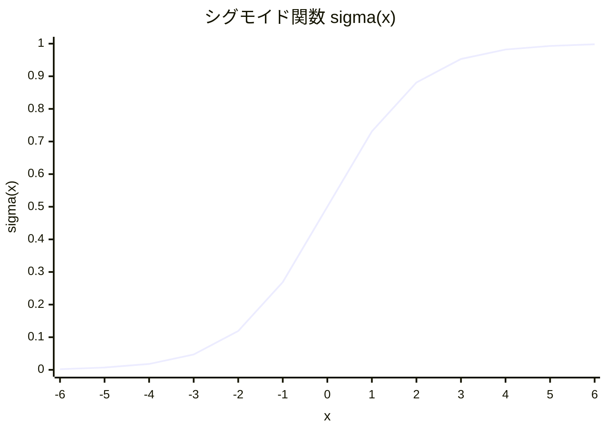
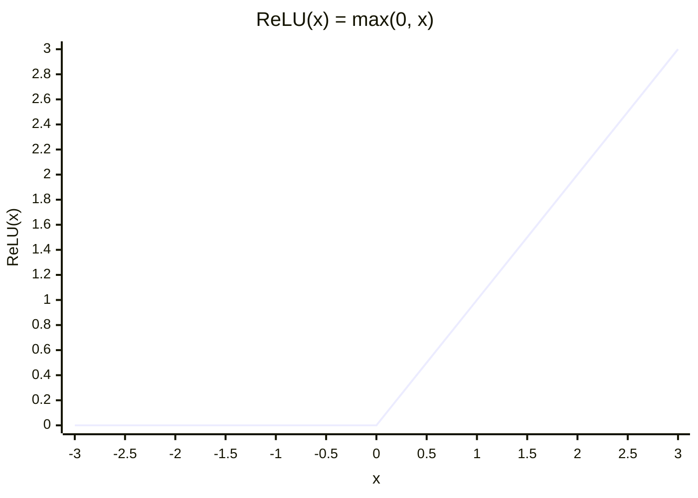
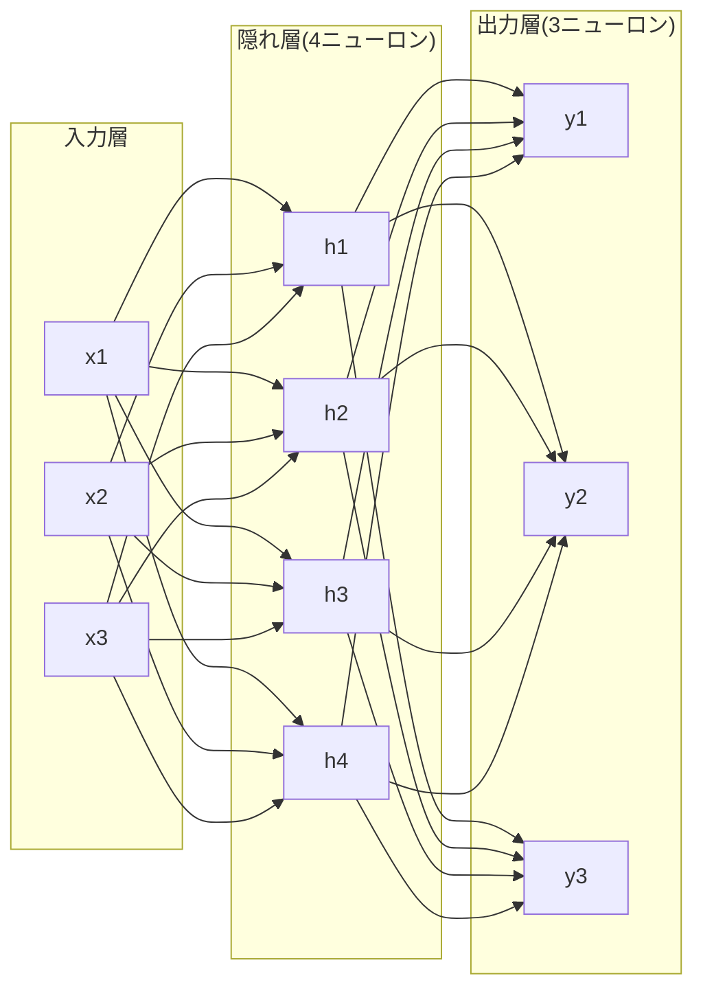
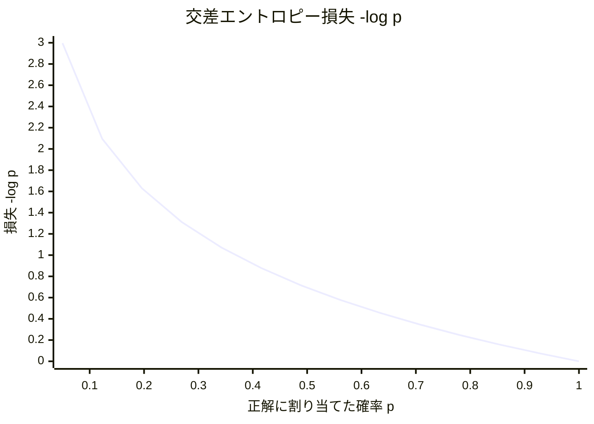
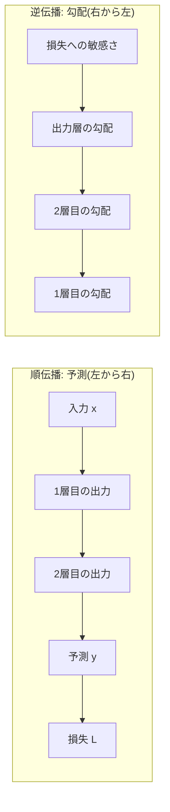

# 第5章 ニューラルネットワーク — 脳を模した計算の仕組み

## この章で学ぶこと

- 神経細胞の比喩から生まれた**人工ニューロン**の仕組み(重み付き和 + バイアス + 活性化関数)
- ニューロン1個の計算が、第2章で学んだ**内積**そのものであること
- なぜ**活性化関数(非線形)** が必要なのか — 線形を何層重ねても線形にしかならない
- 代表的な活性化関数: シグモイドとReLU(グラフ付き)
- 層の計算 $\mathbf{h} = f(W\mathbf{x} + \mathbf{b})$ — 行列で書けるからGPUで速い、という重要な事実
- 多層ネットワーク = 関数の合成(第1章の布石の回収)
- **softmax** — 生の点数を確率分布に変える関数。本書の後半で繰り返し使います(手計算します)
- **交差エントロピー** — 確率分布向けの損失関数(手計算します)
- **逆伝播** — 連鎖律を使って、膨大なパラメータの勾配を一気に計算する仕組み(直感で理解)
- 深層学習の登場とGPUの役割

## この章の前提

- [第1章 数学の準備(1)— 関数と記号に慣れる](01-functions-and-symbols.md) — 指数関数 $e^x$ 、対数、関数の合成 $f(g(x))$
- [第2章 数学の準備(2)— ベクトルと行列](02-vectors-and-matrices.md) — 内積、行列×ベクトル、行列積 = 変換の合成
- [第3章 数学の準備(3)— 微分・勾配・確率](03-derivatives-gradients-probability.md) — 連鎖律(変化率の掛け算)、確率分布
- [第4章 機械学習入門](04-machine-learning-basics.md) — モデル $f_\theta$ 、損失関数、勾配降下法

第4章の最後で「特徴量(表現)まで学習する、表現力の高い関数 $f_\theta$ が欲しい」という話になりました。この章はその関数の中身の話です。そして第1章の関数合成、第2章の内積、第3章の連鎖律という布石が、この章で一斉に回収されます。

---

## 5.1 神経細胞からのひらめき

**ニューラルネットワーク(neural network、神経回路網)** は、その名の通り、脳の**神経細胞(ニューロン)** の働きをヒントに作られた計算の仕組みです。

本物の神経細胞は、ざっくり言うとこう動きます。

1. 他のたくさんの神経細胞から信号を受け取る
2. 信号には「効きやすい経路」と「効きにくい経路」がある(つながりの強さが違う)
3. 受け取った信号の合計が**ある強さを超えたら**、自分も発火して次の細胞へ信号を送る

ポイントは3つ: **たくさんの入力**、**入力ごとに異なる重要度**、**しきい値を超えたら反応**。この3点だけを数式に写し取ったものが人工ニューロンです。

なお、これはあくまで「ヒントにした」程度の話で、実際の脳の忠実な再現ではありません。飛行機が鳥をヒントにしつつ羽ばたかないのと同じで、ニューラルネットワークは脳をヒントにしつつ、中身はここまでの章で学んだ数学(内積・関数・微分)でできています。ですから安心してください。新しい数学はほとんど出てきません。

## 5.2 人工ニューロン = 内積 + 関数

### 5.2.1 3つの部品

**人工ニューロン(artificial neuron)** 1個の計算は、3つの部品でできています。入力をベクトル $\mathbf{x} = (x_1, x_2, \dots, x_n)$ とすると、

1. **重み付き和**: 各入力 $x_i$ に、その入力の重要度を表す**重み(weight)** $w_i$ を掛けて全部足す(神経のつながりの強さに相当)
2. **バイアス**: 反応のしやすさを調整する定数 $b$ を足す(しきい値の役割。第4章の一次関数の $b$ と同じ名前・同じ役割です)
3. **活性化関数**: 結果を**活性化関数(activation function)** $f$ に通して出力を決める(発火するかどうかに相当)

式で書くと、

$$
y = f\left( \sum_{i=1}^{n} w_i x_i + b \right)
$$

読み下し: 「各入力に重みを掛けて合計し($\Sigma$ は第1章の合計記号)、バイアス $b$ を足し、その結果を活性化関数 $f$ に通したものが出力 $y$ 」。

### 5.2.2 これは内積だ(第2章の回収)

ここで、 $\Sigma$ の部分をよく見てください。「対応する成分同士を掛けて足し合わせる」— これは第2章で学んだ**内積**そのものです。

$$
y = f\left( \mathbf{w} \cdot \mathbf{x} + b \right)
$$

読み下し: 「重みベクトル $\mathbf{w}$ と入力ベクトル $\mathbf{x}$ の内積にバイアスを足し、活性化関数に通す」。

第2章で「内積は、2つのベクトルの向きが揃っているほど大きくなる。つまり**内積 = 類似度**」と学びました。この見方を当てはめると、ニューロンの意味が浮かび上がります。

> [!IMPORTANT]
> ニューロン1個は、**「入力が、自分の重みベクトル $\mathbf{w}$ の表すパターンにどれだけ似ているか」を測る検出器**である。似ていれば内積が大きくなり、ニューロンは強く反応する。

そして重み $\mathbf{w}$ とバイアス $b$ は、第4章で学んだ**学習されるパラメータ**です。つまり「何のパターンに反応する検出器になるか」は人間が設計するのではなく、データから勾配降下法で決まるのです。これが第4章末の「特徴量を機械が学ぶ」の具体的な姿です。

### 5.2.3 数値例

入力 $\mathbf{x} = (1, 0, 2)$ 、重み $\mathbf{w} = (0.5, -1, 0.25)$ 、バイアス $b = -0.5$ のニューロンを計算してみます。

- 重み付き和(内積): $0.5 \times 1 + (-1) \times 0 + 0.25 \times 2 = 0.5 + 0 + 0.5 = 1$
- バイアスを足す: $1 + (-0.5) = 0.5$
- 活性化関数に通す: $f(0.5)$ — この値は $f$ の選び方で決まります(次節と次々節)

## 5.3 なぜ活性化関数(非線形)が必要なのか

部品3の活性化関数は、一見なくても良さそうに思えます。実際、 $f$ を素通し($f(x) = x$)にしたニューロンも考えられます。しかし、それでは**層をいくら重ねても意味がない**という致命的な問題が起こります。これはニューラルネットワーク理解の急所なので、丁寧に見ます。

### 5.3.1 線形の壁

活性化関数のないニューロンの計算は「行列を掛けて、ベクトルを足す」だけです(次節で見るように、ニューロンを並べた層は行列で書けます)。このような、掛けて足すだけの変換をおおまかに**線形(linear)** な変換と呼びます。一次関数 $wx + b$ の仲間、まっすぐな変換です。

では、線形の変換を2段重ねるとどうなるでしょう。1段目を $W_1 \mathbf{x}$ 、2段目を $W_2(\cdot)$ とすると(話を簡単にするためバイアスは省きます)、

$$
W_2 (W_1 \mathbf{x}) = (W_2 W_1) \mathbf{x}
$$

読み下し: 「 $W_1$ で変換してから $W_2$ で変換した結果は、あらかじめ掛け合わせた1つの行列 $W_2 W_1$ で変換した結果と完全に同じ」。

これは第2章で学んだ「行列積 = 変換の合成」そのものです。数値でも確かめましょう。

```math
W_1 = \begin{pmatrix} 1 & 0 \\ 0 & 2 \end{pmatrix}, \quad W_2 = \begin{pmatrix} 0 & 1 \\ 1 & 0 \end{pmatrix}, \quad \mathbf{x} = \begin{pmatrix} 3 \\ 1 \end{pmatrix}
```

読み下し: 「2×2の行列2つと、2次元の入力ベクトルを用意する」。

まず2段階で計算すると、 $W_1 \mathbf{x} = (3, 2)$ 、続けて $W_2 (3, 2) = (2, 3)$ となります。

次に、先に行列を合成すると、

```math
W_2 W_1 = \begin{pmatrix} 0 & 2 \\ 1 & 0 \end{pmatrix}
```

となり、これを使うと $(W_2 W_1)\mathbf{x} = (0 \times 3 + 2 \times 1, \; 1 \times 3 + 0 \times 1) = (2, 3)$ 。

完全に一致します。つまり、

> [!IMPORTANT]
> **線形な層を何百層重ねても、結局はたった1枚の線形な層と同じ表現力しかない。**

まっすぐな変換をいくら継ぎ足しても、まっすぐなままなのです。第4章の家賃の例で言えば、どこまでいっても「1本の直線を引く」以上のことができません。曲がった関係、複雑なパターンは永遠に表せない。これが線形の壁です。

### 5.3.2 非線形を1枚挟むと壁が消える

そこで、各層の出力に**曲がった(非線形な)関数**を1枚かませます。これが活性化関数の存在理由です。

$$
\mathbf{h} = f(W_1 \mathbf{x}), \qquad \mathbf{y} = g(W_2 \mathbf{h})
$$

読み下し: 「1段目の変換の後に非線形関数 $f$ を通し、その結果に2段目の変換と非線形関数 $g$ を適用する」。間に曲がった関数が挟まると、全体はもう1つの行列にまとめられなくなり、層を重ねるたびに表現できる関数の複雑さが本当に増えていきます。

実際、非線形な活性化関数を挟んだ2層のネットワークは、ニューロン数を十分に増やせば「どんな連続関数でも好きな精度で近似できる」ことが数学的に証明されています(万能近似定理と呼ばれます。証明は本書の範囲外ですが、「部品を増やせば何でも作れることが保証されている」という安心材料として覚えておいてください)。

たとえ話をするなら、線形変換は「まっすぐな板」です。まっすぐな板を何枚重ねて接着しても、できるのは厚いまっすぐな板だけ。しかし板と板の間に「折り曲げ」を入れられるなら、折り紙のように、重ねるほど複雑な形が作れるようになります。活性化関数はこの「折り曲げ」です。

## 5.4 代表的な活性化関数

では、どんな「曲がった関数」を使うのか。代表選手を2つ紹介します。

### 5.4.1 シグモイド関数 — なめらかなスイッチ

**シグモイド関数(sigmoid function)** は、どんな実数も $0$ と $1$ の間に押し込める、S字カーブの関数です。

$$
\sigma(x) = \frac{1}{1 + e^{-x}}
$$

読み下し: 「入力 $x$ の符号を反転して $e$ の肩に乗せ($e$ は第1章の自然対数の底、約2.718)、1を足して逆数を取る」。 $\sigma$ はシグマと読みます(第1章の合計記号 $\Sigma$ の小文字ですが、ここでは合計とは無関係の、関数の名前です)。

代表的な値を計算してみましょう。

| $x$ | $e^{-x}$ | $\sigma(x) = 1/(1 + e^{-x})$ |
|---|---|---|
| $-4$ | $54.6$ | $0.018$(ほぼ0) |
| $-2$ | $7.39$ | $0.119$ |
| $0$ | $1$ | $0.5$(ちょうど真ん中) |
| $2$ | $0.135$ | $0.881$ |
| $4$ | $0.018$ | $0.982$(ほぼ1) |



$x = 0$ でちょうど 0.5 を通り、左の端は 0 に、右の端は 1 に張り付いていきます。

入力が大きいと1に近づき(発火)、小さいと0に近づく(沈黙)。5.1節の「しきい値を超えたら反応」を、なめらかに(=微分できる形で)表現したスイッチです。なめらかさは重要です。第4章で見たとおり学習は微分(勾配)頼みなので、活性化関数も微分できなければ困るのです。

シグモイドには「出力が確率(0〜1)として読める」という利点もあり、2択の分類の出力によく使われてきました。ただし弱点もあります。グラフの左右の端が平らなことに注目してください。入力が大きすぎたり小さすぎたりする領域では**傾きがほぼ0**になり、勾配降下法の頼みの綱である勾配が消えて学習が進まなくなることがあります(この「勾配が消える」問題は第7章で再登場する重要な伏線です)。

### 5.4.2 ReLU — 現代の主役は意外なほど単純

現在の深層学習で最も広く使われるのは、**ReLU(Rectified Linear Unit、レルー)** という、拍子抜けするほど単純な関数です。

$$
\mathrm{ReLU}(x) = \max(0, x)
$$

読み下し: 「 $x$ と $0$ の大きい方を出力する($\max$ は第1章で学んだ記号)。つまり、プラスならそのまま通し、マイナスなら $0$ に切り捨てる」。

- $\mathrm{ReLU}(3) = 3$ 、 $\mathrm{ReLU}(0.5) = 0.5$
- $\mathrm{ReLU}(-2) = 0$ 、 $\mathrm{ReLU}(-100) = 0$



マイナス側はすべて 0(傾き0)、プラス側はそのまま通す(傾き1)、という形です。

「原点で1回折れ曲がっているだけ」ですが、これで立派な非線形です(直線ではないので、5.3節の壁を破れます)。前節の「折り紙」の比喩どおり、この単純な折り目をたくさん組み合わせることで複雑な形が作れます。

ReLUの長所は、プラス側の傾きが常に1で、シグモイドのような「端で勾配が消える」問題がプラス側では起こらないこと、そして計算が激安なこと($\max$ を取るだけ)です。単純さは、何十億回と計算を繰り返す深層学習では絶大な美徳です。

なお、Transformerでは **GELU(ジェルー)** というReLUの改良版(折れ目をなめらかにしたもの)がよく使われます。名前だけ覚えておいてください。第9章で再登場します。

## 5.5 層 — ニューロンを束ねると行列になる

### 5.5.1 層の式

ニューロン1個では検出できるパターンは1つだけです。そこで、**同じ入力を受け取るニューロンをたくさん並べます**。この並びを**層(layer)** と呼びます。

入力 $\mathbf{x}$($n$ 次元)を受け取るニューロンを $m$ 個並べたとしましょう。各ニューロンはそれぞれ自分の重みベクトルを持っています。 $j$ 番目のニューロンの重みベクトルを、行列 $W$ の第 $j$ 行として積み上げると、 $m$ 個のニューロンの重み付き和は、第2章で学んだ「行列×ベクトル」で一発で書けます。

$$
\mathbf{h} = f(W \mathbf{x} + \mathbf{b})
$$

読み下し: 「 $m \times n$ の重み行列 $W$ を入力ベクトル $\mathbf{x}$ に掛け(= 各行との内積を並べ)、バイアスベクトル $\mathbf{b}$ を足し、各成分に活性化関数 $f$ を適用したものが、層の出力 $\mathbf{h}$ 」。行列×ベクトルが「行と列の内積を並べたもの」だったことを思い出せば、これは「 $m$ 個のニューロンの計算を1つの式に束ねただけ」だと分かります。出力 $\mathbf{h}$ は $m$ 次元のベクトルで、**$m$ 個の検出器の反応の強さを並べたもの**です。

### 5.5.2 数値例

入力3次元、ニューロン2個(出力2次元)の層を計算します。活性化関数はReLUとします。

```math
W = \begin{pmatrix} 1 & 0 & 2 \\ -1 & 1 & 0 \end{pmatrix}, \quad \mathbf{b} = \begin{pmatrix} 1 \\ -3 \end{pmatrix}, \quad \mathbf{x} = \begin{pmatrix} 1 \\ 2 \\ 0 \end{pmatrix}
```

読み下し: 「重み行列は2行3列(ニューロン2個 × 入力3次元)、バイアスは2次元、入力は3次元」。

手順どおりに計算します。

1. 行列×ベクトル(各行との内積):
   - 1行目: $1 \times 1 + 0 \times 2 + 2 \times 0 = 1$
   - 2行目: $-1 \times 1 + 1 \times 2 + 0 \times 0 = 1$
   - よって $W\mathbf{x} = (1, 1)$
2. バイアスを足す: $(1 + 1, \; 1 + (-3)) = (2, -2)$
3. ReLUを各成分に: $(\mathrm{ReLU}(2), \mathrm{ReLU}(-2)) = (2, 0)$

出力は $\mathbf{h} = (2, 0)$ 。1番目の検出器は反応し(2)、2番目の検出器は沈黙した(0)、と読めます。

### 5.5.3 行列で書けるからGPUで速い — 地味だが決定的な事実

「ニューロンの束 = 行列計算」という事実は、単なる書き方の話ではなく、**深層学習の成立条件**です。

**GPU(Graphics Processing Unit)** は、もともとゲームの3D映像のための処理装置で、「単純な掛け算・足し算を何千個も**同時に**実行する」ことに特化しています。そして行列計算はまさに「大量の掛け算・足し算の塊」であり、しかも各成分の計算は互いに独立なので、同時実行(並列計算)と抜群に相性が良いのです。

> [!IMPORTANT]
> ニューラルネットワークの計算の本体は行列計算である。
> 行列計算はGPUで超高速に実行できる。
> だから、巨大なニューラルネットワークの学習が現実的な時間で終わる。

この三段論法は本書の後半で何度も効いてきます。特に第7章では「行列計算に**できない**部分(逐次処理)を抱えたモデル(RNN)がGPUを活かせずに苦しみ、行列計算だけで構成されたTransformerに道を譲る」という、本書の背骨となる話が展開されます。

## 5.6 多層ネットワーク = 関数の合成

### 5.6.1 層を重ねる

層を1つ作れたら、あとはそれを重ねるだけです。1層目の出力を2層目の入力にし、2層目の出力を3層目の入力にし……とつなげます。

$$
\mathbf{h}_1 = f_1(W_1 \mathbf{x} + \mathbf{b}_1), \qquad
\mathbf{h}_2 = f_2(W_2 \mathbf{h}_1 + \mathbf{b}_2), \qquad
\mathbf{y} = W_3 \mathbf{h}_2 + \mathbf{b}_3
$$

読み下し: 「入力 $\mathbf{x}$ を1層目に通して $\mathbf{h}_1$ を得て、それを2層目に通して $\mathbf{h}_2$ を得て、最後の層で出力 $\mathbf{y}$ を得る」。途中の層を**隠れ層(hidden layer)**、その出力($\mathbf{h}_1, \mathbf{h}_2$)を**隠れ状態**や中間表現と呼びます($\mathbf{h}$ は hidden の頭文字です)。

これは第1章の最後に学んだ**関数の合成** $f(g(x))$ そのものです。あのとき「この考え方が第5章の層の積み重ねへの布石になります」と予告しました。ここがその回収地点です。

$$
\mathbf{y} = f_3\Big( f_2\big( f_1(\mathbf{x}) \big) \Big)
$$

読み下し: 「ネットワーク全体は、層という関数を次々に合成した1つの大きな関数である」。第4章の言葉で言えば、これが表現力の高いモデル $f_\theta$ の正体です。パラメータ $\theta$ は、全層の $W$ と $\mathbf{b}$ をすべて集めたものです。

多層にする意味は「段階的な組み立て」にあります。1層目が単純なパターン(画像なら線や角)を検出し、2層目がそれを組み合わせた部品(目・耳)を検出し、3層目がさらにそれを組み合わせたもの(猫の顔)を検出する — 単純な検出器を階層的に積むことで、生のデータから複雑な概念までの階段が作られるのです。これが第4章末の「表現の学習」の実際の姿です。

### 5.6.2 ネットワークの図(本章の最重要図)

入力3次元 → 隠れ層4ニューロン → 出力3ニューロンの小さなネットワークを図にします。本章の最重要図です。図中の1本1本の線が、それぞれ重み(学習されるパラメータ)1個に対応し、各ノードでは $h_1 = f(w_{11} x_1 + w_{12} x_2 + w_{13} x_3 + b_1)$ のような計算が行われます(計算の流れは $\mathbf{x} \to \mathbf{h} = f(W_1 \mathbf{x} + \mathbf{b}_1) \to \mathbf{y} = W_2 \mathbf{h} + \mathbf{b}_2$)。



この図のパラメータ数を数えてみましょう。 $W_1$ が $4 \times 3 = 12$ 個、 $\mathbf{b}_1$ が 4 個、 $W_2$ が $3 \times 4 = 12$ 個、 $\mathbf{b}_2$ が 3 個で、合計 **31 個**です。第4章の家賃モデルはパラメータ2個でしたから、ずいぶん増えました。ちなみにLLMではこれが数十億〜数兆個になります。数え方はまったく同じです(第9章でTransformerについて実際に数えます)。

## 5.7 softmax — 生の点数を確率分布に変える【最重要】

いよいよ、この章の主役である **softmax(ソフトマックス)** の登場です。本書の後半でも繰り返し使う関数です。第8章(Attentionの重み計算)、第10章(訓練)、第14章(文章生成)で繰り返し主役を務めますので、ここでしっかり手を動かして身につけましょう。

### 5.7.1 何が問題なのか

第4章10節で見たとおり、分類モデルには「各選択肢の確率分布」を出力させたいのでした。「猫は魚が___」の次の単語を予測するモデルなら、「好き: 0.71、嫌い: 0.26、走る: 0.04」のような分布です。

ところが、ネットワークの出力層が出す生の値(**ロジット(logit)** や「スコア」と呼ばれます)は、行列を掛けて足しただけの結果なので、たとえばこんな値です。

| 候補の単語 | 生のスコア $z_k$ |
|---|---|
| 好き | $2$ |
| 嫌い | $1$ |
| 走る | $-1$ |

「好き」が優勢なのは読み取れますが、これは確率分布ではありません。マイナスがあるし、合計も1ではない。第3章で学んだ確率分布の条件(**すべて0以上、合計1**)を満たすように変換する必要があります。

### 5.7.2 素朴な案はなぜ失敗するか

素朴な案: 「合計で割れば、合計1になるのでは?」

やってみましょう。合計は $2 + 1 + (-1) = 2$ 。各スコアを2で割ると $(1, \; 0.5, \; -0.5)$ 。「走る」の確率がマイナス0.5になってしまいました。確率がマイナスというのは意味を成しません。失敗です。さらに悪いことに、スコアが $(1, -1)$ のような場合は合計が $0$ になり、割り算自体ができません。

問題の根は「スコアがマイナスになりうる」ことです。ならば、**割り算の前に、すべての値を強制的にプラスにする**変換をかませばよい。しかも、値の大小関係(「好き」>「嫌い」>「走る」)は保ったままで。

### 5.7.3 指数関数の出番(第1章の回収)

「どんな実数もプラスにする、大小関係を保つ関数」— 第1章で学んだ**指数関数** $e^x$ がまさにそれです。第1章のグラフを思い出してください。 $e^x$ は、 $x$ がどんなにマイナスでも出力は0より大きく($e^{-100}$ もごくわずかにプラス)、 $x$ が大きいほど出力も大きい(大小関係を保つ)関数でした。

そこで、**「全スコアを $e^x$ に通してから、合計で割る」**。これがsoftmaxです。

$$
\mathrm{softmax}(z_k) = \frac{e^{z_k}}{\sum_{j=1}^{K} e^{z_j}}
$$

読み下し: 「 $k$ 番目の候補の確率は、 $k$ 番目のスコアの指数 $e^{z_k}$ を、全候補のスコアの指数の合計で割ったもの」。分母が「全員の合計」なので、出来上がった値をすべて足すと必ず1になります。分子も分母もすべてプラスなので、各値は必ず0より大きい。確率分布の条件が両方満たされます。

### 5.7.4 手計算 — 必ず一度は自分でやってみてください

先ほどのスコア $(z_{\text{好き}}, z_{\text{嫌い}}, z_{\text{走る}}) = (2, 1, -1)$ をsoftmaxに通します。 $e \approx 2.718$ として、

**手順1: 各スコアの指数を計算する**

- $e^{2} \approx 7.389$
- $e^{1} \approx 2.718$
- $e^{-1} \approx 0.368$ (マイナスのスコアも、ちゃんとプラスの値になりました)

**手順2: 合計を求める**

$$
7.389 + 2.718 + 0.368 = 10.475
$$

読み下し: 「3つの指数の値を合計すると約10.475」。

**手順3: それぞれを合計で割る**

| 候補 | スコア $z_k$ | $e^{z_k}$ | 確率 $e^{z_k} / 10.475$ |
|---|---|---|---|
| 好き | $2$ | $7.389$ | $\mathbf{0.705}$ |
| 嫌い | $1$ | $2.718$ | $\mathbf{0.259}$ |
| 走る | $-1$ | $0.368$ | $\mathbf{0.035}$ |
| 合計 | — | $10.475$ | $\mathbf{1.000}$ ✓ |

「猫は魚が___」の次は、好き: 70.5%、嫌い: 25.9%、走る: 3.5%。すべてプラス、合計ぴったり1。立派な確率分布の完成です。

### 5.7.5 なぜ指数なのか — 整理

softmaxが指数関数を使う理由をまとめます。

1. **すべてを確実にプラスにするため**。マイナスのスコアも $e^x$ を通せば必ず正になり、「マイナスの確率」事故が起こらない(素朴な案の失敗の解消)。
2. **大小関係を保つため**。 $e^x$ は増加し続ける関数なので、スコア1位の候補は確率でも1位のまま。
3. **差を強調するため**。第1章で見た「指数関数の爆発的増加」がここで活きます。スコアの差 $2 - 1 = 1$ は、指数を通すと**倍率** $e^2 / e^1 = e \approx 2.7$ 倍 の差になります。スコアで3差なら約20倍、5差なら約148倍。優勢な候補に確率をぐっと寄せる、メリハリの効いた変換になるのです。
4. **微分がきれいなため**。学習は勾配頼み(第4章)ですから、微分しやすいことは実用上とても大切です。 $e^x$ は微分の性質が非常に良い関数です(第1章で「増え方が自分自身に比例する」と紹介した、あの性質です)。

なお、名前の由来も面白いので触れておきます。第1章で学んだ $\max$ を思い出してください。「最大のものだけを選ぶ」のがmax(硬い選択)だとすると、softmaxは「最大のものに多めに、他にも少しずつ確率を配る」**柔らかい(soft)max** です。実際、上の例で「好き」が70.5%と多めに取りつつ、他も0にはなっていません。この「白か黒かで切り捨てない」性質が、後の章で効いてきます。

> [!IMPORTANT]
> **予告**: softmaxは第8章で「どの単語にどれだけ注意を向けるか」の重み計算に、第10章で訓練時の確率出力に、第14章では「温度」というつまみ付きで文章生成に登場します。ここの手計算が本書後半の通行手形です。

## 5.8 交差エントロピー — 確率分布のための損失関数【最重要】

softmaxで確率分布が出せるようになりました。次は「その分布がどれくらい外れているか」の採点、つまり分類用の**損失関数**です(第4章の二乗誤差は数値予測用でした。確率分布にはもっと適した物差しがあります)。

### 5.8.1 定義: 正解に割り当てた確率だけを見る

**交差エントロピー(cross-entropy)** 損失の発想は、とても単純です。

**モデルが正解に割り当てた確率を見て、それが高ければ損失は小さく、低ければ損失を大きくする。**

式にすると、正解の候補に割り当てた確率を $p_{\text{正解}}$ として、

$$
L = -\log p_{\text{正解}}
$$

読み下し: 「損失は、正解に割り当てた確率の対数にマイナスを付けたもの」(本書では $\log$ は自然対数 $\ln$ の意味で使います)。

より一般的な書き方も見ておきます。正解の候補を1、それ以外を0とした「正解ラベル」 $y_k$ を使うと、

$$
L = -\sum_{k=1}^{K} y_k \log p_k
$$

読み下し: 「各候補について『正解ラベル × 確率の対数』を合計してマイナスを付ける。正解以外は $y_k = 0$ で消えるので、結局は正解の項 $-\log p_{\text{正解}}$ だけが残る」。2つの式は同じものです。

### 5.8.2 手計算

5.7.4節の例の続きです。モデルの出力は「好き: 0.705、嫌い: 0.259、走る: 0.035」でした。実際の文は「猫は魚が**好き**」なので、正解は「好き」です。

$$
L = -\log(0.705) \approx -(-0.350) = 0.350
$$

読み下し: 「正解『好き』に割り当てた確率0.705の対数は約 $-0.350$(1未満の数の対数はマイナスになるのでした)。マイナスを付けて、損失は約0.350」。

もしモデルが下手で、正解「好き」に3.5%しか割り当てていなかったら?

$$
L = -\log(0.035) \approx -(-3.35) = 3.35
$$

読み下し: 「損失は約3.35。さっきの約10倍の重い罰になる」。

確率と損失の対応を表にすると、この損失関数の「性格」がよく見えます。

| 正解に割り当てた確率 $p$ | 損失 $-\log p$ | 解釈 |
|---|---|---|
| $1.0$ | $0$ | 完璧。罰なし |
| $0.9$ | $0.105$ | ほぼ正解。軽い罰 |
| $0.705$ | $0.350$ | まずまず |
| $0.5$ | $0.693$ | 五分五分 |
| $0.1$ | $2.303$ | かなり外した |
| $0.01$ | $4.605$ | 大外し。重い罰 |
| $0.0001$ | $9.210$ | 「ありえない」と断言して外した。極めて重い罰 |



$p$ が 0 に近づくと損失は天井知らずに急上昇します(自信満々の間違いに極端に重い罰)。逆に $p = 1$ なら損失は 0 です。

### 5.8.3 なぜ対数なのか(第1章の回収)

第1章で「機械学習は対数だらけ」と予告しました。ここがその回収地点です。交差エントロピーが対数を使う理由は3つあります。

1. **微小な確率を扱いやすい数に変換するため**。第1章で学んだとおり、対数は「桁」を取り出す道具です。確率は $0.705$ から $0.0000001$ まで何桁も変わりうる、極端に小さくなりがちな数ですが、対数を通せば $-0.35$ や $-16.1$ のような穏やかな数になり、比較も計算もしやすくなります。
2. **「自信満々の間違い」を厳罰にするため**。上の表とグラフのとおり、 $-\log p$ は $p$ が0に近づくと急激に(天井なしに)大きくなります。「正解の確率をほぼゼロと断言して外す」ことを何よりも強く戒める。この非対称な罰の付け方が、確率を学ばせるのに絶妙に合っています。二乗誤差にはこの性質がありません($p=0.01$ と $p=0$ の二乗誤差の差はごくわずかですが、対数では大差です)。
3. **掛け算を足し算に変えるため**。第1章の対数の主要能力「 $\log(ab) = \log a + \log b$ 」がここで活きます。文章全体の確率は「各単語の確率の掛け算」で表されます(第7章で詳しく)。確率の掛け算は瞬く間に極小の数になってコンピュータで扱えなくなりますが、対数を取れば足し算になり、安全に計算できます。文の各位置の損失を「足して平均する」だけで文全体の採点になるのはこのおかげです(第10章でTransformerの訓練損失としてそのまま登場します)。

### 5.8.4 softmax + 交差エントロピーは名コンビ

softmax(点数→確率)と交差エントロピー(確率→損失)は、ほぼ常にセットで使われます。数式の展開は割愛しますが、この2つを組み合わせると勾配が非常に簡潔な形(「予測確率 − 正解」)になり、勾配降下法と極めて相性が良いことが知られています。第10章で見るTransformerの訓練も、突き詰めれば「softmaxで次単語の確率分布を出し、交差エントロピーで採点する」の繰り返しです。

## 5.9 逆伝播 — 連鎖律で「責任」を配る

### 5.9.1 残された問題: 勾配をどう計算するか

第4章の学習ループを思い出してください。「予測 → 採点 → **傾き(勾配)計算** → 更新」でした。予測は5.6節の合成関数で、採点は交差エントロピーでできます。更新は $\theta \leftarrow \theta - \eta \nabla L$ 。残るは勾配計算です。

しかしネットワークのパラメータは、さっきの小さな例でも31個、LLMなら数十億個。**全パラメータそれぞれについて** $\frac{\partial L}{\partial w}$(この重みを少し動かしたら損失がどれだけ変わるか)を求めなければなりません。1個ずつ「少し動かして損失を測り直す」なんてやっていたら、いくら時間があっても足りません。

これを一挙に解決するのが**逆伝播(backpropagation、バックプロパゲーション)** です。

### 5.9.2 鍵は連鎖律(第3章の回収)

第3章で学んだ**連鎖律**を思い出してください。「合成関数の変化率は、各段の変化率の掛け算」— 歯車が連なっているとき、最初の歯車を回すと最後の歯車がどれだけ回るかは、各段のギア比を掛け合わせれば分かる、というあの話です。そして5.6節で見たとおり、**ニューラルネットワークはまさに関数の合成**です。準備は整いました。

1層目のある重み $w$ が損失 $L$ に与える影響を考えます。 $w$ を少し動かすと、1層目の出力 $\mathbf{h}_1$ が少し変わり、それが2層目の出力 $\mathbf{h}_2$ を少し変え、それが出力 $\mathbf{y}$ を変え、最終的に損失 $L$ が変わります。影響は層を伝って玉突きで届くのです。連鎖律によれば、この玉突きの変化率は各段の変化率の掛け算です。

$$
\frac{\partial L}{\partial w} = \frac{\partial L}{\partial \mathbf{y}} \times \frac{\partial \mathbf{y}}{\partial \mathbf{h}_2} \times \frac{\partial \mathbf{h}_2}{\partial \mathbf{h}_1} \times \frac{\partial \mathbf{h}_1}{\partial w}
$$

読み下し: 「重み $w$ が損失に与える影響は、『損失は出力にどれだけ敏感か』×『出力は2層目にどれだけ敏感か』×『2層目は1層目にどれだけ敏感か』×『1層目はこの重みにどれだけ敏感か』の掛け算で求まる」(厳密にはベクトルの微分なので各項は行列になりますが、「各段の変化率を掛ける」という構造の理解で十分です)。

### 5.9.3 なぜ「逆」伝播なのか — 計算の使い回し

うまい点はここからです。上の式の右側の因子($\frac{\partial L}{\partial \mathbf{y}}$ など、**出力に近い側**の変化率)は、1層目のどの重みについての勾配にも共通して現れます。ということは、**出力側から入力側へ向かって順番に計算すれば、途中結果を全パラメータで使い回せる**のです。

1. まず、損失が出力にどれだけ敏感か($\frac{\partial L}{\partial \mathbf{y}}$)を計算する
2. それを使って、最後の層のパラメータの勾配と、「損失は $\mathbf{h}_2$ にどれだけ敏感か」を計算する
3. それを使って、2層目のパラメータの勾配と、「損失は $\mathbf{h}_1$ にどれだけ敏感か」を計算する
4. ……と、**出力から入力へ逆向きに**1層ずつさかのぼる

予測のときの計算(入力→出力。**順伝播**と呼びます)と逆向きに情報が流れるので、逆伝播という名前が付いています。



たとえるなら、複数の工程で作った製品に不良が出たときの原因調査です。まず最終製品のどこが悪かったかを特定し、それを作った最終工程に原因を割り当てる。最終工程は「受け取った材料のここが悪かった」とその前の工程に原因を割り当てる。これを繰り返して、**出力に近い側から入力に近い側へ、順番に原因をさかのぼっていきます**。各工程の担当者(パラメータ)は、自分に割り当てられた原因の大きさの分だけ、次から作り方を修正する(勾配降下法で更新される)わけです。

### 5.9.4 これ以上の数式は要らない

逆伝播について、本書で必要な理解は次の3点だけです。

1. 逆伝播は**新しい原理ではなく、連鎖律の組織的な適用**である(第3章の知識で原理は分かっている)
2. 「**各パラメータが損失にどれだけ責任があるか**($\frac{\partial L}{\partial \theta}$)」を、全パラメータぶん、順伝播1回と同程度の計算量で機械的に求められる
3. 現代の深層学習ライブラリはこれを完全に自動でやってくれる(**自動微分**)。人間が微分の式を手で導く必要はない

完全な数式展開はしませんが、ブラックボックスでもありません。あなたはすでに部品(微分・連鎖律・合成関数)をすべて持っていて、それが効率よく組み合わされているだけ — そう安心して先へ進んでください。なお、この「同じ変化率を何段も掛け算する」構造には副作用もあります。掛ける数が小さいと積はどんどん0に近づき(シグモイドの平らな領域を思い出してください)、深い網ほど勾配が消えやすいのです。この**勾配消失**の問題は第7章(RNNの限界)と第9章(残差接続)で鍵になります。

## 5.10 深層学習の登場とGPU

最後に、この章の道具が歴史をどう動かしたかを駆け足で見ます。

ニューラルネットワークのアイデア自体は古く、1950年代からあります(単層のパーセプトロン)。逆伝播による多層の学習も1980年代に広まりました。しかし長らく、ニューラルネットは「理屈は面白いが、実用では他の手法に勝てない」存在でした。層を深くすると勾配消失などで学習が難しく、そもそも計算力もデータも足りなかったのです。

転機は2010年代です。

- **データ**: インターネットの普及で、画像もテキストも桁違いの量が手に入るようになった
- **計算力**: ゲーム用に進化していたGPUが、5.5節で見たとおり行列計算の塊であるニューラルネットと非常にうまく噛み合った
- **技術**: ReLU(勾配消失の緩和)をはじめ、深い網を安定して学習させる工夫が揃ってきた

2012年、深い(層の多い)ニューラルネットワーク AlexNet が画像認識コンテストで従来手法に大差をつけて勝ち、**深層学習(deep learning)** ブームに火が付きました。「深層」とは単に「層が深い(多い)」という意味です。以後、画像・音声・そして言語へと深層学習は適用範囲を広げ、「特徴量を人が設計する時代」(第4章11節)は終わりを告げます。

そして言語の世界でこの流れの頂点に立つのが、本書の主役Transformerです。Transformerは、この章の部品 — 行列計算、活性化関数、softmax、交差エントロピー、逆伝播 — を、言語向けに徹底的に並列化しやすい形で組み上げたものです。その部品は、この章までですべて手もとに揃っています。

---

## この章のまとめ

- **人工ニューロン**は「重み付き和 + バイアス + 活性化関数」: $y = f(\mathbf{w} \cdot \mathbf{x} + b)$ 。重み付き和の正体は第2章の**内積**であり、ニューロンは「重みベクトルに似たパターンの検出器」である
- **活性化関数(非線形)** がないと、層をいくら重ねても1枚の線形変換と同じ($W_2 W_1$ にまとまってしまう)。非線形の「折り目」を挟むことで、重ねるほど表現力が増す
- 代表的な活性化関数は**シグモイド**(なめらかなS字、0〜1)と**ReLU**($\max(0, x)$ 、現代の主役)。GELUはReLUの改良版で第9章に登場
- **層**の計算は $\mathbf{h} = f(W\mathbf{x} + \mathbf{b})$ という行列計算にまとまる。**行列計算だからGPUで並列高速化できる** — 深層学習の成立条件
- **多層ネットワーク = 関数の合成**(第1章の回収)。単純な検出器を階層的に積んで複雑な表現を作る
- **softmax**は生のスコアを確率分布に変える: $\mathrm{softmax}(z_k) = e^{z_k} / \sum_j e^{z_j}$ 。指数を使うのは「全部プラスにする」「大小関係を保つ」「差を強調する」ため。手計算例: スコア $(2, 1, -1)$ → 確率 $(0.705, 0.259, 0.035)$
- **交差エントロピー** $L = -\log p_{\text{正解}}$ は確率分布用の損失。対数を使うのは「微小な確率を扱える」「自信満々の間違いを厳罰にできる」「掛け算を足し算にできる」ため
- **逆伝播**は連鎖律(第3章)の組織的適用。「各パラメータの損失への責任」を出力側から入力側へ配って、全勾配を効率よく計算する
- データ・GPU・技術の3拍子が揃った2010年代に**深層学習**が開花した

## 次の章へ

道具は揃いました。しかしニューラルネットワークが扱えるのは数だけです。「猫は魚が好き」という**言葉**を、どうやってネットワークに入れられる**数の並び**にするのか? 次章では、トークン化と埋め込み — 言葉をベクトルにする技術 — を学びます。第2章の「内積 = 類似度」が、言葉の意味の世界で再登場します。

→ [第6章 言葉を数にする — トークンと埋め込み](06-words-to-numbers.md)
