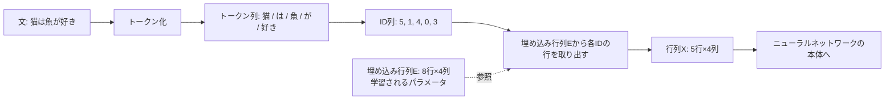

# 第6章 言葉を数にする — トークンと埋め込み

## この章で学ぶこと

- ニューラルネットワークに言葉を入力するには、まず言葉を「数」に変換しなければならないこと
- 文を部品に切り分ける**トークン化(tokenization)** の方法(単語分割・文字分割・サブワード)
- サブワード分割の代表格 **BPE(Byte Pair Encoding)** の仕組み(小さな例で手順を追います)
- 語彙(vocabulary)とトークンID
- **one-hotベクトル**とその致命的な問題点(第2章の「内積=類似度」がここで効いてきます)
- **埋め込み(embedding)**: 意味が近い単語はベクトルも近くなる、という言葉の数値表現
- word2vecの考え方と「王 − 男 + 女 ≈ 女王」
- 埋め込み行列 $E$ と、「文はベクトルを縦に積んだ行列 $X$ になる」という本書後半の土台

## この章の前提

- [第1章 数学の準備(1)— 関数と記号に慣れる](01-functions-and-symbols.md) — 添字、 $\Sigma$ 記法
- [第2章 数学の準備(2)— ベクトルと行列](02-vectors-and-matrices.md) — 内積=類似度、コサイン類似度、行列、転置
- [第3章 数学の準備(3)— 微分・勾配・確率](03-derivatives-gradients-probability.md) — 勾配
- [第4章 機械学習入門](04-machine-learning-basics.md) — パラメータ、学習=良いパラメータ探し
- [第5章 ニューラルネットワーク](05-neural-networks.md) — 層、行列計算としてのNN

---

## 6.1 ニューラルネットワークが扱えるのは数だけ

第5章で、ニューラルネットワークの正体を見ました。1つの層は

$$
\mathbf{h} = f(W\mathbf{x} + \mathbf{b})
$$

**読み下し**: 入力ベクトル $\mathbf{x}$ に行列 $W$ を掛けてバイアス $\mathbf{b}$ を足し、活性化関数 $f$ に通したものが、この層の出力 $\mathbf{h}$ である。

つまりニューラルネットワークの中身は、**行列とベクトルの計算の積み重ね**でした。行列もベクトルも「数の並び」ですから、ニューラルネットワークが処理できるのは、最初から最後まで「数」だけです。

ところが、私たちがこの本で扱いたいのは**言葉**です。

「猫は魚が好き」

この文は、数ではありません。文字の並びです。このままニューラルネットワークに入力しようとしても、文字のままでは掛け算も足し算もできないので、計算のしようがありません。

そこで本章の問いはこうなります。

**「猫は魚が好き」という文を、どうやってニューラルネットワークが食べられる「数の並び」に変換するか?**

答えは2段階です。

1. **トークン化**: 文を「部品」に切り分け、各部品に番号(ID)を振る
2. **埋め込み**: 各番号を「意味を反映したベクトル」に変換する

この2段階を通り抜けると、「猫は魚が好き」は最終的に **1つの行列 $X$** になります。第2章の最後で「 $n$ 個の $d$ 次元ベクトルは $n \times d$ 行列にまとめられる。これが文章の数値表現の形になる」と予告しました。本章はその予告を回収する章です。

では、1段階目のトークン化から始めましょう。

---

## 6.2 トークン化 — 文を部品に切り分ける

文を数にする前に、まず「どういう単位で数を割り当てるか」を決めなければなりません。文をまるごと1つの数にするのは無理があります(世の中の文は無限にあります)。そこで文を小さな部品に切り分けます。この部品を**トークン(token)** と呼び、切り分ける処理を**トークン化(tokenization)** と呼びます。

本書の通し例では、次のように切り分けます。

「猫は魚が好き」 → `[猫, は, 魚, が, 好き]`(5トークン)

さて、「どう切るか」には選択肢があります。代表的な2つの素朴な方法から見てみましょう。

### 6.2.1 単語分割 — 意味の単位で切る

一番自然に思えるのは、**単語ごと**に切る方法です。上の `[猫, は, 魚, が, 好き]` はまさに単語分割です。英語なら空白で区切ればほぼ単語になります("Cats like fish" → `[Cats, like, fish]`)。

**長所**: 1つ1つのトークンが意味を持つ単位なので、扱いやすい。

**短所**は2つあります。

1. **語彙が爆発する**。世の中の単語は膨大です。「猫」「子猫」「猫背」「猫舌」「愛猫家」……活用形も入れると、日本語でも英語でも数十万〜数百万語が平気で登場します。すべてに番号を振ると管理する語彙表が巨大になります。
2. **未知語(知らない単語)に対応できない**。語彙表を作った後に新語・固有名詞・打ち間違いが来ると、番号がないので「不明」としか扱えません。「スマホ」という語が語彙表にないモデルは、「スマホ」が入力されても処理できません。

### 6.2.2 文字分割 — 最小の単位で切る

逆の極端は、**1文字ずつ**切る方法です。

「猫は魚が好き」 → `[猫, は, 魚, が, 好, き]`(6トークン)

**長所**: 語彙が小さくて済みます(日本語の常用漢字+かな+記号で数千、英語ならアルファベット+記号で100程度)。どんな新語が来ても、文字にばらせば必ず処理できるので、**未知語が原理的に発生しません**。

**短所**: 1トークンの情報量が少なすぎます。「好」と「き」に分かれてしまうと、「好き」という意味のまとまりをモデルが自力で再発見しなければなりません。また、同じ文でもトークン列が長くなります。トークン列が長いほど処理量は増えます(トークン列の長さが処理量に響くという話は、後の章でも繰り返し出てきます)。

### 6.2.3 比較表

| 方式 | 語彙サイズ | 未知語 | トークン列の長さ | 1トークンの意味 |
|---|---|---|---|---|
| 単語分割 | 巨大(数十万〜) | 発生する | 短い | 濃い |
| 文字分割 | 小さい(数百〜数千) | 発生しない | 長い | 薄い |
| サブワード(次節) | 中くらい(数万) | 発生しない | 中くらい | そこそこ濃い |

単語分割と文字分割は、ちょうど正反対の長所・短所を持っています。「では、いいとこ取りはできないか?」という発想で生まれたのが、次節の**サブワード**です。

---

## 6.3 サブワード — いいとこ取りの分割

**サブワード(subword)** 分割の発想はこうです。

> [!IMPORTANT]
> **よく出てくる文字のつながりは1つのトークンにまとめ、めったに出ない単語は細かい部品に分ける。**

「猫」「好き」のような頻出語は1トークン。めったに出ない「猫用自動給餌器」のような語は「猫」「用」「自動」「給」「餌」「器」のように部品に分解する。頻出語は効率よく、レア語は文字分割に近い形で確実に処理する。両者のいいとこ取りです。

これを実現する代表的なアルゴリズムが **BPE(Byte Pair Encoding、バイトペア符号化)** です。GPT系のモデルをはじめ、現代の多くの言語モデルがBPEか、それを改良した方式を使っています。

### 6.3.1 BPEの手順 — 「よく隣り合うペアをくっつける」を繰り返す

BPEのルールはとても単純です。

1. まず、すべてを**文字(最小単位)にばらした状態**から始める
2. 学習用の文章の中で、**最も頻繁に隣り合って現れる2つのトークンのペア**を見つける
3. そのペアを**くっつけて1つの新しいトークン**にし、語彙に登録する
4. 語彙が目標のサイズになるまで 2〜3 を繰り返す

たったこれだけです。小さな例で実際に手を動かしてみましょう。

### 6.3.2 小さな例で手順を追う

学習用の文章(コーパス)に、次の単語がこの回数だけ出てくるとします。

| 単語 | 出現回数 |
|---|---|
| ねこ | 5回 |
| ねこみみ | 3回 |
| みみ | 2回 |
| こねこ | 2回 |

**初期状態**: すべて文字にばらします。語彙は文字の集合 `{ね, こ, み}` です。

| 単語 | トークン列(初期状態) |
|---|---|
| ねこ | `[ね, こ]` ×5 |
| ねこみみ | `[ね, こ, み, み]` ×3 |
| みみ | `[み, み]` ×2 |
| こねこ | `[こ, ね, こ]` ×2 |

**1回目のマージ**: 隣り合うペアの出現回数を数えます。

| 隣り合うペア | どこに出るか | 合計回数 |
|---|---|---|
| ね+こ | ねこ(5)、ねこみみ(3)、こねこ(2) | **10回** |
| こ+み | ねこみみ(3) | 3回 |
| み+み | ねこみみ(3)、みみ(2) | 5回 |
| こ+ね | こねこ(2) | 2回 |

最頻ペアは「ね+こ」(10回)。これをくっつけて新トークン「ねこ」を語彙に追加します。語彙は `{ね, こ, み, ねこ}` になりました。各単語のトークン列を書き直します。

| 単語 | トークン列(1回目のマージ後) |
|---|---|
| ねこ | `[ねこ]` ×5 |
| ねこみみ | `[ねこ, み, み]` ×3 |
| みみ | `[み, み]` ×2 |
| こねこ | `[こ, ねこ]` ×2 |

**2回目のマージ**: もう一度ペアを数えます。

| 隣り合うペア | 合計回数 |
|---|---|
| ねこ+み | 3回 |
| み+み | 3 + 2 = **5回** |
| こ+ねこ | 2回 |

最頻は「み+み」(5回)。くっつけて「みみ」を語彙に追加。語彙は `{ね, こ, み, ねこ, みみ}`。

| 単語 | トークン列(2回目のマージ後) |
|---|---|
| ねこ | `[ねこ]` ×5 |
| ねこみみ | `[ねこ, みみ]` ×3 |
| みみ | `[みみ]` ×2 |
| こねこ | `[こ, ねこ]` ×2 |

**3回目のマージ**: 残るペアは「ねこ+みみ」(3回)と「こ+ねこ」(2回)。「ねこ+みみ」をくっつけて「ねこみみ」を追加します。

最終的な語彙は `{ね, こ, み, ねこ, みみ, ねこみみ}` の6トークンです。観察してみましょう。

- 頻出語「ねこ」「ねこみみ」は**丸ごと1トークン**になった
- 「こねこ」は `[こ, ねこ]` と**部品2つ**で表せる
- 学習中に一度も見なかった「こねこみみ」が来ても、`[こ, ねこ, みみ]` と**既存の部品の組み合わせ**で必ず表せる。**未知語が発生しない**

「よく出るものは大きな塊、レアなものは小さな部品の組み合わせ」という、まさに狙い通りの語彙ができました。マージを何回で止めるかを調節すれば、語彙サイズを好きな大きさ(実際のモデルでは3万〜十数万程度)にコントロールできます。

なお、実際のモデルでは文字よりさらに細かい「バイト」という単位から始める流儀(バイトレベルBPE)が主流で、これなら絵文字でもどの言語でも取りこぼしなく扱えます。仕組みの本質は上の例と同じです。

> [!NOTE]
> 実際のトークナイザで日本語を処理すると、「猫」が1トークンになることもあれば、頻度の低い漢字が2〜3トークンに割れることもあります。本書では話を簡単にするため、通し例「猫は魚が好き」は常にきれいに `[猫, は, 魚, が, 好き]` の5トークンに分かれるものとして進めます。

---

## 6.4 語彙とID — トークンに背番号を付ける

トークン化の方法が決まると、モデルが扱うトークンの全リストが確定します。これを**語彙(vocabulary)** と呼び、そのサイズ(トークンの種類数)を本書では $V_{\text{vocab}}$ と書きます(語彙は英語で vocabulary ですが、記号 $V$ は後の章で別の意味に使うため、 $V_{\text{vocab}}$ と添え字を付けて区別します)。

語彙の各トークンには、通し番号(**トークンID**)を振ります。単なる背番号です。たとえば実際のモデル規模($V_{\text{vocab}} = 5$ 万)を想像すると、こんな対応表になります。

「猫は魚が好き」 → `[猫, は, 魚, が, 好き]` → ID列 `[3049, 12, 887, 30, 2214]`

これで文が数の列になりました! ……と言いたいところですが、ここに落とし穴があります。

### 6.4.1 IDをそのまま入力してはいけない

「数になったのだから、ID列 `[3049, 12, 887, 30, 2214]` をそのままニューラルネットワークに入れればいいのでは?」と思うかもしれません。しかしこれはうまくいきません。**IDは背番号であって、量ではない**からです。

数として扱うと、たとえば次のような「ありもしない関係」が生まれてしまいます。

- 「猫(3049)は『は』(12)の約254倍大きい」(意味不明です)
- 「ID 3049 の猫と ID 3050 の何か(たとえば『炊飯器』)はほぼ同じ」(たまたま隣の番号なだけです)
- ニューラルネットワークは入力に重みを掛けて足します(第5章)。IDに重みを掛けたら「背番号 × 重み」というナンセンスな量が計算されてしまいます

背番号の大小や近さには何の意味もないのに、数として計算するとその「偽の構造」を拾ってしまう。これが問題です。必要なのは、**番号の大小に意味が乗らない表現**です。その最も素朴な答えが、次のone-hotベクトルです。

---

## 6.5 one-hotベクトル — 素朴だが問題だらけ

### 6.5.1 定義

**one-hotベクトル(one-hot vector)** とは、**1つの成分だけが1で、残りすべてが0のベクトル**です。トークンIDが $i$ のトークンは、「第 $i$ 成分だけが1の $V_{\text{vocab}}$ 次元ベクトル」で表します。

手計算できるように、ここからしばらくは $V_{\text{vocab}} = 8$ のミニ語彙で考えます。

| ID | 0 | 1 | 2 | 3 | 4 | 5 | 6 | 7 |
|---|---|---|---|---|---|---|---|---|
| トークン | が | は | 犬 | 好き | 魚 | 猫 | 肉 | 机 |

このミニ語彙では「猫は魚が好き」のID列は `[5, 1, 4, 0, 3]` です。「猫」(ID 5)のone-hotベクトルは、

$$
\mathbf{e}_{\text{猫}} = (0,\ 0,\ 0,\ 0,\ 0,\ 1,\ 0,\ 0)
$$

**読み下し**: 8次元ベクトルのうち、猫のID である5番目(0から数えて)の成分だけが1で、他は全部0。

文全体をone-hotで書くと、次の表になります(各行が1トークン)。

| トークン | 成分0(が) | 1(は) | 2(犬) | 3(好き) | 4(魚) | 5(猫) | 6(肉) | 7(机) |
|---|---|---|---|---|---|---|---|---|
| 猫 | 0 | 0 | 0 | 0 | 0 | **1** | 0 | 0 |
| は | 0 | **1** | 0 | 0 | 0 | 0 | 0 | 0 |
| 魚 | 0 | 0 | 0 | 0 | **1** | 0 | 0 | 0 |
| が | **1** | 0 | 0 | 0 | 0 | 0 | 0 | 0 |
| 好き | 0 | 0 | 0 | **1** | 0 | 0 | 0 | 0 |

one-hotの良いところは、**背番号の大小の意味が完全に消える**ことです。どのトークンも「自分の場所に1が立っているだけ」で、対等です。ID 3049 と 3050 が「近い」といった偽の関係も生まれません。

しかし、one-hotには2つの大きな問題があります。

### 6.5.2 問題点1: 巨大すぎる

実際の語彙サイズは5万程度です。すると**1トークンを表すのに5万次元**(5万個の数、しかもそのうち49,999個は0)が必要です。「猫は魚が好き」のたった5トークンで、 $5 \times 50{,}000 = 25$ 万個の数。ほとんどが0の、スカスカで無駄だらけの表現です。こういう「ほとんど0のベクトル」を**疎(sparse、スパース)** なベクトルと呼びます。

### 6.5.3 問題点2: すべての単語が「互いに無関係」になる

こちらがより深刻です。第2章で学んだ最重要演算、**内積**を思い出してください。**内積は類似度**であり、向きが揃うほど大きく、直交(直角)なら0=「無関係」なのでした。

では、one-hotベクトル同士の内積を計算してみましょう。「猫」と「犬」という、意味の近い2語で試します。

$$
\mathbf{e}_{\text{猫}} \cdot \mathbf{e}_{\text{犬}}
= (0,0,0,0,0,1,0,0) \cdot (0,0,1,0,0,0,0,0)
$$

**読み下し**: 猫のone-hotと犬のone-hotの、対応する成分同士を掛けて全部足す。

成分ごとに掛け算すると、

$$
0{\cdot}0 + 0{\cdot}0 + 0{\cdot}1 + 0{\cdot}0 + 0{\cdot}0 + 1{\cdot}0 + 0{\cdot}0 + 0{\cdot}0 = 0
$$

**読み下し**: 1が立っている場所が互いにずれているので、掛け算はどの成分でも「1×0」か「0×0」になり、合計は0。

内積は **0**。つまり第2章の言葉で言えば、「猫」と「犬」は**完全に直交=完全に無関係**です。しかも、これは猫と犬に限りません。**異なるトークン同士のone-hotの内積は、必ず0になります**(1の立つ位置が必ずずれるからです)。

- 猫と犬(意味が近い): 内積 0
- 猫と机(意味が遠い): 内積 0
- 魚と肉(意味が近い): 内積 0

**すべての単語ペアが等しく「無関係」**。one-hot表現は、「猫と犬は似ている」「魚と肉はどちらも食べ物」という、言葉の意味の構造を1ミリも表現できないのです。

これでは困ります。もしモデルが訓練中に「猫は魚が好き」という文をたくさん見て何かを学んでも、その知識は「犬は肉が好き」の処理に全く流用できません。猫と犬が「似ている」と知る手がかりが、表現のどこにもないからです。

欲しいのは、**意味が近い単語は、ベクトルとしても近い**(内積・コサイン類似度が大きい)という性質を持った表現です。それが**埋め込み**です。

---

## 6.6 埋め込み — 意味を座標にする

### 6.6.1 定義: 低次元の密なベクトル

**埋め込み(embedding)** とは、各トークンに割り当てられた、**低次元で密なベクトル**のことです。

- **低次元**: one-hotの5万次元ではなく、数百〜数千次元(本書の手計算では4次元)。この次元数を本書では $d_{\text{model}}$(モデル次元)と書きます。実際のモデルでは $d_{\text{model}} = 512$ や $4096$ などです
- **密(dense、デンス)**: ほとんどが0の疎なベクトルと違い、全成分がいろいろな値を取る

そして最大の特徴が、**意味が近い単語は、埋め込みベクトルも近い**という性質です。「意味」という掴みどころのないものを、ベクトル空間の「位置」として表す。言葉を意味の地図の上に**埋め込む**わけです。

### 6.6.2 手計算: 埋め込みの内積とコサイン類似度

$d_{\text{model}} = 4$ として、ミニ語彙の各トークンに次の埋め込みを与えてみます(値は説明用に単純にしてあります)。

| トークン | 埋め込みベクトル |
|---|---|
| が | $(0,\ 1,\ 0,\ -1)$ |
| は | $(0,\ 1,\ 0,\ 0)$ |
| 犬 | $(2,\ 1,\ 1,\ 0)$ |
| 好き | $(-1,\ 0,\ 1,\ 2)$ |
| 魚 | $(1,\ 0,\ 2,\ 1)$ |
| 猫 | $(2,\ 2,\ 1,\ 0)$ |
| 肉 | $(1,\ 0,\ 2,\ 0)$ |
| 机 | $(0,\ -1,\ 2,\ 0)$ |

第2章のコサイン類似度(向きの近さ。1に近いほど似ていて、0なら無関係)を計算してみましょう。

**猫と犬**:

$$
\mathbf{v}_{\text{猫}} \cdot \mathbf{v}_{\text{犬}} = 2{\cdot}2 + 2{\cdot}1 + 1{\cdot}1 + 0{\cdot}0 = 7
$$

**読み下し**: 猫ベクトルと犬ベクトルの対応成分を掛けて足すと7。0ではない、はっきり正の値。

ノルム(長さ)は $`\lVert \mathbf{v}_{\text{猫}} \rVert = \sqrt{2^2+2^2+1^2+0^2} = \sqrt{9} = 3`$ 、 $`\lVert \mathbf{v}_{\text{犬}} \rVert = \sqrt{4+1+1+0} = \sqrt{6} \approx 2.449`$ なので、

$$
\cos(\text{猫}, \text{犬}) = \frac{7}{3 \times 2.449} \approx 0.95
$$

**読み下し**: 内積をお互いの長さで割ったコサイン類似度は約0.95。最大値1にかなり近く、「猫と犬はとても似ている」。

同じ計算を他のペアでもやってみます。

| ペア | 内積 | コサイン類似度 | 解釈 |
|---|---|---|---|
| 猫・犬 | 7 | $\approx 0.95$ | とても似ている(どちらも動物) |
| 魚・肉 | $1{+}0{+}4{+}0 = 5$ | $\approx 0.91$ | とても似ている(どちらも食べ物) |
| 猫・魚 | $2{+}0{+}2{+}0 = 4$ | $\approx 0.54$ | そこそこ関係がある(猫は魚を食べる) |
| 猫・机 | $0{-}2{+}2{+}0 = 0$ | $0$ | 無関係 |

one-hotでは全ペアが一律0だった類似度に、**濃淡がついた**ことに注目してください。「似ている」「そこそこ」「無関係」が、内積という単純な計算で読み取れるようになりました。第2章で「内積=類似度という見方は後で必ず効いてくる」と強調したのは、まさにこのため(そして第8章のAttentionのため)です。

### 6.6.3 埋め込み空間を眺める

埋め込みベクトルたちが住む空間を**埋め込み空間(embedding space)** と呼びます。実際は数百次元ですが、雰囲気を掴むために2次元に描くと、こんなイメージです(この図は概念図で、意味の近い単語が近くに集まる様子を表しています)。

```text
        ^ 意味の軸2(たとえば「生き物らしさ」)
        |
      4 |     *A   *B
        |       *C
      3 |  *D
        |
      2 |              *E  *F
        |                *G
      1 |  *H
        |     *I
      0 |                       *J
        |                     *K
        +---------------------------->
           0    1    2    3    4    5
                意味の軸1(たとえば「食べ物らしさ」)

  A=犬  B=猫  C=虎  D=鳥
  E=魚  F=肉  G=米
  H=好き  I=嫌い
  J=机  K=椅子
```

(図: 各点が1つの単語のベクトル。点の近さが意味の近さを表す)

- 「猫・犬・虎・鳥」が1つのまとまり(動物)を作っている
- 「魚・肉・米」が別のまとまり(食べ物)を作っている
- 「好き・嫌い」(感情の言葉)も近くに並んでいる
- 「机・椅子」(家具)はどのまとまりからも離れた場所にいる

注意してほしいのは、**軸に「生き物らしさ」などのラベルが最初から付いているわけではない**ことです。上の図のラベルは人間が後付けで解釈したものです。実際の埋め込み空間の各軸が何を意味するかは通常はっきりしません。大事なのは軸の名前ではなく、**「近い・遠い」という位置関係が意味の類似を表す**ことです。

### 6.6.4 なぜ低次元で足りるのか

5万次元のone-hotが、なぜ512次元程度の埋め込みで置き換えられるのでしょうか。考え方はこうです。one-hotの5万次元は「5万個の単語を全部バラバラの方向に置く」ための次元でした。しかし単語の意味は本当はバラバラではなく、「動物っぽさ」「食べ物っぽさ」「ポジティブさ」「時制」……のような、**ずっと少数の意味の要素の組み合わせ**でかなり記述できます。埋め込みは、この「少数の意味の軸」だけで単語を表し直したもの、と考えられます。無駄に広い空間をやめて、意味の詰まったコンパクトな空間に引っ越すのです。

---

## 6.7 word2vecの考え方 — 文脈が意味を作る

「意味が近い単語はベクトルも近い」という埋め込みは、どうやって作るのでしょうか。人間が5万語すべてに手で座標を割り振る……のは不可能です。答えは本書でおなじみ、**データから学習する**(第4章)です。その先駆けとして有名なのが、2013年に登場した **word2vec(ワード・ツー・ベック)** です。

### 6.7.1 分布仮説 — 「単語の意味は、周りの単語が決める」

word2vecの土台には、言語学の**分布仮説(distributional hypothesis)** という考え方があります。

> [!IMPORTANT]
> **似た文脈に現れる単語は、意味も似ている。**

たとえば「___がニャーと鳴いた」の空欄に入るのは「猫」「子猫」「仔猫」あたりで、「机」はまず入りません。「___を焼いて食べた」に入るのは「魚」「肉」「パン」あたりです。**どんな空欄に入れるかのパターン(=文脈)が似ている単語は、意味が似ている**。言われてみれば当たり前のようですが、これが強力なのです。なぜなら「文脈が似ているか」は、意味の定義論争をしなくても、**大量の文章から機械的に数えられる**からです。

### 6.7.2 word2vecの学習: 周りの単語を当てるゲーム

word2vecは、大量の文章を使ってニューラルネットワークに次のようなクイズを解かせます。

「猫 は ___ が 好き」の ___ の周りの単語から、___ を当てよ(あるいはその逆で、中央の単語から周りを当てよ)

このクイズに正解できるように、第4章・第5章で学んだいつもの手順(損失を定義して勾配降下法でパラメータ更新)で訓練します。そして重要なのはここです。**このモデルの入力部分のパラメータが、各単語に割り当てられたベクトル**になっています。クイズの成績を上げようとパラメータが調整されていくと、似た文脈に出る単語(猫と犬など)は自然と似たベクトルを持つようになります。分布仮説が、学習を通じてベクトルの近さに変換されるのです。

つまり埋め込みは、**単語当てクイズの「副産物」として自動的に得られる**のです。誰も各単語の座標を手で決めていないのに、意味が近い単語どうしが近くに並ぶ配置が自動的にできあがる。これがword2vecの新しさでした。

### 6.7.3 王 − 男 + 女 ≈ 女王

word2vecの埋め込みには、よく知られた面白い性質があります。ベクトルの足し算・引き算(第2章)が、意味の操作に対応するのです。

$$
\mathbf{v}_{\text{王}} - \mathbf{v}_{\text{男}} + \mathbf{v}_{\text{女}} \approx \mathbf{v}_{\text{女王}}
$$

**読み下し**: 王のベクトルから男のベクトルを引き、女のベクトルを足すと、女王のベクトルにほぼ一致する。

2次元のおもちゃの例で確かめてみましょう。仮に埋め込みがこうなっていたとします。

| 単語 | ベクトル |
|---|---|
| 王 | $(4,\ 3)$ |
| 男 | $(4,\ 1)$ |
| 女 | $(1,\ 1)$ |
| 女王 | $(1,\ 3)$ |

計算すると、

$$
(4,\ 3) - (4,\ 1) + (1,\ 1) = (1,\ 3)
$$

**読み下し**: 成分ごとに 4−4+1=1、3−1+1=3 で、結果はぴったり女王のベクトル (1, 3)。

図にするとカラクリが見えます。

```text
      ^ 第2成分(「王族らしさ」)
      |
    3 |   *B          *A
      |   ^           ^
      |   |           |          どちらの矢印も同じ移動 (0, 2) = 「王族化ベクトル」
      |   |           |
    1 |   *D          *C
      |
    0 +--------------------> 第1成分(「男性らしさ」)
          1           4

  A=王 (4, 3)   B=女王 (1, 3)   C=男 (4, 1)   D=女 (1, 1)
```

「王 − 男」は $(0, 2)$ 、つまり「男を王族にするための移動」です。同じ移動を「女」に適用すると「女王」に着く。**意味の関係(性別、王族らしさ)が、埋め込み空間では平行な矢印として現れている**わけです。他にも「東京 − 日本 + フランス ≈ パリ」(首都の関係)のような例が知られています。誰も教えていないのに、単語当てクイズの副産物にこんな構造が宿る。埋め込みという考え方の力がよく分かる例です。

### 6.7.4 word2vecの限界 — 1単語1ベクトルの窮屈さ

ただし、word2vecの埋め込みには弱点があります。**1つの単語には1つのベクトルしか割り当てられない**ことです。

日本語の「はし」を考えてください。「橋を渡る」の「はし」と「箸で食べる」の「はし」は別物ですが、word2vecでは同じ1本のベクトルで表すしかありません。英語の "bank"(銀行/川岸)も同様です。文脈によって意味が変わる単語に、固定の1点しか与えられないのは窮屈です。

「**文脈に応じて単語のベクトルが変わってほしい**」。この願いに正面から応えるのが、第8章で学ぶAttentionです(予告だけしておきます)。本章の埋め込みは、いわば文脈を見る前の「単語の辞書的な意味」の座標であり、Transformerはこれを出発点として文脈を混ぜ込んでいきます。

---

## 6.8 埋め込み行列 $E$ — 「ID → 行を取り出す」だけ

ここまで「各トークンに埋め込みベクトルを割り当てる」と言ってきました。これを行列として整理しましょう。

### 6.8.1 定義

全トークンの埋め込みベクトルを、ID順に**縦に積み上げた行列**を**埋め込み行列(embedding matrix)** $E$ と呼びます。サイズは

$$
E \in \mathbb{R}^{V_{\text{vocab}} \times d_{\text{model}}}
$$

**読み下し**: $E$ は、行数が語彙サイズ $V_{\text{vocab}}$ 、列数がモデル次元 $d_{\text{model}}$ の行列である($\mathbb{R}$ は「実数」の意味で、「実数を成分とする $V_{\text{vocab}} \times d_{\text{model}}$ 行列」と読みます)。

ミニ語彙($V_{\text{vocab}} = 8$ 、 $d_{\text{model}} = 4$)なら、 $E$ は $8 \times 4$ 行列です。

```math
E =
\begin{pmatrix}
0 & 1 & 0 & -1 \\
0 & 1 & 0 & 0 \\
2 & 1 & 1 & 0 \\
-1 & 0 & 1 & 2 \\
1 & 0 & 2 & 1 \\
2 & 2 & 1 & 0 \\
1 & 0 & 2 & 0 \\
0 & -1 & 2 & 0
\end{pmatrix}
\begin{matrix}
\leftarrow \text{ID 0: が} \\
\leftarrow \text{ID 1: は} \\
\leftarrow \text{ID 2: 犬} \\
\leftarrow \text{ID 3: 好き} \\
\leftarrow \text{ID 4: 魚} \\
\leftarrow \text{ID 5: 猫} \\
\leftarrow \text{ID 6: 肉} \\
\leftarrow \text{ID 7: 机}
\end{matrix}
```

**読み下し**: 第 $i$ 行が、ID $i$ のトークンの埋め込みベクトルになっている表。

すると「トークンID $i$ を埋め込みベクトルに変換する」という操作は、**$E$ の第 $i$ 行を取り出すだけ**です。計算らしい計算は何もありません。辞書を引くように行を見るだけなので、この操作は**ルックアップ(lookup、参照)** とも呼ばれます。「猫」(ID 5)なら $E$ の第5行、 $(2,\ 2,\ 1,\ 0)$ です。

### 6.8.2 one-hotとの関係

実はこの「行の取り出し」は、one-hotベクトルを使った行列計算として書けます。第2章で学んだ「行列とベクトルの掛け算」の出番です。

$$
\mathbf{x}_{\text{猫}} = \mathbf{e}_{\text{猫}}^\top E
$$

**読み下し**: 猫のone-hotベクトル(を横に寝かせたもの)と埋め込み行列 $E$ を掛けると、猫の埋め込みベクトルが出てくる。

確かめましょう。 $\mathbf{e}_{\text{猫}}^\top = (0,0,0,0,0,1,0,0)$ と $E$ の積の第1成分は、one-hotと「 $E$ の第1列 $(0, 0, 2, -1, 1, 2, 1, 0)$ 」の内積です。

$$
0{\cdot}0 + 0{\cdot}0 + 0{\cdot}2 + 0{\cdot}(-1) + 0{\cdot}1 + 1{\cdot}2 + 0{\cdot}1 + 0{\cdot}0 = 2
$$

**読み下し**: 1が立っているのは5番目だけなので、 $E$ の第1列の5番目の成分「2」だけが生き残る。

他の成分も同様に、「 $E$ の各列の5番目の成分」だけが拾われます。結果は

$$
(0,0,0,0,0,1,0,0)\, E = (2,\ 2,\ 1,\ 0)
$$

**読み下し**: one-hotを掛けるという操作は、 $E$ の第5行(猫の行)をそっくり抜き出す操作と同じ。

つまり、**埋め込み = one-hotベクトル × 埋め込み行列**なのです。one-hot(疎で巨大だが「どのトークンか」だけを純粋に表す)に行列 $E$ を掛けて、密で低次元な意味ベクトルへ変換している、と読めます。実装上はわざわざ掛け算せず行を取り出すだけですが、「one-hotと埋め込みは対立する2方式ではなく、行列 $E$ で結ばれた連続した話」だと分かる、気持ちのよい関係です。

### 6.8.3 埋め込みは「学習されるパラメータ」である

ここが本章で最も大切なポイントの1つです。

> [!IMPORTANT]
> **埋め込み行列 $E$ の中身は、人間が決めるのではない。学習で決まる。**

$E$ は、第4章で学んだ「モデルのパラメータ $\theta$ 」の一部です。訓練開始時、 $E$ の中身は**でたらめな乱数**です。猫も犬も机も、空間内のでたらめな位置に散らばった状態から始まります。そして訓練が進む中で、損失(第5章の交差エントロピー)を減らす方向に、勾配降下法(第4章)で $E$ の各数値が少しずつ更新されていきます。「猫と犬を近くに置いた方がクイズの成績が上がる」なら、勾配がそのように2つの行を近づけていく。6.6節で見た「似た単語どうしが近くに集まる」配置は、**この学習の結果として自然にできあがる**ものなのです。

パラメータ数も見積もっておきましょう。実際の規模($V_{\text{vocab}} = 5$ 万、 $d_{\text{model}} = 512$)では、

$$
50{,}000 \times 512 = 25{,}600{,}000
$$

**読み下し**: 埋め込み行列だけで約2,560万個の学習されるパラメータがある。

たった「単語をベクトルにする」だけの部品が、数千万パラメータの大所帯です。言語モデルのパラメータ数の感覚を掴む、最初の一歩です。

---

## 6.9 文は行列になる — 第2章の回収

いよいよ本章のゴールです。通し例「猫は魚が好き」を、入口から出口まで一気に変換してみましょう。

**ステップ1: トークン化** — 「猫は魚が好き」 → `[猫, は, 魚, が, 好き]`

**ステップ2: ID化** — ミニ語彙で → `[5, 1, 4, 0, 3]`

**ステップ3: 埋め込み** — 各IDについて $E$ の行を取り出す

| 位置 $t$ | トークン | ID | 埋め込みベクトル $\mathbf{x}_t$($E$ の行) |
|---|---|---|---|
| 1 | 猫 | 5 | $(2,\ 2,\ 1,\ 0)$ |
| 2 | は | 1 | $(0,\ 1,\ 0,\ 0)$ |
| 3 | 魚 | 4 | $(1,\ 0,\ 2,\ 1)$ |
| 4 | が | 0 | $(0,\ 1,\ 0,\ -1)$ |
| 5 | 好き | 3 | $(-1,\ 0,\ 1,\ 2)$ |

**ステップ4: 縦に積んで行列にする** — 5個の4次元ベクトルを、文の順番どおり縦に積みます。

```math
X =
\begin{pmatrix}
2 & 2 & 1 & 0 \\
0 & 1 & 0 & 0 \\
1 & 0 & 2 & 1 \\
0 & 1 & 0 & -1 \\
-1 & 0 & 1 & 2
\end{pmatrix}
\begin{matrix}
\leftarrow \text{猫} \\
\leftarrow \text{は} \\
\leftarrow \text{魚} \\
\leftarrow \text{が} \\
\leftarrow \text{好き}
\end{matrix}
```

**読み下し**: 文「猫は魚が好き」の数値表現は、1行目が猫、2行目が「は」……と、各トークンの埋め込みを文の順に縦に積んだ $5 \times 4$ 行列 $X$ である。

一般に、トークン数 $n$ の文は

$$
X \in \mathbb{R}^{n \times d_{\text{model}}}
$$

**読み下し**: $n$ 行 $d_{\text{model}}$ 列の行列。行の数が文の長さ、列の数が意味ベクトルの次元。

第2章の最終節で学んだ「**$n$ 個の $d$ 次元ベクトルは $n \times d$ 行列にまとめられる**」。あのときは「これが文章の数値表現の形になります」という予告付きの抽象的な話でした。その正体がこの $X$ です。第2章の布石が、ここで回収されました。

そして第5章で見たとおり、**行列にまとまっているからこそ、GPUで一気に計算できる**のでした。文を $X$ という1つの行列にしておけば、この後の処理(第8章のAttentionもその一つです)を全トークンまとめて行列演算で書けます。この形式が、本書の残り全部の章の共通の出発点になります。

### 6.9.1 本章の全体像(最重要図)

文が行列になるまでの流れを1枚にまとめます。



---

## この章のまとめ

- ニューラルネットワークは数しか処理できないので、言葉は「トークン化 → 埋め込み」の2段階で数に変換する
- **トークン化**には単語分割(語彙が爆発・未知語に弱い)と文字分割(列が長い・1トークンが薄い)があり、いいとこ取りが**サブワード**分割。代表格の**BPE**は「最も頻繁に隣り合うペアをくっつける」を繰り返すだけで、頻出語は1トークン・レア語は部品の組み合わせになり、未知語が発生しない
- 語彙の各トークンには**ID**(背番号)を振るが、IDの数値そのものに意味はないので直接入力してはいけない
- **one-hotベクトル**は背番号の偽の構造を消せるが、(1)巨大で疎、(2)**すべての単語ペアの内積が0=全単語が互いに無関係**(第2章の「内積=類似度」の裏返し)という致命的な問題がある
- **埋め込み**は低次元で密なベクトル。**意味が近い単語はベクトルも近い**(猫・犬のコサイン類似度 ≈ 0.95、猫・机は 0)
- word2vecは「周りの単語を当てるクイズ」の副産物として埋め込みを学習する(分布仮説)。「王 − 男 + 女 ≈ 女王」のように、意味の関係がベクトルの引き算・足し算に現れる
- **埋め込み行列 $E$**($V_{\text{vocab}} \times d_{\text{model}}$)は「ID → 行の取り出し」の表であり、one-hot × $E$ とも書ける。 $E$ は乱数から始まり**学習で更新されるパラメータ**である
- 文はトークンの埋め込みを縦に積んだ行列 $X$($n \times d_{\text{model}}$)になる。これは第2章最終節の予告の回収であり、本書の残り全章の出発点

## 次の章へ

言葉が数(行列 $X$)になったので、いよいよ「文章を扱うニューラルネットワーク」を作れます。次章では、Transformer登場前の主役だった **RNN** を学びます。第3章で予告した「次に来る単語の確率分布」という見方が**言語モデル**として正式に登場し、RNNの全盛期と、Transformer誕生の引き金となった限界、そして**Attentionの誕生**までを追いかけます。

→ [第7章 Transformer前夜 — RNNの栄光と限界](07-before-transformer.md)
