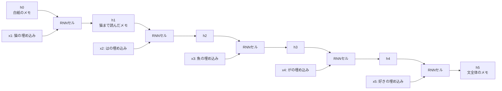
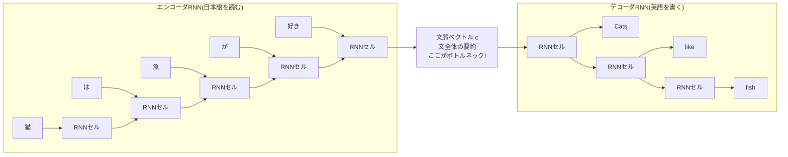
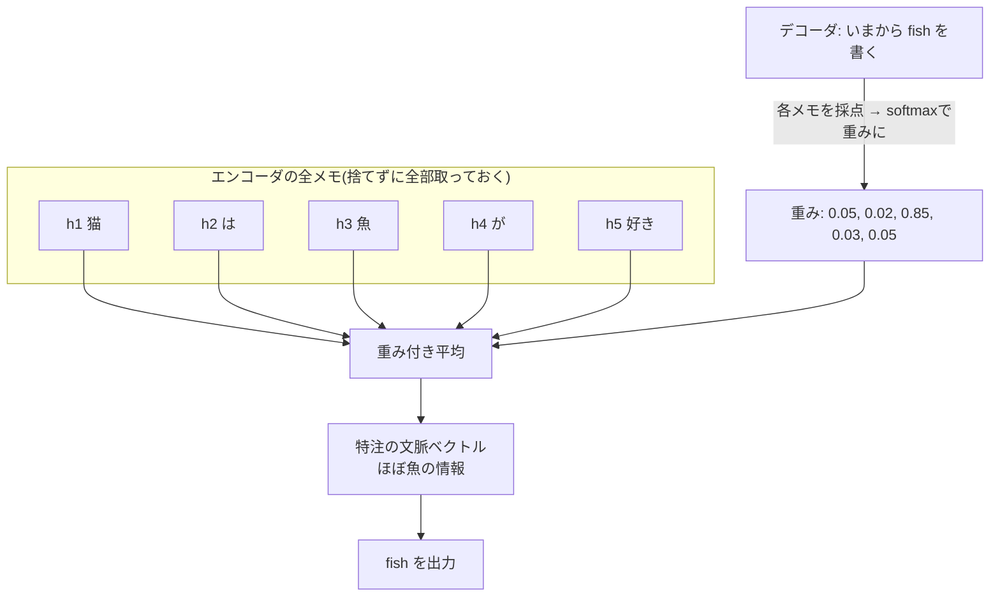

# 第7章 Transformer前夜 — RNNの栄光と限界

## この章で学ぶこと

- **言語モデル(language model)** の正式な定義: 「次の単語の確率分布」を出す関数(第3章の布石をここで回収します)
- 最古参の方法 **n-gram** と、その限界(組み合わせ爆発・長距離依存)
- **RNN**: 「読みながらメモを更新する」ニューラルネットワーク。数式と展開図
- RNNの弱点: **勾配消失・勾配爆発**(第3章の連鎖律がここで効いてきます)
- 記憶を守る改良版 **LSTM** の考え方
- 翻訳を可能にした **seq2seq(エンコーダ・デコーダ)** と、その**ボトルネック問題**
- ボトルネックを解消した**Attention(注意機構)の誕生**(「重み付き平均で情報を集める」という発想)
- それでも残ったRNNの根本的な問題(逐次処理・並列化不可)と、"Attention Is All You Need" への道

## この章の前提

- [第1章 数学の準備(1)— 関数と記号に慣れる](01-functions-and-symbols.md) — 指数の爆発的増加
- [第2章 数学の準備(2)— ベクトルと行列](02-vectors-and-matrices.md) — 行列×ベクトル
- [第3章 数学の準備(3)— 微分・勾配・確率](03-derivatives-gradients-probability.md) — 連鎖律、条件付き確率、確率分布、期待値
- [第5章 ニューラルネットワーク](05-neural-networks.md) — 層、活性化関数、softmax、逆伝播、GPU
- [第6章 言葉を数にする](06-words-to-numbers.md) — トークン、埋め込みベクトル

---

## 7.1 言語モデル — 「次に来る単語」を当てる機械

### 7.1.1 第3章の布石を回収する

第3章の最後で、「『猫は魚が___』の空欄に何が来るかは、確率分布として考えられる。この見方が本書全体の核心になる」という話をしました。いよいよこの布石を回収します。この「次に来る単語を確率分布として予測する仕組み」には正式な名前があります。**言語モデル(language model)** です。

> [!IMPORTANT]
> **言語モデルとは、「ここまでの単語列」を受け取って、「次の単語の確率分布」を返す関数である。**

数式で書くと、言語モデルが計算するのは次の量です。

$$
P(w_t \mid w_1, w_2, \dots, w_{t-1})
$$

**読み下し**: 1番目から $t-1$ 番目までの単語 $w_1, \dots, w_{t-1}$ が既に与えられたという条件のもとで、 $t$ 番目の単語が $w_t$ になる条件付き確率(第3章の $P(A \mid B)$ の読み方そのままです。縦棒の右が「分かっていること」、左が「知りたいこと」)。

通し例で具体的に見ましょう。「猫 は 魚 が」まで読んだ言語モデルは、語彙のすべてのトークンに対して「次に来る確率」を割り振ります。たとえば、

| 次の単語 $w_5$ の候補 | $P(w_5 \mid \text{猫, は, 魚, が})$ |
|---|---|
| 好き | 0.40 |
| 食べたい | 0.15 |
| 苦手 | 0.10 |
| 泳ぐ | 0.02 |
| 机 | 0.0001 |
| …(語彙の残り全部) | …(合計すると残りの確率) |

**全部足すと1になる**(第3章: 確率の和は1)ことに注意してください。これはまさに第5章で学んだ**softmax**の出番です。ニューラルネットワークで言語モデルを作る場合、出力層で語彙の全トークン分のスコアを出し、softmaxに通して確率分布にします。「分類問題の選択肢が語彙全体(5万択!)になったもの」と考えれば、第4・5章で学んだ機械学習の枠組みにぴったり収まります。

### 7.1.2 文全体の確率 — 掛け算の鎖

言語モデルは「次の1単語」を予測する機械ですが、実はこれで**文全体の確率**も計算できます。第3章の条件付き確率の考え方で、文の確率は「1単語ずつ順に出てくる確率の掛け算」に分解できるのです。

$$
P(w_1, w_2, \dots, w_n) = P(w_1) \times P(w_2 \mid w_1) \times P(w_3 \mid w_1, w_2) \times \cdots \times P(w_n \mid w_1, \dots, w_{n-1})
$$

**読み下し**: 文全体が現れる確率は、「最初の単語が出る確率」×「最初の単語を見た上で2番目が出る確率」×「最初の2つを見た上で3番目が出る確率」×……と、次々に条件を増やしながら掛け合わせたもの。

「猫は魚が好き」で数値例を作ってみます(値は説明用の架空のものです)。

| 因子 | 意味 | 仮の値 |
|---|---|---|
| $P(\text{猫})$ | 文が「猫」で始まる確率 | 0.01 |
| $P(\text{は} \mid \text{猫})$ | 「猫」の次が「は」の確率 | 0.4 |
| $P(\text{魚} \mid \text{猫, は})$ | 「猫 は」の次が「魚」の確率 | 0.05 |
| $P(\text{が} \mid \text{猫, は, 魚})$ | 「猫 は 魚」の次が「が」の確率 | 0.5 |
| $P(\text{好き} \mid \text{猫, は, 魚, が})$ | 「猫 は 魚 が」の次が「好き」の確率 | 0.4 |

$$
P(\text{猫, は, 魚, が, 好き}) = 0.01 \times 0.4 \times 0.05 \times 0.5 \times 0.4 = 0.00004
$$

**読み下し**: 5つの条件付き確率を掛け合わせると、この文が現れる確率は0.00004(=10万分の4)。

「そんな小さい値でいいの?」と思うかもしれませんが、可能な文は天文学的な数だけあるので、1つ1つの文の確率が小さいのは自然なことです。大事なのは相対比較です。良い言語モデルなら、「猫は魚が好き」には「猫は机が好き」よりずっと高い確率を割り当てるはずです。

### 7.1.3 言語モデルは何の役に立つのか

「次の単語を当てるだけの機械」は、一見地味です。しかし、これが非常に幅広く使えることが、本書の残りを通して明らかになっていきます。さしあたり2つだけ挙げます。

- **文章生成**: 次の単語を予測しては文末に付け足し、また予測する……を繰り返せば、文章が生成できます(この生成ループの詳細は第14章で扱います)
- **自然さの判定**: 音声認識や翻訳の候補が複数あるとき、「言語モデルが高い確率を与える方」を選べば自然な文になります

そして予告しておくと、ChatGPTのような対話AIの正体も、突き詰めれば「非常に高性能な言語モデル」です。「次の単語の確率分布」という地味な見た目こそ、本書のゴールへの一本道です。

では、この $P(w_t \mid w_1, \dots, w_{t-1})$ をどうやって計算するのか。歴史をたどりながら、方法の進化を見ていきましょう。

---

## 7.2 n-gram — 直前だけ見る素朴な方法

### 7.2.1 数えて割るだけ

最も古典的な方法は、**数える**ことです。大量の文章を集めて、「『魚 が』の後に『好き』が来た回数」を数え、「『魚 が』が出た回数」で割る。これが確率の推定値になります。

ただし、「ここまでの単語列**全部**」を条件にすると、すぐ破綻します。「猫 は 魚 が」という4単語の並びとまったく同じ並びが、手持ちの文章に何回出てくるでしょうか? 長い列になるほど出現回数は激減し、ほとんどの列は1回も出てきません。0回同士の割り算になってしまいます。

そこで割り切った近似をします。**直前の $n-1$ 単語だけを見て、それより前は忘れる**。これが **n-gram(エヌグラム)言語モデル**です。たとえば $n=3$(トライグラム)なら、

$$
P(w_t \mid w_1, \dots, w_{t-1}) \approx P(w_t \mid w_{t-2}, w_{t-1})
$$

**読み下し**: 次の単語の確率を、直前のたった2単語だけを条件にした確率で近似する。それより昔の単語は影響しないとみなす。

計算は数えて割るだけです。たとえばコーパス(集めた文章)中に「魚 が」という並びが100回あり、そのうち「魚 が 好き」と続いたのが30回なら、

$$
P(\text{好き} \mid \text{魚, が}) \approx \frac{30}{100} = 0.3
$$

**読み下し**: 「魚 が」の直後に「好き」が来た割合は30%なので、確率0.3と見積もる。

単純明快で、実際、携帯電話の予測変換など長く実用されてきました。しかし限界が2つあります。

### 7.2.2 限界1: 組み合わせ爆発

$n$ を大きくすれば文脈を長く見られますが、組み合わせの数が爆発します。語彙サイズを5万とすると、

| モデル | 見る並びの長さ | 並びの種類数 |
|---|---|---|
| bigram($n=2$) | 2単語 | $50{,}000^2 = 25$ 億 |
| trigram($n=3$) | 3単語 | $50{,}000^3 = 125$ 兆 |
| 4-gram($n=4$) | 4単語 | $50{,}000^4 \approx 6.25 \times 10^{18}$(625京) |

**どんなに大量の文章を集めても、ほとんどの並びは一度も出現しません**。出現回数0の並びの確率は見積もれない(あるいは0になってしまう)ので、 $n$ は実用上3〜5程度が限界でした。第1章で見た「指数の爆発的増加」が、ここでは壁になるわけです。

### 7.2.3 限界2: 長距離依存

もっと本質的な問題があります。文の意味は、直前の数単語だけでは決まらないのです。

「**猫**は 昨日 隣の 家の 庭で 見つけた 小さな 魚が **好き**」

「好き」の主語は9単語前の「猫」です。このように**離れた単語同士が意味的に結びつく**ことを**長距離依存(long-range dependency)** と呼びます。trigramは直前の「魚 が」しか見ないので、主語が猫だろうと犬だろうと国会だろうと、同じ予測しかできません。「直前 $n-1$ 単語で切り捨てる」という近似そのものが、言葉の性質に合っていないのです。

必要なのは、**文脈全体を(原理的には)いくらでも遡って覚えていられるモデル**。ニューラルネットワークと第6章の埋め込みを手にした研究者たちが次に向かったのが、RNNでした。

---

## 7.3 RNN — 読みながらメモを更新する

### 7.3.1 発想: 1本のメモを持ち歩く

**RNN(Recurrent Neural Network、再帰型ニューラルネットワーク)** の発想は、人間の読み方に似ています。

文を先頭から1トークンずつ読む。頭の中に「ここまでの内容の要約メモ」を1つ持っておき、新しいトークンを読むたびにメモを書き換える。

この「メモ」にあたるベクトルを**隠れ状態(hidden state)** と呼び、 $\mathbf{h}_t$($t$ 番目のトークンまで読んだ時点のメモ)と書きます。更新のルールは次の式です。

$$
\mathbf{h}_t = f(W_h \mathbf{h}_{t-1} + W_x \mathbf{x}_t)
$$

**読み下し**: 新しいメモ $`\mathbf{h}_t`$ は、「1つ前のメモ $`\mathbf{h}_{t-1}`$ を行列 $`W_h`$ で変換したもの」と「いま読んだトークンの埋め込み $`\mathbf{x}_t`$ を行列 $`W_x`$ で変換したもの」を足し、活性化関数 $`f`$ に通して作る。つまり「古いメモ+新情報 → 新しいメモ」。

部品はすべて既習です。 $\mathbf{x}_t$ は第6章の埋め込みベクトル、 $W_h, W_x$ は学習されるパラメータ(行列)、 $f$ は第5章の活性化関数です(RNNでは tanh(タンジェント・ハイパボリック)という、シグモイドを上下に引き伸ばして −1〜1 の値を出すようにした関数がよく使われます。バイアス項は簡単のため省略しています)。

決定的に重要な点が2つあります。

1. **同じ $W_h, W_x$ を全ステップで使い回す**。1トークン目でも100トークン目でも、メモの更新ルールは同一です。だから文が何トークンでも対応できます。
2. $`\mathbf{h}_t`$ は $`\mathbf{h}_{t-1}`$ に依存し、 $`\mathbf{h}_{t-1}`$ は $`\mathbf{h}_{t-2}`$ に依存し……と、**メモは1つ前、そのまた1つ前……とたどる形で、過去全体とつながっています**。原理的には、 $`\mathbf{h}_t`$ には1トークン目からの情報が(間接的に)全部流れ込んでいます。n-gramのような「 $`n-1`$ 単語で強制打ち切り」がありません。

言語モデルとして使うときは、各時点のメモ $\mathbf{h}_t$ を第5章の要領で「線形層 + softmax」に通し、「次の単語の確率分布」を出力します。

### 7.3.2 展開図(本章の最重要図 その1)

RNNは「同じセルを時間方向に繰り返し使う」構造なので、時間軸に沿って展開して描くとよく分かります。「猫は魚が好き」を読む様子です。



図の5つの「RNNセル」は、すべて同じ重み $W_h, W_x$ を使っています。また、各時点のメモ $\mathbf{h}_t$ からは、softmaxを通していつでも「次の単語の確率分布」を出せます。

### 7.3.3 手計算してみる

小さな数値で1周してみましょう。手計算を簡単にするため、この節では埋め込みもメモも2次元とします(第6章では4次元を使いましたが、次元数はモデル設計者が選べる設定値です)。

設定:

- 埋め込み: 猫 $=(1, 0)$ 、は $=(0, 1)$ 、魚 $=(1, 1)$ 、が $=(0, 1)$ 、好き $=(-1, 1)$
- $f = \mathrm{ReLU}$(負なら0、正ならそのまま。第5章)
- 初期メモ $\mathbf{h}_0 = (0, 0)$(白紙)

重み行列は次の2つを使います。

```math
W_x = \begin{pmatrix} 1 & 0 \\ 0 & 1 \end{pmatrix}, \quad W_h = \begin{pmatrix} 0.5 & 0 \\ 0 & 0.5 \end{pmatrix}
```

( $W_x$ はそのまま通す行列、 $W_h$ は各成分を半分にする行列)

順に更新します。

**$t=1$(猫を読む)**:

$$
\mathbf{h}_1 = \mathrm{ReLU}\bigl(W_h \mathbf{h}_0 + W_x \mathbf{x}_1\bigr) = \mathrm{ReLU}\bigl((0,0) + (1,0)\bigr) = (1,\ 0)
$$

**読み下し**: 白紙のメモに猫の情報がそのまま書き込まれ、メモは (1, 0) になった。

**$`t=2`$(はを読む)**: $`W_h \mathbf{h}_1 = (0.5, 0)`$ 、 $`W_x \mathbf{x}_2 = (0,1)`$ なので

$$
\mathbf{h}_2 = \mathrm{ReLU}\bigl((0.5,\ 0) + (0,\ 1)\bigr) = (0.5,\ 1)
$$

**読み下し**: 猫の痕跡は半分(0.5)に薄まり、「は」の情報が加わった。

以下同様に計算すると、

| $`t`$ | 読むトークン | $`W_h \mathbf{h}_{t-1}`$(古いメモ×0.5) | $`+\ W_x \mathbf{x}_t`$(新情報) | $`\mathbf{h}_t`$(ReLU後) |
|---|---|---|---|---|
| 1 | 猫 | $(0,\ 0)$ | $(1,\ 0)$ | $(1,\ 0)$ |
| 2 | は | $(0.5,\ 0)$ | $(0,\ 1)$ | $(0.5,\ 1)$ |
| 3 | 魚 | $(0.25,\ 0.5)$ | $(1,\ 1)$ | $(1.25,\ 1.5)$ |
| 4 | が | $(0.625,\ 0.75)$ | $(0,\ 1)$ | $(0.625,\ 1.75)$ |
| 5 | 好き | $(0.3125,\ 0.875)$ | $(-1,\ 1)$ | $(0,\ 1.875)$ |

この表をじっと見ると、面白いことに気づきます。 $t=1$ で書き込まれた猫の情報(第1成分の「1」)は、ステップごとに $W_h$ で0.5倍され、 $1 \to 0.5 \to 0.25 \to 0.125 \to \dots$ とどんどん薄まっていきます。最後は「好き」の負の成分と打ち消し合い、ReLUで0に潰されて、**$\mathbf{h}_5$ から猫の痕跡はほぼ消えてしまいました**。

たった5トークンでこれです。もっと長い文ならどうなるでしょうか。これが次節のテーマ、RNN最大の弱点です。

---

## 7.4 遠い記憶は消えていく — 勾配消失

### 7.4.1 0.5を掛け続けるとどうなるか

前節の例では、古いメモは1ステップごとに0.5倍されました。 $t$ ステップ後に残る割合は $0.5^t$ です。

| 経過ステップ数 $t$ | 残る割合 $0.5^t$ |
|---|---|
| 1 | 0.5 |
| 5 | 0.03125 |
| 10 | 約0.001 |
| 20 | 約0.000001(100万分の1) |
| 100 | 約 $8 \times 10^{-31}$ |

**読み下し**: 1未満の数を繰り返し掛けると、指数関数的に(第1章の爆発の逆で)急速に0へ近づく。100ステップ前の情報は事実上完全消滅する。

逆に、もし $W_h$ が情報を2倍にする行列だったら $2^{100} \approx 1.3 \times 10^{30}$ となり、今度は数値が爆発します。**縮めば消滅、伸びれば爆発**。ちょうど1倍をずっと保つ綱渡りは、学習でパラメータが動き続ける以上、まず維持できません。

### 7.4.2 学習の側でも同じことが起こる — 勾配消失・勾配爆発

いま見たのは「前向きの計算で記憶が薄れる」話でしたが、**学習(誤差の逆伝播)ではさらに深刻**です。

第5章で、逆伝播は「連鎖律(第3章)を使って、出力側から入力側へ誤差の責任を配っていく計算」だと学びました。連鎖律は「変化率の掛け算」でしたね。RNNで「100トークン前の入力が最終的な損失にどれだけ責任があるか」を計算するには、 $`\mathbf{h}_{100}`$ から $`\mathbf{h}_1`$ まで、**100段の変化率を掛け算で遡る**ことになります。そして各段には毎回**同じ行列 $`W_h`$(の影響)** が現れます。

- 各段の変化率が1より小さい(例: 0.5)→ $0.5^{100} \approx 10^{-30}$ 。勾配がほぼ0になり、「遠い過去のパラメータをどう直せばよいか」の信号が届かない。これが**勾配消失(vanishing gradient)**
- 各段の変化率が1より大きい(例: 2)→ $2^{100} \approx 10^{30}$ 。勾配が発散し、パラメータ更新が滅茶苦茶になる。これが**勾配爆発(exploding gradient)**

勾配消失の帰結は深刻です。勾配は「損失を減らすためにパラメータを動かすべき方向」(第3・4章)でした。遠い過去に関する勾配が0なら、**モデルは遠い過去との関係を学習できません**。つまり素朴なRNNは、原理的には過去全体を見られる構造なのに、**学習の力学として長距離依存が学べない**のです。「猫は 昨日 隣の 家の 庭で 見つけた 小さな 魚が」まで読んで「好き」の主語を猫と結びつける。n-gramで諦めたあの課題が、RNNでも(素朴なままでは)解けませんでした。

---

## 7.5 LSTM — ゲートで記憶を守る

### 7.5.1 発想: 消えないメモ用の「ベルトコンベア」を用意する

勾配消失への対策を積み重ねる中で生まれた改良版が **LSTM(Long Short-Term Memory、長・短期記憶)** です。ここでは概要だけ掴めば十分です(内部の完全な数式は本書では使いません)。

素朴なRNNの問題は、メモ $\mathbf{h}_t$ が毎ステップ**強制的に**行列 $W_h$ と活性化関数を通されて書き換わることでした。大事な記憶も無関係な記憶も、一律に薄められてしまいます。

LSTMのアイデアは、通常のメモ $`\mathbf{h}_t`$ とは別に、**セル状態(cell state)** $`\mathbf{c}_t`$ という「長期記憶専用のレーン」を用意することです。セル状態はベルトコンベアのように、原則としてほぼ素通しで次のステップへ流れます。そして、その内容をいつ書き換えるかを**ゲート(gate)** が制御します。

- **忘却ゲート**: 古い記憶のうち、どれをどのくらい消すか
- **入力ゲート**: 新しい情報のうち、どれをどのくらい書き込むか
- **出力ゲート**: 記憶のうち、どれをいまの出力(メモ $\mathbf{h}_t$)に読み出すか

ゲートの実体は、第5章のシグモイド関数です。シグモイドは0〜1の値を出すのでした。この値を記憶の各成分に掛けることで、「0=完全に閉じる(通さない)」「1=全開(素通し)」「0.5=半分だけ通す」という**蛇口(バルブ)** として働きます。中心となる更新は、概念的には次の形です。

$$
\mathbf{c}_t = \mathbf{f}_t \odot \mathbf{c}_{t-1} + \mathbf{i}_t \odot \tilde{\mathbf{c}}_t
$$

**読み下し**: 新しい長期記憶 $`\mathbf{c}_t`$ は、「忘却ゲート $`\mathbf{f}_t`$ で選別された古い記憶」と「入力ゲート $`\mathbf{i}_t`$ で選別された新しい候補情報 $`\tilde{\mathbf{c}}_t`$ 」の和。記号 $`\odot`$ は「対応する成分同士を掛ける」演算(内積と違い、結果はベクトルのまま)。

小さな数値例: 古い記憶が $`\mathbf{c}_{t-1} = (2,\ 1)`$ 、忘却ゲートが $`\mathbf{f}_t = (0.9,\ 0.1)`$ なら、

$$
\mathbf{f}_t \odot \mathbf{c}_{t-1} = (0.9 \times 2,\ 0.1 \times 1) = (1.8,\ 0.1)
$$

**読み下し**: 第1成分の記憶はほぼ保持(2→1.8)、第2成分の記憶はほぼ消去(1→0.1)。成分ごとに「残す・消す」を使い分けられる。

ポイントは、ゲートの値が1に近いとき、**記憶が変換行列を通らずに、ほぼそのままの値で次の時刻へ流れ続ける**ことです。勾配消失の原因は「同じ行列を何十回も掛け続けること」でした(7.4節)。ゲートが1に近ければ、記憶の通り道では行列の代わりに「1に近い数」を掛け続けることになるため、何十回掛けても値が保たれ、勾配が消えにくくなります。しかも、どのゲートをいつ開け閉めするかは、人間が設計するのではなく**すべて学習で決まります**。「主語の情報は文末の動詞まで保持する」といった使い方を、データから自動的に身につけるのです。

### 7.5.2 RNN/LSTMの全盛期

LSTM(と、その簡略版のGRU)は、2010年代半ばの自然言語処理の主役でした。機械翻訳、音声認識、スマートフォンの音声アシスタント、予測変換など、身の回りの言語AIの多くがRNN系で動いていた時代があります。特に機械翻訳での成功が、次節のseq2seqです。

---

## 7.6 seq2seq — 翻訳への挑戦とボトルネック

### 7.6.1 エンコーダとデコーダ

翻訳は「猫は魚が好き」→ "Cats like fish" のように、**系列(単語の列)を入れて系列を出す**タスクです。入力と出力で長さも言語も違うので、「1トークン読むごとに1トークン出す」ような単純な対応では扱えません。

2014年に登場した **seq2seq(sequence-to-sequence、系列変換)** は、これを2本のRNNの分業で解きました。

- **エンコーダ(encoder、符号化器)**: 入力文「猫は魚が好き」を先頭から読み、読み終えたときの最終メモ $\mathbf{h}_5$ を作る。この1本のベクトルを**文脈ベクトル(context vector)** $\mathbf{c}$ と呼び、「文全体の要約」とみなす
- **デコーダ(decoder、復号器)**: 文脈ベクトル $\mathbf{c}$ を初期メモとして受け取り、そこから "Cats" → "like" → "fish" と、1単語ずつ言語モデルの要領(次単語の確率分布→単語を選ぶ→それを次の入力に)で英文を生成する



### 7.6.2 ボトルネック問題(本章の最重要図 その2)

seq2seqは実際に動く機械翻訳を実現し、大きな成功を収めました。しかし構造をよく見ると、無理のある場所が1箇所あります。エンコーダとデコーダの継ぎ目です。

> [!IMPORTANT]
> **入力文の情報は、何もかも、たった1本の固定長ベクトル $\mathbf{c}$ を通ってしかデコーダに渡れない。**

これを**ボトルネック(bottleneck、瓶の首)問題**と呼びます。ASCIIで描くとこうです。

```text
 左 = エンコーダ(日本語を読む) / 右 = デコーダ(英語を書く)

 x1 -> x2 -> x3 -> x4 -> x5     |     Cats    like    fish
  |     |     |     |     |     |      ^       ^       ^
  v     v     v     v     v     |      |       |       |
[h1]->[h2]->[h3]->[h4]->[h5]    |    [d1] -> [d2] -> [d3]
                          \     |      ^
                           \    |     /
                            +->(c)---+
                               ~~~
                               ここが瓶の首(ボトルネック)

 x1〜x5 = 入力トークン(x1=猫, x2=は, x3=魚, x4=が, x5=好き)
 (c) = 文脈ベクトル1本
   ・5単語でも500単語でも同じ次元数
   ・ここを通れなかった情報は永遠に失われる
```

何が問題か、具体的に考えてみます。

- **固定長**: $\mathbf{c}$ の次元数は(たとえば512次元と)最初に決めた定数です。入力が5単語でも500単語でも、**同じ大きさの入れ物**に詰め込むしかありません。短い文なら足りても、長い文では確実に情報が溢れます。たとえるなら、**本を一冊読んで、その内容を一枚の付箋にメモし、以後は付箋だけを見て全訳する**ようなものです。
- **記憶の劣化**: しかも7.4節で見たとおり、RNNのメモは古い情報ほど薄れます。 $`\mathbf{c} = \mathbf{h}_5`$ には文末の「好き」の情報は色濃く、文頭の「猫」の情報は薄くしか残っていません(手計算の表で、 $`\mathbf{h}_5`$ から猫の痕跡がほぼ消えていたのを思い出してください)。
- **必要な情報は時々刻々変わる**: デコーダが "Cats" を出すときに一番見たいのは「猫」の情報、"fish" を出すときは「魚」の情報です。なのに、どの時点でも渡されるのは同じ「ぼんやりした全体要約」1本だけです。

実際、seq2seqの翻訳品質は**文が長くなるほど急激に落ちる**ことが知られていました。原因ははっきりしています。ボトルネックです。

---

## 7.7 Attentionの誕生 — 全部をもう一度見に行く

### 7.7.1 発想の転換

2015年前後、バーダナウ(Bahdanau)らが提案した解決策は、いま振り返ればコロンブスの卵でした。

**要約1本に無理に詰め込むのをやめよう。エンコーダの途中のメモ $`\mathbf{h}_1, \dots, \mathbf{h}_5`$ を全部取っておいて、デコーダが1単語書くたびに、必要な場所を「見に行けば」いい。**

これが**注意機構(Attention、アテンション)** の誕生です。デコーダは各ステップで次の3つを行います。

1. **採点**: いま書こうとしている単語にとって、入力側の各メモ $`\mathbf{h}_1, \dots, \mathbf{h}_5`$ がどれくらい関連があるかのスコアを計算する
2. **正規化**: スコアをsoftmax(第5章)に通して、合計1の**注意の重み(attention weights)** にする
3. **集約**: 重みを使って $`\mathbf{h}_1, \dots, \mathbf{h}_5`$ の**重み付き平均**を取り、「いまこの瞬間のための特注の文脈ベクトル」を作る

式の形だけ示すと、デコーダの $t$ ステップ目で使う文脈ベクトルは

$$
\mathbf{c}_t = \sum_{i=1}^{5} a_{t,i}\, \mathbf{h}_i
$$

**読み下し**: $`t`$ ステップ目の文脈ベクトル $`\mathbf{c}_t`$ は、入力側の5つのメモ $`\mathbf{h}_i`$ を、注意の重み $`a_{t,i}`$(すべて0以上で、 $`i`$ について足すと1)で混ぜ合わせた重み付き平均。

この「重み付き平均」は、第3章で学んだ**期待値**の計算とまったく同じ形です(確率で重み付けして足す、あの形)。布石がまたひとつ回収されました。

### 7.7.2 数値で見る: "fish" を書くとき、モデルはどこを見るか

7.3節の手計算で得たエンコーダのメモを再利用しましょう。

$$
\mathbf{h}_1 = (1,\ 0),\quad \mathbf{h}_2 = (0.5,\ 1),\quad \mathbf{h}_3 = (1.25,\ 1.5),\quad \mathbf{h}_4 = (0.625,\ 1.75),\quad \mathbf{h}_5 = (0,\ 1.875)
$$

**読み下し**: 「猫は魚が好き」を読んだエンコーダが各時点で残した5つのメモ。 $`\mathbf{h}_1`$ は猫まで、 $`\mathbf{h}_3`$ は魚まで読んだ時点のメモ。捨てずに全部取っておく。

デコーダが "fish" を書こうとしているとします。学習済みのモデルなら、「魚」を読んだ直後のメモ $\mathbf{h}_3$ に高い重みを付けるはずです。たとえば注意の重みが次のようになったとしましょう。

| $i$ | 1(猫) | 2(は) | 3(魚) | 4(が) | 5(好き) | 合計 |
|---|---|---|---|---|---|---|
| 重み $a_{t,i}$ | 0.05 | 0.02 | **0.85** | 0.03 | 0.05 | 1.00 |

文脈ベクトルを計算します。

$$
\mathbf{c}_t = 0.05\,(1,\ 0) + 0.02\,(0.5,\ 1) + 0.85\,(1.25,\ 1.5) + 0.03\,(0.625,\ 1.75) + 0.05\,(0,\ 1.875)
$$

**読み下し**: 5つのメモそれぞれに注意の重みを掛けて、全部足し合わせる(重み付き平均)。

第1成分: $0.05 + 0.01 + 1.0625 + 0.01875 + 0 = 1.141$ 、第2成分: $0 + 0.02 + 1.275 + 0.0525 + 0.09375 = 1.441$ なので、

$$
\mathbf{c}_t \approx (1.14,\ 1.44)
$$

**読み下し**: できあがった文脈ベクトルは $\mathbf{h}_3 = (1.25,\ 1.5)$ にとても近い。つまり「ほぼ『魚』の情報、そこに他の単語の情報を少々」という特注ブレンドになっている。

デコーダの各ステップで、この「見に行く場所」が変わります。イメージを表にすると、

| 生成中の単語 | 猫 | は | 魚 | が | 好き |
|---|---|---|---|---|---|
| **Cats** を書くとき | **0.80** | 0.08 | 0.05 | 0.03 | 0.04 |
| **like** を書くとき | 0.05 | 0.05 | 0.10 | 0.10 | **0.70** |
| **fish** を書くとき | 0.05 | 0.02 | **0.85** | 0.03 | 0.05 |

各行が「その瞬間の視線の配り方」です。もはや1本の要約に頼らず、**毎ステップ、原文全体を見渡して必要な場所に焦点を合わせる**。まさに「注意」という名前の通りです。



### 7.7.3 詳細は第8章で

「スコアはどうやって計算するのか?」「何を根拠に0.85などの重みが出てくるのか?」という疑問は当然ですが、**ここでは踏み込みません**。スコアの計算方法、Q・K・Vという役割分担、行列でまとめて書く方法など、Attentionの数式の詳細はすべて**次の第8章で徹底的に**扱います。本章で掴んでほしいのは、次の1点だけです。

> [!IMPORTANT]
> **Attention = 関連度に応じた重みで、全部の情報の重み付き平均を取る仕組み**

ヒントだけ言えば、「関連度の採点」に使われるのは、第2章から繰り返し登場しているあの演算、内積(=類似度)です。

Attentionを組み込んだseq2seqは、長文翻訳の品質を大きく改善しました。ボトルネックは解消され、2016年頃には大手の翻訳サービスもこの方式(RNN + Attention)に切り替わっています。これで一件落着、とはいかなかったのが次節です。

---

## 7.8 それでも残る問題 — 逐次処理という壁

### 7.8.1 RNNは1歩ずつしか歩けない

Attentionはボトルネック問題を解決しました。しかし、土台がRNNである限りどうしても消えない問題が残りました。**逐次性(sequentiality)** です。

RNNの更新式をもう一度見てください。

$$
\mathbf{h}_t = f(W_h \mathbf{h}_{t-1} + W_x \mathbf{x}_t)
$$

**読み下し**: $`\mathbf{h}_t`$ を計算するには $`\mathbf{h}_{t-1}`$ が**先に**計算済みでなければならない。

$`\mathbf{h}_3`$ は $`\mathbf{h}_2`$ を待ち、 $`\mathbf{h}_2`$ は $`\mathbf{h}_1`$ を待ちます。つまり**5トークンの文は必ず5ステップ順番に、1万トークンの文書は必ず1万ステップ順番に**処理するしかありません。どれだけ計算機を並べても、この待ち行列は縮みません。

### 7.8.2 GPUがヒマを持て余す

第5章で強調した事実を思い出してください。ニューラルネットワークの計算は行列演算で書ける、そしてGPUは**巨大な行列演算を一括で並列処理する**のが得意だから深層学習が花開いた、のでした。

RNNはこの強みを活かせません。各ステップの計算(小さな行列×ベクトル)は軽いのに、**前のステップが終わるまで次に手を付けられない**ので、GPUの数千の計算ユニットのほとんどが遊んでしまいます。たとえるなら、千人の作業員がいるのに、バケツリレーの列が1本しかないようなものです。

これは訓練で深刻な問題になります。言語モデルを賢くするには膨大な文章を学習させたいのに(この規模の話は第10章・第13章で)、1文書の中を1トークンずつしか進めないのでは、時間がいくらあっても足りません。**モデルとデータを大きくしたくても、逐次性が天井になる**のです。

### 7.8.3 積み残した問題の整理

| 問題 | n-gram | 素朴なRNN | LSTM | seq2seq + Attention |
|---|---|---|---|---|
| 長い文脈を扱える構造か | ×(直前 $n{-}1$ 語のみ) | ○(原理上) | ○ | ○ |
| 長距離依存を実際に学べるか | × | ×(勾配消失) | △(改善したが限界あり) | ○(Attentionが直結) |
| 固定長ベクトルのボトルネック | — | — | —(seq2seqで発生) | ○(解消) |
| **並列に処理できるか** | ○ | **×(逐次)** | **×(逐次)** | **×(土台がRNNのまま)** |

表の右下を見てください。ボトルネックも長距離依存も、解決の立役者は**Attention**でした。一方、最後まで残った「並列化できない」の原因は**RNNの再帰構造そのもの**です。RNNにAttentionを足した形は、いわば「古いエンジンに高性能な部品を後付けした」状態でした。

### 7.8.4 では、RNNを捨てたら?

ここで、次の問いが生まれます。

> [!IMPORTANT]
> 情報を運ぶ仕事はAttentionが十分うまくやれると分かった。
> **なら、RNNを丸ごと捨てて、Attentionだけでモデルを組んだらどうか?**

- Attentionは「全部のメモの重み付き平均」であり、計算の実体は行列演算なので、**全トークンを一括で並列処理できる**(GPUと相性抜群)
- どのトークンからどのトークンへも**1ステップで直接**情報が届くので、途中で何度も変換されて情報が薄れる、という問題が起きない

2017年、Googleの研究チームがこの問いに正面から答えた論文を発表します。タイトルは挑発的でした。

> **"Attention Is All You Need"(必要なのはAttentionだけ)**

この論文で提案されたアーキテクチャこそ、本書の主役である**Transformer(トランスフォーマー)** です。

---

## この章のまとめ

- **言語モデル**とは「ここまでの単語列を条件として、次の単語の確率分布 $P(w_t \mid w_1, \dots, w_{t-1})$ を返す関数」。第3章の「次に来る単語の分布」の布石をここで正式に回収した。文全体の確率は条件付き確率の掛け算の鎖に分解できる
- **n-gram**は「直前 $n-1$ 単語だけ数えて割る」素朴な言語モデル。組み合わせ爆発(語彙5万のtrigramで125兆通り)と長距離依存の無視という限界がある
- **RNN**は隠れ状態(メモ)$`\mathbf{h}_t = f(W_h \mathbf{h}_{t-1} + W_x \mathbf{x}_t)`$ を更新しながら読む。同じ重みを使い回すので任意の長さを扱えるが、記憶は指数関数的に薄れる
- 学習では、連鎖律(第3章)で同じ行列の影響を何十回も掛けるため**勾配消失・勾配爆発**が起き、長距離依存を学べない
- **LSTM**はゲート(シグモイドの蛇口)で「残す・消す・読み出す」を制御し、記憶のベルトコンベアを作って勾配消失を緩和した
- **seq2seq**はエンコーダRNNとデコーダRNNの分業で翻訳を実現したが、文全体を固定長の文脈ベクトル1本に詰め込む**ボトルネック問題**を抱えた
- **Attention**は「エンコーダの全メモを取っておき、デコーダが毎ステップ、関連度の重みで**重み付き平均**(第3章の期待値と同じ形)を取って見に行く」仕組み。ボトルネックを解消した(数式の詳細は第8章)
- それでもRNNの**逐次性**(前のステップを待たないと次を計算できない=並列化できない=GPUを活かせない)は残り、「Attentionだけで組めばいいのでは?」という問いが2017年の "Attention Is All You Need"、すなわちTransformerにつながった

## 次の章へ

いよいよ本書の山場です。次章では、本章で「重み付き平均で情報を集める発想」とだけ紹介したAttentionを、ゼロから数式で組み立てます。関連度の採点に第2章の内積が、重みへの変換に第5章のsoftmaxが登場し、Q(クエリ)・K(キー)・V(バリュー)という役割分担、そして $\mathrm{softmax}(QK^\top/\sqrt{d_k})V$ という完成形まで、すべて手計算で確かめます。

→ [第8章 Attention徹底解説 — 本書の山場](08-attention.md)
