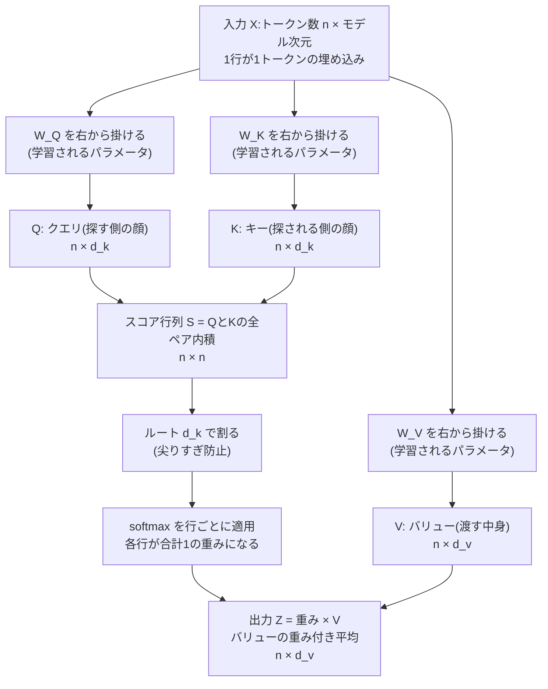
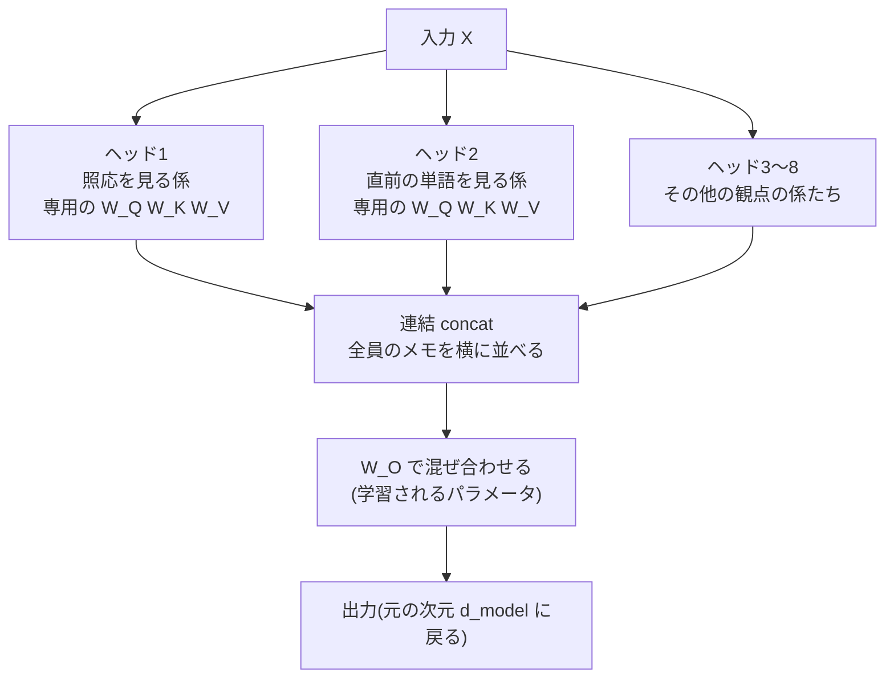

# 第8章 Attention徹底解説 — 本書の山場

いよいよ本書の山場です。

この章で扱う **注意機構(attention)** は、Transformerの中核であり、ChatGPTをはじめとする大規模言語モデルの根幹です。逆に言えば、この章さえ理解できれば、残りの章は「attentionをどう組み合わせ、どう訓練し、どう使うか」の話にすぎません。

安心してください。この章に、新しい数学はほとんど登場しません。使う道具は、第2章の **内積(=類似度)**、第5章の **softmax**、第6章の **埋め込み**、そして第3章の **重み付き平均(期待値)** だけです。本書がここまで7章分かけて準備してきた道具が、この章で一斉に組み合わさります。

その代わり、段階をとことん細かく刻みます。いきなり完成形の数式を見せることはしません。「素朴なアイデア」から出発し、その弱点を数値で確かめながら、一歩ずつ完成形まで登っていきます。

## この章で学ぶこと

- 単語の意味は文脈で決まること、そして「各単語が他の単語から情報を集める仕組み」がなぜ必要か
- 素朴なattention: 埋め込み同士の内積 → softmax → 重み付き平均(手計算で完全に追う)
- なぜクエリ(Q)・キー(K)・バリュー(V)の3役に分けるのか
- なぜ $\sqrt{d_k}$ で割るのか(スケーリング)
- 完成形 $\mathrm{Attention}(Q, K, V) = \mathrm{softmax}\!\left(\dfrac{QK^\top}{\sqrt{d_k}}\right)V$ の意味と、行列形式が「全トークン同時処理」を意味すること
- 3トークン・4次元での完全な手計算(入力から出力まで全要素)
- attention重みの可視化(ヒートマップ)と照応の解決
- Multi-Head Attention(複数の「係」で文を見る)
- 因果マスク(未来をカンニングさせない仕組み)

## この章の前提

- [第2章 ベクトルと行列](02-vectors-and-matrices.md) — **内積=類似度**、行列積、転置。この章の主役です
- [第3章 微分・勾配・確率](03-derivatives-gradients-probability.md) — 重み付き平均(期待値)、勾配
- [第5章 ニューラルネットワーク](05-neural-networks.md) — softmax、学習されるパラメータという考え方
- [第6章 言葉を数にする](06-words-to-numbers.md) — 埋め込みベクトル、文=行列 $X$
- [第7章 Transformer前夜](07-before-transformer.md) — attentionの誕生、RNNの並列化できない問題

---

## 8.1 「それ」は何を指すのか — 文脈が意味を決める

まず、この章全体を貫く例文を出します。通し例「猫は魚が好き」の、続きの場面です。

「猫は魚を見つけた。**それ**を食べた。」

「それ」は何を指しているでしょうか。もちろん「魚」です。あなたは一瞬で分かったはずです。猫が食べるのは魚であって、猫自身でも「見つけた」でもありません。このように、代名詞が前に出てきた言葉を指し示す関係を **照応(anaphora)** と呼びます。

ここで第6章を思い出してください。単語は **埋め込み(embedding)** ベクトルに変換されるのでした。埋め込み行列 $E$ から「それ」の行を取り出す。この操作は、文脈が何であろうと**常に同じベクトル**を返します。「それ」が魚を指していようが、犬を指していようが、天気を指していようが、埋め込みベクトルは1種類しかありません。

これは困ります。「それを食べた」の続きを予測するには、「それ=魚」だと知っている必要があるからです。「それ」のベクトルの中に「魚」の情報が混ざっていてほしいのです。

同じ問題は代名詞に限りません。

- 英語の **bank** — 口座の話なら「銀行」、川の話なら「土手」。同じ単語なのに文脈で意味が変わる
- 「**甘い**ケーキ」と「**甘い**考え」— 同じ「甘い」でも周りの単語で意味が変わる

つまり、こういうことです。

> [!IMPORTANT]
> **単語の本当の意味は、その単語だけでは決まらない。周りの単語との関係で決まる。**

だとすれば、欲しい仕組みはこう書けます。

**各単語が、文中の他の単語を見渡して、関係の深い単語から情報を集めてくる仕組み。**

これこそがattentionです。第7章の最後で見たように、この発想自体は翻訳モデル(seq2seq)の改良として生まれました。デコーダが「入力の全単語をもう一度見に行く」というあの仕組みです。この章では、あの発想を **文が自分自身を見渡す形**(self-attention)に発展させ、数式のレベルまで完全に分解します。

### 「情報を集める」を数学に翻訳する

「関係の深い単語から情報を集める」という仕組みを、ここまでの章で学んだ内容で言い換えてみましょう。

| やりたいこと | 使えるもの | 学んだ章 |
|---|---|---|
| 単語を数(ベクトル)にする | 埋め込み | 第6章 |
| 2つの単語の「関係の深さ」を測る | **内積=類似度** | 第2章 |
| 関係の深さを「合計1の割合」に変換する | **softmax** | 第5章 |
| 割合に応じて情報を混ぜる | **重み付き平均** | 第3章 |

全部そろっています。組み立てましょう。

---

## 8.2 ステップ1: 素朴なattention — 内積・softmax・重み付き平均だけで作る

最初のバージョンは、パラメータ(学習される重み)を**一切使わず**、埋め込みベクトルだけで作ります。後で分かるように、このバージョンには重大な弱点があるのですが、attentionの骨格はこの素朴版にすべて含まれています。

### 8.2.1 作戦

文中に $`n`$ 個のトークンがあり、それぞれの埋め込みベクトルを $`\mathbf{x}_1, \mathbf{x}_2, \dots, \mathbf{x}_n`$(各 $`d_{\text{model}}`$ 次元)とします。トークン $`i`$ の「新しいベクトル」 $`\mathbf{z}_i`$ を、次の3手順で作ります。

1. **スコア**: トークン $i$ と各トークン $j$ の関連度を、内積で測る
2. **重み**: スコアをsoftmaxに通して、合計1の重みにする
3. **混合**: 重みを使って、全トークンの埋め込みの重み付き平均をとる

数式で書くと次のとおりです。まずスコア。

$$
s_{ij} = \mathbf{x}_i \cdot \mathbf{x}_j
$$

**読み下し**: トークン $i$ とトークン $j$ の関連度スコア $s_{ij}$ は、2つの埋め込みベクトルの内積である。第2章で学んだとおり、内積は「向きが揃っているほど大きい」ので、意味が近い単語ほど高いスコアになる。

次に重み。

$$
a_{ij} = \frac{e^{s_{ij}}}{\sum_{j'=1}^{n} e^{s_{ij'}}} = \mathrm{softmax}(s_{i1}, s_{i2}, \dots, s_{in})_j
$$

**読み下し**: トークン $i$ から見たトークン $j$ の重み $a_{ij}$ は、スコア $s_{ij}$ の指数を、トークン $i$ の全スコアの指数の合計で割ったもの。つまりスコアの列をsoftmaxに通した $j$ 番目の値。これで $a_{i1} + a_{i2} + \cdots + a_{in} = 1$ が保証される(第5章のsoftmaxそのもの)。

最後に混合。

$$
\mathbf{z}_i = \sum_{j=1}^{n} a_{ij}\, \mathbf{x}_j
$$

**読み下し**: トークン $`i`$ の新しいベクトル $`\mathbf{z}_i`$ は、全トークンの埋め込み $`\mathbf{x}_j`$ を、重み $`a_{ij}`$ で混ぜ合わせた**重み付き平均**である。第3章の期待値と同じ形。重みが大きい単語の情報ほど濃く混ざる。

たとえるなら、こうです。教室にいる $n$ 人の生徒(トークン)が、それぞれ「自分と関係の深い人は誰か」を全員に対して採点し(内積)、採点結果を割合に直し(softmax)、その割合に応じて各人のノート(埋め込み)をコピーして自分のノートを作り直す(重み付き平均)。全員が同時にこれを行います。

### 8.2.2 手計算: 3トークンでやってみる

例文「猫は魚を見つけた。それを食べた。」は9トークンほどになりますが、手計算にはつらいので、主役の3語 **[猫, 魚, それ]** だけを抜き出します(「それ」が「魚」を指せるかどうか、が見どころです)。

埋め込みは $d_{\text{model}} = 4$ とし、次の値を使います(説明用に著者が単純な値を選んだものです。本物は第6章で見たとおり学習で決まります)。

| トークン | 埋め込みベクトル |
|---|---|
| $\mathbf{x}_1$ = 猫 | $(1,\ 0,\ 1,\ 0)$ |
| $\mathbf{x}_2$ = 魚 | $(0,\ 1,\ 0,\ 1)$ |
| $\mathbf{x}_3$ = それ | $(1,\ 1,\ 0,\ 0)$ |

**手順1: スコア(内積)を全ペアで計算する。**

$$
s_{11} = \mathbf{x}_1 \cdot \mathbf{x}_1 = 1\cdot1 + 0\cdot0 + 1\cdot1 + 0\cdot0 = 2
$$

**読み下し**: 猫と猫自身の内積は2。自分自身との内積は「ベクトルの長さの2乗」なので、必ず大きめの値になる(ここが後で問題になります。覚えておいてください)。

残りも同様に計算します。

- $`s_{12} = \mathbf{x}_1 \cdot \mathbf{x}_2 = 0+0+0+0 = 0`$(猫と魚: 共通の成分がなく無関係)
- $`s_{13} = \mathbf{x}_1 \cdot \mathbf{x}_3 = 1+0+0+0 = 1`$
- $s_{21} = 0,\quad s_{22} = 2,\quad s_{23} = 1$
- $s_{31} = 1,\quad s_{32} = 1,\quad s_{33} = 2$

スコアを表(=行列 $S$)にまとめます。行が「見る側 $i$ 」、列が「見られる側 $j$ 」です。

| $s_{ij}$ | 猫 $j{=}1$ | 魚 $j{=}2$ | それ $j{=}3$ |
|---|---|---|---|
| **猫 $i{=}1$** | 2 | 0 | 1 |
| **魚 $i{=}2$** | 0 | 2 | 1 |
| **それ $i{=}3$** | 1 | 1 | 2 |

内積は $`\mathbf{x}_i \cdot \mathbf{x}_j = \mathbf{x}_j \cdot \mathbf{x}_i`$ なので、この表は対称になっています。つまり「それから見た魚の重要度」と「魚から見たそれの重要度」が必ず同じ値になる、ということです(これがなぜ困るのかは、8.2.3の弱点のところで説明します)。

**手順2: 各行をsoftmaxで重みにする。**

第5章の手順どおり、 $e$ の累乗を計算して合計で割ります。 $e^0 = 1$ 、 $e^1 \approx 2.718$ 、 $e^2 \approx 7.389$ を使います。

猫の行 $(2, 0, 1)$:

$$
(a_{11}, a_{12}, a_{13}) = \left(\frac{7.389}{11.107},\ \frac{1}{11.107},\ \frac{2.718}{11.107}\right) \approx (0.665,\ 0.090,\ 0.245)
$$

**読み下し**: 猫の行のスコア $(2,0,1)$ をsoftmaxに通すと、分母は $7.389 + 1 + 2.718 = 11.107$ で、重みは約 $(0.665, 0.090, 0.245)$ 。合計は1になる。

同様に、魚の行 $(0, 2, 1)$ は $(0.090,\ 0.665,\ 0.245)$ 、それの行 $(1, 1, 2)$ は分母が $2.718 + 2.718 + 7.389 = 12.825$ なので $(0.212,\ 0.212,\ 0.576)$ となります。

重み行列 $A$ にまとめます(各行の合計が1であることを確認してください)。

| $a_{ij}$ | 猫 | 魚 | それ | 行の合計 |
|---|---|---|---|---|
| **猫** | 0.665 | 0.090 | 0.245 | 1.000 |
| **魚** | 0.090 | 0.665 | 0.245 | 1.000 |
| **それ** | 0.212 | 0.212 | **0.576** | 1.000 |

**手順3: 重み付き平均で新しいベクトルを作る。**

「それ」の新しいベクトル $\mathbf{z}_3$ を計算してみます。

$$
\mathbf{z}_3 = 0.212\,\mathbf{x}_1 + 0.212\,\mathbf{x}_2 + 0.576\,\mathbf{x}_3
$$

**読み下し**: 「それ」の新ベクトルは、猫の埋め込みを21.2%、魚の埋め込みを21.2%、それ自身の埋め込みを57.6%混ぜたもの。

成分ごとに計算します。

- 第1成分: $0.212 \times 1 + 0.212 \times 0 + 0.576 \times 1 = 0.788$
- 第2成分: $0.212 \times 0 + 0.212 \times 1 + 0.576 \times 1 = 0.788$
- 第3成分: $0.212 \times 1 + 0.212 \times 0 + 0.576 \times 0 = 0.212$
- 第4成分: $0.212 \times 0 + 0.212 \times 1 + 0.576 \times 0 = 0.212$

3トークンぶんの結果をまとめます。

| トークン | 元の埋め込み $`\mathbf{x}_i`$ | 新しいベクトル $`\mathbf{z}_i`$ |
|---|---|---|
| 猫 | $(1, 0, 1, 0)$ | $(0.910,\ 0.335,\ 0.665,\ 0.090)$ |
| 魚 | $(0, 1, 0, 1)$ | $(0.335,\ 0.910,\ 0.090,\ 0.665)$ |
| それ | $(1, 1, 0, 0)$ | $(0.788,\ 0.788,\ 0.212,\ 0.212)$ |

これで素朴版attentionの計算は一通り完了です。各トークンが「文脈の情報が混ざった新しいベクトル」を手に入れました。これを **文脈化された埋め込み(contextualized embedding)** と呼びます。「それ」のベクトルが、もはや辞書的な「それ」ではなく、この文の中での「それ」になったわけです。

### 8.2.3 素朴版の弱点 — 数値がすでに教えてくれている

さて、うまくいったように見えますが、重み行列 $A$ の「それ」の行をもう一度見てください。

| | 猫 | 魚 | それ |
|---|---|---|---|
| **それ** | 0.212 | 0.212 | **0.576** |

「それ」は**魚を指している**はずなのに、魚への重みはたった0.212で、猫への重みと同じ。一番大きい重みは**自分自身**(0.576)に向いています。照応の解決に失敗しているのです。なぜこうなったのか、原因を分解すると素朴版の弱点が見えてきます。

**弱点1: 自分ばかり見てしまう。** 自分自身とのスコア $s_{ii}$ は「自分の長さの2乗」なので、たいてい他のどのスコアよりも大きくなります。「他の単語から情報を集めたい」のに、常に自分自身の情報が最も濃く混ざってしまうのでは、目的を果たせません。

**弱点2: 「単語としての類似」しか測れない。** 「それ」と「魚」は、単語としては全然似ていません(代名詞と名詞ですから、埋め込み空間でも遠い)。照応を解決するのに必要なのは「**それ**という代名詞は、少し前に出てきた**目的語の名詞**を探すべきだ」という、単語の類似とは別種の**役割ベースの関連**です。生の埋め込みの内積では、これを表現できません。

**弱点3: 探す基準と渡す中身が同じ。** 「どの単語に注目するかを決める基準」も「注目された単語が渡す情報」も、同じ埋め込みベクトル1本でまかなっています。しかし「見つけてもらうための目印」と「見つけた人に渡す中身」は、本来別のものであるはずです。

**弱点4: 学習の余地がない。** この素朴版にはパラメータが1個もありません。第4章で学んだように、機械学習の本質は「損失が減るようにパラメータを調整する」ことでした。パラメータがなければ、タスクに合わせて注目の仕方を改善していくことができません。

この4つの弱点を、たった一つのアイデアがまとめて解決します。それが Q・K・V です。

---

## 8.3 ステップ2: Q・K・V — 三つの顔を使い分ける

### 8.3.1 図書館のアナロジー

あなたが図書館で「猫の飼い方の本」を探す場面を想像してください。

1. あなたは頭の中に**探したいもの**(「猫 飼い方」)を持っています。これが **クエリ(Query)**、検索語です
2. 本棚の本には**背表紙のタイトル**(『はじめての猫との暮らし』)が付いています。これが **キー(Key)**、探されるための目印です
3. 背表紙がクエリと合致した本を開くと、**中身**(飼い方の詳しい解説)が手に入ります。これが **バリュー(Value)**、実際に受け取る情報です

大事なのは、**この3つは同じものではない**ということです。背表紙(キー)は「見つけてもらう」ために最適化された短い目印であり、中身(バリュー)そのものではありません。あなたの検索語(クエリ)も、あなた自身の全人格ではなく「いま探したいもの」だけを表しています。

検索エンジンでも同じです。検索窓に打つ言葉がクエリ、各Webページのタイトルや索引語がキー、ページの本文がバリューです。

attentionにこれを持ち込みます。各トークンは、1本の埋め込みベクトル $\mathbf{x}_i$ から**3つの異なる顔**を作ります。

- $\mathbf{q}_i$(クエリ): 「私は**こういう情報を探しています**」という顔
- $\mathbf{k}_i$(キー): 「私は**こういう情報を持っている者です**」という顔(背表紙)
- $\mathbf{v}_i$(バリュー): 「私を選んだ人には**この中身を渡します**」という顔

そしてスコアは「**自分のクエリ**と**相手のキー**の内積」で測ります。「それ」のクエリが「直前に出てきた食べられる名詞を探しています」であり、「魚」のキーが「私は食べられる名詞です」であれば、2つの単語自体が似ていなくても、**クエリとキーは似せられる**。これが弱点2の解決です。自分のクエリと自分のキーが似ている必然性もなくなるので、弱点1(自分ばかり見る)も解消できます。渡す中身はバリューという別のベクトルなので、弱点3も解決します。

### 8.3.2 3つの顔は「学習される変換」で作る

では、1本の埋め込みからどうやって3つの顔を作るのか。第2章で学んだ「**行列はベクトルを変換する機械**」の出番です。3つの変換行列 $W_Q,\ W_K,\ W_V$ を用意して、埋め込みに掛けるだけです。

ここで記法の約束を明示しておきます(第6章と同じ流儀です)。本書では、トークンの埋め込みを**横向きのベクトル(行ベクトル)** として扱い、 $n$ 個のトークンの埋め込みを縦に積んだ $n \times d_{\text{model}}$ の行列を $X$ と書きます。数学の教科書ではベクトルは縦向き(列ベクトル)が基本ですが、深層学習では「1行=1トークン」と並べるこの流儀が標準なので、本書もそれに従います。行ベクトルに行列を掛けるときは、**右から**掛けます。

$$
\mathbf{q}_i = \mathbf{x}_i W_Q, \qquad \mathbf{k}_i = \mathbf{x}_i W_K, \qquad \mathbf{v}_i = \mathbf{x}_i W_V
$$

**読み下し**: トークン $`i`$ のクエリ $`\mathbf{q}_i`$ は、埋め込み $`\mathbf{x}_i`$($`1 \times d_{\text{model}}`$ の行ベクトル)に行列 $`W_Q`$($`d_{\text{model}} \times d_k`$)を右から掛けたもので、 $`1 \times d_k`$ の行ベクトルになる。キーとバリューも同様に、それぞれ専用の行列 $`W_K,\ W_V`$ で作る。

ここで $d_k$ は **キー(とクエリ)の次元** です。クエリとキーは内積をとるので必ず同じ次元でなければなりません。バリューの次元は $d_v$ と書き、 $d_k$ と同じにすることが多いです。 $d_k$ は $d_{\text{model}}$ より小さくてかまいません(むしろ小さくするのが普通です。理由は8.9のMulti-Headで分かります)。

そして最重要ポイント。**$W_Q,\ W_K,\ W_V$ は学習されるパラメータです。** 第4章の勾配降下法・第5章の逆伝播によって、「次の単語の予測が当たるようになる」方向へ、この3つの行列の中身が少しずつ調整されていきます。「代名詞は直前の目的語を探すとよい」というような注目のパターンは、人間が設計するのではなく、大量の文章を予測する訓練の中で**自動的に発見される**のです。これが弱点4の解決です。

たとえるなら、 $W_Q$ は「単語を検索語に翻訳する辞書」、 $W_K$ は「単語を背表紙に翻訳する辞書」、 $W_V$ は「単語を渡すべき中身に翻訳する辞書」であり、3冊の辞書の中身そのものを機械が学習で書き上げていく、というわけです。

スコアと重みと出力は、素朴版の $\mathbf{x}$ を適切な顔に置き換えるだけです。

$$
s_{ij} = \mathbf{q}_i \cdot \mathbf{k}_j, \qquad a_{ij} = \mathrm{softmax}(s_{i1}, \dots, s_{in})_j, \qquad \mathbf{z}_i = \sum_{j=1}^n a_{ij}\, \mathbf{v}_j
$$

**読み下し**: スコアは「 $i$ のクエリ」と「 $j$ のキー」の内積。重みはスコア行のsoftmax。出力は**バリュー**の重み付き平均(混ぜるのは埋め込みそのものではなくバリュー)。

なお第2章で確認したとおり、内積は $\mathbf{q} \cdot \mathbf{k}$ とも $\mathbf{q}\mathbf{k}^\top$(行ベクトル×列ベクトル)とも書けます。どちらも同じ計算です。

---

## 8.4 ステップ3: なぜ $\sqrt{d_k}$ で割るのか — スケーリング

完成形まであと一歩です。実際のTransformerでは、内積スコアをそのままsoftmaxに入れず、**$\sqrt{d_k}$ で割ってから**入れます。これを **スケーリング(scaling)** と呼びます。なぜこんな操作が要るのでしょうか。数値で見るのが一番早いです。

### 8.4.1 softmaxは大きいスコアで「尖りすぎる」

スコアの列 $(2, 1, 0)$ をsoftmaxに通すと、

$$
\mathrm{softmax}(2, 1, 0) \approx (0.665,\ 0.245,\ 0.090)
$$

**読み下し**: スコア2の候補に約67%、スコア1に約24%、スコア0に約9%。1位を重視しつつ、2位・3位にもそれなりの重みが残る、ほどよい配分。

では、スコア全体が10倍になって $(20, 10, 0)$ だったら? $e^{20} \approx 4.85 \times 10^8$ 、 $e^{10} \approx 22026$ 、 $e^0 = 1$ なので、

$$
\mathrm{softmax}(20, 10, 0) \approx (0.99995,\ 0.000045,\ 0.0000000021)
$$

**読み下し**: 1位がほぼ100%を独占し、2位以下はほぼゼロ。スコアの**比**は $(2,1,0)$ と同じなのに、softmaxは差の**絶対量**に反応するため、ほぼ「1位総取り」になってしまう。

比較表にします。

| スコア | softmax後の重み | 様子 |
|---|---|---|
| $(2,\ 1,\ 0)$ | $(0.665,\ 0.245,\ 0.090)$ | ほどよく混ざる |
| $(20,\ 10,\ 0)$ | $(0.99995,\ 0.000045,\ 0.000000002)$ | 1位総取り(尖りすぎ) |

尖りすぎの何が悪いのでしょうか。2つあります。

1. **情報を混ぜられない**: attentionの目的は「複数の単語から情報を集める」ことでした。1位総取りでは、1単語をコピーするだけの機械になってしまいます。
2. **学習が止まる**: こちらが深刻です。重みが0.99995のとき、スコアを少し変えても重みは**ほとんど動きません**($e^{20}$ の項が他よりはるかに大きいため)。「入力を変えても出力が変わらない」= **傾き(勾配)がほぼゼロ** ということです。第4章で学んだとおり、学習は勾配を頼りに進むのでした。勾配がゼロでは、 $W_Q$ や $W_K$ を直す手がかりが消えてしまいます。第5章で見た「シグモイドの平らな領域で学習が止まる」問題や、第7章の勾配消失と同じ種類の問題です。

### 8.4.2 次元が大きいほど内積は大きくなる

問題は、**内積という演算は次元が増えるほど値が大きくぶれる**ことです。内積は $d_k$ 個の「成分の積」の合計でした。

$$
\mathbf{q} \cdot \mathbf{k} = q_1 k_1 + q_2 k_2 + \cdots + q_{d_k} k_{d_k}
$$

**読み下し**: 内積は $d_k$ 個の項の足し算。足す項の数が増えれば、合計のばらつきも大きくなる。

ここで統計の用語を2つだけ、厳密な定義には立ち入らずイメージで導入します。数値の集まりが平均のまわりでどれくらい散らばっているかを表す量を **分散(variance)**、その散らばりを「元の数値と同じ単位のぶれ幅」に直したものを **標準偏差(standard deviation)** と呼びます。「ぶれ幅の平均的な大きさ」と思えば十分です(第9章のLayerNormでも再登場します)。

各成分が「平均0、ぶれ幅(標準偏差)1」程度の値だとすると、統計の性質から、内積の典型的なぶれ幅は $\sqrt{d_k}$ 程度になります。サイコロを1個振るより64個振って合計したほうが、合計値のぶれ幅が大きくなるのと同じ理屈です。

| $d_k$ | 内積の典型的な大きさ($\pm\sqrt{d_k}$ 程度) | softmaxの様子 |
|---|---|---|
| 2 | $\pm 1.4$ | ほどよい |
| 64 | $\pm 8$ | かなり尖る |
| 512 | $\pm 22.6$ | ほぼ総取り・学習停止 |

実際のTransformerでは $d_k = 64$ 程度が普通なので、対策なしではスコアが $\pm 8$ から $\pm 16$ くらいの値を平気で取り、softmaxが尖りすぎてしまいます。

### 8.4.3 対策: $\sqrt{d_k}$ で割る

ばらつきが $\sqrt{d_k}$ 倍になるのなら、 $\sqrt{d_k}$ で割って元に戻せばよい、という素直な対策を取ります。

$$
s_{ij} = \frac{\mathbf{q}_i \cdot \mathbf{k}_j}{\sqrt{d_k}}
$$

**読み下し**: スコアは、クエリとキーの内積を $\sqrt{d_k}$ で割ったもの。これで次元がいくつでも、スコアの典型的な大きさは1前後に保たれ、softmaxがほどよい配分を保つ。

数値例: $d_k = 64$ で内積が $(16, 8, 0)$ と出たとします。そのままsoftmaxに入れると $(0.99966,\ 0.00034,\ 0.0000001)$ でほぼ総取り。 $\sqrt{64} = 8$ で割ると $(2, 1, 0)$ となり、 $(0.665, 0.245, 0.090)$ のほどよい配分に戻ります。

---

## 8.5 完成形: Scaled Dot-Product Attention — 行列で書くと「全トークン同時処理」

部品がそろいました。ここまでの手続きを1つの式にまとめたものが、2017年の原論文 "Attention Is All You Need" に登場する **スケール化内積注意(Scaled Dot-Product Attention)** です。

$$
\mathrm{Attention}(Q, K, V) = \mathrm{softmax}\!\left(\frac{QK^\top}{\sqrt{d_k}}\right)V
$$

**読み下し**: 全トークンのクエリを積んだ行列 $Q$ と、全トークンのキーを積んだ行列 $K$ の転置を掛けて「全ペアの内積スコア表」を作り、 $\sqrt{d_k}$ で割ってスケールを整え、各行をsoftmaxで合計1の重みに変え、その重みで全トークンのバリュー行列 $V$ を混ぜ合わせる。

ここに出てくる記号の形を整理します。 $n$ はトークン数です。

| 記号 | 作り方 | 形 | 意味 |
|---|---|---|---|
| $X$ | 埋め込みを縦に積む | $n \times d_{\text{model}}$ | 入力(1行=1トークン) |
| $Q = XW_Q$ | 学習される変換 | $n \times d_k$ | 全トークンのクエリ(探す顔) |
| $K = XW_K$ | 学習される変換 | $n \times d_k$ | 全トークンのキー(探される顔) |
| $V = XW_V$ | 学習される変換 | $n \times d_v$ | 全トークンのバリュー(渡す中身) |
| $S = QK^\top / \sqrt{d_k}$ | 行列積 | $n \times n$ | 全ペアのスコア表 |
| $A = \mathrm{softmax}(S)$ | 行ごとにsoftmax | $n \times n$ | attention重み(各行の合計1) |
| $Z = AV$ | 行列積 | $n \times d_v$ | 出力(文脈化されたベクトル) |

$`QK^\top`$ という行列積に注目してください。第2章で「行列積は、左の行列の各**行**と右の行列の各**列**の内積を並べたもの」と学びました。 $`K^\top`$(転置)の第 $`j`$ 列は $`\mathbf{k}_j`$ なので、 $`QK^\top`$ の $`(i, j)`$ 成分はまさに $`\mathbf{q}_i \cdot \mathbf{k}_j`$ です。つまり「全トークンペアの内積を一括計算する」のが $`QK^\top`$ の正体です。第2章で内積と転置と行列積を仕込んだのは、この1行を読めるようになるためだったのです。

### 8.5.1 図で見る: Q/K/V計算フロー(本書最重要図)

この計算の流れを図にします。**この図は本書で最も重要な図です。** 何度でも戻ってきてください。



### 8.5.2 行列形式の本当のありがたみ — RNNとの決定的な違い

行列で書けることには、見た目がきれいという以上の、決定的に重要な意味があります。

第7章を思い出してください。RNNの弱点は、 $`\mathbf{h}_1`$ を計算しないと $`\mathbf{h}_2`$ が計算できず、 $`\mathbf{h}_2`$ がないと $`\mathbf{h}_3`$ が計算できない、という**逐次処理**でした。1000トークンの文なら1000ステップ、順番待ちの計算が必要で、GPUの「大量の計算を同時にやる」能力(第5章)を活かせないのでした。

attentionは違います。 $Q = XW_Q$ も $QK^\top$ も $AV$ も、すべて**行列積**です。行列積の各成分は互いに独立に計算できるので、**全トークン・全ペアの計算を一度に、同時に**実行できます。トークン1の処理が終わるのをトークン2が待つ必要はありません。

| | RNN(第7章) | attention(本章) |
|---|---|---|
| 計算の進み方 | 1トークンずつ順番に($n$ ステップ) | 全トークン同時(行列積ひとまとめ) |
| GPUとの相性 | 悪い(順番待ちが発生) | 最高(行列積はGPUの得意技) |
| 離れた単語同士の情報の距離 | $n$ ステップ経由(伝言ゲームで劣化) | **常に1ステップ**(直接内積をとる) |
| 文が長くなると | 記憶が薄れる・勾配消失 | どの距離のペアも対等に扱える |

特に3行目が重要です。RNNでは文頭の「猫」の情報が文末に届くまでに何十回も変換されて薄れていきました(伝言ゲーム)。attentionでは、文末のトークンが文頭のトークンと**直接**内積をとります。距離1でも距離1000でも、扱いは完全に対等です。長距離依存の問題(第7章)が、仕組みのレベルで消滅しているのです。

これが「RNNを捨ててattentionだけで作ればいいのでは?」(= Attention Is All You Need)という発想の核心でした。

なお、正直に代償も述べておくと、 $n$ トークンの全ペアを見るためスコア表は $n \times n$ になり、文が2倍長くなると計算量は4倍になります。この $O(n^2)$ 問題への対策は第15章で扱います。

---

## 8.6 完全な手計算 — 3トークンで、入口から出口まで全要素を追う

いよいよ、この章の総仕上げです。完成形のattentionを、**すべての数値を省略せずに**手で計算します。ここを一度自分の手で追えば、attentionは「知っている」から「使える」に変わります。

設定は次のとおりです。

- トークン列: **[猫, 魚, それ]**($n = 3$)。8.2と同じく「猫は魚を見つけた。それを食べた。」の主役3語
- モデル次元: $d_{\text{model}} = 4$
- クエリ/キー/バリューの次元: $d_k = d_v = 2$

### 8.6.1 入力 $X$ と3つの変換行列

入力は8.2と同じ埋め込みです。行ベクトルを縦に積んで、 $3 \times 4$ の行列 $X$ にします。

```math
X = \begin{pmatrix} 1 & 0 & 1 & 0 \\ 0 & 1 & 0 & 1 \\ 1 & 1 & 0 & 0 \end{pmatrix}
\begin{matrix} \leftarrow 猫 \\ \leftarrow 魚 \\ \leftarrow それ \end{matrix}
```

**読み下し**: 1行目が猫、2行目が魚、3行目が「それ」の埋め込み。3トークン×4次元。

変換行列は次の値とします($4 \times 2$ が3つ)。**本来この値は勾配降下法(第4章)が訓練データから見つけ出すものです。今回は「学習が見つけた値」の役を著者が務め、照応がうまく解決される値を選んであります。**

```math
W_Q = \begin{pmatrix} 0 & 1 \\ 0 & 1 \\ 2 & 0 \\ 1 & 0 \end{pmatrix}, \qquad
W_K = \begin{pmatrix} 1 & -1 \\ 0 & 1 \\ 1 & 1 \\ 0 & 1 \end{pmatrix}, \qquad
W_V = \begin{pmatrix} 1 & 0 \\ 0 & 1 \\ 1 & 0 \\ 0 & 1 \end{pmatrix}
```

**読み下し**: 埋め込み(4次元)をクエリ・キー・バリュー(各2次元)に変換する3つの行列。中身の数値そのものに深い意味はなく、「訓練の結果、このような値になった」という想定で読んでください。

### 8.6.2 $Q = XW_Q$ を計算する

行列積の手順(第2章)どおり、「 $X$ の行」と「 $W_Q$ の列」の内積を並べます。まず猫の行 $\mathbf{x}_1 = (1, 0, 1, 0)$ から。

- $q_{11} = 1 \times 0 + 0 \times 0 + 1 \times 2 + 0 \times 1 = 2$
- $q_{12} = 1 \times 1 + 0 \times 1 + 1 \times 0 + 0 \times 0 = 1$

よって $`\mathbf{q}_1 = (2,\ 1)`$ 。魚の行 $`\mathbf{x}_2 = (0, 1, 0, 1)`$:

- $q_{21} = 0 \times 0 + 1 \times 0 + 0 \times 2 + 1 \times 1 = 1$
- $q_{22} = 0 \times 1 + 1 \times 1 + 0 \times 0 + 1 \times 0 = 1$

よって $`\mathbf{q}_2 = (1,\ 1)`$ 。「それ」の行 $`\mathbf{x}_3 = (1, 1, 0, 0)`$:

- $q_{31} = 1 \times 0 + 1 \times 0 + 0 \times 2 + 0 \times 1 = 0$
- $q_{32} = 1 \times 1 + 1 \times 1 + 0 \times 0 + 0 \times 0 = 2$

よって $\mathbf{q}_3 = (0,\ 2)$ 。まとめると、

```math
Q = XW_Q = \begin{pmatrix} 2 & 1 \\ 1 & 1 \\ 0 & 2 \end{pmatrix}
```

**読み下し**: 3トークンそれぞれのクエリ(探す顔)。「それ」のクエリは $(0, 2)$ で、この向きが「探しているもの」を表す。

### 8.6.3 $K = XW_K$ と $V = XW_V$ を計算する

同じ手順です。キーの1成分だけ確認しておきます。猫の行と $W_K$ の第1列 $(1, 0, 1, 0)$ の内積は $1 \times 1 + 0 \times 0 + 1 \times 1 + 0 \times 0 = 2$ 、第2列 $(-1, 1, 1, 1)$ との内積は $1 \times (-1) + 0 \times 1 + 1 \times 1 + 0 \times 1 = 0$ 。よって $\mathbf{k}_1 = (2,\ 0)$ 。残りも同様に計算して、

```math
K = XW_K = \begin{pmatrix} 2 & 0 \\ 0 & 2 \\ 1 & 0 \end{pmatrix}, \qquad
V = XW_V = \begin{pmatrix} 2 & 0 \\ 0 & 2 \\ 1 & 1 \end{pmatrix}
```

**読み下し**: 各トークンのキー(背表紙)とバリュー(渡す中身)。魚のキーは $(0, 2)$ 、魚のバリューは $(0, 2)$ 。

ここで注目してほしいのは、**「それ」のクエリ $`\mathbf{q}_3 = (0, 2)`$ と「魚」のキー $`\mathbf{k}_2 = (0, 2)`$ が、向きまでぴったり揃っている**ことです。生の埋め込みでは「それ」 $`(1,1,0,0)`$ と「魚」 $`(0,1,0,1)`$ はあまり似ていませんでした。しかし $`W_Q`$ と $`W_K`$ という別々の変換を通した結果、「それの探す顔」と「魚の探される顔」が一致した。これがQ/K/V分離の効果です。

結果をトークンごとに一覧にします。

| トークン | 埋め込み $`\mathbf{x}_i`$ | クエリ $`\mathbf{q}_i`$ | キー $`\mathbf{k}_i`$ | バリュー $`\mathbf{v}_i`$ |
|---|---|---|---|---|
| 猫 | $(1,0,1,0)$ | $(2,\ 1)$ | $(2,\ 0)$ | $(2,\ 0)$ |
| 魚 | $(0,1,0,1)$ | $(1,\ 1)$ | $(0,\ 2)$ | $(0,\ 2)$ |
| それ | $(1,1,0,0)$ | $(0,\ 2)$ | $(1,\ 0)$ | $(1,\ 1)$ |

### 8.6.4 スコア行列 $QK^\top$ を計算する

$`QK^\top`$ の $`(i,j)`$ 成分は $`\mathbf{q}_i \cdot \mathbf{k}_j`$ です。9ペア全部計算します。

- $s_{11} = (2,1)\cdot(2,0) = 4 + 0 = 4$
- $s_{12} = (2,1)\cdot(0,2) = 0 + 2 = 2$
- $s_{13} = (2,1)\cdot(1,0) = 2 + 0 = 2$
- $s_{21} = (1,1)\cdot(2,0) = 2 + 0 = 2$
- $s_{22} = (1,1)\cdot(0,2) = 0 + 2 = 2$
- $s_{23} = (1,1)\cdot(1,0) = 1 + 0 = 1$
- $s_{31} = (0,2)\cdot(2,0) = 0 + 0 = 0$
- $s_{32} = (0,2)\cdot(0,2) = 0 + 4 = 4$
- $s_{33} = (0,2)\cdot(1,0) = 0 + 0 = 0$

```math
QK^\top = \begin{pmatrix} 4 & 2 & 2 \\ 2 & 2 & 1 \\ 0 & 4 & 0 \end{pmatrix}
```

**読み下し**: 全ペアの関連度スコア表。行が「見る側」、列が「見られる側」。「それ」の行(3行目)は $(0,\ 4,\ 0)$ で、魚だけが突出して高い。素朴版と違い、**この表はもう対称ではない**(「それ→魚」は4なのに「魚→それ」は1)。見る側と見られる側で別の顔を使っているからこそ、こういう非対称な関係が表現できる。

### 8.6.5 $\sqrt{d_k}$ で割り、行ごとにsoftmax

$d_k = 2$ なので $\sqrt{d_k} = \sqrt{2} \approx 1.414$ で全成分を割ります。

```math
\frac{QK^\top}{\sqrt{2}} \approx \begin{pmatrix} 2.83 & 1.41 & 1.41 \\ 1.41 & 1.41 & 0.71 \\ 0 & 2.83 & 0 \end{pmatrix}
```

**読み下し**: スケール調整後のスコア表。値の大小関係はそのままに、全体が $\sqrt{2}$ 分の1に縮む。

各行をsoftmaxにかけます。 $e^{2.83} \approx 16.92$ 、 $e^{1.41} \approx 4.11$ 、 $e^{0.71} \approx 2.03$ 、 $e^{0} = 1$ を使います。

**猫の行** $(2.83,\ 1.41,\ 1.41)$: 分母は $16.92 + 4.11 + 4.11 = 25.14$ 。

$$
(a_{11}, a_{12}, a_{13}) = \left(\frac{16.92}{25.14},\ \frac{4.11}{25.14},\ \frac{4.11}{25.14}\right) \approx (0.673,\ 0.164,\ 0.164)
$$

**読み下し**: 猫は自分に67%、魚と「それ」に16%ずつ注意を向ける。

**魚の行** $(1.41,\ 1.41,\ 0.71)$: 分母は $4.11 + 4.11 + 2.03 = 10.25$ 。重みは $(0.401,\ 0.401,\ 0.198)$ 。

**「それ」の行** $(0,\ 2.83,\ 0)$: 分母は $1 + 16.92 + 1 = 18.92$ 。

$$
(a_{31}, a_{32}, a_{33}) = \left(\frac{1}{18.92},\ \frac{16.92}{18.92},\ \frac{1}{18.92}\right) \approx (0.053,\ 0.894,\ 0.053)
$$

**読み下し**: 「それ」は**89.4%の注意を魚に向ける**。自分自身へはわずか5.3%。

attention重み行列 $A$ が完成しました。

| $A$ | 猫 | 魚 | それ | 行の合計 |
|---|---|---|---|---|
| **猫** | 0.673 | 0.164 | 0.164 | 1.001(丸め誤差) |
| **魚** | 0.401 | 0.401 | 0.198 | 1.000 |
| **それ** | 0.053 | **0.894** | 0.053 | 1.000 |

素朴版(8.2)と並べてみましょう。「それ」の行の変化に注目です。

| 「それ」の行 | 猫へ | 魚へ | 自分へ | 判定 |
|---|---|---|---|---|
| 素朴版(Q/K/Vなし) | 0.212 | 0.212 | **0.576** | 自分ばかり見て照応に失敗 |
| Q/K/V版 | 0.053 | **0.894** | 0.053 | **「それ」→「魚」の照応を解決** |

**弱点1(自分ばかり見る)と弱点2(役割ベースの関連が測れない)が、数値の上で解決された**ことが確認できました。

### 8.6.6 出力 $Z = AV$ を計算する

最後に、重み $A$ でバリュー $V$ を混ぜます。各行は「バリューの重み付き平均」です。

**猫の出力** $`\mathbf{z}_1 = 0.673\,\mathbf{v}_1 + 0.164\,\mathbf{v}_2 + 0.164\,\mathbf{v}_3`$:

- 第1成分: $0.673 \times 2 + 0.164 \times 0 + 0.164 \times 1 = 1.346 + 0 + 0.164 = 1.510$
- 第2成分: $0.673 \times 0 + 0.164 \times 2 + 0.164 \times 1 = 0 + 0.328 + 0.164 = 0.492$

**魚の出力** $`\mathbf{z}_2 = 0.401\,\mathbf{v}_1 + 0.401\,\mathbf{v}_2 + 0.198\,\mathbf{v}_3`$:

- 第1成分: $0.401 \times 2 + 0.401 \times 0 + 0.198 \times 1 = 1.000$
- 第2成分: $0.401 \times 0 + 0.401 \times 2 + 0.198 \times 1 = 1.000$

**「それ」の出力** $`\mathbf{z}_3 = 0.053\,\mathbf{v}_1 + 0.894\,\mathbf{v}_2 + 0.053\,\mathbf{v}_3`$:

- 第1成分: $0.053 \times 2 + 0.894 \times 0 + 0.053 \times 1 = 0.106 + 0 + 0.053 = 0.159$
- 第2成分: $0.053 \times 0 + 0.894 \times 2 + 0.053 \times 1 = 0 + 1.788 + 0.053 = 1.841$

```math
Z = AV \approx \begin{pmatrix} 1.510 & 0.492 \\ 1.000 & 1.000 \\ 0.159 & 1.841 \end{pmatrix}
```

**読み下し**: 3トークンの出力(文脈化されたベクトル)。「それ」の出力は $(0.159,\ 1.841)$ 。

ここで魚のバリュー $\mathbf{v}_2 = (0,\ 2)$ と見比べてください。「それ」の出力 $(0.159,\ 1.841)$ は、**ほとんど魚のバリューそのもの**です。attentionを1回通っただけで、「それ」のベクトルの中身が「魚」の情報でほぼ置き換わりました。この後の層(第9章のFFNや次のattention層)は、「それ」の位置に「魚の情報」があるものとして処理を進められます。「それを食べた」の次を予測するとき、モデルは「魚を食べた」と知っているのと同じ状態になるのです。

計算の全行程を1枚にまとめます。

```text
  X (3x4)          Q (3x2)   K (3x2)   V (3x2)
  1 0 1 0          2 1       2 0       2 0
  0 1 0 1   -->    1 1       0 2       0 2       <- X に W_Q, W_K, W_V をそれぞれ掛ける
  1 1 0 0          0 2       1 0       1 1

  QK^T (3x3)      / sqrt(2)       softmax          xV = Z (3x2)
  4 2 2           2.83 1.41 1.41   0.673 0.164 0.164     1.510 0.492
  2 2 1     -->   1.41 1.41 0.71   0.401 0.401 0.198     1.000 1.000
  0 4 0           0    2.83 0      0.053 0.894 0.053     0.159 1.841
                                         ^
                                         「それ」は魚を89%見ている

  各行列の行は、上から 猫, 魚, それ の順。softmax は行ごとに適用。
```

---

## 8.7 attention重みを可視化する — ヒートマップ

attention重み行列 $A$ は「どの単語がどの単語を見ているか」の表なので、色の濃淡で描くとひと目で読み取れます。これを **ヒートマップ(heatmap)** と呼びます。本書はMarkdownの表で、濃さを █(濃い)▓ ▒ ░(薄い)の記号で表現します。

まず、いま計算した3トークンの $A$ をヒートマップ風にすると次のようになります。

| 見る側 \ 見られる側 | 猫 | 魚 | それ |
|---|---|---|---|
| **猫** | 0.673 ▓▓▓ | 0.164 ░ | 0.164 ░ |
| **魚** | 0.401 ▒▒ | 0.401 ▒▒ | 0.198 ░ |
| **それ** | 0.053 | **0.894 ████** | 0.053 |

次に、実際に訓練されたモデルが文全体でどんな重みを付けるか、雰囲気をつかみましょう。例文をフルバージョン「猫 / は / 魚 / を / 見つけた / 。 / それ / を / 食べた」(9トークン)にします。以下は、訓練済みモデルのあるヘッドに典型的に現れるパターンを模した**説明用の値**です(トークンを区別するため位置番号を添えています)。

| 見る側 \ 見られる側 | 猫₁ | は₂ | 魚₃ | を₄ | 見つけた₅ | 。₆ | それ₇ | を₈ | 食べた₉ |
|---|---|---|---|---|---|---|---|---|---|
| **猫₁** | 0.55 ▓▓▓ | 0.05 | 0.15 ░ | 0.02 | 0.18 ░ | 0.01 | 0.02 | 0.01 | 0.01 |
| **魚₃** | 0.18 ░ | 0.02 | 0.45 ▒▒ | 0.05 | 0.24 ░ | 0.01 | 0.02 | 0.02 | 0.01 |
| **それ₇** | 0.03 | 0.01 | **0.62 ████** | 0.02 | 0.14 ░ | 0.01 | 0.10 ░ | 0.02 | 0.05 |
| **食べた₉** | 0.20 ░ | 0.02 | 0.15 ░ | 0.03 | 0.08 | 0.02 | **0.42 ▒▒** | 0.06 | 0.02 |

(9行すべて書くと長いので、読みどころのある4行を抜粋しています。各行の合計は1です。)

この表の読み方です。

- **「それ₇」の行**: 「魚₃」の列に0.62の重み。**モデルが「それ=魚」という照応を解決している瞬間**です。動詞「見つけた₅」にも0.14の重みがあり、「見つけられたものを探す」手がかりとして動詞も見ている、と解釈できます
- **「食べた₉」の行**: 目的語である「それ₇」に0.42、主語の「猫₁」に0.20。動詞が自分の主語と目的語を集めている格好です
- 助詞「は」「を」や句点にはどの行からもほとんど重みが向いていません。情報量の少ない単語は自然と無視されます

実際の研究でも、訓練されたTransformerのattention重みを可視化すると、照応関係・主語と述語・修飾関係などの言語学的な構造に対応するパターンが(誰も教えていないのに)現れることが知られています。

---

## 8.8 self-attentionという名前 — 誰が誰を見るのか

ここまで説明してきた仕組みの正式名称は **自己注意(self-attention)** です。「自己」が付くのは、**クエリもキーもバリューも、すべて同じ文(同じ $X$)から作られている**からです。文が自分自身のメンバー同士でお互いを見渡すから、self(自己)です。

思い出してください。第7章で登場したattentionの原型(Bahdanau attention)は、**翻訳のデコーダがエンコーダ側の入力文を見る**仕組みでした。あちらは「見る側」と「見られる側」が別の文です。この形は **交差注意(cross-attention)** と呼ばれ、Q/K/Vの言葉で言えば「クエリはデコーダの文から、キーとバリューはエンコーダの文から作る」となります。詳しくは第9章で扱います。

| 種類 | クエリの出どころ | キー/バリューの出どころ | 用途 |
|---|---|---|---|
| self-attention | 文 $X$ 自身 | 文 $X$ 自身 | 文の中の関係を捉える(本章) |
| cross-attention | デコーダ側の文 | エンコーダ側の文 | 翻訳元を参照する(第9章) |

---

## 8.9 Multi-Head Attention — 複数の「係」で文を見る

### 8.9.1 1つのattentionでは1種類の関係しか見られない

8.6の手計算で、私たちのattentionは「照応(それ→魚)」をうまく捉えました。しかし、文の中には**同時に何種類もの関係**が存在します。

- 照応: 「それ」→「魚」
- 主語と述語: 「食べた」→「猫」
- 修飾: 「白い」→「猫」
- 直前・直後という位置関係: 「は」→「猫」

1組の $W_Q, W_K, W_V$ が作れるattention重みのパターンは1種類です。「それ」の行の重みを魚に89%割り振ってしまったら、同じ行で「直前の単語」にも大きな重みを置くことはできません。1人の係に全部やらせるのは無理があります。

そこで、**attentionを複数個、並列に走らせます**。それぞれが自分専用の $W_Q, W_K, W_V$ を持ち、別々の観点で文を見る。1つ1つを **ヘッド(head)** と呼び、全体を **マルチヘッド注意(Multi-Head Attention)** と呼びます。会社にたとえるなら、文法係・意味係・照応係・位置係……と、専門の違う複数の担当者が同じ文書を同時に読み、それぞれの観点でメモを作って、最後に1つの報告書にまとめる、というイメージです。

### 8.9.2 仕組み: 分割 → 並列attention → 連結 → 混合

ヘッド数を $h$ とします。ヘッド $i$ は自分専用の変換行列 $W_Q^{(i)},\ W_K^{(i)},\ W_V^{(i)}$ を持ち、それぞれ独立にattentionを計算します。

$$
\mathrm{head}_i = \mathrm{Attention}\!\left(XW_Q^{(i)},\ XW_K^{(i)},\ XW_V^{(i)}\right)
$$

**読み下し**: ヘッド $i$ の出力は、自分専用の3つの行列で $X$ からQ/K/Vを作り、8.5の完成形attentionを実行した結果($n \times d_v$ の行列)。

$h$ 個の出力を横に**連結(concatenate)** し、最後に行列 $W_O$ で混ぜ合わせます。

$$
\mathrm{MultiHead}(X) = \mathrm{Concat}(\mathrm{head}_1, \dots, \mathrm{head}_h)\, W_O
$$

**読み下し**: 全ヘッドの出力($n \times d_v$ が $h$ 個)を横につないで $n \times (h \cdot d_v)$ の行列にし、出力変換行列 $W_O$($h \cdot d_v \times d_{\text{model}}$)を掛けて、元のモデル次元 $d_{\text{model}}$ に戻す。 $W_O$ も学習されるパラメータで、「各係のメモをどう混ぜて1つの報告書にするか」を担当する。

次元の決め方には定番の流儀があります。**各ヘッドの次元を $d_k = d_v = d_{\text{model}} / h$ にする**のです。たとえば原論文では $d_{\text{model}} = 512$ 、 $h = 8$ なので、各ヘッドは $d_k = 64$ 次元で働きます。512次元の大きな1つのattentionを持つ代わりに、64次元の小さなattentionを8個持つ。合計のパラメータ数と計算量はほぼ同じまま、**8種類の観点**が手に入ります。8.3で「 $d_k$ は $d_{\text{model}}$ より小さくてよい」と言ったのはこのためです。



### 8.9.3 ミニ数値例: 2ヘッドで

私たちのおもちゃの設定($d_{\text{model}} = 4$)なら、 $h = 2$ 、各ヘッド $d_k = d_v = 2$ が自然です。

- **ヘッド1**: 8.6で計算したものをそのまま使います(照応係)。出力は $Z^{(1)}$ 、その「それ」の行は $(0.159,\ 1.841)$ でした
- **ヘッド2**: 別の $W_Q^{(2)}, W_K^{(2)}, W_V^{(2)}$ を持つ「直前の単語を見る係」だとします。同じ手順で計算した結果、attention重みと出力が次のようになったとしましょう(手順は8.6とまったく同じなので結果だけ示します)

| ヘッド2の重み | 猫 | 魚 | それ |
|---|---|---|---|
| **猫** | 0.90 | 0.05 | 0.05 |
| **魚** | **0.80** | 0.10 | 0.10 |
| **それ** | 0.10 | **0.80** | 0.10 |

各行とも「1つ前のトークン」に重みが集まっています(先頭の猫は前がないので自分を見ています)。ヘッド2のバリューを $`\mathbf{v}^{(2)}_1 = (1,0)`$ 、 $`\mathbf{v}^{(2)}_2 = (1,2)`$ 、 $`\mathbf{v}^{(2)}_3 = (1,1)`$ とすると、「それ」の行の出力は

$$
\mathbf{z}^{(2)}_3 = 0.10 \times (1,0) + 0.80 \times (1,2) + 0.10 \times (1,1) = (1.0,\ 1.7)
$$

**読み下し**: ヘッド2における「それ」の出力は、主に直前の単語(魚)のバリューを反映した $(1.0,\ 1.7)$ 。

> [!NOTE]
> 実は「直前の単語を見る」という芸当は、いまの入力 $X$(埋め込みを積んだだけの行列)からは原理的に作れません。attentionは単語の**順番を知らない**からです(この事実は次章の冒頭で数値で確かめます)。実際のTransformerでは、次章で学ぶ**位置エンコーディング**が埋め込みに足されているおかげで、こうしたヘッドが学習できます。ここでは「ヘッドごとに違う仕事を覚えられる」という点だけつかんでください。

**連結**: 「それ」の行について、ヘッド1の出力とヘッド2の出力を横につなぎます。

$$
\mathrm{Concat} = (\underbrace{0.159,\ 1.841}_{\text{ヘッド1}},\ \underbrace{1.0,\ 1.7}_{\text{ヘッド2}})
$$

**読み下し**: 2次元+2次元で4次元に戻る。前半は照応係のメモ、後半は位置係のメモ。

**混合**: 最後に $W_O$($4 \times 4$)を右から掛けます。たとえば

```math
W_O = \begin{pmatrix} 1 & 0 & 0 & 0 \\ 0 & 1 & 0 & 0 \\ 0 & 1 & 1 & 0 \\ 1 & 0 & 0 & 1 \end{pmatrix}
```

**読み下し**: 連結した4次元ベクトルを、最終出力の4次元へ混ぜ直す行列。これも学習されるパラメータ(値は説明用)。

この $W_O$ を使うと、「それ」の行の最終出力は

- 第1成分: $0.159 \times 1 + 1.841 \times 0 + 1.0 \times 0 + 1.7 \times 1 = 1.859$
- 第2成分: $1.841 + 1.0 = 2.841$ 、第3成分: $1.0$ 、第4成分: $1.7$

つまり $(1.859,\ 2.841,\ 1.0,\ 1.7)$ 。2人の係のメモが混ざり合った、 $d_{\text{model}} = 4$ 次元のベクトルが得られました。これが次の層へ渡っていきます。

実際のモデルでヘッドたちがどんな係になるかは、もちろん学習まかせです。訓練済みモデルを調べると、「直前のトークンを見るヘッド」「文頭を見るヘッド」「照応を解決するヘッド」「構文的な依存関係を追うヘッド」などが自然に分化していることが観察されています。

---

## 8.10 因果マスク — 未来をカンニングさせない

### 8.10.1 なぜ未来を見てはいけないのか

第7章で学んだとおり、言語モデルの仕事は「これまでの単語列から**次の**単語を予測する」ことです。「猫は魚が」まで読んで「好き」を当てる。このとき、モデルが「好き」自身を見てよいはずがありません。答えを見てから答えるのは**カンニング**です。

ところが、8.5のattentionは全ペアのスコアを計算します。つまり位置3のトークンが位置5のトークン(未来)を見ることも自由にできてしまいます。文章の途中まで読んで次を予測する訓練(詳細は第10章)では、これは致命的です。カンニングで100点を取る学習には何の価値もありません。

そこで、**各トークンは自分と自分より前(過去)しか見てはいけない**という制約を加えます。時間的な原因→結果の向きを守らせることから、これを **因果マスク(causal mask)** と呼びます。マスク=目隠しです。

### 8.10.2 仕組み: $-\infty$ を足すと softmax が 0 を返す

「見てはいけない」を数式でどう表現するか。ここにうまい仕掛けがあります。**見てはいけないペアのスコアに $-\infty$(マイナス無限大)を足す**のです。

$$
\mathrm{Attention}(Q, K, V) = \mathrm{softmax}\!\left(\frac{QK^\top}{\sqrt{d_k}} + M\right)V
$$

**読み下し**: スケール済みスコアにマスク行列 $M$ を足してからsoftmaxにかける。 $M$ は「見てよいペア=0、見てはいけないペア= $-\infty$ 」の表。

マスク行列 $M$ は、対角より右上(=未来を見るペア)が $-\infty$ の三角形になります。3トークンならこうです。

| $M$ | 猫(位置1) | 魚(位置2) | それ(位置3) |
|---|---|---|---|
| **猫(位置1)** | 0 | $-\infty$ | $-\infty$ |
| **魚(位置2)** | 0 | 0 | $-\infty$ |
| **それ(位置3)** | 0 | 0 | 0 |

なぜ $-\infty$ を「足す」とうまくいくのか。softmaxは各スコア $s$ を $e^s$ に変換するのでした。そして

$$
e^{-\infty} = 0
$$

**読み下し**: $e$ のマイナス無限大乗は0。第1章の指数関数のグラフで見たとおり、 $e^x$ は $x$ を小さくすればいくらでも0に近づく。その極限が0。

つまり、 $-\infty$ を足されたスコアはsoftmaxの分子が0になり、**attention重みが厳密に0**になります。しかもsoftmaxの「合計1」という性質は保たれたまま、残りの(見てよい)トークンだけで重みが分配し直されます。「禁止」を、場合分けやif文ではなく、ただの足し算で実現しているのです。

### 8.10.3 数値例: 8.6の計算にマスクをかける

8.6で求めたスケール済みスコアにマスクを足します。

```math
\frac{QK^\top}{\sqrt{2}} + M = \begin{pmatrix} 2.83 & -\infty & -\infty \\ 1.41 & 1.41 & -\infty \\ 0 & 2.83 & 0 \end{pmatrix}
```

**読み下し**: 1行目(猫)は未来である魚・「それ」への欄が $-\infty$ に。2行目(魚)は「それ」への欄が $-\infty$ に。3行目(それ)は最後尾なので全部見てよく、変化なし。

行ごとにsoftmaxをかけます。

- **猫の行** $(2.83,\ -\infty,\ -\infty)$: 分子は $(16.92,\ 0,\ 0)$ 、分母16.92。重みは $(1,\ 0,\ 0)$ 。先頭トークンは過去がないので、自分だけを見る
- **魚の行** $(1.41,\ 1.41,\ -\infty)$: 分子は $(4.11,\ 4.11,\ 0)$ 。重みは $(0.5,\ 0.5,\ 0)$ 。猫と自分を半々で見る
- **「それ」の行** $(0,\ 2.83,\ 0)$: マスクなしと同じ $(0.053,\ 0.894,\ 0.053)$

マスク後の重み行列をヒートマップ風に示します。

| $A$(マスク付き) | 猫 | 魚 | それ |
|---|---|---|---|
| **猫** | 1.000 ████ | 0 | 0 |
| **魚** | 0.500 ▓▓ | 0.500 ▓▓ | 0 |
| **それ** | 0.053 | **0.894 ████** | 0.053 |

右上の三角形がきれいに0になっています。そして大事なことに、**「それ」→「魚」の照応は無傷**です。魚は「それ」より過去にあるので、マスクは照応の解決を妨げません。過去から情報を集めるのは、カンニングではなく読解だからです。

このマスク付きself-attentionには、実はもう一つ大きな利点があります。訓練のとき、1つの文の**全位置の「次単語予測」を同時に採点できる**のです(位置1の予測も位置2の予測も、それぞれカンニングなしであることが保証されているため)。この仕組みが訓練をどれほど効率化するかは、第10章でじっくり見ます。

なお、マスクを使うかどうかは用途で決まります。翻訳の入力文を読む側(エンコーダ)のように「文全体を一度に見てよい」場面ではマスクなしのself-attentionを使い、文章を生成する側(デコーダ、そしてGPT)ではマスク付きを使います。この使い分けは第9章と第11章で登場します。

---

## この章のまとめ

- 単語の意味は文脈で決まる。attentionは「**各トークンが、関連の深いトークンから情報を集めて自分のベクトルを作り直す**」仕組みであり、出力は**文脈化された埋め込み**である
- 素朴版(埋め込み同士の内積→softmax→重み付き平均)でも骨格は動くが、①自分ばかり見る ②単語の類似しか測れない ③探す目印と渡す中身が同じ ④学習できない、という弱点がある
- **Q(クエリ=探す顔)/ K(キー=探される顔)/ V(バリュー=渡す中身)** の3役に分けることで解決する。3つの顔は学習される行列 $W_Q, W_K, W_V$ による変換で作られ、「どこに注目すべきか」自体がデータから学習される
- 内積は次元 $d_k$ が大きいほど値がぶれ、softmaxが尖りすぎて勾配が消える。**$\sqrt{d_k}$ で割る**ことでスコアの大きさを整える
- 完成形は $\mathrm{Attention}(Q,K,V) = \mathrm{softmax}\!\left(\dfrac{QK^\top}{\sqrt{d_k}}\right)V$ 。行列形式は**全トークン・全ペアの同時計算**を意味し、RNNの逐次処理と違ってGPUで並列化でき、どんなに離れたトークン同士も距離1で直接つながる
- 3トークンの完全手計算で、「それ」が「魚」に89%の重みを向け、出力ベクトルがほぼ魚のバリューになる(照応の解決)ことを確認した
- **Multi-Head Attention**は、小さなattention(ヘッド)を複数並列に走らせ、照応係・位置係など**異なる観点**を同時に持つ仕組み。各ヘッドの出力を連結し $W_O$ で混ぜる
- **因果マスク**は、未来のトークンへのスコアに $-\infty$ を足し、 $e^{-\infty} = 0$ を利用してattention重みを厳密に0にする。次単語予測のカンニングを防ぎ、全位置の同時訓練を可能にする

## 次の章へ

attentionという中核部分は手に入りました。しかし、attentionだけでは文章の**語順**すら区別できませんし(実は本章の計算は、トークンの順番を入れ替えても各トークンの結果が変わりません。次章の冒頭で確かめます)、深く積み重ねるための工夫も必要です。次章では、位置エンコーディング・残差接続・LayerNorm・FFNという名脇役たちを揃え、attentionと組み合わせて**Transformerの全体像**を完成させます。第7章で予告した「エンコーダとデコーダをつなぐattentionの正体」も明かされます。

→ [第9章 Transformerの全体像](09-transformer-architecture.md)
