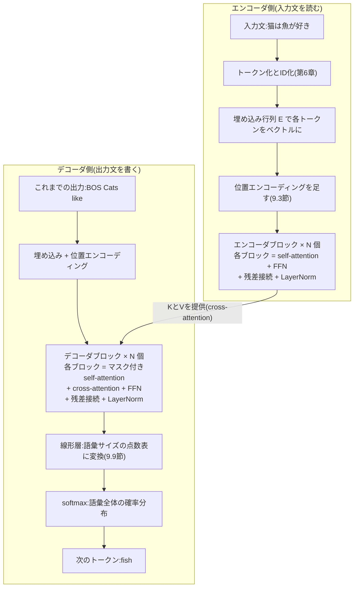
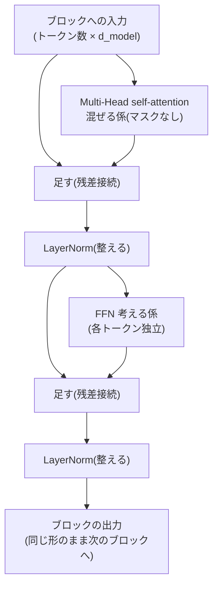
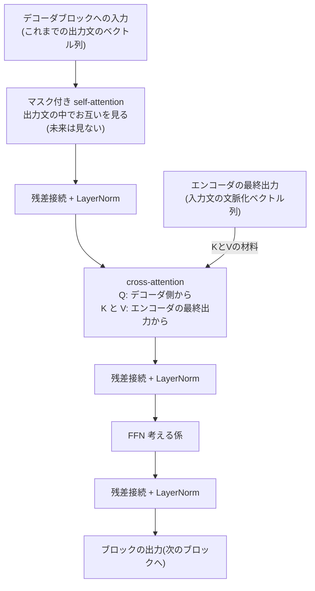

# 第9章 Transformerの全体像

第8章で、私たちはTransformerの心臓部であるattentionを完全に分解しました。この章では、その心臓の周りに必要な部品を一つずつ取り付けて、**Transformerという一つの機械を完成**させます。

部品は4つです。**位置エンコーディング**(語順を教える)、**残差接続**(深く積んでも学習できるようにする)、**層正規化**(値の暴れを抑える)、**FFN**(集めた情報を各トークンが咀嚼する)。どれも、attentionという主役を支えるために「なければ困る理由」がはっきりある名脇役です。この章では毎回その「困る理由」から入ります。

そして最後に、完成したTransformerが「猫は魚が好き」を "Cats like fish" に翻訳する様子を、入口から出口まで通しで追いかけます。

## この章で学ぶこと

- 原論文 "Attention Is All You Need"(2017)と、Transformerが生まれた経緯
- 全体アーキテクチャ(エンコーダ・デコーダ)の見取り図
- **位置エンコーディング**: attentionは語順を知らない、という事実とその処方箋
- **残差接続**: 深いネットワークでも勾配が消えない「高速道路」
- **層正規化(LayerNorm)**: 値のスケールを整えて学習を安定させる
- **FFN**: attentionが「混ぜる係」、FFNが「考える係」という役割分担
- エンコーダブロック/デコーダブロックの組み立てと、$N$ 回積み重ねる構造
- **cross-attention**: 第7章のseq2seq attentionの正体
- 出力層: 語彙全体の確率分布を出すまで
- 翻訳例「猫は魚が好き」→ "Cats like fish" の一部始終
- パラメータはどこに何個あるのか(一覧表と概算)

## この章の前提

- [第5章 ニューラルネットワーク](05-neural-networks.md) — 層、活性化関数(ReLU)、softmax
- [第6章 言葉を数にする](06-words-to-numbers.md) — トークン化、埋め込み行列 $E$
- [第7章 Transformer前夜](07-before-transformer.md) — seq2seq、ボトルネック問題、勾配消失
- [第8章 Attention徹底解説](08-attention.md) — self-attention、Multi-Head、因果マスク。**この章は第8章の直接の続きです**

---

## 9.1 原論文 "Attention Is All You Need"

2017年、Google の研究者たち(Vaswani ら8名)が発表した論文 **"Attention Is All You Need"(注意こそすべて)** で、Transformerは世に出ました。もともとは**機械翻訳のためのモデル**です。当時の翻訳の主流は「RNNベースのseq2seq + attention」(第7章)でしたが、この論文は挑発的な提案をしました。

> RNNを**完全に捨てて**、attentionだけでseq2seqを作ってみたらどうか。

動機は第7章と第8章で見たとおりです。RNNは逐次処理のせいで並列化できず、訓練が遅い。一方attentionは、全トークンを行列積で同時に処理でき、どんなに離れた単語も直接つなげる。だったらRNNの部分は要らないのではないか——結果は、翻訳の品質で当時の最高記録を更新し、しかも**訓練時間は大幅に短縮**。この「質を落とさず並列化できる」性質こそが、後にモデルの巨大化(第13章)を可能にし、LLM時代の扉を開くことになります。

原論文のTransformerは、第7章のseq2seqと同じく**エンコーダ・デコーダ**構成です。

- **エンコーダ(encoder)**: 入力文(例:「猫は魚が好き」)を読み込み、各トークンの「文脈化されたベクトル」の列を作る(読解係)
- **デコーダ(decoder)**: エンコーダの結果を参照しながら、出力文("Cats like fish")を1トークンずつ生成する(作文係)

ただし第7章のseq2seqと違い、**文全体を1本の固定長ベクトルに押し込むボトルネックはありません**。エンコーダの出力は「トークン数ぶんのベクトルの列」のまま保たれ、デコーダは毎ステップ、その全部をattentionで見に行きます。

## 9.2 全体像を眺める — 本書最重要図

まず完成形の見取り図を示します。**この図は本書で最も重要な図の一つです。** 現時点で細部が分からなくて大丈夫です。この章の各節がこの図の部品を1つずつ説明し、章の終わりに戻ってきたとき、全部が読めるようになっています。



同じ図をASCIIアートでも描きます。

```text
   【エンコーダ側】                          【デコーダ側】
   入力文「猫は魚が好き」                     次のトークン "fish"
        │                                       ▲
        v                                       │
 ┌──────────────┐                      ┌──────────────────┐
 │ トークン化+ID │                      │ softmax(確率分布)│
 └──────┬───────┘                      └────────▲─────────┘
        v                                       │
 ┌──────────────┐                      ┌──────────────────┐
 │ 埋め込み E    │                      │ 線形層(語彙へ)   │
 └──────┬───────┘                      └────────▲─────────┘
        v                                       │
 ┌──────────────┐                      ┌──────────────────┐
 │ +位置エンコード│                      │ デコーダブロック×N │
 └──────┬───────┘                      │ ┌──────────────┐ │
        v                              │ │ FFN          │ │
 ┌──────────────────┐                  │ ├──────────────┤ │
 │ エンコーダブロック×N│    K, V         │ │ cross-       │ │
 │ ┌──────────────┐ │ ═══════════════> │ │ attention    │ │
 │ │ FFN          │ │  入力文の全トークン │ ├──────────────┤ │
 │ ├──────────────┤ │  を毎回見に行ける  │ │ マスク付き    │ │
 │ │ self-        │ │  (ボトルネック無し) │ │ self-attention│ │
 │ │ attention    │ │                  │ └──────────────┘ │
 │ └──────────────┘ │                  └────────▲─────────┘
 └──────────────────┘                           │
   ※各部品には残差接続と               ┌──────────────────┐
     LayerNormが付く(図では省略)       │ 埋め込み+位置     │
                                      └────────▲─────────┘
                                               │
                                  これまでの出力 "<BOS> Cats like"
```

読み方のポイントは3つです。

1. **左右2本の塔**がある。左がエンコーダ(読解係)、右がデコーダ(作文係)
2. 各塔は、同じ構造の**ブロックを $N$ 個**積み重ねてできている(原論文では $N = 6$)
3. 2本の塔をつなぐ橋が **cross-attention**。デコーダはここを通じて入力文を参照する

それでは部品を1つずつ見ていきます。最初は、第8章の最後に予告した「attentionは語順を知らない」問題からです。

---

## 9.3 位置エンコーディング — attentionは語順を知らない

### 9.3.1 まず事実を確認する: 語順を入れ替えても結果が同じ

衝撃的な事実から始めます。**第8章のattentionは、トークンの順番を完全に無視します。**

第8章の手計算を思い出してください。トークン $i$ の出力を決めるのは、①自分のクエリ $\mathbf{q}_i$、②全トークンのキーとバリュー、の2つだけでした。この計算のどこにも「トークン $j$ は何番目にあるか」という情報は登場しません。スコアはクエリとキーの**内積**だけで決まり、内積は相手が隣にいようが100トークン先にいようが同じ値です。

具体的に確かめましょう。第8章の例で、$X$ の行の順番を [猫, 魚, それ] から [魚, 猫, それ] に入れ替えたとします。すると:

- $Q, K, V$ の行も同じように入れ替わるだけ(各行の**中身**は変わらない)
- スコア表 $QK^\top$ は、行と列が同じように入れ替わるだけ(「それ」と「魚」の内積4は、位置がどこでも4)
- softmaxは行ごとの計算なので、重みも入れ替わるだけ
- 結局、**「それ」の出力ベクトルは $(0.159,\ 1.841)$ のまま、1ミリも変わりません**

つまりattentionにとって、文は「単語の**列**」ではなく「単語の**袋**」です。袋に [猫, は, 魚, が, 好き] を放り込んでも [魚, は, 猫, が, 好き] を放り込んでも、各単語が受け取る情報は同じ。しかし「猫は魚が好き」と「魚は猫が好き」は意味が違います。「猫が魚を食べた」と「魚が猫を食べた」なら大事件です。語順は言葉の意味の一部なのです。

RNN(第7章)にはこの問題がありませんでした。1トークンずつ順番に読むという構造自体が語順を織り込んでいたからです。RNNを捨てて並列処理を手に入れた代償として、語順の情報を失った——だから、**語順を明示的に教え直す**必要があります。

### 9.3.2 処方箋: 位置の分だけベクトルを「ずらす」

解決策は拍子抜けするほど単純です。**「あなたは $t$ 番目です」という情報をベクトルにして、埋め込みに足し算する**のです。これを **位置エンコーディング(Positional Encoding)** と呼びます。

$$
\mathbf{x}_t^{\text{入力}} = \mathbf{e}_{w_t} + \mathbf{p}_t
$$

**読み下し**: 位置 $t$ のトークンの入力ベクトルは、「単語 $w_t$ の埋め込みベクトル」と「位置 $t$ を表すベクトル $\mathbf{p}_t$」の足し算。同じ単語でも、出てくる位置が違えば微妙に違うベクトルとしてattentionに渡る。

こうすると、同じ「魚」でも3番目の魚と7番目の魚は少し違うベクトルになるので、attentionのスコア(内積)が位置の影響を受けられるようになります。「直前の単語を見る係」(第8章のヘッド2)のような芸当も、位置情報が入っているからこそ学習できるわけです。

では、$\mathbf{p}_t$ はどんなベクトルにすべきでしょうか。素朴な案から検討します。

- **案1: 位置番号そのものを足す**($\mathbf{p}_t = (t, t, \dots, t)$)。位置1000では1000という巨大な値が足され、埋め込みの中身(だいたい $\pm 1$ 程度)が完全にかき消されてしまいます。却下
- **案2: 0〜1に正規化する**(位置 $t$ を文長 $n$ で割る)。同じ「3番目」でも、10単語の文と100単語の文で値が変わってしまい、「3番目」の意味が文の長さに依存してしまいます。却下

欲しい性質は、①値が暴れない(常に一定の範囲)、②どの位置も互いに区別できる、③位置同士の**相対関係**(2つ隣、5つ前など)が読み取りやすい、の3つです。

### 9.3.3 sin/cos版: 周期の違う波を束ねる

原論文の答えは、**周期の異なるsin波・cos波の値を並べる**というものでした。位置 $t$、次元番号 $2i$(偶数)と $2i+1$(奇数)に対して:

$$
p_{t,\,2i} = \sin\!\left(\frac{t}{10000^{2i/d_{\text{model}}}}\right), \qquad
p_{t,\,2i+1} = \cos\!\left(\frac{t}{10000^{2i/d_{\text{model}}}}\right)
$$

**読み下し**: 位置ベクトルの偶数番目の成分は「位置 $t$ を、次元ごとに違う定数で割ってからsinに入れた値」、奇数番目はcos版。次元番号 $i$ が大きいほど分母 $10000^{2i/d_{\text{model}}}$ が大きくなる、つまり**後ろの次元ほどゆっくり変化する波**になる。

sin・cosの厳密な性質は本書の前提を超えるので、**この式を完全に理解する必要はありません**。押さえてほしいのは次の直感だけです。sinとcosは「$-1$ から $1$ の間を周期的に往復する波」であり、分母が大きいほど波はゆっくり(周期が長く)なります。

これは**時計**と同じ仕組みです。時計は「秒針(速い)・分針(中くらい)・時針(遅い)」という周期の違う3本の針の組み合わせで、一日のどの瞬間も一意に表せます。あるいは**2進数の桁**を思い浮かべてもかまいません。1の位は 0,1,0,1,… と毎回パタパタ変わり、上の桁ほどゆっくり変わる。桁を全部読めば、どんな数でも区別できます。位置エンコーディングは、これの「なめらか版」です。速い波が細かい位置の違いを、遅い波が大まかな位置を担当し、束ねればどの位置も一意に表せます。

$d_{\text{model}} = 4$ で実際の値を計算してみましょう。分母は、次元0・1が $10000^{0/4} = 1$、次元2・3が $10000^{2/4} = 100$ です。なお、第6章では位置を「1番目・2番目…」と1から数えましたが、位置エンコーディングの式は $t = 0$ 始まりで書くのが慣例なので、本章では先頭を位置0とします。

| 位置 $t$ | 次元0: $\sin(t)$ | 次元1: $\cos(t)$ | 次元2: $\sin(t/100)$ | 次元3: $\cos(t/100)$ |
|---|---|---|---|---|
| 0 | 0.000 | 1.000 | 0.000 | 1.000 |
| 1 | 0.841 | 0.540 | 0.010 | 1.000 |
| 2 | 0.909 | −0.416 | 0.020 | 1.000 |
| 3 | 0.141 | −0.990 | 0.030 | 1.000 |
| 4 | −0.757 | −0.654 | 0.040 | 0.999 |

次元0・1(速い波、周期約6.3)は位置が1つ進むだけで大きく動き、次元2・3(遅い波、周期約628)はほとんど動きません。速い針と遅い針、そのものです。

```text
値
 1 |  *  *                 *  *            次元0: sin(t)
   | *    *               *    *           速い波(周期 約6.3)
 0 |*------*-------------*------*----→ 位置 t
   |        *           *
-1 |         *  *  *  *
     0  1  2  3  4  5  6  7  8  9

 1 |* * * * * * * * * * * * * * * *        次元2: sin(t/100)スタイル
   |                                       遅い波(周期 約628)
 0 |------------------------------→ 位置 t
   | この範囲ではほぼ動かない
-1 |  = 「大きい桁」の針
```

数値例として、「猫は魚が好き」の先頭2トークンの入力ベクトルを作ってみます。埋め込みを 猫 $= (1, 0, 1, 0)$、は $= (0, 2, 0, 1)$ とすると:

- 猫(位置0): $(1, 0, 1, 0) + (0,\ 1,\ 0,\ 1) = (1,\ 1,\ 1,\ 1)$
- は(位置1): $(0, 2, 0, 1) + (0.841,\ 0.540,\ 0.010,\ 1.000) = (0.841,\ 2.540,\ 0.010,\ 2.000)$

**読み下し**: 各トークンの埋め込みに、その位置の波の値が足し込まれた。これがエンコーダ/デコーダの最初のブロックへの入力になる。

sin/cos版の利点は、学習パラメータが不要なこと、そして訓練で見た文より長い文にも(波は無限に続くので)一応対応できることです。一方、**位置埋め込みを埋め込み行列と同じように学習で獲得する**流儀(学習型位置埋め込み)もあり、GPT系の初期モデルはこちらを採用しました。さらに現代のLLMでは、位置の扱いをattentionの内部に組み込んだ **RoPE** という改良が主流になっていますが、これは第15章で扱います。ここでは「**attentionは語順を知らないので、位置情報を何らかの形で注入する必要がある**」という一点を持ち帰ってください。

---

## 9.4 残差接続 — 勾配の高速道路

### 9.4.1 困る理由: 深く積むと学習できなくなる

この章の後半で見るように、Transformerはブロックを何層も積み重ねます(原論文で6層、GPT-3級では96層)。ここで第7章の亡霊がよみがえります。**勾配消失**です。

第5章で学んだとおり、学習の指令(勾配)は連鎖律によって出力側から入力側へ、層を遡って伝わります。連鎖律は「変化率の掛け算」でした。1より小さい数を96回掛ければほぼ0になり、深い層(入力に近い側)には学習の指令がほとんど届きません。RNNでは「時間方向」に起きたこの問題が、深いネットワークでは「層の深さ方向」に起きるのです。

### 9.4.2 処方箋: 入力をそのまま出力に足す

解決策はまたしても足し算です。各部品(attentionやFFN)の出力に、**その部品への入力をそのまま足してしまう**のです。

$$
\mathbf{y} = \mathbf{x} + f(\mathbf{x})
$$

**読み下し**: 部品 $f$ を通した結果 $f(\mathbf{x})$ に、入力 $\mathbf{x}$ をそのまま足したものを出力とする。部品を「通り抜ける道」と並行して、「素通りする迂回路」を用意する形。これを **残差接続(residual connection)** と呼ぶ。

```text
      x ────────────────────┐
      │                     │   ← 迂回路(何もせず素通り)
      v                     │      勾配もここを素通りできる
 ┌─────────────┐            │
 │ 部品 f       │            │
 │ (attention   │            │
 │  や FFN)     │            │
 └─────────────┘            │
      │ f(x)                │
      v                     v
      ＋ ←──────────────────┘
      │
      v
   y = x + f(x)
```

数値例: 入力が $\mathbf{x} = (1,\ 0,\ 1,\ 0)$ で、attentionの出力が $f(\mathbf{x}) = (0.5,\ -0.2,\ 0.1,\ 0.3)$ なら、

$$
\mathbf{y} = (1,\ 0,\ 1,\ 0) + (0.5,\ -0.2,\ 0.1,\ 0.3) = (1.5,\ -0.2,\ 1.1,\ 0.3)
$$

**読み下し**: 出力は「元の自分」に「attentionで集めた情報」を上乗せしたもの。

なぜこれで勾配消失が防げるのでしょうか。$\mathbf{y} = \mathbf{x} + f(\mathbf{x})$ を $\mathbf{x}$ で微分すると(第3章の記法で)、

$$
\frac{\partial \mathbf{y}}{\partial \mathbf{x}} = 1 + \frac{\partial f}{\partial \mathbf{x}}
$$

**読み下し**: 出力の入力に対する変化率は「1 + 部品の変化率」。部品の変化率がどんなに小さくても、**必ず「1」が残る**。

連鎖律で層を遡るとき、各層の変化率が掛け合わされていきますが、残差接続があれば各層の係数は「$1 + \text{何か}$」の形です。$0.5$ を96回掛ければ消滅しますが、「$1 + $ 小さい数」を掛け続けても1のまわりに留まれます。勾配は、部品の中を通らずとも**迂回路を素通りして**深い層まで届く——残差接続は「勾配の高速道路」なのです。第7章でRNNが苦しんだ勾配消失に対する、Transformer側の答えがこれです。

もう一つ、直感的なご利益があります。残差接続があると、各部品の仕事は「入力を丸ごと作り直す」ことではなく「入力に**差分(修正)を加える**」ことになります(残差=引き算の残り、という名前の由来です)。「それ」のベクトルに魚の情報を**上乗せ**する、という第8章の使い方とも自然に噛み合います。各層は少しずつベクトルを磨き上げていけばよいのです。

---

## 9.5 層正規化(LayerNorm)— 値の暴れを抑える

### 9.5.1 困る理由: 足し算を重ねると値のスケールが暴れる

残差接続は足し算です。埋め込み+位置エンコーディング+attentionの出力+FFNの出力+……と、層を重ねるたびに値が積み上がっていくと、ベクトルの成分がどんどん大きく(あるいは偏って)なりえます。第8章で見たとおり、softmaxは入力のスケールに敏感でした(尖りすぎ問題)。値のスケールが層ごとにバラバラだと、学習率(第4章の $\eta$)をどう選んでも、ある層では大きすぎ、別の層では小さすぎる、という事態になり、訓練が不安定になります。

### 9.5.2 処方箋: 各トークンのベクトルを「平均0・ばらつき1」に整える

そこで、要所要所で値を標準サイズに整え直します。**層正規化(Layer Normalization、LayerNorm)** は、**各トークンのベクトル1本ごとに**、成分の平均を0、ばらつき(分散)を1に揃える操作です。

ベクトル $\mathbf{x} = (x_1, \dots, x_d)$ に対して、まず平均 $\mu$(ミュー)と分散 $\sigma^2$(シグマ2乗)を計算し、各成分を次のように変換します。分散・標準偏差は第8章8.4.2で導入した「ばらつきの大きさ」です(この $\sigma$ は第5章のシグモイド関数とは別物で、標準偏差を表す統計の慣例文字です)。

$$
y_i = \gamma_i \cdot \frac{x_i - \mu}{\sqrt{\sigma^2 + \epsilon}} + \beta_i
$$

**読み下し**: 各成分から平均を引き(中心を0に)、ばらつきの平方根=標準偏差で割る(ぶれ幅を1に)。$\epsilon$(イプシロン)はゼロ割りを防ぐための極小の数(例: $10^{-5}$)。最後の $\gamma$(ガンマ)と $\beta$(ベータ)は学習されるパラメータで、「本当に平均0・ばらつき1がベストとは限らないので、最終的なスケールと位置は学習で微調整してよい」という逃げ道。

数値例: $\mathbf{x} = (2,\ 0,\ 4,\ -2)$ を正規化してみます($\gamma = 1, \beta = 0, \epsilon \approx 0$ とします)。

- 平均: $\mu = (2 + 0 + 4 + (-2)) / 4 = 1$
- 各成分から平均を引く: $(1,\ -1,\ 3,\ -3)$
- 分散: $\sigma^2 = (1^2 + (-1)^2 + 3^2 + (-3)^2)/4 = (1+1+9+9)/4 = 5$、標準偏差 $\sqrt{5} \approx 2.236$
- 割る: $(1,\ -1,\ 3,\ -3) / 2.236 \approx (0.447,\ -0.447,\ 1.342,\ -1.342)$

**読み下し**: どんなに大きな値のベクトルが来ても、LayerNormを通れば「平均0・ばらつき1」の標準サイズに整えられて出てくる。

LayerNormを**どこに置くか**には2つの流儀があります。原論文は「残差接続で足した**後**に置く」**Post-LN**でしたが、その後「各部品に入る**前**に置く」**Pre-LN**のほうが深いモデルでも訓練が安定することが分かり、GPT系を含む現代のモデルはほぼPre-LNです。本書の説明はどちらの理解にも通用するので、「ブロックの中の決まった場所で毎回値を整え直す係がいる」とだけ覚えてください。

---

## 9.6 FFN — attentionが「混ぜる係」、FFNが「考える係」

### 9.6.1 困る理由: attentionは混ぜることしかできない

attentionの出力は何だったでしょうか。**バリューの重み付き平均**です。平均は混ぜ合わせであって、新しい情報の加工ではありません。「それ」の位置に魚の情報を運んでくることはできても、「魚は食べられるものだ」「食べたのだから満腹だろう」といった**知識に基づく変換・推論**は、混ぜるだけの機構には荷が重いのです。第5章で学んだとおり、複雑な入出力関係を作るには**非線形の変換**(活性化関数を挟んだ層)が必要でした。attentionの中に、活性化関数は登場していません。

### 9.6.2 処方箋: 各トークンに小さな2層ニューラルネットを通す

そこでTransformerは、attentionの直後に **フィードフォワード網(Feed-Forward Network、FFN)** を置きます。正体は、第5章でさんざん練習した**ごく普通の2層ニューラルネットワーク**です。

$$
\mathrm{FFN}(\mathbf{x}) = \max(0,\ \mathbf{x}W_1 + \mathbf{b}_1)\, W_2 + \mathbf{b}_2
$$

**読み下し**: 入力ベクトルに1つ目の行列 $W_1$ を掛けてバイアス $\mathbf{b}_1$ を足し、ReLU(マイナスを0に潰す活性化関数、第5章)を通し、2つ目の行列 $W_2$ を掛けてバイアス $\mathbf{b}_2$ を足す。$W_1, W_2, \mathbf{b}_1, \mathbf{b}_2$ はすべて学習されるパラメータ。

大事な特徴が2つあります。

**特徴1: 各トークンに独立に、同じFFNが適用される。** attentionと違い、FFNはトークン同士を一切見ません。$n$ 個のトークンそれぞれのベクトルが、**同じ** $W_1, W_2$ を持つ同じFFNを、別々に通ります。役割分担はこうです。

> **attention = 混ぜる係**(トークン**間**で情報をやり取りする)
> **FFN = 考える係**(各トークンが、集めた情報を**自分の中で**咀嚼・加工する)

会議のたとえで言えば、attentionが「全員で情報交換をする会議」、FFNが「会議後に各自が席へ戻ってやる持ち帰り作業」です。Transformerブロックは、この「会議→個人作業」のセットを何度も繰り返す組織なのです。

また、FFNは**知識の貯蔵庫**でもあると考えられています。「魚は食べ物」「パリはフランスの首都」のような事実知識の多くは、FFNの重みの中に蓄えられていることを示唆する研究があります。attentionが文脈から材料を集め、FFNが記憶と照合して加工する、という分業です。

**特徴2: 中間層は4倍広い。** 慣例として、中間の次元 $d_{\text{ff}}$ は $d_{\text{model}}$ の**4倍**にします(原論文: $d_{\text{model}} = 512$、$d_{\text{ff}} = 2048$)。一度広い空間に展開してから畳み直すほうが、複雑な変換を表現しやすいためです。作業机は広いほうが仕事がしやすい、という感覚で捉えてください。

数値例: 小さく $d_{\text{model}} = 2$、$d_{\text{ff}} = 4$ で1トークン分を計算します。$\mathbf{x} = (1,\ -1)$、バイアスは0、

$$
W_1 = \begin{pmatrix} 1 & 0 & 1 & 0 \\ 0 & 1 & 0 & 1 \end{pmatrix}, \qquad
W_2 = \begin{pmatrix} 1 & 0 \\ 0 & 1 \\ 1 & 1 \\ 0 & 0 \end{pmatrix}
$$

とします。

**読み下し**: $W_1$ が2次元を4次元へ広げ、$W_2$ が4次元を2次元へ戻す(値は説明用)。

計算を追います。

- 1層目: $\mathbf{x}W_1 = (1,\ -1,\ 1,\ -1)$(2次元→4次元に展開)
- ReLU: $\max(0, \cdot)$ でマイナスを0に潰して $(1,\ 0,\ 1,\ 0)$
- 2層目: $(1, 0, 1, 0)\,W_2 = (1 \times 1 + 1 \times 1,\ 1 \times 1) = (2,\ 1)$(4次元→2次元に戻す)

**読み下し**: 広げて、非線形で刈り込んで、畳み直す。入力 $(1, -1)$ が $(2, 1)$ という別のベクトルに加工された。

なお、活性化関数には第5章で名前だけ予告した **GELU** を使うのが現代の主流です。GELUはReLUの角をなめらかにした親戚で、「マイナスをおおむね0に潰す」という役割は同じです。

---

## 9.7 エンコーダブロック — 部品を組み立てる

部品が揃いました。組み立てましょう。**エンコーダブロック**1個の中身は、たった2つの部品と、それぞれに付く残差接続+LayerNormです。

1. **Multi-Head self-attention**(第8章。マスクなし=全トークンがお互いを見てよい)+ 残差接続 + LayerNorm
2. **FFN**(9.6節)+ 残差接続 + LayerNorm



重要なのは、**ブロックの入力と出力が同じ形($n \times d_{\text{model}}$)** だということです。形が変わらないから、レゴブロックのように**同じ構造を何個でも積み重ねられます**。原論文ではこれを $N = 6$ 個積みました。

層を重ねる意味は、第5章の「多層=関数の合成」と同じです。1層目のattentionは「それ→魚」のような表面的な関係を捉え、2層目は「1層目で文脈が混ざったベクトル同士」の関係を捉え……と、層が深くなるほど抽象的な関係を扱えるようになります。会議→個人作業→また会議→また個人作業、を6巡すれば、最初はバラバラだった各トークンのベクトルが、文全体の意味を織り込んだ深い表現に育っていくわけです。

エンコーダ塔の最終出力は、**入力文の各トークンに対応する、文脈化しきったベクトルの列**($n \times d_{\text{model}}$ の行列)です。第7章のseq2seqのように1本のベクトルに要約したりせず、**列のまま**次へ渡します。ボトルネックはありません。

---

## 9.8 デコーダブロックとcross-attention — 第7章の伏線回収

デコーダは「これまでに生成した出力文のトークン列」を受け取り、次のトークンを予測する塔です。**デコーダブロック**は、エンコーダブロックの2部品の**間に、もう1つattentionが挟まった**3部品構成です(各部品に残差接続+LayerNormが付くのは同じ)。

1. **マスク付き Multi-Head self-attention** — 出力文の中でお互いを見る。ただし**因果マスク付き**(第8章8.10)。生成中の文の未来はまだ存在しないし、訓練時にカンニングさせないため
2. **cross-attention** — **入力文を見に行く**(後述)
3. **FFN** — 考える係(エンコーダと同じ)



### cross-attentionの正体

第7章で、attentionはもともと「翻訳のデコーダが、**入力の全単語をもう一度見に行く**仕組み」として生まれた、と学びました。あのときは「重み付き平均をとる」という発想だけ紹介し、詳細な数式は第8章に譲る、と約束しました。**その正体がこれです。** cross-attention(交差注意)は、第8章の完成形の式をそのまま使い、材料の出どころだけを変えたattentionです。

$$
\mathrm{CrossAttention} = \mathrm{softmax}\!\left(\frac{Q_{\text{dec}}\, K_{\text{enc}}^\top}{\sqrt{d_k}}\right) V_{\text{enc}}
$$

**読み下し**: クエリ $Q_{\text{dec}}$ は**デコーダ側**のベクトル列から作り($Q_{\text{dec}} = H_{\text{dec}} W_Q$)、キーとバリューは**エンコーダの最終出力**から作る($K_{\text{enc}} = H_{\text{enc}} W_K$、$V_{\text{enc}} = H_{\text{enc}} W_V$)。「いま英語で何と言うべきかを考えている私(クエリ)」が、「日本語の入力文の各単語(キー)」と照合し、合った単語の情報(バリュー)を持ってくる。

出力文側が $m$ トークン、入力文側が $n$ トークンなら、attention重みの表は $m \times n$ になります。翻訳「猫は魚が好き」→ "Cats like fish" で、訓練済みモデルに典型的な重みの例を示します(説明用の値です)。

| 出力側 \ 入力側 | 猫 | は | 魚 | が | 好き |
|---|---|---|---|---|---|
| **Cats** | **0.72 ████** | 0.08 | 0.10 ░ | 0.04 | 0.06 |
| **like** | 0.06 | 0.02 | 0.10 ░ | 0.07 | **0.75 ████** |
| **fish** | 0.08 | 0.02 | **0.80 ████** | 0.05 | 0.05 |

"like" の行に注目してください。英語の2語目 "like" を出すとき、モデルは日本語の**文末**にある「好き」を見ています。日本語(好きが最後)と英語(likeが2番目)の語順の違いを、cross-attentionが自動的に吸収しているのです。第7章のボトルネック問題——文全体を1本のベクトルに押し込むと細部が失われる——は、「毎ステップ、入力文の全トークンを直接見に行ける」ことで完全に解消されました。

デコーダブロックも $N$ 個積み重ねます。すべてのデコーダブロックのcross-attentionが、エンコーダ塔の**最終**出力を参照します。

---

## 9.9 出力層 — ベクトルを「次のトークンの確率分布」に変える

デコーダ塔のてっぺんから出てくるのは、$d_{\text{model}}$ 次元のベクトル(の列)です。しかし私たちが最終的に欲しいのは、第3章以来ずっと追いかけている「**次のトークンの確率分布**」——語彙の全単語に対する確率の表です。最後の変換は2段階です。

**段階1: 線形層で語彙サイズに広げる。** 最後尾トークンのベクトル $\mathbf{h}$($1 \times d_{\text{model}}$)に、出力行列 $W_{\text{out}}$($d_{\text{model}} \times V_{\text{vocab}}$)を掛けます。

$$
\mathbf{u} = \mathbf{h}\, W_{\text{out}}
$$

**読み下し**: $d_{\text{model}}$ 次元のベクトルを、語彙サイズ $V_{\text{vocab}}$ 次元(数万次元)の「各単語の点数表」に変換する。この点数を **ロジット(logit)** と呼ぶ。

**段階2: softmaxで確率分布にする。**

$$
P(\text{次のトークン} = w) = \mathrm{softmax}(\mathbf{u})_w
$$

**読み下し**: 点数表をsoftmax(第5章)に通し、全単語ぶん足すと1になる確率分布にする。

数値例: 語彙がたった5語 {Cats, like, fish, dogs, EOS} だとして、ロジットが $\mathbf{u} = (3.2,\ 1.1,\ 0.5,\ -0.8,\ 0.2)$ と出たとします。$e^{3.2} \approx 24.5$、$e^{1.1} \approx 3.00$、$e^{0.5} \approx 1.65$、$e^{-0.8} \approx 0.45$、$e^{0.2} \approx 1.22$、合計 $\approx 30.8$ なので、

| 候補 | Cats | like | fish | dogs | EOS |
|---|---|---|---|---|---|
| ロジット | 3.2 | 1.1 | 0.5 | −0.8 | 0.2 |
| 確率 | **0.795** | 0.097 | 0.053 | 0.015 | 0.040 |

**読み下し**: モデルは「次はCats」に79.5%の確信を持っている。この分布から1語を選べば(選び方は第14章)、次のトークンが決まる。

ちなみに $W_{\text{out}}$ の形($d_{\text{model}} \times V_{\text{vocab}}$)は、第6章の埋め込み行列 $E$($V_{\text{vocab}} \times d_{\text{model}}$)の転置と同じです。実際、$W_{\text{out}} = E^\top$ として**同じ行列を入口と出口で共有**するモデルも多くあります(重み共有)。「単語→ベクトル」の辞書を逆引きすれば「ベクトル→単語らしさ」になる、という直感に合ううえ、パラメータを大きく節約できます。

---

## 9.10 通し翻訳ストーリー — 「猫は魚が好き」が "Cats like fish" になるまで

それでは、完成したTransformerの中を、データが入口から出口まで流れる様子を通しで追いましょう。

**【エンコーダ側: 読解】**

1. **トークン化**(第6章): 「猫は魚が好き」→ `[猫, は, 魚, が, 好き]` → ID列 `[3049, 12, 887, 30, 2214]`
2. **埋め込み**: 埋め込み行列 $E$ から各IDの行を取り出し、5本の $d_{\text{model}}$ 次元ベクトル、すなわち $5 \times d_{\text{model}}$ の行列 $X$ を作る
3. **位置エンコーディング**(9.3): 各行に位置ベクトル $\mathbf{p}_0, \dots, \mathbf{p}_4$ を足す。これで「魚は3番目」という情報が入った
4. **エンコーダブロック×$N$**(9.7): 各ブロックで「self-attentionで混ぜる→FFNで考える」(残差とLayerNorm付き)を繰り返す。1層目で「好き」のベクトルに主語「猫」と対象「魚」の情報が混ざり、層を経るごとに「猫が主語で、魚が好意の対象で……」という文全体の構造を織り込んだ5本のベクトルに育つ
5. エンコーダの最終出力(5本のベクトル列)が、**全デコーダブロックのcross-attentionにキーとバリューの材料として**供給される。エンコーダの仕事はここまで(入力文が変わらない限り、再計算は不要)

**【デコーダ側: 作文】** 出力文はまだ空です。文の始まりを表す特殊トークン **BOS(Beginning of Sequence、文頭記号)** だけを置いてスタートします。

6. **ステップ1**: デコーダに `[BOS]` を入れる。埋め込み+位置エンコーディングの後、マスク付きself-attention(トークンが1個なので実質何もしない)→ cross-attentionで入力文を見る。「文頭でまず主語を出すべきだ」→ 重みが「猫」に集中 → 「猫」の情報を取り込む → FFN → …… → 出力層で確率分布(9.9の数値例がまさにこれ)→ **"Cats"**(79.5%)を選ぶ
7. **ステップ2**: デコーダに `[BOS, Cats]` を入れる。"Cats" の位置のベクトルが、cross-attentionで「好き」を強く見る(9.8の表の "like" の行)→ 確率分布 → **"like"** を選ぶ
8. **ステップ3**: `[BOS, Cats, like]` を入れる。マスク付きself-attentionで "like" が "Cats" を確認し(単数ならlikesだが複数だからlike、のような整合もここで保たれる)、cross-attentionは「魚」を見る → **"fish"** を選ぶ
9. **ステップ4**: `[BOS, Cats, like, fish]` を入れる。入力文の内容はすべて訳し終えた → モデルは文の終わりを表す特殊トークン **EOS(End of Sequence、文末記号)** に最大の確率を割り当てる → 生成終了

| ステップ | デコーダへの入力 | cross-attentionが主に見る入力語 | 出力(確率最大のトークン) |
|---|---|---|---|
| 1 | BOS | 猫 | **Cats** |
| 2 | BOS, Cats | 好き | **like** |
| 3 | BOS, Cats, like | 魚 | **fish** |
| 4 | BOS, Cats, like, fish | 文全体 | **EOS**(完成) |

翻訳結果 "Cats like fish" が得られました。1トークンずつ、毎回「これまでの出力+入力文全体」を材料に次の1語を選ぶ——この生成ループの詳細(確率分布からどう選ぶか、など)は第14章で掘り下げます。

ここで一つ、先の章への伏線を張っておきます。この「デコーダが1トークンずつ次を予測する」部分だけを取り出し、エンコーダとcross-attentionを取り払った構成——実はそれが**GPT**です(第11章)。あなたはすでに、ChatGPTの本体の設計図をほぼ理解しています。

---

## 9.11 パラメータはどこにあるのか — 一覧表と概算

第4章以来、「学習=良いパラメータ探し」と言い続けてきました。ではTransformerの「学習されるパラメータ」は、結局どこに何個あるのでしょうか。全部品を棚卸しします(sin/cos版の位置エンコーディングは計算式で作るのでパラメータなし。学習型ならここにも表が1枚加わります)。

| パラメータ | 形 | ある場所 | 役割 |
|---|---|---|---|
| 埋め込み行列 $E$ | $V_{\text{vocab}} \times d_{\text{model}}$ | 入口(出口と共有可) | トークンID→ベクトル |
| $W_Q, W_K, W_V$ | 各 $d_{\text{model}} \times d_{\text{model}}$ ※ | 各attention | 3つの顔を作る変換 |
| $W_O$ | $d_{\text{model}} \times d_{\text{model}}$ | 各attention | ヘッドのメモを混ぜる |
| FFNの $W_1, \mathbf{b}_1$ | $d_{\text{model}} \times d_{\text{ff}}$、$d_{\text{ff}}$ | 各FFN | 広げて考える |
| FFNの $W_2, \mathbf{b}_2$ | $d_{\text{ff}} \times d_{\text{model}}$、$d_{\text{model}}$ | 各FFN | 畳んで戻す |
| LayerNormの $\gamma, \beta$ | 各 $d_{\text{model}}$ | 各LayerNorm | スケールの微調整 |
| 出力層 $W_{\text{out}}$ | $d_{\text{model}} \times V_{\text{vocab}}$ | 出口($E^\top$ と共有可) | ベクトル→語彙の点数表 |

※ $W_Q$ などは「全ヘッド分をまとめて1枚」と数えています($h$ 個の $d_{\text{model}} \times d_k$ を横に並べると $d_{\text{model}} \times d_{\text{model}}$ になる。$d_k = d_{\text{model}}/h$ のため)。

原論文の標準設定(Transformer base)で実際に数えてみましょう。設定は $d_{\text{model}} = 512$、$h = 8$、$d_{\text{ff}} = 2048$、$N = 6$(エンコーダ・デコーダ各6層)、語彙 $V_{\text{vocab}} = 32{,}000$(入口と出口で共有)とします。

- **埋め込み**: $32{,}000 \times 512 = 16{,}384{,}000 \approx 1{,}638$万個
- **attention 1個あたり**: $W_Q, W_K, W_V, W_O$ の4枚 × $512 \times 512 = 262{,}144$ で、約 $105$万個
- **FFN 1個あたり**: $512 \times 2048 + 2048 \times 512 + 2048 + 512 = 2{,}099{,}712 \approx 210$万個
- **エンコーダブロック1個**: attention 1個 + FFN 1個 + LayerNorm 2個 $\approx 105 + 210 + 0.2 \approx 315$万個 → **6層で約1,890万個**
- **デコーダブロック1個**: attention **2個**(self + cross)+ FFN 1個 + LayerNorm 3個 $\approx 420$万個 → **6層で約2,520万個**
- **出力層**: 埋め込みと共有するので追加ゼロ

$$
\text{合計} \approx 1{,}638万 + 1{,}890万 + 2{,}520万 \approx 6{,}000万個
$$

**読み下し**: 原論文のTransformer(base)の学習パラメータは約6千万個。論文公称の約6,500万個と(語彙数などの細部の差を除き)一致する。

この6千万個の数字が、すべて第4章の勾配降下法で、翻訳データから少しずつ調整されていきます。そして本書の後半で見るように、この同じ設計図のまま $d_{\text{model}}$ と $N$ と訓練データを増やしていった先に、パラメータ数十億〜数千億個のLLMがあります(GPT-3は1,750億個。規模の話は第13章で)。**設計図はもう、あなたの手元にあるのと同じものです。**

---

## この章のまとめ

- Transformerは2017年の論文 "Attention Is All You Need" で提案された、**RNNを使わずattentionだけで組んだ**エンコーダ・デコーダ型の翻訳モデル。並列訓練が可能になったことが、後の大規模化への道を開いた
- **位置エンコーディング**: attentionは語順を完全に無視する(語順を入れ替えても各トークンの出力は不変)ため、周期の異なるsin/cos波の値(または学習型の位置埋め込み)を埋め込みに**足して**位置情報を注入する
- **残差接続** $\mathbf{y} = \mathbf{x} + f(\mathbf{x})$: 微分に必ず「1」が残るため、勾配が層を素通りして深部まで届く「高速道路」。深い積み重ねを可能にする
- **LayerNorm**: 各トークンのベクトルを平均0・ばらつき1に整え、学習を安定させる。現代はPre-LN(部品の前に置く)が主流
- **FFN**: 各トークンに独立に適用される2層NN(中間層は4倍幅)。**attention=混ぜる係、FFN=考える係**という分業。知識の貯蔵庫でもある
- **エンコーダブロック** = self-attention + FFN(+残差・LayerNorm)。入出力が同じ形なので $N$ 個積める
- **デコーダブロック** = マスク付きself-attention + **cross-attention** + FFN。cross-attentionは「Qをデコーダから、K/Vをエンコーダから」作るattentionで、第7章のseq2seq attentionの正体。ボトルネック問題を解消する
- **出力層**: 線形層でロジット(語彙全体の点数表)を作り、softmaxで**次トークンの確率分布**にする。埋め込み行列との重み共有も使われる
- パラメータは埋め込み・$W_Q, W_K, W_V, W_O$・FFN・LayerNorm・出力層に分布し、原論文の標準設定で約6千万個。これらすべてが勾配降下法で学習される

## 次の章へ

設計図は完成しました。しかし、6千万個(LLMなら数千億個)のパラメータに「良い値」を入れる作業——**訓練**——はどう行うのでしょうか。次章では、「文章そのものが問題と答えになる」自己教師あり学習という革命的な仕組みと、因果マスクのおかげで全位置を同時に採点できるカラクリ、そしてGPU数千枚を数ヶ月動かす訓練の実際を見ていきます。

→ [第10章 Transformerを訓練する](10-training.md)
