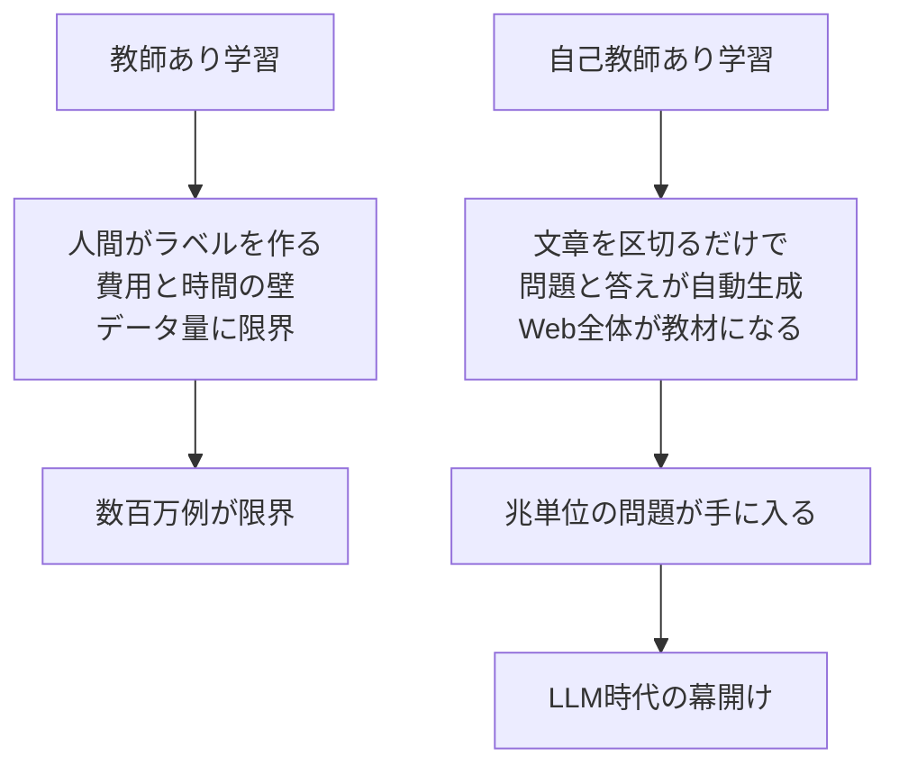
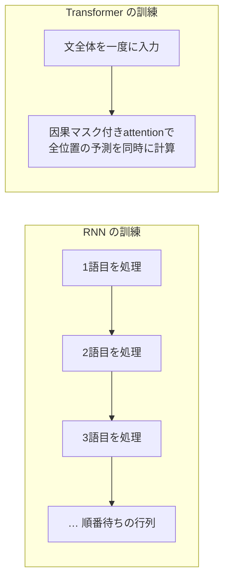
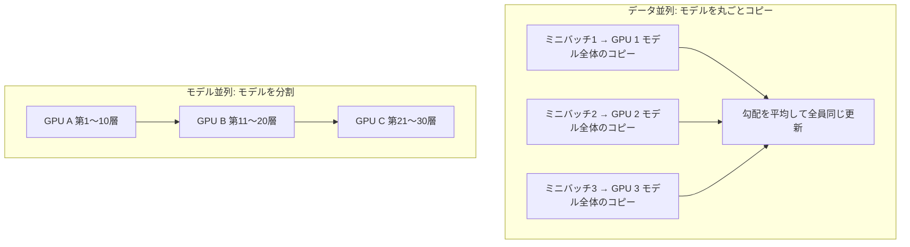
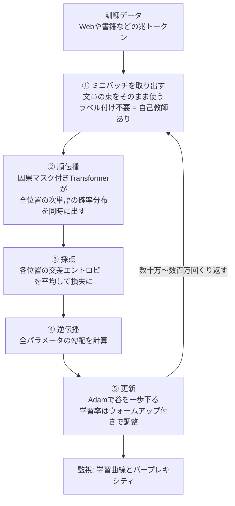

# 第10章 Transformerを訓練する

第9章までで、Transformerという機械の「設計図」は完成しました。入力の文がトークンになり、埋め込みになり、attentionとFFNのブロックを何層も通り抜けて、最後に「次の単語の確率分布」が出てくる。その全経路を、私たちはもう知っています。

しかし、設計図だけでは機械は賢くなりません。第9章で見たとおり、Transformerの中身は $W_Q$ や $W_K$ といった**大量のパラメータ(数値の表)** であり、作りたての状態ではそれらはデタラメな乱数です。乱数のままのTransformerに「猫は魚が」と入れても、出てくる確率分布はデタラメで、「好き」の確率はほとんどゼロでしょう。

この章では、そのデタラメな数値の山が、どうやって「言葉が分かる」状態まで鍛え上げられるのかを見ていきます。使う道具は、実はすべて第4章と第5章で手に入れたものです。新しい仕組みはほとんど出てきません。**本当に新しいのは「教材の作り方」のアイデア一つだけ**です。そしてそのアイデアが、LLMの時代を開く大きな転換点になりました。

## この章で学ぶこと

- Transformerの訓練で「何を」学習するのか(答え: 第9章で一覧にしたパラメータ全部)
- **自己教師あり学習** — 「文章そのものが問題と答えになる」というアイデア
- 訓練データの実際: Web・書籍・コード、そして「兆トークン」という規模感
- 次単語予測の訓練の具体像 — 因果マスクのおかげで**全位置を同時に**予測・採点できること
- 損失関数 = 各位置の交差エントロピーの平均(第5章の回収)。手計算例つき
- **パープレキシティ** — 「モデルが平均何択で迷っているか」という賢さの物差し
- ミニバッチ・エポック・学習曲線という訓練の道具立て
- **Adam**(勾配降下法の改良版)と学習率ウォームアップ
- 訓練の物理的な実際: GPU数千枚・数ヶ月・分散学習

## この章の前提

- [第4章 機械学習入門](04-machine-learning-basics.md) — 損失関数、勾配降下法 $\theta \leftarrow \theta - \eta \nabla L$ 、訓練データとテストデータ、過学習
- [第5章 ニューラルネットワーク](05-neural-networks.md) — softmax、**交差エントロピー**、逆伝播
- [第8章 Attention徹底解説](08-attention.md) — **因果マスク**(未来の単語を見せない仕組み)
- [第9章 Transformerの全体像](09-transformer-architecture.md) — アーキテクチャ全体と、パラメータがどこにあるかの一覧

---

## 10.1 何を学習するのか — パラメータ一覧の再確認

第4章で学んだ機械学習の合言葉を思い出してください。

> [!IMPORTANT]
> **学習とは、良いパラメータ探しである。**

モデルはパラメータ付きの関数 $f_\theta(x)$ で、 $\theta$(シータ: パラメータ全部をまとめた記号)を動かして、損失 $L$ が小さくなる場所を探す。それが学習でした。Transformerもまったく同じです。違うのは $\theta$ の個数だけです。

第9章の最後で作った「パラメータはどこにあるか」の一覧を、簡単に再掲します。

| パラメータ | 役割 | ある場所 |
|---|---|---|
| 埋め込み行列 $E$ | トークンIDをベクトルにする(第6章) | 入口に1つ |
| $W_Q, W_K, W_V, W_O$ | attentionの「探す顔・探される顔・渡す中身」を作る(第8章) | 各層 × 各ヘッド |
| FFNの $W_1, W_2$(とバイアス) | 各トークンを個別に「考える」2層NN(第9章) | 各層に1組 |
| LayerNormの係数 | 値のスケールを整える(第9章) | 各層に複数 |
| 出力層の行列 | 最後のベクトルを語彙全体のスコアに変換(第9章) | 出口に1つ($E$ と共有することも) |

訓練とは、**この表にあるすべての数値を、いっせいに勾配降下法で調整すること**です。更新式は第4章で手計算したものと一字一句同じです。

$$
\theta \leftarrow \theta - \eta \nabla L
$$

**読み下し**: すべてのパラメータ $\theta$ を、損失 $L$ の勾配 $\nabla L$(最も急な上り方向)と逆向きに、学習率 $\eta$(イータ)の歩幅だけ動かす。つまり「損失の谷を一歩下る」。

第4章では $\theta$ は $w$ と $b$ のたった2個でした。GPT-3クラスのTransformerでは $\theta$ は**約1,750億個**あります。しかし勾配 $\nabla L$ は、第5章で学んだ**逆伝播**が「各パラメータが損失にどれだけ責任があるか」を全パラメータぶん機械的に計算してくれるのでした。2個でも1,750億個でも、やることは同じ「谷下り」です。

では、谷下りの出発点は? 何か気の利いた初期値があるのでしょうか。答えは拍子抜けするほど単純で、**小さな乱数**です。訓練開始時のTransformerは、文字どおりデタラメな機械です。そこから兆単位の問題を解かせて、少しずつ谷を下らせます。

残る問いは一つです。**その「兆単位の問題」は、いったい誰が作るのでしょうか?**

## 10.2 自己教師あり学習 — 文章そのものが問題と答えになる

### 10.2.1 ラベル付けという壁

第4章で学んだ機械学習の基本形を思い出しましょう。住宅価格の予測なら「広さ→価格」、画像分類なら「画像→猫/犬」というように、**入力と正解(ラベル)のペア**を大量に集めて、モデルの予測と正解のズレ(損失)を減らしていくのでした。このように正解ラベル付きのデータで学ぶやり方を **教師あり学習(supervised learning)** と呼びます。

教師あり学習には宿命的な弱点があります。**正解ラベルは人間が手作業で付けるしかない**のです。写真100万枚に「猫」「犬」とラベルを付けるだけでも大変な費用と時間がかかります。ましてTransformerの言語能力を鍛えるのに必要なデータは、後で見るように**兆単位のトークン**です。1兆個の問題に人間が正解を付けるとなると、1人が1秒に1問ラベル付けしても3万年以上かかります。教師あり学習の延長線上には、LLMは存在できません。

### 10.2.2 発想の転換: 問題と答えは、文章の中に最初から入っている

ここで、本書後半で最も重要なアイデアが登場します。

> [!IMPORTANT]
> **文章は、それ自体が「問題」と「答え」のペアの山である。**

通し例「猫は魚が好き」で見てみましょう。この5トークンの文をどこかで区切れば、「区切りより前」が問題文、「区切りの直後の1トークン」が正解になります。

| 問題(入力) | 答え(正解ラベル) |
|---|---|
| 猫 | は |
| 猫 は | 魚 |
| 猫 は 魚 | が |
| 猫 は 魚 が | 好き |

見てください。**誰もラベル付けをしていないのに、5トークンの文から4個の「問題と正解のペア」が生まれました**。1,000トークンの文書なら999問。1兆トークンのテキストなら、ほぼ1兆問です。しかも問題の内容は「次に来る言葉を当てよ」。第3章の最後で予告し、第7章で **言語モデル** として正式に導入した、 $P(w_t \mid w_1, \dots, w_{t-1})$ を当てるあの問題と同じです。

このように、**人間のラベル付けなしで、データ自身から問題と正解を自動生成して学ぶ**やり方を **自己教師あり学習(self-supervised learning)** と呼びます。「教師(正解)」はいるけれど、その教師はデータ自身が務める、という意味です。



なぜこれが大きな転換点なのか。**インターネット上の全テキスト、人類が書いてきた全書籍が、そのまま教材になる**からです。ラベル付けのコストがゼロになったことで、訓練データの量の上限が「人間の作業量」から「人類がこれまでに書いた文章の総量」に跳ね上がりました。この量の増大が、第13章で学ぶスケーリング則(大きくすればするほど賢くなる)と組み合わさって、LLMを生み出したのです。

### 10.2.3 「次の単語を当てる」だけで、なぜ賢くなるのか

「穴埋めクイズを兆回解くだけで、言葉が分かるようになるの?」と思うのは当然の疑問です。鍵は、**次の単語を正確に当てるには、結局あらゆる知識が必要になる**ことにあります。

- 「猫は魚が___」を当てるには、**文法**(「が」の後には述語が来やすい)と**常識**(猫は魚を好む)が要ります
- 「水は100度で___」を当てるには、**科学の知識**が要ります
- 「彼女は鍵を忘れたことに気づいた。だから家に___」を当てるには、**推論**(鍵がない→入れない→戻る?)が要ります

つまり「次単語予測」は一見単純な問題に見えて、実は**言葉にまつわる全能力を試す総合問題**なのです。損失を下げようとする圧力が、文法も知識も推論の芽も、パラメータの中に押し込んでいきます。

## 10.3 訓練データの実際 — 兆トークンの世界

では実際のLLMは何を「読んで」いるのでしょうか。代表的な材料は次のとおりです。

| データ源 | 中身 | 特徴 |
|---|---|---|
| **Common Crawl** | Web全体を巡回して集めた公開Webページの巨大アーカイブ | 量は桁違いに多い。ただし玉石混交で、清掃(クリーニング)が必須 |
| 書籍 | 小説・専門書など | 長く一貫した文章。長距離の文脈を学べる |
| Wikipedia | 百科事典 | 事実知識が高密度 |
| コード | GitHubなどのプログラム | 論理的な構造。推論能力への好影響が知られる |
| 論文・ニュースなど | 学術・時事テキスト | 専門知識 |

規模感をつかみましょう。単位は第6章で学んだ**トークン**です。

- GPT-3(2020年)の訓練データ: 約**3,000億トークン**
- 近年の主要LLM: **10兆トークン超**も珍しくない

1兆トークンがどれくらいか。日本語の文庫本1冊がおよそ10万字、トークンにして数万〜十数万トークンです。ざっくり1冊5万トークンとすると、**1兆トークン ≈ 文庫本2,000万冊分**。人間が1日1冊読んでも5万年以上かかる量を、モデルは訓練期間中に「読み」ます。

ただし、集めたデータをそのまま流し込むわけではありません。訓練の前に大がかりな下ごしらえをします。

- **清掃**: 機械生成のスパム、文字化け、意味のないページの除去
- **重複除去**: 同じ文章が何度も出てくると、モデルがそれを丸暗記してしまう(第4章の過学習と同じ問題)ため、重複を削る
- **混合比の設計**: コードを何%、書籍を何%入れるか、といった「献立」の調整。データの質と配合が最終的な賢さを大きく左右することが知られています

## 10.4 次単語予測の訓練の具体像 — 全位置を同時に採点する

### 10.4.1 1つの文が「4問同時のテスト」になる

「猫は魚が好き」でTransformer(ここではデコーダ型、つまり因果マスク付きのもの)を訓練する様子を具体的に見ます。

まず、入力として文全体 `[猫, は, 魚, が, 好き]` をそのまま与えます。第9章で見たとおり、Transformerは**各位置ごとに**「次の単語の確率分布」を出力します。つまり出力は1個ではなく、位置の数だけあります。

| 位置 | その位置までの入力 | その位置の出力(確率分布)が答えるべき問題 | 正解 |
|---|---|---|---|
| 1 | 猫 | 「猫」の次は? | は |
| 2 | 猫 は | 「猫 は」の次は? | 魚 |
| 3 | 猫 は 魚 | 「猫 は 魚」の次は? | が |
| 4 | 猫 は 魚 が | 「猫 は 魚 が」の次は? | 好き |

1回の計算(順伝播)で、**4つの問題すべての答案が同時に出てくる**のです。5トークンの文なら4問、1,000トークンの文書なら999問を、たった1回のモデル実行で解かせて採点できます。

### 10.4.2 なぜ同時にできるのか — 因果マスクの回収

ここで「あれ?」と思った方は鋭いです。位置2の出力は「猫 は」だけから「魚」を予測しなければいけないのに、入力には文全体(「魚 が 好き」も含む)を与えています。**位置2が正解の「魚」をこっそり見てしまったら、カンニングでは?**

そのとおり、何も対策しなければカンニングになります。そしてその対策こそ、第8章で学んだ **因果マスク(causal mask)** でした。attentionのスコア行列で「未来の位置」に $-\infty$ を足し、softmaxの後の重みを0にする、あの仕組みです。因果マスクがあるおかげで、

- 位置1の出力は「猫」だけを見て計算され、
- 位置2の出力は「猫 は」だけを見て計算され、
- 位置4の出力は「猫 は 魚 が」だけを見て計算される

ことが**構造的に保証**されます。だから文全体を一度に入れても、各位置の予測は「その位置までしか読んでいない状態」の正直な答案になるのです。第8章で「なぜわざわざ未来を隠すのか」と学んだ仕組みは、この**訓練の並列化**のためにあったのです。

なお、このように「入力に正解の並びをそのまま与えて、全位置で次を予測させる」訓練方式を **教師強制(teacher forcing)** と呼びます。位置3の予測が外れても、位置4の入力には(モデルの予測ではなく)正解の「が」を使う、という意味です。訓練中は常に正解のレール上を走らせる、と考えてください。

### 10.4.3 RNNとの決定的な違い

第7章で見たRNNは、単語を1個読むごとに隠れ状態を更新する**逐次処理**でした。1,000トークンの文書で999問を解かせるには、999ステップを順番に踏むしかなく、GPUの並列計算能力を活かせません。

Transformerは、因果マスクのおかげで**999問を1回の行列計算でまとめて処理**できます。第8章で見た「attentionの行列形式 = 全トークン同時処理」が、訓練の速さに直結しているわけです。同じ計算資源なら桁違いに多くのデータを学べる。これがRNNを歴史の主役から降ろした実務上の決定打でした。



## 10.5 損失関数 — 交差エントロピーの平均(第5章の回収)

### 10.5.1 1問ぶんの採点: 交差エントロピー

各位置の答案(確率分布)をどう採点するか。ここで第5章で学んだ **交差エントロピー(cross-entropy)** がそのまま使えます。復習すると、

$$
L_{\text{1問}} = -\ln P_\theta(\text{正解})
$$

**読み下し**: モデルが「正解の選択肢」に割り当てた確率を取り出し、その自然対数にマイナスを付けたものが損失。正解に高い確率を与えるほど損失は小さく、正解の確率が0に近いほど損失は爆発的に大きくなる。

数値で感覚を確認しましょう(第1章の対数の感覚の復習でもあります)。

| モデルが正解に割り当てた確率 $P$ | 損失 $-\ln P$ | 感想 |
|---|---|---|
| 0.9 | 0.105 | ほぼ確信して正解。ごほうび |
| 0.5 | 0.693 | 2択まで絞れている |
| 0.25 | 1.386 | 4択で迷っている |
| 0.01 | 4.605 | ほぼ外している。大減点 |
| 0.0001 | 9.210 | 論外。猛烈な減点 |

### 10.5.2 文全体の損失: 全位置の平均

文(トークン列 $w_1, w_2, \dots, w_n$)全体の損失は、各位置の交差エントロピーを**平均**したものです。

$$
L(\theta) = -\frac{1}{n-1} \sum_{t=1}^{n-1} \ln P_\theta(w_{t+1} \mid w_1, \dots, w_t)
$$

**読み下し**: 位置 $t$ を1から $n-1$ まで動かし、それぞれの位置で「ここまでの単語列 $w_1, \dots, w_t$ を見たモデルが、次の正解 $w_{t+1}$ に割り当てた確率」の対数を取り、マイナスを付けて足し合わせ、問題数 $n-1$ で割って平均する。つまり「1問あたりの平均減点」。

通し例で手計算してみましょう。訓練途中のモデルが、各位置の正解に次の確率を割り当てたとします。

| 位置 $t$ | 入力(ここまで) | 正解 $w_{t+1}$ | 正解に割り当てた確率 | 損失 $-\ln P$ |
|---|---|---|---|---|
| 1 | 猫 | は | 0.40 | 0.916 |
| 2 | 猫 は | 魚 | 0.20 | 1.609 |
| 3 | 猫 は 魚 | が | 0.50 | 0.693 |
| 4 | 猫 は 魚 が | 好き | 0.25 | 1.386 |

$$
L = \frac{0.916 + 1.609 + 0.693 + 1.386}{4} = \frac{4.604}{4} = 1.151
$$

**読み下し**: 4問ぶんの減点を合計して4で割ると、この文に対する平均損失は約1.151。

この1.151という数を小さくする方向へ、逆伝播が全パラメータの勾配を計算し、Adamが(後述)一歩更新する。それが訓練の1ステップです。位置2の「魚」の確率0.20が低めなので、「『猫は』の後に『魚』が来やすくなる」方向の圧力が、 $E$ にも $W_Q, W_K, W_V$ にもFFNにも、責任の大きさに応じてかかります。

一つ注目してほしいのは、**正解以外の単語をどう間違えたかは損失に直接出てこない**ことです。損失に入るのは「正解に割り当てた確率」だけ。ただしsoftmax(第5章)の性質上、確率の合計は1なので、正解の確率を上げることは自動的に不正解たちの確率を下げることを意味します。

### 10.5.3 訓練が進むと損失はどうなるか

同じ文に対する損失は、訓練の進行とともにこう変わっていきます。

| 訓練の段階 | 正解に割り当てる確率(イメージ) | 平均損失 |
|---|---|---|
| 開始直後(乱数) | 語彙5万なら各単語 $1/50000 = 0.00002$ | $-\ln(1/50000) \approx 10.8$ |
| 序盤 | よく出る単語(「は」「が」)を覚え始める | 6〜7 |
| 中盤 | 文法をほぼ習得、常識も部分的に | 3〜4 |
| 大規模訓練の終盤 | 「猫は魚が→好き」レベルは余裕 | 2前後 |

開始直後の損失が $\ln 50000 \approx 10.8$ になる理由は明快です。乱数のモデルは語彙5万の全単語に均等な確率しか割り当てられないので、正解の確率は常に $1/50000$ 、損失は $-\ln(1/50000) = \ln 50000$ です。訓練とはこの10.8を、勾配降下で少しずつ削っていく作業です。

### 10.5.4 よくある疑問 — 損失はゼロまで下がるのか?

学習曲線が下がり続けるなら、いつかは損失0(全問、確率1.0で正解)に届くのでしょうか。答えは**届きません**。理由はモデルの性能ではなく、**言語そのものの性質**にあります。

「猫は魚が」の次に来る単語は、本当に「好き」だけでしょうか。「嫌い」かもしれないし、「大好き」「食べたい」「入った水槽を眺めている」かもしれません。**次の単語は本質的に一つには決まらない**のです。理想のモデルとは「次の単語の真の確率分布」をそのまま言い当てるモデルであって、常に確率1.0を正解に置けるモデルではありません。したがってどれほど訓練しても、平均損失には言語自体の不確実性ぶんの下限が残ります(この下限は「言語のエントロピー」と呼ばれます。名前だけ知っていれば十分です)。

学習曲線が漸近していく先は0ではなくこの下限であり、次節のパープレキシティで言えば「1」には決してならない、ということです。もし「猫は魚が」の続きが本当に平均1択になったら、それは言葉がすべて定型文になってしまった世界でしょう。

## 10.6 パープレキシティ — 「平均何択で迷っているか」

損失1.151と言われても、正直ピンときませんよね。そこで、損失を人間の感覚に翻訳した物差しが **パープレキシティ(perplexity、困惑度)** です。定義はとても簡単です。

$$
\mathrm{PPL} = e^{L}
$$

**読み下し**: 平均交差エントロピー損失 $L$ を、指数関数 $e^x$(第1章)で「対数を取る前の世界」に戻したものがパープレキシティ。対数の逆演算が指数でしたから、これは「 $-\ln$ でつけた採点を、確率のスケールに引き戻す」操作です。

### 10.6.1 なぜ「何択か」と読めるのか

モデルが毎回、正解を含む $k$ 個の候補まで絞り込み、その $k$ 個に均等に確率 $1/k$ を配っているとしましょう。このとき損失は毎問 $-\ln(1/k) = \ln k$ 、パープレキシティは

$$
\mathrm{PPL} = e^{\ln k} = k
$$

**読み下し**: 「常に $k$ 択まで絞れているモデル」のパープレキシティはちょうど $k$ 。

つまり **パープレキシティ = モデルが平均して何択のクイズを解いている状態か**、と読めるのです。

- $\mathrm{PPL} = 50000$: 語彙5万から全くの当てずっぽう(訓練開始直後)
- $\mathrm{PPL} = 100$: 平均100択まで絞れている
- $\mathrm{PPL} = 4$: 平均4択。かなり賢い
- $\mathrm{PPL} = 1$: 全問、確率1.0で正解し続ける(理論上の下限。実際には到達不能)

### 10.6.2 手計算で確かめる

10.5節の数値例では平均損失 $L = 1.151$ でした。

$$
\mathrm{PPL} = e^{1.151} \approx 3.16
$$

**読み下し**: このモデルは「猫は魚が好き」を読むとき、平均するとおよそ3.16択のクイズを解いているのと同じ迷い方をしている。

実はこの3.16、別の道からも出せます。4問の正解確率は $0.40, 0.20, 0.50, 0.25$ でした。これらを全部掛けると $0.40 \times 0.20 \times 0.50 \times 0.25 = 0.01$ 。その4乗根(4問ぶんの「平均的な1問の確率」= 幾何平均)は $0.01^{1/4} = 10^{-0.5} \approx 0.316$ 。その逆数は

$$
\frac{1}{0.316} \approx 3.16
$$

**読み下し**: パープレキシティは「正解確率の幾何平均の逆数」でもある。平均的な1問で正解に約31.6%を割り当てている = 約3.16択で迷っているのと同じ。

2つの計算がぴったり一致しました。これは偶然ではなく、対数の「掛け算を足し算にする」性質(第1章)そのものです。

パープレキシティは言語モデルの標準的な成績表で、テストデータ(第4章: 訓練に使っていないデータ)で測ります。訓練データでのパープレキシティだけが下がってテストデータで下がらなければ、それは丸暗記、つまり第4章で学んだ**過学習**のサインです。

参考までに、言語モデルの歴史をパープレキシティで振り返ると、進歩が一目で分かります(値は測り方の条件によって大きく変わるため、あくまで桁の目安です)。

| モデル(時代) | パープレキシティの目安 | 読み方 |
|---|---|---|
| 当てずっぽう(訓練前) | 語彙サイズと同じ(例: 50,000) | 5万択で迷走 |
| n-gramモデル(第7章) | 数百 | 数百択 |
| RNN・LSTM(第7章) | 60〜100程度 | 100択弱 |
| GPT-2級のTransformer | 20〜35程度 | 30択前後 |
| 現代の大規模LLM | 10未満 | 10択未満 |

第7章で辿った「n-gram → RNN → Transformer」の歴史は、「何万択もの迷いを、どこまで数択に近づけられるか」の歴史でもあったのです。

## 10.7 ミニバッチ・エポック・学習曲線

### 10.7.1 ミニバッチ — 全データは一度に食べられない

第4章の勾配降下法は「損失を計算して一歩下る」でしたが、兆トークンのデータ全体で損失を計算してから一歩、では永遠に終わりません。そこで実際は、データから少量ずつ取り出して更新します。

- **ミニバッチ(mini-batch)**: 1回の更新に使うデータの小さな束。LLMの事前学習では「合計数百万トークンぶんの文章の束」といった規模が典型的です
- ミニバッチごとに損失→勾配→更新を繰り返すやり方を **確率的勾配降下法(SGD: Stochastic Gradient Descent)** と呼びます。「確率的」は「毎回ランダムに選んだ一部だけで勾配を見積もる」の意味です

ミニバッチの勾配は全データの勾配の「見積もり」なのでノイズを含みますが、更新の回数を桁違いに稼げるため、トータルでははるかに速く谷を下れます。地図全体を精密測量してから一歩進むより、足元の傾きをさっと見て歩き続けるほうが早く麓に着く、というわけです。

規模感も計算しておきましょう。訓練データが10兆トークン、1ミニバッチが400万トークンだとすると、必要な更新回数は

$$
\frac{10^{13}}{4 \times 10^{6}} = 2.5 \times 10^{6}
$$

**読み下し**: 10兆(10の13乗)トークンを400万トークンずつの束に分けると、束はおよそ250万個できる。つまりデータを1周するだけで約250万回のパラメータ更新を行う。

10.9節の表で「更新回数は数十万〜数百万ステップ」という規模感が出てくるのは、この計算から来ています。

### 10.7.2 エポック — データを何周するか

- **エポック(epoch)**: 訓練データ全体をちょうど1周ぶん使い切ること

従来の機械学習では同じデータを何十エポックも周回するのが普通でした。しかしLLMの事前学習では、データが桁外れに多いため**ほぼ1エポック(1周)しかしない**のが標準です。同じ文章を何度も見せると丸暗記(過学習)のリスクが上がることも知られており、「新しい文章を次々読ませる」方が効くのです。

### 10.7.3 学習曲線 — 訓練の健康診断書

訓練中は、更新ステップ数を横軸、損失を縦軸にした **学習曲線(learning curve)** を常に監視します。

```text
損失 L
 10.8 ┤●  ← 開始直後: 当てずっぽう(ln 50000)
      │●
  8.0 ┤ ●
      │  ●●        急降下: 「は」「が」など
  6.0 ┤    ●●      頻出パターンをまず覚える
      │      ●●●
  4.0 ┤         ●●●●
      │             ●●●●●●     ゆるやかな長い下り:
  3.0 ┤                   ●●●●●●●●   文法→知識→推論と
      │                           ●●●●●●●●●   深い能力が育つ
  2.0 ┤                                    ●●●●●●●●●●●●
      └──────────────────────────────────────────────────→
                        訓練ステップ数
```

典型的な形は「最初に急降下、その後は長い長いゆるやかな下り」です。テストデータでの損失が下がり続けている限り、モデルはまだ賢くなり続けています。訓練損失だけ下がってテスト損失が上がり始めたら過学習の警報です(第4章)。この学習曲線が意外なほど正確に予測できてしまう、という話が第13章のスケーリング則につながります。

## 10.8 Adam と学習率ウォームアップ — 谷の下り方の工夫

### 10.8.1 素朴な勾配降下法の弱点

第4章の勾配降下法をそのまま兆トークン規模で使うと、いくつか困りごとが出ます。

1. **谷がでこぼこ**: ミニバッチごとの勾配はノイズだらけで、進む方向がジグザグにぶれる
2. **方向によって傾きの強さが全然違う**: あるパラメータの方向には急峻、別の方向にはほぼ平坦。1つの学習率 $\eta$ を全パラメータ共通で使うと、急な方向では暴れ、平坦な方向では止まってしまう

### 10.8.2 Adam — 勢いと歩幅を自動調整する

そこでLLMの訓練では、勾配降下法の改良版である **Adam(アダム: Adaptive Moment Estimation)** がほぼ標準で使われます。アイデアは2つだけです(概要のみで十分です)。

1. **勢い(モーメンタム)を持たせる**: 今回の勾配だけでなく、過去の勾配の平均的な方向を覚えておき、そちらへ進み続ける。谷を転がるボールが多少のでこぼこを勢いで均すイメージ。ミニバッチのノイズによるジグザグが打ち消される
2. **パラメータごとに歩幅を自動調整する**: 各パラメータについて「最近の勾配の大きさ」も覚えておき、いつも勾配が大きいパラメータは歩幅を小さく(慎重に)、勾配が小さいパラメータは歩幅を大きく(大胆に)する

つまりAdamは「 $\theta \leftarrow \theta - \eta \nabla L$ の $\nabla L$ を勢い付きの平均に置き換え、 $\eta$ をパラメータごとに自動で伸縮させる」改良版です。谷下りという本質は何も変わっていません。

### 10.8.3 学習率ウォームアップ — 最初はそろそろと

学習率 $\eta$ 自体も、訓練を通じて一定ではなく計画的に変えます。代表的なのが **ウォームアップ(warmup)** 付きのスケジュールです。

```text
学習率 η
   │
最大┤        ●●
   │      ●    ●●
   │     ●       ●●●
   │    ●           ●●●●
   │   ●                ●●●●●●
   │  ●                       ●●●●●●●●●
   │ ●                                 ●●●●●●●●●●●
  0└─●──────────────────────────────────────────────→
    ←ウォームアップ→←――――― ゆっくり減衰 ―――――――――→
    (最初の数千step)              訓練ステップ数
```

- **序盤(ウォームアップ)**: 学習率をほぼ0から数千ステップかけて徐々に上げる。訓練開始直後のパラメータは乱数で、勾配の指す方向もあてになりません。そこで大股に歩くと一気に変な場所へ飛ばされて壊れてしまう(損失が発散する)ため、最初はそろそろ歩きます
- **中盤以降(減衰)**: 最大値に達したら、今度は長い時間をかけてゆっくり下げる。谷底が近づいたら歩幅を狭めないと、谷底の周りを行ったり来たりして落ち着けない。第4章で見た「学習率が大きすぎる問題」への対策です

## 10.9 訓練の物理的実際 — GPU数千枚、数ヶ月の大工事

ここまでの話は数式の世界でしたが、最後に「物理的に何が起きているか」を見ておきましょう。LLMの事前学習は、現代最大級の計算プロジェクトです。

### 10.9.1 規模感

| 項目 | 規模の目安(大規模LLMの場合) |
|---|---|
| GPU | 数千〜数万枚(1枚数百万円クラスの計算専用チップ) |
| 期間 | 数週間〜数ヶ月、24時間ノンストップ |
| 電力 | 数千MWh級(一般家庭の数百〜数千年分の電力量) |
| 費用 | 数十億円規模、最先端モデルでは100億円を超えるとも推定される |
| 更新回数 | 数十万〜数百万ステップ |

第5章で「行列計算だからGPUで速い」と学びました。それでも、1,000億個規模のパラメータに兆トークンを読ませる計算量は1枚のGPUには到底収まりません。そこで**分散学習**が必須になります。

### 10.9.2 分散学習 — 手分けの二大方式

- **データ並列(data parallelism)**: モデルの完全なコピーを多数のGPUに置き、**別々のミニバッチ**を同時に処理させる。各GPUが計算した勾配を全員で平均してから、全コピーを同じように更新する(全コピーは常に同一に保たれる)。「同じ教科書を持った生徒がそれぞれ別の問題集を解き、答え合わせの学びを全員で共有する」イメージ
- **モデル並列(model parallelism)**: モデル自体が1枚のGPUに入りきらない場合、**モデルを分割**して複数GPUに分担させる。層ごとに分ける(1〜10層はGPU1、11〜20層はGPU2、…)方式や、1つの巨大な行列計算そのものを複数GPUで分担する方式がある

実際の大規模訓練では、この2つ(と、さらに細かい工夫)を組み合わせて数千枚のGPUを協調させます。



また、数ヶ月動かし続ければGPUの故障は日常茶飯事です。そのため定期的にパラメータ全体をディスクに保存し(**チェックポイント**)、故障時はそこから再開します。ハードウェアの世話・電力・冷却まで含め、LLMの訓練は「数式」であると同時に「巨大な土木工事」でもあるのです。

## 10.10 訓練ループの全体図

この章の内容を1枚にまとめます。



このループを回し終えたモデルが、いわゆる**事前学習済みモデル**です。「事前」という言葉の意味(この後にまだ何かあるのか?)は、第12章で明らかになります。

---

## この章のまとめ

- Transformerの訓練とは、第9章で一覧にした**全パラメータ**($E$ 、 $W_Q, W_K, W_V, W_O$ 、FFN、LayerNorm、出力層)を勾配降下法 $\theta \leftarrow \theta - \eta \nabla L$ でいっせいに調整することである
- **自己教師あり学習**がもたらした転換: 文章を区切るだけで「問題(ここまでの文)と答え(次の単語)」のペアが自動生成される。ラベル付け不要だから**Web全体が教材になり**、兆トークン規模の訓練が可能になった
- **因果マスク**(第8章)のおかげで、文全体を一度に入力しても各位置は未来をカンニングできない。だから**全位置の予測と採点を1回の計算で同時に**行える(教師強制)。これがRNNにない並列性であり、Transformerが訓練で圧勝した理由
- 損失は**各位置の交差エントロピーの平均**(第5章の回収)。「猫は魚が好き」の4問で確率 $0.40, 0.20, 0.50, 0.25$ なら平均損失は約1.151
- **パープレキシティ** $\mathrm{PPL} = e^L$ は「モデルが平均何択で迷っているか」。上の例では $e^{1.151} \approx 3.16$ 、つまり約3択
- 訓練は**ミニバッチ**単位で行い、LLMの事前学習はデータをほぼ**1エポック**しか周回しない。進行は**学習曲線**で監視する
- **Adam**は勾配降下法の改良版(勢い + パラメータごとの歩幅自動調整)。学習率は**ウォームアップ**で最初は小さく、その後ゆっくり減衰させる
- 物理的には**GPU数千枚 × 数ヶ月**の大工事であり、**データ並列**(モデルをコピーして別データ)と**モデル並列**(モデル自体を分割)で手分けする

## 次の章へ

訓練の仕組みが分かると、次の疑問が湧きます。「では、エンコーダとデコーダ、どちらをどう訓練するのが正解なの?」。実は歴史は3通りの答えを出しました。エンコーダだけを穴埋め問題で鍛えたBERT、デコーダだけを次単語予測で鍛えたGPT、両方をそのまま使ったT5。三つの系譜の設計思想と、なぜ最終的に「デコーダのみ」が現代LLMの主流になったのかを見ていきます。

→ [第11章 三つの系譜 — BERT・GPT・T5](11-bert-gpt-t5.md)
