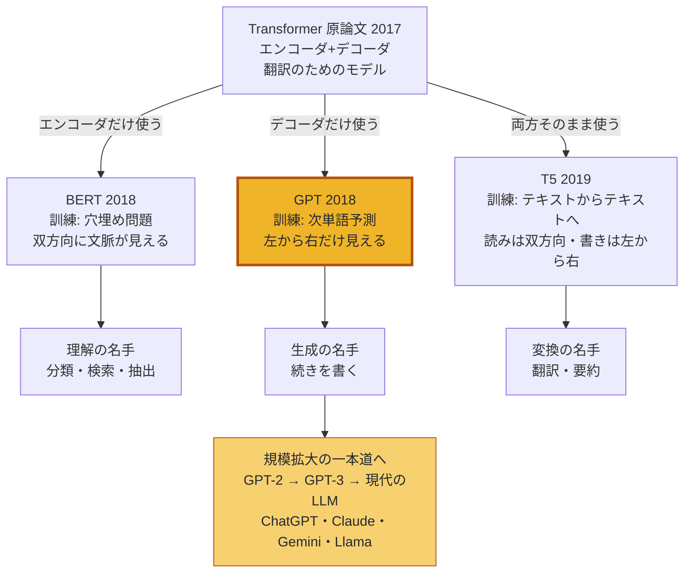
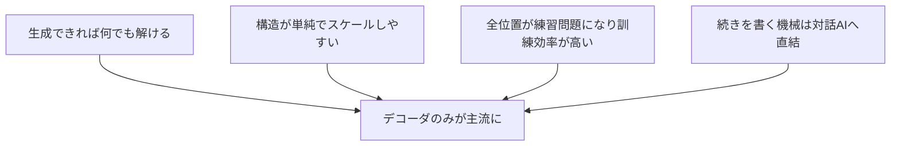

# 第11章 三つの系譜 — BERT・GPT・T5

第9章で学んだTransformerの原論文 "Attention Is All You Need"(2017年)は、**翻訳のための機械**でした。入力文を読み込むエンコーダと、訳文を生み出すデコーダが、cross-attentionで手をつなぐ、あの二階建ての構造です。

ところが、その後の歴史は面白い方向に進みます。研究者たちはこの機械を**分解して**、「エンコーダだけ」「デコーダだけ」「両方そのまま」という3通りの使い方を試したのです。部品の選び方と訓練問題の選び方の組み合わせから、性格のまったく違う3つの系譜(**GPT**、**BERT**、**T5**)が生まれました。

この章はいわば「Transformer家系図」の章です。3系譜それぞれの設計思想を理解すると、「なぜ現代のLLM(ChatGPTやClaude)はほぼ全部デコーダのみなのか」という、現在のAIの姿を決めた大きな問いに答えられるようになります。

## この章で学ぶこと

- 原論文のエンコーダ・デコーダ構造が、3通りの使い方に分かれていった経緯
- **GPT(デコーダのみ)**: 自己回帰・次単語予測で鍛える生成の名手。GPT-1→2→3の規模の変遷
- **BERT(エンコーダのみ)**: **マスク言語モデル**(穴埋め問題)で鍛える理解の名手。双方向に文脈を見られる強みと、生成ができない弱み
- **T5(エンコーダ・デコーダ)**: 「すべてのタスクをテキスト→テキストに」という統一思想
- 3系譜の比較表と系統図
- なぜ現代のLLMは「デコーダのみ」が主流になったのか
- 着地点: **LLM = 巨大なデコーダのみTransformer**

## この章の前提

- [第8章 Attention徹底解説](08-attention.md) — self-attention、**因果マスク**(未来を見せない仕組み)
- [第9章 Transformerの全体像](09-transformer-architecture.md) — エンコーダ・デコーダ構造、cross-attention、出力層
- [第10章 Transformerを訓練する](10-training.md) — 自己教師あり学習、次単語予測、交差エントロピー

---

## 11.1 出発点 — 翻訳機だったTransformer

第9章の復習から始めましょう。2017年の原論文のTransformerは、こういう構造でした。

- **エンコーダ**: 入力文(例:「猫は魚が好き」)の全トークンを、マスクなしのself-attentionで**双方向に**(前からも後ろからも)読み、意味の詰まったベクトル列を作る
- **デコーダ**: 因果マスク付きself-attentionで訳文("Cats like fish")を左から右へ1語ずつ組み立てながら、cross-attentionでエンコーダのベクトル列を参照する

翻訳という仕事には、この二階建てがぴったりでした。「読む係」と「書く係」の分業です。

しかし2018年、研究者たちはあることに気づきます。**この機械の部品は、翻訳以外にも使えるのではないか?** しかも、部品の選び方によって「読む」に特化することも「書く」に特化することもできるのではないか。

こうして、わずか1年半ほどの間に3つの系譜が出そろいます。

| 登場 | モデル | 使った部品 | 訓練問題 |
|---|---|---|---|
| 2018年6月 | **GPT**(OpenAI) | デコーダのみ | 次単語予測 |
| 2018年10月 | **BERT**(Google) | エンコーダのみ | 穴埋め(マスク言語モデル) |
| 2019年10月 | **T5**(Google) | エンコーダ・デコーダ | テキスト→テキスト変換 |

ここで大事な視点を先に述べておきます。3系譜の違いは、突き詰めると次の2点だけです。

1. **どの部品を使うか**(エンコーダ / デコーダ / 両方)
2. **どんな自己教師あり問題で鍛えるか**(次単語予測 / 穴埋め / 変換)

「部品を切り離しても動くの?」と不思議に思うかもしれません。動きます。第9章を思い出すと、エンコーダは「ベクトル列を受け取り、文脈を混ぜ込んだより良いベクトル列を返す」部品、デコーダは「ここまでの列を受け取り、次の1トークンの確率分布を返す」部品でした。どちらも入力と出力がそれ自体で完結しているので、単体でも立派なモデルとして成立するのです。カメラ付き携帯電話からカメラだけを取り出してデジカメとして使い、電話だけを取り出して通話機として使えるようなものです。

そしてこの2つは連動しています。**「各トークンがどの方向を見られるか」が部品で決まり、それに合う訓練問題が決まる**のです。順番に見ていきましょう。

## 11.2 GPT — デコーダのみ: 「続きを書く」に全振りした系譜

### 11.2.1 構造: デコーダからcross-attentionを抜いたもの

**GPT(Generative Pre-trained Transformer)** は、原論文の**デコーダだけ**を取り出したモデルです。ただしエンコーダがいないので、エンコーダを参照するためのcross-attention(第9章)は不要になり、取り除かれます。残るのは、**「因果マスク付きself-attention + FFN(+残差接続とLayerNorm)のブロックを $N$ 層積んだもの」** という、第9章のデコーダよりさらに素直な構造です。重要なのは**因果マスクが残っている**こと。各トークンは自分より左(過去)しか見られません。

構造を1枚の図にしておきましょう。

```text
   出力: 各位置の「次の単語」の確率分布
                ^
                |
        線形層 + softmax(第9章)
                ^
                |
   +---------------------------+
   |  +---------------------+  |
   |  |        FFN          |  |      FFN(+残差・LayerNorm)
   |  |         ^           |  |
   |  |   self-attention    |  |      因果マスク付き(+残差・LayerNorm)
   |  +---------------------+  |
   |            x N            |      同じブロックをただ N 層積むだけ
   |                           |      ※ cross-attention は無い
   +---------------------------+
                ^
                |
    埋め込み + 位置エンコーディング(第6・9章)
                ^
                |
   入力: 猫 は 魚 が 好き
```

エンコーダも、エンコーダにつなぐcross-attentionも無い、「一種類のブロックの積み重ね」。この徹底した単純さが、後で見る「スケールのしやすさ」に効いてきます。

### 11.2.2 訓練: 第10章でやったあれ、そのまま

GPTの訓練問題は **次単語予測** です。……どこかで聞き覚えがありませんか? そうです、**第10章で詳しく学んだ訓練は、実はそのままGPT型モデルの訓練でした**。「猫は魚が」から「好き」を当てる、全位置同時に採点する、損失は交差エントロピーの平均。すべてそのまま当てはまります。

このように「ここまでの列から次の1個を予測し、それを繰り返して列を左から右へ伸ばしていく」方式を **自己回帰(autoregressive)** と呼びます。「回帰」は第4章の予測の意味、「自己」は「自分がこれまで出した(あるいは与えられた)列を、次の予測の入力に使う」の意味です。式で書けば、文全体の確率を

$$
P(w_1, w_2, \dots, w_n) = P(w_1) \times P(w_2 \mid w_1) \times P(w_3 \mid w_1, w_2) \times \cdots \times P(w_n \mid w_1, \dots, w_{n-1})
$$

**読み下し**: 文全体の確率は、「1語目の確率」×「1語目を見たうえでの2語目の確率」×「2語目までを見たうえでの3語目の確率」×……という条件付き確率(第3章)の掛け算に分解できる。GPTはこの掛け算の各因子(次の1語の確率)を担当する。

通し例で確かめます。「猫は魚が好き」なら、

$$
P(\text{猫は魚が好き}) = P(\text{猫}) \times P(\text{は} \mid \text{猫}) \times P(\text{魚} \mid \text{猫は}) \times P(\text{が} \mid \text{猫は魚}) \times P(\text{好き} \mid \text{猫は魚が})
$$

**読み下し**: 5トークンの文の確率は、5つの「次の1語の確率」の積。仮に各確率が $0.1, 0.4, 0.2, 0.5, 0.25$ なら、文全体の確率は $0.1 \times 0.4 \times 0.2 \times 0.5 \times 0.25 = 0.001$ 。

なお、第10章で手に入れた道具はすべてそのまま使えます。損失は各位置の交差エントロピーの平均、成績表はパープレキシティ。「第10章は実質、GPTの訓練の章だった」と言い換えても過言ではありません。

### 11.2.3 「見える方向」を表で確認する

第8章で学んだ因果マスクを、attentionの「見える/見えない」表として再確認しましょう(行が「見る側」、列が「見られる側」。○=見える、×=マスクで遮断)。

| 見る側\見られる側 | 猫 | は | 魚 | が | 好き |
|---|---|---|---|---|---|
| **猫** | ○ | × | × | × | × |
| **は** | ○ | ○ | × | × | × |
| **魚** | ○ | ○ | ○ | × | × |
| **が** | ○ | ○ | ○ | ○ | × |
| **好き** | ○ | ○ | ○ | ○ | ○ |

左下半分だけが○の三角形です。GPTの世界では、時間は常に左から右へしか流れません。

この表は、第8章で学んだ因果マスクの行列(マスクする位置に $-\infty$ を足す、あの仕組み)を「○×」に描き直しただけのものです。系譜どうしを比べるときは、この○×の形(三角形か、正方形か)だけ頭に置いておけば十分です。

### 11.2.4 得意なこと・GPT-1→2→3の系譜

この設計の得意技は当然、**生成**です。次単語予測そのものが「続きを書く」練習なので、訓練済みモデルはそのまま文章生成機として使えます(生成の具体的な手順は第14章で詳しく学びます)。

GPTの系譜は「同じ設計のまま規模だけを拡大する」という、いま振り返れば大胆な一本道を進みました。

| モデル | 年 | パラメータ数 | 特徴 |
|---|---|---|---|
| GPT-1 | 2018 | 約1.2億 | 「事前学習+タスクごとの微調整」の有効性を実証 |
| GPT-2 | 2019 | 約15億 | 微調整なしでも流暢な文章を生成し話題に |
| GPT-3 | 2020 | 約1,750億 | 例を見せるだけでタスクをこなす能力(few-shot)を発見。第12章の主役 |

3世代の歩みを、もう少しだけ順に追っておきましょう。

- **GPT-1(2018)** の主張は「まずラベル無しの大量テキストで**事前学習**し、その後にタスクごとの少量のラベル付きデータで追加訓練(微調整)する」という2段構えでした。ラベル無しデータでの次単語予測が、これほど広いタスクの土台になる。それ自体が当時は発見でした
- **GPT-2(2019)** は同じ設計を約13倍に拡大しました。すると、タスク用の微調整をしていないのに、書き出しを与えるだけで新聞記事風の文章を何段落も破綻なく書き続ける能力が現れます。「悪用が怖いので段階的に公開する」という異例の発表も話題になりました
- **GPT-3(2020)** はさらに約100倍。ここで「例をプロンプトに数個見せるだけで、パラメータを一切更新せずに新しいタスクをこなす」という**few-shot**の能力が確認されます(第12章で詳述)。「規模を上げると量だけでなく質が変わる」ことを世界に印象づけた転換点でした

規模の拡大はパラメータ数だけの話ではありません。訓練データも一緒に増えています(トークン数はおおよその目安です)。

| モデル | 主な訓練データ | データ規模の目安 |
|---|---|---|
| GPT-1 | 書籍コーパス | 約10億トークン |
| GPT-2 | WebText(質の高いWebページを選別したもの) | 約100億トークン |
| GPT-3 | Common Crawl+書籍+Wikipediaなど | 約3,000億トークン |

第10章で学んだとおり、自己教師あり学習ではデータの上限が「人類の書いた文章の総量」まで広がっています。モデルとデータを両輪でどう大きくするか。このバランスの問題は、第13章(Chinchilla則)で主役になります。

GPT-1からGPT-3まで、**構造はほぼ同じで、パラメータ数が約1,500倍**になっています。「大きくしただけ」で何が起きたのか。few-shotの発見は第12章で、規模と賢さの法則は第13章で詳しく扱います。

## 11.3 BERT — エンコーダのみ: 「読んで理解する」に全振りした系譜

### 11.3.1 発想: 未来も見ていいなら、もっと深く読める

GPTの因果マスクには、訓練の都合上やむを得ない「もったいなさ」があります。「猫は魚が好き」の「魚」の意味を考えるとき、GPT型では「猫は」しか見られません。でも人間が文を**読解**するときは、前後の両方を見ますよね。「魚」の後ろに「が好き」が続くと知っていれば、この「魚」は食べ物(えさ)としての魚だと分かります。

**BERT(Bidirectional Encoder Representations from Transformers)** は、この「両方向読み」に振り切ったモデルです。名前のBが **双方向(bidirectional)** のBです。使う部品は原論文の**エンコーダだけ**。エンコーダのself-attentionには因果マスクがないので、全トークンがお互いを自由に見られます。

| 見る側\見られる側 | 猫 | は | 魚 | が | 好き |
|---|---|---|---|---|---|
| **猫** | ○ | ○ | ○ | ○ | ○ |
| **は** | ○ | ○ | ○ | ○ | ○ |
| **魚** | ○ | ○ | ○ | ○ | ○ |
| **が** | ○ | ○ | ○ | ○ | ○ |
| **好き** | ○ | ○ | ○ | ○ | ○ |

GPTの三角形と対照的に、全マスが○です。

### 11.3.2 訓練: マスク言語モデル(穴埋め問題)

ここで問題が生じます。全トークンがお互いを見られるなら、**次単語予測は訓練問題として成立しません**。「猫は」の次を当てさせようにも、モデルは正解の「魚」がもう見えているからです(第10章で学んだ、因果マスクが防いでいたカンニングがまさに起きてしまう)。

BERTの答えは、問題の形を変えることでした。**マスク言語モデル(Masked Language Model, MLM)**、日本語で言えば**穴埋め問題**です。

1. 文からランダムに一部のトークン(BERTでは約15%)を選び、特殊トークン `[MASK]` に置き換える
2. モデルに文全体を読ませ、`[MASK]` の位置に**元々何があったか**を当てさせる

通し例でやってみましょう。

入力: 「猫 は **[MASK]** が 好き」 → 正解: **魚**

このとき当てるべき確率は、

$$
P(w_3 = \text{魚} \mid \text{猫, は, [MASK], が, 好き})
$$

**読み下し**: 「3番目が隠された文全体(前も後ろも!)を見たうえで、隠された単語が『魚』である確率」。GPTの $P(\text{魚} \mid \text{猫, は})$ と見比べると、条件(縦棒の右側)に**未来の『が 好き』まで入っている**のが決定的な違い。

穴の左右両方がヒントになるのがポイントです。「〜が好き」という後ろの文脈が見えるおかげで、`[MASK]` には「魚」「肉」「おもちゃ」のような**好かれる対象**が入ると絞り込めます。仮にモデルが「魚: 0.5、肉: 0.2、犬: 0.05、…」という分布を出し、正解が「魚」なら、損失は第5章・第10章と同じ交差エントロピーで $-\ln 0.5 \approx 0.693$ です。採点の仕組みは3系譜共通で、**変わるのは問題の形だけ**です。

そしてこれも立派な**自己教師あり学習**です(第10章の回収)。穴を開けるのは機械的な操作なので、ラベル付けは不要。Web全体が穴埋めドリルになります。

このときモデルが `[MASK]` の位置に出す確率分布は、たとえばこんな姿をしています(語彙全体にわたる分布のうち上位だけ抜粋)。

| `[MASK]` の候補 | 確率 |
|---|---|
| 魚 | 0.50 |
| 肉 | 0.20 |
| おもちゃ | 0.09 |
| ミルク | 0.07 |
| 犬 | 0.05 |
| (その他の全単語) | 残り0.09を分け合う |

「〜**が好き**」という**右側の文脈**が見えているからこそ、候補が「好かれるもの」に集中する。双方向読みの威力がよく表れています。GPT型が同じ位置を予測するときは「猫は」しか見えないので、分布はもっとぼんやりせざるを得ません。

なお、実際のBERTの訓練には細かい工夫があります。選んだ15%のトークンをすべて `[MASK]` に置き換えるのではなく、そのうち8割だけを `[MASK]` にし、1割はランダムな別の単語に、1割は元の単語のままにして「本当は何だったか」を当てさせます。本番でBERTを使うとき入力に `[MASK]` は現れないため、「マスクが無くても全トークンについて良い表現を作る」練習を混ぜておく、という配慮です(細部まで覚える必要はありません)。

### 11.3.3 得意なこと: 理解タスク。そして決定的にできないこと

双方向読みのBERTは、文の「理解」を問うタスクで当時の記録を総なめにしました。

- **分類**: この映画レビューは肯定的? 否定的?(文全体を読んでから判定)
- **検索**: この質問とこの文書は関係が深い?(Google検索にも導入されました)
- **固有表現抽出**: 文中の人名・地名・組織名はどれ?
- **文の類似度判定**: 2つの文は同じ意味?

使い方の定石も紹介しておきます。BERTでは入力の先頭に `[CLS]` という特殊トークンを付ける約束になっています。文全体を読み終えたあとの `[CLS]` の位置のベクトルは、attentionによって文中の全単語から情報を集めており(第8章)、「文全体の要約ベクトル」として使えます。その上に小さな分類器(第5章で学んだ、重み付き和とsoftmaxの層)を載せて微調整すれば、分類タスクの完成です。

GPTの図(11.2.1)と対にして、BERTの構造も図にしておきます。

```text
   出力の使い方は2通り:
     ・各 [MASK] 位置のベクトル -> 線形層 + softmax -> 「元の単語」の分布
     ・[CLS] 位置のベクトル -> 分類器を載せて「文全体の要約」として利用
                ^
                |
   +---------------------------+
   |   encoder block  x N      |      マスクなし self-attention + FFN
   |                           |      (全トークンが互いに見える)
   +---------------------------+
                ^
                |
    埋め込み + 位置エンコーディング
                ^
                |
   入力: [CLS] 猫 は [MASK] が 好き
```

一方で、BERTには構造上どうしてもできないことがあります。**文章の生成**です。BERTが解けるのは「与えられた文の穴を埋める」ことだけで、「白紙から左から右へ文章を書き続ける」訓練を一切受けていません。次々に単語を継ぎ足す仕組み(自己回帰)を持たないので、「猫について作文して」という依頼には原理的に応えられないのです。

無理にやらせるとどうなるか想像してみましょう。「猫について作文して `[MASK]` `[MASK]` `[MASK]` …」と穴を並べても、BERTの穴埋めは各穴を(他の穴がどう埋まるかを知らずに)ばらばらに予測します。結果は「猫 猫 は は 好き …」のような、つながらない単語の羅列になりがちです。文章を書くには、「すでに決めた単語を踏まえて次の単語を決める」、つまり自己回帰の仕組みがどうしても必要なのです。

代表モデルには、BERT本家のほか、訓練方法を洗練させた **RoBERTa**、構造を改良した **DeBERTa** などがあります。パラメータ数はBERT-baseで約1.1億、BERT-largeで約3.4億と、GPT-3に比べるとずっと小柄です。

もう一つ、当時の使われ方の違いにも触れておきます。BERTが作ったのは「事前学習済みモデルを配布し、使う人がタスクごとに微調整して専用モデルを作る」という文化でした。感情分析用のBERT、検索用のBERT、医療文書用のBERT……と、用途ごとに専用機が量産されたのです。一方、後のGPT-3は「巨大な1つのモデルを、微調整せずプロンプトの工夫だけで何にでも使う」という正反対の路線を示します(第12章)。この「1モデルで何でも」路線が、そのまま現代のLLMの使われ方になりました。

## 11.4 T5 — エンコーダ・デコーダ: 「全部テキスト変換にしてしまえ」という系譜

### 11.4.1 発想: タスクごとの特注をやめる

GPT登場以前・以後を通じて、機械学習では「タスクごとにモデルの頭(出力部分)を付け替える」のが普通でした。分類には分類用の出力層、要約には要約用の仕組み……という具合です。

**T5(Text-to-Text Transfer Transformer)** は、この慣習を根本から見直しました。

> [!IMPORTANT]
> **すべてのタスクは「テキストを入れたらテキストが返る」形に書き直せる。だから、モデルはテキスト→テキスト変換器の1種類だけでいい。**

構造は原論文と同じ**エンコーダ・デコーダ**です。入力テキストをエンコーダが双方向に読み、デコーダが答えのテキストを自己回帰で生成します。タスクの区別は、入力の先頭に付ける「指示の言葉」だけで表します。

| タスク | T5への入力 | T5の出力 |
|---|---|---|
| 翻訳 | `日本語を英語に翻訳: 猫は魚が好き` | `Cats like fish` |
| 感情分類 | `感情を判定: この映画は最高だった` | `肯定的` |
| 要約 | `要約: (長い記事の本文)` | `(短い要約文)` |
| 類似度 | `文の類似度: 文1… 文2…` | `4.2` ←数値さえ文字列で出す |

分類の答えも、類似度のスコアさえも、**すべて「文字列の生成」として出力**する徹底ぶりです。

名前の由来にも触れておきます。T5の2つ目のTである **Transfer(転移)** は、「事前学習で得た力を、別のタスクへ移して使う」という **転移学習(transfer learning)** の考え方から来ています。実は「大量データで事前学習し、目的のタスクで仕上げる」という本章の3系譜すべてに共通する流れが、転移学習の一種です。

### 11.4.2 訓練: スパン穴埋め

T5の事前学習も自己教師ありの穴埋め系ですが、BERTと少し違い、**連続する数トークンの塊(スパン)をまとめて隠し、デコーダに復元させる**方式です。

- 入力(エンコーダへ): 「猫 は **[X]** 好き」
- 出力(デコーダが生成): 「**[X]** 魚 が」(=[X]の中身は「魚 が」でした、と答える)

エンコーダの双方向読解力と、デコーダの生成力を、両方いっぺんに鍛える問題設計になっています。

BERTの穴埋めとの違いは、穴の中身を**書き出させる**点です。BERTは「穴に入る1トークンを当てる」クイズでしたが、T5は「穴に入っていたトークン列を、デコーダで左から右へ生成して復元する」ため、読解と生成の両方に学習信号が流れます。

また、T5の論文はもう一つの意味でも重要でした。構造の選び方・訓練問題の選び方・データの量と質など、当時乱立していた無数の設計の選択肢を、**同じ条件でしらみつぶしに比較実験した「地図」** を残したのです。後続の研究はこの地図の恩恵を大きく受けています。

代表モデルは T5、多言語版の mT5、指示文で微調整した FLAN-T5、類似思想の BART など。T5は最大版で約110億パラメータでした。

## 11.5 三つの系譜を並べる — 比較表と系統図

ここまでの内容を一望します。まず本章の最重要図である系統図を示します。



次に、5つの観点での比較表です。

| 観点 | BERT系 | GPT系 | T5系 |
|---|---|---|---|
| **構造** | エンコーダのみ | デコーダのみ(cross-attentionなし) | エンコーダ・デコーダ |
| **訓練タスク** | マスク言語モデル(穴埋め) | 次単語予測(自己回帰) | スパン穴埋め/テキスト→テキスト変換 |
| **見える方向** | 双方向(全トークンが互いに見える) | 左→右のみ(因果マスク) | 読む側は双方向、書く側は左→右 |
| **得意なこと** | 理解(分類・検索・抽出) | 生成(続きを書く・対話) | 変換(翻訳・要約) |
| **できない/苦手** | 文章の生成 | 訓練時は文の右側の情報を使えない | 構造が複雑になりがち |
| **代表モデル** | BERT、RoBERTa、DeBERTa | GPT-1/2/3/4、Llama、Claude、Gemini | T5、mT5、FLAN-T5、BART |

> [!TIP]
> 覚え方はシンプルです。**BERTは読む人、GPTは書く人、T5は訳す人。**

年表の形でも整理しておきましょう。

```text
2017 --o-- Transformer原論文「Attention Is All You Need」(翻訳用)
       |
2018 --o-- 6月  GPT-1(デコーダのみ・約1.2億)
       |
     --o-- 10月 BERT(エンコーダのみ・最大約3.4億)
       |        -> 理解タスクの記録を総なめに
2019 --o-- 2月  GPT-2(約15億)— 流暢な生成で話題に
       |
     --o-- 10月 T5(最大約110億)— テキスト→テキスト統一
       |
2020 --o-- GPT-3(約1,750億)— few-shotの発見
       |
2022 --o-- ChatGPT — デコーダのみ+対話の仕上げ(第12章)
       |
     --o-- 現在: 主要LLMはほぼすべて「デコーダのみ」の子孫
```

こうして眺めると、2018〜2019年に三つ巴だった時代から、2020年以降は「デコーダのみ」の一人勝ちへと流れが変わっていく様子がよく分かります。

最後に、3系譜が「同じ文のどこを見て、何を予測するか」を通し例で並べます。この1つの表に、本章の違いのすべてが詰まっています。

| | 解く問題 | 見える範囲 | 出力の形 |
|---|---|---|---|
| **GPT** | 「猫 は」の次は? | 「猫 は」(左だけ) | 次の1トークンの分布(魚: 0.2, …) |
| **BERT** | 「猫 は [MASK] が 好き」の穴は? | 文全体(左も右も) | 穴の1トークンの分布(魚: 0.5, …) |
| **T5** | 「猫 は [X] 好き」の [X] は? | エンコーダで文全体 | 「魚 が」というトークン列を生成 |

同じ「魚」を当てる問題でも、GPTの確信度(0.2)よりBERTの確信度(0.5)の方が高くなっています。見える情報が多いぶん、1問あたりの条件は有利だからです。それなのに、なぜ主流はGPT型になったのか。次の節で正面から答えます。

## 11.6 なぜ現代のLLMは「デコーダのみ」が主流になったのか

2018年の時点では、理解タスクの成績はBERTが圧勝でした。それなのに、2020年代のLLM(GPT-4、Claude、Gemini、Llama)はほぼすべてGPT型(デコーダのみ)です。なぜ「書く人」が天下を取ったのでしょうか。理由は大きく4つあります。

### 理由1: 生成できるモデルは、実は何でもできる

分類も検索も要約も、**答えをテキストとして「生成」すれば解けます**。「このレビューは肯定的? 否定的?」と聞かれて「肯定的」と**書けば**いいのです。つまり、

- 生成タスク → GPT型にしか解けない
- 理解タスク → BERT型でも解けるが、GPT型でも「答えを書く」形で解ける

という非対称があります。T5の「すべてはテキスト→テキスト」という考え方は正しかったのですが、皮肉なことに、デコーダのみでもプロンプト(入力文)の中に材料を全部入れてしまえば同じことができると分かってきました。**1つのモデルで全部済むなら、生成できる方を選ぶ**のが自然です。

### 理由2: 構造が単純で、スケールさせやすい

デコーダのみのモデルは「同じブロックをただ積むだけ」の一様な構造です。エンコーダ・デコーダのような二系統の管理も、cross-attentionの接続もありません。単純な構造は、

- 実装と改良がしやすい
- 第10章で見た**モデル並列**などの分散学習と相性が良い
- パラメータを増やす(層を足す・幅を広げる)ときの設計判断が少ない

という利点になります。「とにかく大きくすると賢くなる」というスケーリング則の時代(第13章)には、**大きくしやすい構造であること自体が強み**でした。

### 理由3: 訓練効率 — 全トークンが練習問題になる

第10章で見たとおり、GPT型の次単語予測では**文中のほぼすべての位置が問題として採点されます**(1,000トークンなら999問)。一方BERTのマスク言語モデルで採点されるのは、隠した**約15%のトークンだけ**です。同じ1,000トークンを読ませても、GPT型は999問、BERT型は150問ぶんしか学習信号が得られません。兆トークン規模の訓練では、この学習効率の差が大きく効いてきます。

### 理由4: 事前学習で身につけた能力を、そのまま対話に使える

GPT型の事前学習で身につくのは「続きを書く」能力です。そして対話AIがやっていることも、突き詰めれば「プロンプト(質問)の続きとして答えを書く」ことなので、**事前学習の能力を、仕組みを変えずにそのまま対話に流用できます**。例を見せれば真似をするfew-shot(第12章)も、指示に従う対話AIへの追加訓練(同じく第12章)も、「続きを書く機械」という土台の上にそのまま積み上げられました。一方BERT型は生成ができないため、対話AIにするには仕組みの作り直しが必要になります。

4つの理由を一覧にしておきます。

| # | 理由 | 一言で |
|---|---|---|
| 1 | 生成できれば、理解タスクも「答えを書く」形で解ける | 生成は万能の出力形式 |
| 2 | 同じブロックの積み重ねで、構造の管理が単純 | 単純さはスケールの味方 |
| 3 | ほぼ全トークンが採点対象になる(BERTは約15%のみ) | 同じデータから多く学べる |
| 4 | 「続きを書く」はfew-shot・SFT・対話AIへ直結する | 事前学習の能力をそのまま対話に使える |

まとめると、次の図のようになります。



公平のために付け加えると、**BERT系が消えたわけではありません**。検索エンジンの裏側や、文をベクトル化して類似文書を探す用途(埋め込みモデル)では、双方向で読めるエンコーダ型がいまも現役の主力です。「主流」の座がデコーダのみに移った、というのが正確な理解です。

現在の実務での使い分けも、ざっくり一覧にしておきます。

| やりたいこと | 向いている系譜 | 例 |
|---|---|---|
| 対話・作文・コード生成・要約 | デコーダのみ(GPT型) | ChatGPT、Claude、Gemini |
| 文の意味ベクトル化・類似文書の検索 | エンコーダのみ(BERT型)の子孫 | 各種の埋め込みモデル |
| 定型的な変換(機械翻訳など) | エンコーダ・デコーダ | 専用の翻訳モデル、T5系 |

### 疑問: 双方向で読めるBERTの方が「理解」は上のはずでは?

もっともな疑問です。1つの穴を当てるときの条件だけを比べれば、左右の両方が見えるBERTの方が確かに有利でした(11.5節の表で、同じ「魚」への確信度が0.5対0.2だったとおりです)。

しかし、対話AIの実際の使われ方を思い出してください。モデルが答えを書き始める時点では、あなたの質問文全体がすでにプロンプトとして入力済みです。因果マスクの下でも、生成される答えの各トークンは**質問文の全トークンを参照できます**。質問はすべて「過去」の側にあるからです。つまり「質問を読み終えてから答える」という使い方では、左→右の制約は実質的な足かせになりません。制約が効くのは入力文の内部で表現を作る過程だけで、それも層の深さとモデルの規模で十分に補えることが、経験的に分かってきました。

## 11.7 着地 — LLMとは「巨大なデコーダのみTransformer」である

本章の結論を一行にまとめます。

> [!IMPORTANT]
> **LLM(大規模言語モデル)とは、デコーダのみのTransformerを巨大化し、兆トークンの次単語予測で訓練したものである。**

この一行は、本書のここまでの内容の集大成です。分解してみましょう。

- 「デコーダのみのTransformer」 = 因果マスク付きself-attention(第8章)+ FFN・残差接続・LayerNorm(第9章)のブロックの積み重ね
- 「巨大化」 = 第9章で数えたパラメータを数百億〜数兆個に増やす(その意味は第13章)
- 「兆トークンの次単語予測で訓練」 = 第10章の自己教師あり学習そのもの

ChatGPTの中身(GPT-4など)も、Claudeも、Geminiも、Llamaも、細部の改良(第15章で学びます)を除けば、この一行の説明から外れません。あなたはもう、現代AIの主役の正体を、部品レベルから説明できる地点に立っています。

### 11.7.1 よくある疑問

本章の内容には、鋭い読者ほど引っかかる点がいくつかあります。まとめて答えておきましょう。

**Q: 対話AIは入力を「読む」必要があるのに、なぜ読む専門のエンコーダが要らないの?**
A: デコーダのみのモデルでも、あなたの発言はプロンプトとしてモデルの「過去」に置かれ、生成される各トークンはattentionでプロンプト全体を参照できます(11.6節の「疑問」で述べたとおりです)。つまり「読む」仕事は、因果マスク付きself-attentionが兼任しています。専任の読み係がいなくても、会話の文脈は読めるのです。

**Q: GPTの因果マスクは、訓練が終わったら外してもいい?**
A: 外せません。訓練中のモデルは「左だけを見て次を当てる」前提でパラメータを最適化しています。本番でマスクを外すと、訓練時と見え方が変わってしまい、動作が壊れます。そもそも生成時は1トークンずつ左から右へ作るので、参照すべき「未来」がまだ存在しません。訓練と本番の条件を揃えることが大切です。

**Q: BERTとGPTの「良いとこ取り」はできないの?**
A: それがまさにT5(やBART)の発想でした。エンコーダで双方向に読み、デコーダで生成する。設計として筋は良かったのですが、本章で見たとおり、規模を極端に大きくする競争では、より単純なデコーダのみが勝ち残りました。

**Q: では、T5の路線は「負けた」の?**
A: 負けたというより、**思想が吸収された**と言うべきでしょう。「すべてのタスクをテキストで統一する」というT5の考え方は、プロンプトひとつで何でも指示する現代LLMの使い方そのものに受け継がれています。FLAN-T5のように現役で使われるモデルも残っています。

なお、ここから先の章(第12章〜第15章)では、特に断らない限り「LLM」は**デコーダのみのTransformer**を指すものとして話を進めます。

ただし、大きな謎が残っています。第10章と本章で作った「事前学習済みの巨大GPT」は、あくまで**次の単語を予測する機械**です。それがなぜ、質問に答え、指示に従い、対話までできるのでしょうか? 実は、**そのままでは、できない**のです。

---

## この章のまとめ

- 2017年の原論文(エンコーダ・デコーダ、翻訳用)から、**部品の選び方**と**訓練問題の選び方**の組み合わせで3つの系譜が生まれた
- **GPT(デコーダのみ)**: 因果マスクで左→右だけを見ながら**次単語予測**で訓練する**自己回帰**モデル。生成の名手。GPT-1(1.2億)→GPT-2(15億)→GPT-3(1,750億)と、ほぼ同じ構造のまま規模を拡大した
- **BERT(エンコーダのみ)**: マスクを外して**双方向**に読み、**マスク言語モデル(穴埋め)** で訓練。「猫は[MASK]が好き」→「魚」。理解タスク(分類・検索・抽出)の名手だが、構造上**生成はできない**
- **T5(エンコーダ・デコーダ)**: 「**すべてのタスクをテキスト→テキストに**」という統一思想。翻訳も分類も要約も、答えを文字列として生成する
- T5の名前の由来である**転移学習**(事前学習で得た力を別のタスクへ移して使う)は、実は3系譜すべてに共通する土台の考え方である
- デコーダのみが主流になった理由: ①生成できれば理解タスクも解ける ②構造が単純でスケールしやすい ③全位置が練習問題になり訓練効率が高い ④「続きを書く機械」は対話AIに直結する
- BERT系は消えたのではなく、埋め込み・検索の分野で現役。実務では「生成はGPT型、検索はBERT型の子孫、定型変換はエンコーダ・デコーダ」と使い分けられている
- 着地: **LLM = 巨大なデコーダのみTransformer + 兆トークンの次単語予測**。ChatGPTもClaudeもこの子孫である

## 次の章へ

事前学習を終えたLLMは、しかしまだ「賢い続き書き機械」にすぎません。質問をすると質問で返してくることさえあります。この機械が、どうやって「指示に従い、対話できるAIアシスタント」に生まれ変わるのか。few-shotの発見、指示チューニング(SFT)、そして人間の好みを教え込むRLHFという仕上げの工程を見ていきます。

→ [第12章 LLMから対話AIへ — 微調整とRLHF](12-from-llm-to-chat-ai.md)
