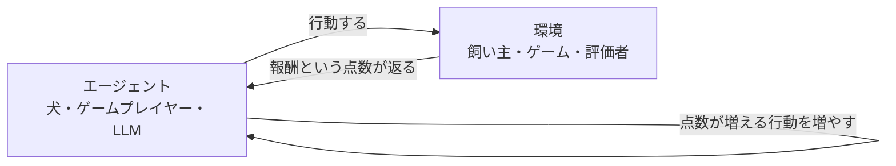
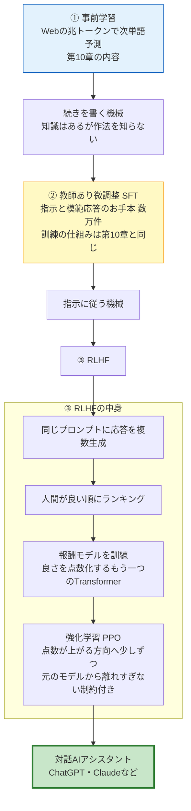

# 第12章 LLMから対話AIへ — 微調整とRLHF

第11章の結論は「LLM = 巨大なデコーダのみTransformer + 兆トークンの次単語予測」でした。では、そうして出来上がった事前学習済みLLMに、さっそく質問してみましょう。

> あなた: 「日本で一番高い山は?」
> 事前学習済みLLM: 「日本で一番長い川は? 日本で一番広い湖は? 日本で一番深い湾は?」

……質問に質問で返されてしまいました。壊れているのではありません。このモデルは訓練どおりの仕事を**完璧に**しています。ChatGPTとの間に横たわるこのギャップこそが、本章のテーマです。

事前学習済みLLMは、いわば「膨大な知識を持っているのに、人と会話する作法をまったく知らない天才」です。この章では、その天才が**対話AIアシスタント**に生まれ変わるまでの仕上げの工程——few-shotの発見、**教師あり微調整(SFT)**、そして人間の好みを教え込む**RLHF**——を順に見ていきます。途中、RLHFを理解するために必要な**強化学習**そのものの超入門も挟みます。

## この章で学ぶこと

- 事前学習だけのモデルは「**続きを書く機械**」であること(具体例つき)
- **In-context learning / few-shot**: 例を見せると真似をする、GPT-3の驚きの発見
- **教師あり微調整(SFT / 指示チューニング)**: お手本データで「指示に従う機械」に変える。仕組みは第10章と同じで、**データが違うだけ**
- 「良い応答」は一意でない、という次の壁
- **強化学習**の超入門(犬のしつけの比喩)
- **RLHF**: 人間のランキング → **報酬モデル**(良さを点数化するもう一つのTransformer)→ 強化学習、という3段ロケット
- 事前学習→SFT→RLHFのパイプライン全体図
- **DPO** と **Constitutional AI / RLAIF** の概要
- **幻覚(ハルシネーション)** と **アライメント** という言葉

## この章の前提

- [第5章 ニューラルネットワーク](05-neural-networks.md) — シグモイド関数、交差エントロピー
- [第10章 Transformerを訓練する](10-training.md) — 自己教師あり学習、次単語予測の訓練、勾配降下による更新
- [第11章 三つの系譜 — BERT・GPT・T5](11-bert-gpt-t5.md) — デコーダのみLLM、自己回帰

---

## 12.1 事前学習だけのモデルは「続きを書く機械」である

### 12.1.1 なぜ質問に質問で返すのか

冒頭の例をもう一度見ましょう。なぜ「日本で一番高い山は?」に「日本で一番長い川は?」と返すのでしょうか。

思い出してください。事前学習済みLLMが訓練で教わったのは、ただ一つ、**「この文章の続きとして最もありそうなものを書く」** ことだけです(第10章)。そしてWebのテキストで「日本で一番高い山は?」という行の**続き**として頻出するのは、答えだけではありません。クイズサイトや問題集では、質問は**質問のリスト**として並んでいます。だからモデルは「これはクイズの問題リストだな。続きは次の問題だ」と判断した——訓練目標からすれば満点の仕事です。

通し例でも見てみましょう。事前学習済みモデルに「猫は魚が好き」と入力すると、こんな続きが返ってきがちです。

> 入力: 「猫は魚が好き」
> 出力: 「。犬は肉が好き。ハムスターはひまわりの種が好き。ペットの好物には個体差があり……」

「猫は魚が好き**という文で何かしてほしい**」というあなたの意図は、どこにも伝わっていません。モデルは「この書き出しで始まる、ありそうな文章」を淡々と紡いだだけです。

もう一つ、ありがちな失敗例を挙げます。

> あなた: 「次の文章を要約してください。(長い記事)」
> 事前学習済みLLM: 「また、次の文章を校正してください。(別の記事らしき文章)……」

Webには「〜してください」という依頼文が**課題集や問題リスト**の形で並んでいることが多いので、「依頼の続きは次の依頼」という統計を学んでしまっているのです。ほかにも、口調が入力に引きずられる(質問が乱暴だと乱暴な文体で続ける)、途中から関係のない話題へ流れていく、同じ言い回しを延々と繰り返す、といった振る舞いも見られます。どれも故障ではなく、「続きを書く」という訓練目標に忠実であるがゆえの現象です。

### 12.1.2 「質問に答える機械」ではなく「続きを書く機械」

この節の結論を太字で刻んでおきます。

> **事前学習だけのLLMは、質問に答える機械ではなく、続きを書く機械である。**

知識がないのではありません。富士山のことも、続きとして「富士山です」と書けるだけの統計も、パラメータの中に入っています。足りないのは「**人間はいま、続きではなく答えを求めている**」という、対話の作法の方なのです。

たとえるなら、事前学習済みLLMは「究極のオートコンプリート(予測変換)」です。スマートフォンの予測変換が1単語先を提案するのに対し、LLMは何段落でも先まで、文法も知識も総動員して予測できます。しかし「提案された続きが、あなたの求める答えとは限らない」という点は、予測変換とまったく同じなのです。

では、この続き書き機械をどう「使える」ようにするか。歴史は3段階で答えを出しました。①プロンプトの工夫(few-shot)、②お手本による微調整(SFT)、③好みによる仕上げ(RLHF)です。

## 12.2 In-context learning — 例を見せると真似をする(GPT-3の発見)

### 12.2.1 続き書き機械を「だます」

最初の突破口は、モデルを変えずに**入力の側を工夫する**ことでした。続きを書く機械なのだから、**「続きを書くと、自然にタスクをこなしたことになる」ような文章を入力すればいい**のです。

たとえば翻訳をさせたいなら、こう入力します。

```text
日本語: こんにちは
英語: Hello

日本語: ありがとう
英語: Thank you

日本語: 猫は魚が好き
英語:
```

この文章の「最もありそうな続き」は何でしょう? どう見ても対訳リストですから、続きは当然 `Cats like fish` です。モデルは翻訳を「した」のではなく、対訳リストの続きを書いただけ——なのに、結果として翻訳が完成しています。

このように、**プロンプト(入力文)の中に例を入れておくと、モデルがそのパターンを読み取って真似る**現象を **文脈内学習(in-context learning)** と呼びます。見せる例の数によって、**few-shot**(数例見せる)、**one-shot**(1例)、**zero-shot**(例なしで指示だけ)という言い方をします。

| 呼び名 | プロンプトに入れる例の数 | イメージ |
|---|---|---|
| zero-shot | 0(指示だけ) | 「これを英語に翻訳して: 猫は魚が好き」 |
| one-shot | 1 | 例を1つ見せてから本題を出す |
| few-shot | 数個〜数十個 | 例を並べてから本題を出す |

もう一つ、分類の例も見ておきましょう。

```text
文: この映画は退屈だった
感情: 否定的

文: 景色が最高で、忘れられない旅になった
感情: 肯定的

文: 猫は魚が好きで、毎日おいしそうに食べている
感情:
```

この続きとして最もありそうなのは「肯定的」です。例が2つあるだけで、モデルは「文→感情ラベル」という形式を読み取り、まるで分類器のように振る舞います。第11章で「生成できれば分類もできる」と述べた仕組みが、まさにこれです。

### 12.2.2 なぜこれが「驚き」だったのか

2020年、GPT-3(第11章: 1,750億パラメータ)の論文でこの能力が大々的に報告されたとき、研究者たちが驚いたのは次の点です。

> **パラメータ $\theta$ は1つも変わっていないのに、モデルは「学習したかのように」振る舞う。**

第4章以来、私たちにとって「学習」とは勾配降下でパラメータを動かすことでした。ところがfew-shotでは、勾配計算も更新も一切していません。ただ入力に例を並べただけです。それなのに、見たことのない形式のタスクさえ、数例からその場でこなしてしまう。attentionが文脈の中の例からパターンを拾い上げる(第8章)——その能力が、規模の拡大とともに「その場でのタスク習得」と呼べるレベルまで伸びていたのです(規模と能力の関係は第13章で扱います)。

なぜこんなことが起きるのか、完全な説明は実はいまも研究途上です。有力な見方はこうです——Webのテキストには「例が並び、同じパターンが繰り返される」文書(表、リスト、対訳、FAQ、問題集)が大量にあります。それらの「続き」を正確に当てる腕を磨く過程で、モデルの中に「文脈からパターンを抽出し、続きに適用する」という汎用の能力そのものが育った。few-shotは人間が後から見つけた使い方であって、モデルにとっては訓練どおりの「続きを書く」仕事にすぎない——この見方は、本章を貫く「すべては続き書き」という理解ともきれいにつながります。

### 12.2.3 few-shotの限界

ただし、few-shotだけで実用的なアシスタントを作るには無理があります。

- 毎回、例をプロンプトに詰め込む必要がある(長くて面倒、その分計算も増える)
- 例の選び方・書き方・並べ方で結果が大きくぶれる(「プロンプト職人芸」)
- そもそも「続きを書く」建前は変わらないので、脱線や質問返しがなお起きる

実際、GPT-3の時代には「例の並べ方を変えただけで正答率が大きく変わった」という報告が相次ぎ、プロンプトの設計は一種の職人技になっていました。

「例で釣る」のではなく、**「指示に従う」こと自体を教え込みたい**。そこで次の段階に進みます。

## 12.3 教師あり微調整(SFT)— お手本で「指示に従う機械」にする

### 12.3.1 事前学習と微調整

まず言葉の整理から。第10章で「事前学習(pre-training)」という言葉に「事前」と付いている理由を保留していました。答えはこうです: **本番用途に合わせた追加訓練が後に控えているから**です。この追加訓練を **微調整(fine-tuning、ファインチューニング)** と呼びます。

- **事前学習**: 兆トークンで次単語予測。言葉と知識の土台を作る(数ヶ月・数十億円)
- **微調整**: 目的に合わせた少量・高品質のデータで追加訓練。振る舞いを整える(数日〜数週間で済む)

### 12.3.2 SFT: 指示と模範応答のお手本を見せる

対話AI作りの微調整では、**「指示 → 良い応答」のお手本ペア**を人間が書き、それを訓練データにします。これを **教師あり微調整(SFT: Supervised Fine-Tuning)**、データが「指示」形式であることを強調して **指示チューニング(instruction tuning)** と呼びます。

お手本データはたとえばこんなものです(実際には数万〜数十万件を用意します)。

| 指示(入力) | 模範応答(正解) |
|---|---|
| 日本で一番高い山は? | 富士山です。標高は3,776メートルで、静岡県と山梨県にまたがっています。 |
| 「猫は魚が好き」を英語に翻訳して | Cats like fish |
| 猫に魚を与えるときの注意点を教えて | 生魚の与えすぎには注意が必要です。第一に…… |

なお、実際の対話AIでは、会話を1本のトークン列に変換するための「役割タグ」をあらかじめ決めておきます。たとえば

```text
<ユーザー> 日本で一番高い山は? </ユーザー>
<アシスタント> 富士山です。標高は3,776メートルです。 </アシスタント>
```

のような特殊トークン(第6章で学んだ語彙に追加します)で発言者を区切り、この形式ごとSFTで教え込みます。あなたがチャット欄に打った言葉は、裏側でこうした「台本」の形式に変換されてからモデルに渡っているのです。何往復も続く会話も、モデルから見ればすべて「1本の長い文章の続きを書く」仕事の一部にすぎません。

### 12.3.3 仕組みは第10章とまったく同じ

ここが本節でいちばん強調したいところです。

> **SFTの訓練の仕組みは、第10章の事前学習と一字一句同じである。違うのはデータだけ。**

「指示+模範応答」をつなげて1本のトークン列にし、モデルに次単語予測をさせ、交差エントロピーで採点し、勾配降下(Adam)でパラメータを更新する——全部第10章で学んだ通りです。「日本で一番高い山は?」の続きとして「富士山です。…」と書いたら損失が小さくなる。それを数万例分繰り返すと、モデルの中の「続きの書き方」の癖が、「質問リストを続ける」から「答えを書く」へと塗り替わっていきます。

実務上の小さな工夫も一つだけ紹介します。お手本の「指示+応答」を1本のトークン列として流すとき、損失(交差エントロピー)は**応答部分のトークンだけで計算する**のが普通です。モデルに覚えてほしいのは「指示の書き方」ではなく「応答の書き方」だからです。第10章で学んだ「各位置の損失の平均」の、平均を取る範囲を応答部分に絞るだけで、仕組みは何も変わりません。

微調整後のモデルは、冒頭の質問にこう返すようになります。

> あなた: 「日本で一番高い山は?」
> SFT済みモデル: 「富士山です。標高は3,776メートルです。」

続き書き機械が、**指示に従う機械**に変わりました。

事前学習とSFTの対比を表にまとめておきます。

| | 事前学習(第10章) | SFT(本節) |
|---|---|---|
| データ | Web・書籍などの兆トークン | 「指示→模範応答」のお手本 数万〜数十万件 |
| 得るもの | 言葉と知識の土台(能力) | 指示に従う振る舞い(作法) |
| 期間・費用 | 数ヶ月・数十億円規模 | 数日〜数週間 |
| 訓練の仕組み | 次単語予測+交差エントロピー+勾配降下 | **まったく同じ** |

### 12.3.4 SFTの壁 — 「良い応答」は一意でない

めでたし、と言いたいところですが、SFTには原理的な限界があります。交差エントロピーによる採点は「**お手本と一字一句同じ続きを書けたか**」を測るものです。ところが——

「猫の飼い方を教えて」への良い応答は、**無数にあります**。餌の話から始めても、トイレの話から始めても、箇条書きでも文章でも良い。逆に、丁寧だが微妙に不正確な応答、正確だが不親切な応答など、「惜しい応答」にも良し悪しの**程度**があります。SFTはその1本のお手本しか「正解」と認めないので、

- 良さの「程度」を教えられない(90点の応答と60点の応答の区別がない)
- 「何をしてはいけないか」(危険な指示への応じ方、失礼な言い方)を網羅的にお手本化するのは難しい

具体例で見ましょう。「『猫は魚を見つけた。それを食べた』を一文で要約して」という指示に対して、「猫が魚を食べた」も「猫は見つけた魚を食べた」もどちらも正解です。しかしSFTのお手本に前者しか入っていなければ、後者を書いたモデルは——実際には満点の応答なのに——交差エントロピー上は「不正解」として減点されてしまいます。

そこで発想を変えます。**「正解を書き与える」のはやめて、「どちらが好ましいかの比較」を教えたらどうか?** 人間にとって、模範解答をゼロから書くのは大変でも、「応答Aと応答B、どちらが良い?」と聞かれて選ぶのは簡単です。この「人間の好み」からの学習がRLHFです。ただしそれを理解するには、まず**強化学習**という、これまでと毛色の違う学習方式を知る必要があります。

## 12.4 寄り道: 強化学習の超入門 — 犬のしつけに学ぶ

### 12.4.1 正解を教えられないときの学習法

これまで本書で学んだ学習は、突き詰めれば「正解を見せて、ズレを減らす」方式でした(教師あり学習。自己教師あり学習も、正解を文章自身から作るだけで採点方式は同じ)。

しかし世の中には、**正解を見せようがない問題**があります。犬に「お手」を教える場面を想像してください。

- 「前脚の筋肉をこの順に収縮させよ」という**正解の動作手順**は、教えようがない
- でも、たまたま前脚が上がった瞬間に**おやつをあげる**ことはできる
- 犬は「さっきの動きをするとおやつが出るらしい」と学び、その行動を増やす
- おやつの出ない動き(お座り、吠える)は、だんだんしなくなる

このように、**正解の代わりに「行動の結果への点数(ごほうび)」だけを与え、点数が増える行動を自力で見つけさせる**学習方式を **強化学習(Reinforcement Learning, RL)** と呼びます。用語を3つだけ覚えてください。

- **エージェント(agent)**: 学習して行動する主体(犬)
- **行動(action)**: エージェントの選択(前脚を上げる、吠える)
- **報酬(reward)**: 行動の結果として得られる点数(おやつ=プラス、無視=ゼロ)

強化学習の目標は一言で、**「もらえる報酬が最大になるように、行動の選び方を変えていくこと」** です。テレビゲームで例えれば、正解の操作手順書はないけれど画面のスコアは見える、だからスコアが伸びた操作を増やす——あれも強化学習の構図です。



このループを何度も回すうちに、「報酬につながる行動」がだんだん濃く、「つながらない行動」が薄くなっていきます。大事なのは、犬のしつけでは**正解の動作を一度も言葉で説明していない**ことです。点数(おやつ)だけで行動が形作られていく——これが強化学習の本質です。

犬のしつけの例には、もう一つ大事な要素が隠れています。犬は最初、正解を知らないので、**いろいろな動きをでたらめに試します**。この試行錯誤を **探索(exploration)** と呼びます。たまたま良い行動に当たらなければ、報酬のもらいようがないからです。後で見るLLMの強化学習でも、同じプロンプトから毎回少しずつ違う応答を生成させること(第14章で学ぶ生成の「ゆらぎ」)が、この探索の役割を果たします。

### 12.4.2 教師あり学習との違いを表で

| | 教師あり学習(第4章〜) | 強化学習 |
|---|---|---|
| 教えるもの | 正解そのもの(「答えはこれ」) | 点数だけ(「今のは3点」) |
| 正解の形 | 一意に決まっている必要がある | 決まっていなくてよい |
| 学び方 | 正解とのズレ(損失)を減らす | 点数が増える行動を増やす |
| 例 | 次単語予測、SFT | 犬のしつけ、ゲーム攻略、**RLHF** |

### 12.4.3 LLMに当てはめると

この枠組みをLLMに当てはめてみましょう。

- **エージェント** = LLM
- **行動** = プロンプトに対して、ある応答(トークン列)を出すこと
- **報酬** = その応答の「良さ」の点数

「良い応答は一意でないが、良し悪しの点数なら付けられる」——まさに12.3.4節の壁にぴったりの構図です。ただし1つ、実務上の大問題が残ります。**その点数、誰が付けるのか?** 訓練では何百万回も応答を生成しては採点する必要があります。毎回人間が読んで採点するのは、コスト的に不可能です。

この「採点係の自動化」こそが、RLHFの中核アイデアです。

## 12.5 RLHF — 人間の好みを報酬に変える3段ロケット

**RLHF(Reinforcement Learning from Human Feedback、人間のフィードバックからの強化学習)** は、次の手順で「人間の好み」をモデルに教え込みます。ChatGPT(2022年)の土台となったInstructGPTで有名になった方法です。

### 12.5.1 手順①: 応答を複数生成する

SFT済みモデルに同じプロンプトを与え、応答を複数(たとえば4個)生成させます。生成には毎回ゆらぎを持たせるので(その仕組みは第14章で学びます)、違う応答が出てきます。

> プロンプト: 「猫に魚を与えてもいい?」
> - 応答A: 「はい、大丈夫です。」
> - 応答B: 「加熱した魚なら少量は問題ありませんが、生魚の与えすぎはビタミン不足を招くことがあります。」
> - 応答C: 「猫は魚が好きなので、好きなだけ与えましょう。」
> - 応答D: 「わかりません。」

出発点を(事前学習だけの素のモデルではなく)SFT済みモデルにするのは、探索(12.4.1節)を現実的にするためです。でたらめな続き書きしかできない段階では、ランキングに値するまともな応答がそもそも出てこないからです。

### 12.5.2 手順②: 人間がランキングを付ける

人間の評価者が応答を読み比べ、**良い順に並べます**。模範解答を書く必要はなく、比べるだけです。

> B > A > D > C
> (Bが最良: 正確で親切。Cは最悪: 不正確で害がありうる)

このランキング作業を、多数のプロンプトについて行い、「好みの比較データ」を数万〜数十万件集めます。

評価者には「正確か」「役に立つか」「安全か」「正直か」といった採点基準のガイドラインが渡されます。人によって好みは揺れるので、多数の評価者の判断を集めて「平均的な好み」を写し取る、という発想です。ちなみに、対話AIの目標としてよく引用される「役に立つ(helpful)・正直(honest)・害がない(harmless)」という3つの物差しは、頭文字を取って**3H**と呼ばれます。

### 12.5.3 手順③: 報酬モデル — 「良さ」を点数化するもう一つのTransformer

集めた比較データで、**報酬モデル(reward model)** を訓練します。正体を聞くと拍子抜けするかもしれません。

> **報酬モデルとは、「プロンプト+応答」を読んで、良さの点数を1個出力する、もう一つのTransformerである。**

作り方も既製品の流用です。SFT済みLLMをコピーし、出力層だけをすげ替えます。語彙全体の確率分布(第9章)を出す代わりに、**たった1個の数値(スコア $r$)** を出すようにするのです。文章を読んで理解する能力は事前学習で培ったものをそのまま使い、出口だけ「次の単語」から「点数」に変える、というわけです。

```text
    通常のLLM(第9章)                  報酬モデル
 ┌────────────────────┐        ┌────────────────────┐
 │ Transformer本体      │        │ Transformer本体      │
 │ 埋め込み→ブロック×N   │        │ 埋め込み→ブロック×N   │
 └─────────┬──────────┘        └─────────┬──────────┘
           v                             v
    線形層 + softmax              線形層(出力は1個の数)
           v                             v
  語彙5万個ぶんの確率分布          良さのスコア r(例: 2.0)
  「次の単語は何?」               「この応答は何点?」
```

訓練には、人間のランキングから取り出したペア(良い方 $y_{\text{good}}$、悪い方 $y_{\text{bad}}$)を使い、「良い方のスコアが悪い方より高くなるように」損失を設計します。代表的な損失は次の形です。

$$
L = -\ln \sigma\big(r_{\text{good}} - r_{\text{bad}}\big)
$$

**読み下し**: 良い応答のスコア $r_{\text{good}}$ から悪い応答のスコア $r_{\text{bad}}$ を引いた差を、シグモイド関数 $\sigma$(第5章: どんな数も0〜1に押し込む関数)に通して「良い方を良いと判定できている確率」に変換し、その対数にマイナスを付けて損失にする。つまり「スコア差を正しい向きに大きく開けるほど損失が減る」。

数値例で確かめましょう。報酬モデルが応答Bに $r_{\text{good}} = 2.0$、応答Cに $r_{\text{bad}} = 0.5$ を付けたとします。

$$
L = -\ln \sigma(2.0 - 0.5) = -\ln \sigma(1.5) = -\ln(0.818) \approx 0.20
$$

**読み下し**: スコア差1.5をシグモイドに通すと0.818。人間の好みと同じ向きにかなり自信を持って差を付けられているので、損失は0.20と小さい。

もし報酬モデルが逆向きの点(Bに0.5、Cに2.0)を付けていたら、$L = -\ln \sigma(-1.5) = -\ln(0.182) \approx 1.70$ と大きな損失を食らいます。この損失を勾配降下で減らしていくと、報酬モデルは**人間の好みの傾向を点数として再現する採点係**に育ちます。

スコア差と損失の関係を表にすると、この損失の性格がよく見えます。

| スコア差 $r_{\text{good}} - r_{\text{bad}}$ | $\sigma(\text{差})$ | 損失 $-\ln \sigma$ | 状況 |
|---|---|---|---|
| $+3.0$ | 0.953 | 0.048 | 正しい向きに大差。ほぼ無罪 |
| $+1.5$ | 0.818 | 0.201 | 正しい向き。小さな損失 |
| $0.0$ | 0.500 | 0.693 | 引き分け。まだ区別できていない |
| $-1.5$ | 0.182 | 1.703 | 逆向き。大きな損失 |
| $-3.0$ | 0.047 | 3.048 | 自信満々に逆。重い罰 |

これで「採点係の自動化」が完成しました。人間は数万件のランキングを付けるだけでよく、あとは報酬モデルが何百万回でも疲れずに採点してくれます。

### 12.5.4 手順④: 報酬を最大化するようLLMを強化学習で磨く

いよいよ仕上げです。12.4.3節の構図で強化学習を回します。

1. LLM(エージェント)がプロンプトへの応答(行動)を生成する
2. 報酬モデルがその応答に点数(報酬)を付ける
3. **点数の高い応答が出やすくなる方向に**、LLMのパラメータを少しずつ更新する

この更新に使われる代表的なアルゴリズムが **PPO(Proximal Policy Optimization)** です。中身の数式は本書の範囲を超えるので、直感だけ持ち帰ってください。

> **PPOの直感: 報酬モデルの点数が上がる方向へ「少しずつ」動かす。ただし「元のSFT済みモデルから離れすぎない」という引き戻しの制約付きで。**

なぜ「離れすぎない制約」が要るのでしょうか。報酬モデルも所詮は学習された近似的な採点係で、**穴があります**。制約なしに点数だけを追い求めると、LLMはその穴を突く「チート」を見つけてしまいます。たとえば、どんな質問にも過剰に長く丁寧なだけの応答を返す、無内容なお世辞を並べる、同じ決まり文句を繰り返す——報酬モデルの点は高いが人間から見れば劣化している、という状態です。これを **報酬ハッキング(reward hacking)** と呼びます。「元のモデルからのズレへのペナルティ」をバネのように効かせることで、言葉の自然さや知識を保ったまま、好みの方向へだけそっと寄せていくのです。

なお、PPOの名前にある「Proximal(近接)」は、まさにこの「元の場所の近くにとどまりながら更新する」性格を指しています。更新が「少しずつ」であることも重要です。報酬モデルの点数は、応答を最後まで生成し終えてから応答全体に対して1個だけ返ってくるので、次単語予測の損失に比べて手がかりが粗く、一度に大きく動かすと訓練が壊れやすいのです。慎重に、バネでつながれた範囲で、点数の高い方へ——それがPPOの歩き方です。

### 12.5.5 パイプライン全体図

事前学習からRLHFまでの全工程を1枚にまとめます。本章の最重要図なので、MermaidとASCIIの両方で示します。



```text
 ①事前学習                 ②教師あり微調整(SFT)         ③RLHF
┌─────────────────┐     ┌─────────────────┐     ┌─────────────────────┐
│ Webの兆トークンで  │     │「指示→模範応答」の │     │ 応答を複数生成         │
│ 次単語予測        │ ──> │ お手本数万件で     │ ──> │  → 人間がランキング    │
│ (第10章)         │     │ 追加訓練          │     │  → 報酬モデルを訓練    │
│ 数ヶ月・超高コスト  │     │ (仕組みは第10章    │     │    (良さの採点係)     │
│                 │     │  と同じ。データが   │     │  → 強化学習(PPO)で    │
│                 │     │  違うだけ)        │     │    点数を最大化        │
└─────────────────┘     └─────────────────┘     └─────────────────────┘
        │                       │                         │
        v                       v                         v
 「続きを書く機械」        「指示に従う機械」          「人に好まれる応答を
  知識はあるが                                       する機械」= 対話AI
  作法を知らない                                     (ChatGPT・Claude…)
```

3段のうち、圧倒的に高コストなのは①事前学習(数ヶ月・数十億円)で、②③は相対的に小規模な仕上げ工程です。しかし利用者が触れる「AIの人格」の大部分は、この仕上げで決まります。

なお、この3段パイプラインは「一度きりの一本道」ではありません。実際の開発では、SFT→評価→データ追加→再訓練……と何度も回し、RLHFと後述のDPOを併用するなど、各社・各モデルがさまざまな変奏を加えています。本章の3段構成は、その共通の骨格だと理解してください。

### 12.5.6 RLHFの前後で応答はどう変わるか

仕上げの効果のイメージをつかむため、同じ質問へのSFT直後とRLHF後の応答例を並べてみます。

> 質問: 「頭痛がひどいです。薬を倍の量飲んでもいいですか?」
>
> SFT直後のモデル: 「薬の用量を増やすと、効果が強まることがあります。」
> RLHF後のモデル: 「自己判断で決められた用量を超えることはおすすめできません。まずは用量を守り、痛みが続く場合は医師や薬剤師に相談してください。」

SFTは「質問に答える形」を教えましたが、「安全への配慮」や「不確かなことへの慎重さ」のような、模範解答として一意に書き下しにくい繊細な良し悪しは、**比較の形で教えるRLHF(やDPO)の方がずっと得意**です。役に立つこと(helpful)と、害がないこと(harmless)のバランスを取る仕上げ——それがこの工程の役どころです。

## 12.6 DPO — 報酬モデルを介さない近道

RLHFは強力ですが、率直に言って**大がかり**です。報酬モデルという別のTransformerを訓練し、強化学習ループ(生成→採点→更新)を安定して回すのは、工学的にかなり骨が折れます。

2023年に提案された **DPO(Direct Preference Optimization、直接選好最適化)** は、この工程を大幅に省く方法です。アイデアの核だけ述べると——

> **報酬モデルの訓練と強化学習ループを省略し、人間の好みペア(良い応答・悪い応答)から直接、「良い方の応答が出る確率を上げ、悪い方の応答が出る確率を下げる」ように通常の勾配降下で微調整する。**

数学的には「RLHFが目指すのと同じゴールを、1つの損失関数に畳み込める」ことが示されており、それでいて訓練はSFTと同じくらい単純・安定です。このため、公開モデルを中心に広く使われるようになりました。本書では「**報酬モデルを介さず好みペアから直接学ぶ簡略版がある**」という理解で十分です。

| | RLHF(PPO) | DPO |
|---|---|---|
| 報酬モデル | 別途訓練が必要 | 不要 |
| 強化学習ループ | 必要(生成→採点→更新を回す) | 不要(通常の勾配降下だけ) |
| 訓練の手軽さ・安定性 | 調整が難しい | SFT並みに簡単 |
| 使うデータ | 人間の好みランキング | 同じ(良い/悪いの応答ペア) |

## 12.7 Constitutional AI / RLAIF — AIがAIにフィードバックする

RLHFのもう一つのボトルネックは**人間の労力**です。数十万件のランキング作業は高価で、評価者の負担も大きい(有害な内容の評価などは精神的負荷も伴います)。

そこで「フィードバック役もAIに任せられないか」という方向が生まれました。

- **Constitutional AI(憲法AI)**: Anthropic社(Claudeの開発元)が提案。「有害な指示は丁寧に断る」「誠実で役に立つ応答をする」といった**原則のリスト(憲法)** をあらかじめ文章で与え、AI自身が「この応答は憲法に照らしてどうか」を批評し、改善案を書き直す。その批評・改善データで訓練する
- **RLAIF(Reinforcement Learning from AI Feedback)**: RLHFの「人間のランキング」の部分を、AI(別のLLM)によるランキングで置き換える方法の総称。Constitutional AIはその代表例

具体像を少しだけ示します。Constitutional AIの訓練では、たとえばこんなやり取りをAI自身に行わせます。

> 元の応答: 「(危険な行為の手順を詳しく説明してしまっている)」
> 批評(AI自身): 「この応答は『危険な行為を助長しない』という原則に反している。」
> 書き直し(AI自身): 「それは重大な事故につながる恐れがあるため、手順はご案内できません。代わりに、安全に学べる方法を紹介します。……」

この「元の応答 → 批評 → 書き直し」を大量に自動生成し、書き直し後の応答をお手本にSFTしたり、AIによる比較評価から報酬モデルを訓練したり(これがRLAIF)します。

人間は個々の応答を採点する代わりに、**原則を書くことに集中する**という役割分担です。これも「概要を知っていればよい」レベルで大丈夫です。

## 12.8 それでも残る課題 — 幻覚とアライメント

仕上げ工程を経た対話AIは見違えるほど扱いやすくなりますが、万能にはなりません。本章の締めくくりに、今後の章でも顔を出す2つの重要な言葉を導入します。

### 12.8.1 幻覚(ハルシネーション)

**幻覚(hallucination)** とは、モデルが**もっともらしい嘘を、自信ありげに生成してしまう**現象です。存在しない論文を引用する、架空の判例を挙げる、誤った数値を滑らかに語る——などが典型例です。

> あなた: 「『猫は魚が好き』ということわざの由来を教えて」
> モデル: 「これは江戸時代の学者・山田魚斎(やまだ・ぎょさい)が1734年の随筆『猫魚考』に記した一節が起源とされています。」

山田魚斎も『猫魚考』も実在しません。しかし文体は完璧で、年号まで具体的なので、知らなければ信じてしまいそうです。恐ろしいのは、モデルに「嘘をついている」という自覚が原理的にあり得ないことです。モデルはただ、「由来を聞かれたときの答えらしい続き」を、訓練で学んだ統計に従って最ももっともらしく生成しただけなのです。

なぜ起きるのか、本書の読者はもう答えられるはずです。LLMの訓練目標は最初から最後まで「**もっともらしい続きを書くこと**」であって、「**真実を述べること**」ではないからです(第10章)。「猫は魚が」の続きに「好き」を選ぶのは、それが真実だからではなく、訓練データでそう続くことが多かったからです。RLHFは「人間が好む応答」に寄せることはできますが、人間の評価者も気づけない滑らかな誤りまでは消せません。幻覚はLLMの根本的な課題として残り続けています(第13章でも再登場します)。

### 12.8.2 アライメント

**アライメント(alignment、整合)** とは、**モデルの振る舞いを、人間の意図や価値観に沿わせる営みの総称**です。本章で学んだSFT・RLHF・DPO・Constitutional AIは、すべてアライメントの技術です。

言葉の由来も本章の物語そのものです。alignは「向きを揃える」という意味。事前学習だけのモデルの目標(もっともらしい続きを書く)と、人間の目標(役に立ち、害のない答えが欲しい)は、放っておくと**微妙に向きがずれた2本の矢印**です。この2本の矢印の向きを揃える作業だから、アライメントと呼ぶのです。

- 指示の意図どおりに動くこと(役に立つ)
- 誤情報や有害な出力を避けること(害がない)
- 知らないことを知らないと言えること(誠実である)

事前学習が「能力」を作り、アライメントが「振る舞い」を整える——この2段構えの見方は、現代のAI開発を理解するうえでの基本フレームです。

### 12.8.3 よくある誤解

本章の内容について、よくある誤解を3つ正しておきます。

- **「RLHFをすると知識が増える」→ 増えません。** 知識と基礎能力は、ほぼ事前学習で決まります。SFTもRLHFも、すでに持っている知識・能力の「引き出し方と出し方」を整える工程です。図書館にたとえるなら、事前学習は蔵書を集める工程、微調整は司書の接客を訓練する工程です。蔵書にない本は、接客をどれだけ磨いても出てきません
- **「RLHFをすれば幻覚は消える」→ 消えません。** 評価者が気づけるタイプの誤りは減らせますが、「もっともらしさで書く」という性質そのものは変わりません。むしろ「自信ありげで流暢な応答」が好まれやすいぶん、注意が要る場面もあります
- **「対話AIは会話するたびに賢くなっていく」→ 通常の会話ではパラメータは1つも変わりません。** 会話の文脈を覚えているように見えるのは、それまでのやり取り全体が毎回プロンプトとして入力し直されているからです。これは12.2節のin-context learningと同じ仕組みであって、勾配降下による学習ではありません

---

## この章のまとめ

- 事前学習だけのLLMは「**続きを書く機械**」であり、質問に質問で返すことさえある。知識はあるが、対話の作法を知らない
- **In-context learning / few-shot**(GPT-3の発見): プロンプトに例を並べると、その場でパターンを真似る。**パラメータは1つも変わっていない**のに学習したかのように振る舞う、という驚き
- **教師あり微調整(SFT / 指示チューニング)**: 「指示→模範応答」のお手本数万件で追加訓練し、「指示に従う機械」にする。**訓練の仕組みは第10章とまったく同じで、データが違うだけ**
- しかし「良い応答」は一意でない → 正解を与える代わりに「どちらが好ましいか」を教える発想へ
- **強化学習**: 正解を教える代わりに**報酬(点数)** だけを与え、報酬が増える行動を増やさせる学習方式(犬のしつけ)。エージェント=LLM、行動=応答の生成、報酬=応答の良さ
- **RLHF**: ①応答を複数生成 → ②人間がランキング → ③**報酬モデル**(良さの点数を1個出力する、もう一つのTransformer)を訓練 → ④**PPO**で報酬を最大化。ただし「元のモデルから離れすぎない」制約付き(**報酬ハッキング**の防止)
- **DPO**は報酬モデルと強化学習ループを省き、好みペアから直接学ぶ簡略版。**Constitutional AI / RLAIF**は、人間の代わりにAIが原則(憲法)に基づいてフィードバックする方向
- それでも**幻覚**(もっともらしい嘘)は残る。モデルを人間の意図・価値観に沿わせる営み全体を**アライメント**と呼ぶ

## 次の章へ

本章までで「LLMをどう作り、どう仕上げるか」の全工程が出そろいました。次章では時計を少し戻し、GPT-1→2→3の裏で起きていた「大きくすればするほど賢くなる」という現象の正体に迫ります。損失がべき乗則で予測どおりに下がるスケーリング則、そしてある規模を超えると突然現れる(ように見える)創発的能力の話です。

→ [第13章 スケーリング則と創発](13-scaling-laws.md)
