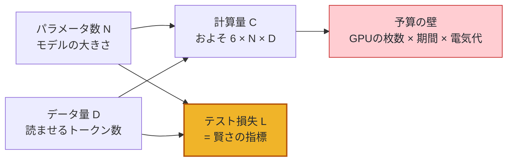
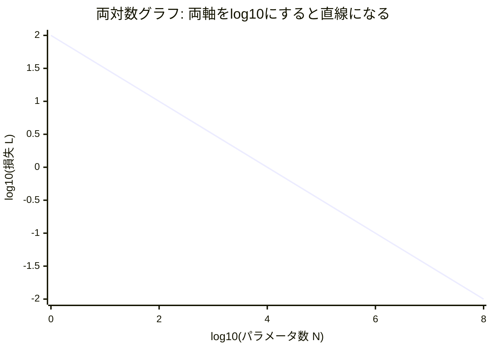
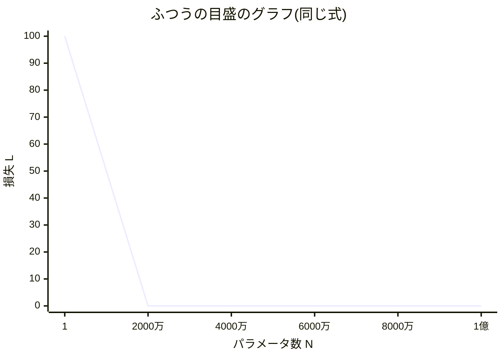
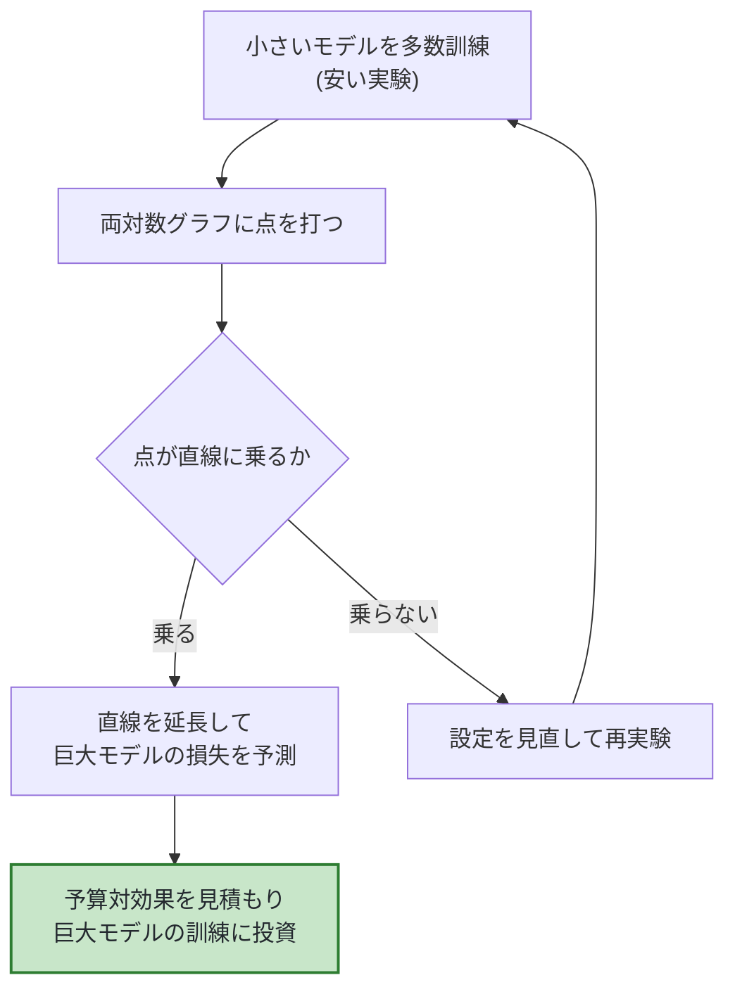
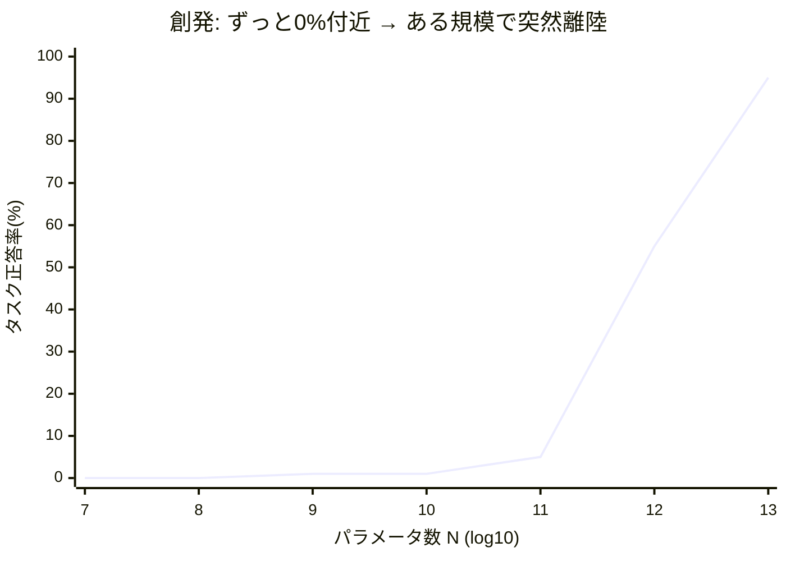
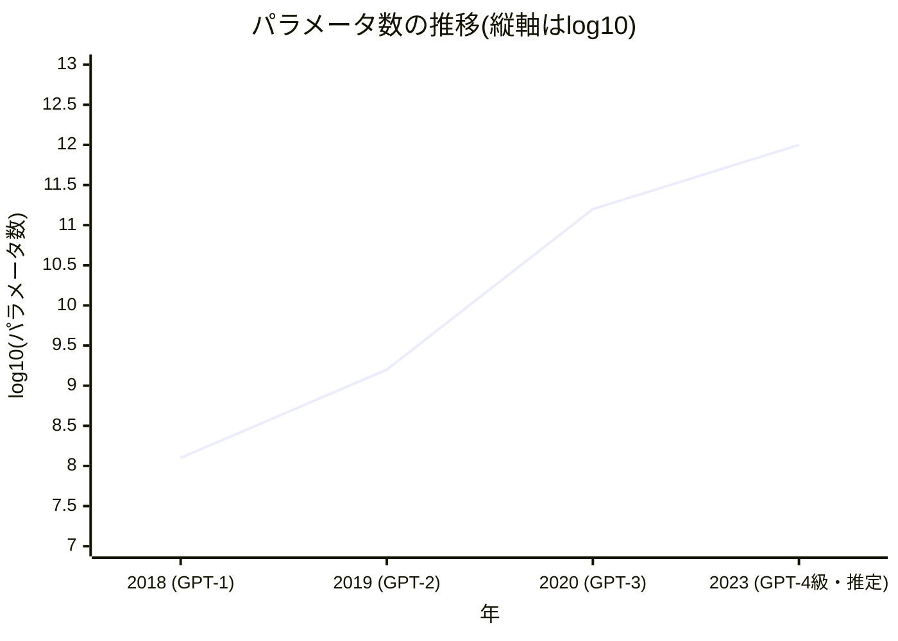

# 第13章 スケーリング則と創発

## この章で学ぶこと

- 「モデルを大きくすると賢くなる」が、機械学習の常識からすればまったく当たり前ではなかったこと
- モデルの規模を測る3つの軸: パラメータ数 $N$ ・データ量 $D$ ・計算量 $C$
- **スケーリング則(Scaling Laws)**: 損失が「べき乗則」に従って予測可能に下がること、そして両対数グラフで直線になること(第1章の対数がここで回収されます)
- Kaplan則から **Chinchilla則** へ: 「同じ計算予算なら、モデルを小さくしてデータを増やせ」
- 計算量の目安 $C \approx 6ND$
- **創発(emergence)**: ある規模を超えると急にできるようになる(ように見える)能力と、「それは測り方のせいでは?」という反論
- スケーリングの限界と課題(データ枯渇・費用・幻覚・推論コスト)
- GPT-2 → GPT-3 → GPT-4級 という規模拡大の年表

## この章の前提

- [第1章](01-functions-and-symbols.md): 指数関数・対数(この章の主役です)
- [第4章](04-machine-learning-basics.md): 損失関数、過学習と汎化
- [第10章](10-training.md): 次単語予測の訓練、訓練データの規模感
- [第12章](12-from-llm-to-chat-ai.md): LLMが対話AIになるまでの流れ

前章までで、Transformerという仕組みがどう作られ(第8〜9章)、どう訓練され(第10章)、どのような追加訓練を経て対話AIになるか(第12章)を見てきました。この章では視点を変えて、「**なぜ近年のAIは、こんなに急に賢くなったのか**」という問いに答えます。答えを一言でいえば「**大きくしたから**」なのですが、その裏には意外なほど整然とした法則が隠れています。

---

## 13.1 「大きくすれば賢くなる」は当たり前ではない

### 13.1.1 機械学習の古い常識

まず、第4章で学んだことを思い出してください。

> [!NOTE]
> モデルのパラメータを増やしすぎると、訓練データを**丸暗記**してしまい、初めて見るデータでの成績(汎化性能)はむしろ悪くなる — これが**過学習(overfitting)** でした。

この常識に従えば、パラメータ数を10倍、100倍、1万倍にしていくのは「過学習まっしぐらの愚行」のはずです。実際、深層学習が広まる前の機械学習では、「モデルはデータに対して大きすぎてはいけない」「余計なパラメータは削るべき」というのが鉄則でした。統計学の教科書にも「パラメータはデータ数よりずっと少なく」と書かれていたのです。

ところが、大規模言語モデルの世界では逆のことが起きました。

- パラメータを増やすほど、テストデータでの損失(初めて見る文章での次単語予測の外し具合)が**下がり続けた**
- しかも、その下がり方が**きれいな法則に従っていた**

### 13.1.2 なぜ過学習しなかったのか

種明かしをすると、鍵は**データも一緒に増やしていた**ことにあります。第10章で見たとおり、LLMの訓練データはWeb全体から集めた**兆(= $10^{12}$)単位のトークン**です。過学習は「モデルの記憶容量に対してデータが少なすぎる」ときに起こる現象でした。データが事実上無尽蔵にあり、しかもモデルが全データを1〜数回しか見ない(エポック数が小さい)なら、丸暗記する暇がないのです。

たとえるなら、こういうことです。

> [!TIP]
> 問題集が10ページしかないのに記憶力抜群の生徒に勉強させると、答えを丸暗記して終わります(過学習)。しかし問題集が**図書館まるごと**あれば、どんな記憶力の生徒でも丸暗記は不可能で、「解き方そのもの」を身につけるしかありません(汎化)。

ただし、これはあくまで直感的な説明です。「巨大モデル + 巨大データならうまくいく」ことは、**実験する前から数学的な理論で証明・予測できていたわけではありません**。実際にやってみたら意外なほど規則正しくうまくいった、というのが実際の順序です。その「意外なほど規則正しい」部分を、実験結果から法則としてまとめたのが、これから見るスケーリング則です。

---

## 13.2 規模を測る3つの軸 — $N$ ・ $D$ ・ $C$

「モデルを大きくする」と一口に言っても、大きくできるものは3つあります。

| 記号 | 名前 | 意味 | 例えるなら |
|---|---|---|---|
| $N$ | **パラメータ数** | モデルの中の学習される数値の総数(第9章の $W_Q, W_K, W_V$, FFNの重み、埋め込み行列 $E$ …の全成分の合計) | 脳の大きさ |
| $D$ | **データ量** | 訓練で読ませるトークンの総数 | 読んだ本の量 |
| $C$ | **計算量** | 訓練に費やす計算の総回数(単位は**FLOP**: 浮動小数点演算1回) | 勉強に使った総時間 |

この3つは独立ではありません。 $N$ 個のパラメータを持つモデルに $D$ トークンを読ませれば、それに応じた計算量 $C$ がかかります(具体的な関係は13.5節で見ます)。

**FLOP(フロップ)** という単位だけ補足しておきます。これは「掛け算や足し算などの小数の計算1回」を1と数える単位です。第2章で行列×ベクトルの計算をしたとき、内積のために掛け算と足し算を何度もしましたね。あの1回1回がFLOPです。LLMの訓練では、これが $10^{23}$ 回(1000垓回)といった天文学的な回数になります。

3つの軸の関係を図にしておきます。

スケーリング則とは、この図の右下、「 $N$ と $D$ が損失 $L$ をどう決めるか」に**きれいな数式**を与えるものです。

---

## 13.3 スケーリング則 — 損失はべき乗則で下がる

### 13.3.1 べき乗則とは何か

2020年、OpenAIのKaplan(カプラン)らは、Transformer言語モデルの規模と性能の関係を系統的に調べ、次の発見を報告しました。

> [!IMPORTANT]
> テストデータでの損失 $L$ は、パラメータ数 $N$(あるいはデータ量 $D$ 、計算量 $C$)の**べき乗則(power law)** に従って下がる。

べき乗則とは、次の形の関係のことです。

$$
L(N) = \left(\frac{N_c}{N}\right)^{\alpha}
$$

**読み下し**: 損失 $L$ は、「基準となる定数 $N_c$ をパラメータ数 $N$ で割ったもの」の $\alpha$(アルファ)乗に等しい。 $N$ を大きくするほど括弧の中は小さくなるので、損失は下がっていく。 $\alpha$ は「下がりやすさ」を決める定数(実測ではおよそ 0.05〜0.1 程度の小さい正の数)。

式の形が少し取っつきにくいので、もっと簡単な数値例で感覚をつかみましょう。仮に、あるモデル群の損失が

$$
L(N) = 100 \times N^{-0.5}
$$

**読み下し**: 損失は「100 を $N$ の 0.5 乗(= $\sqrt{N}$)で割ったもの」。パラメータ数が増えるほど損失は小さくなるが、減り方はだんだん緩やかになる。

という関係に従うとします($\alpha = 0.5$ は実際より大げさな値ですが、計算しやすいのでこれで進めます)。値を入れてみると:

| パラメータ数 $N$ | $\sqrt{N}$ | 損失 $L = 100/\sqrt{N}$ |
|---:|---:|---:|
| $1$ | $1$ | $100$ |
| $100$ | $10$ | $10$ |
| $10{,}000$ | $100$ | $1$ |
| $1{,}000{,}000$ | $1{,}000$ | $0.1$ |
| $100{,}000{,}000$ | $10{,}000$ | $0.01$ |

注目してほしいのは、**「 $N$ を100倍にするたびに、損失が10分の1になる」という規則性**です。10倍とか100倍とかの「倍率」の世界で見ると、変化が一定になっています。これがべき乗則の特徴です。

### 13.3.2 両対数グラフで直線になる — 第1章の対数の回収

ここで、**第1章で学んだ対数がついに本領を発揮します**。第1章で「対数は掛け算を足し算に変える」「桁違いに大きい数と小さい数を同じ土俵で扱える」と学んだことを思い出してください。あのときの布石を、いまここで回収します。

先ほどの式の両辺の対数(常用対数 $\log_{10}$)を取ってみます。

$$
\log_{10} L = \log_{10} 100 - 0.5 \log_{10} N = 2 - 0.5 \log_{10} N
$$

**読み下し**: 損失の対数は、「2 から、パラメータ数の対数の半分を引いたもの」。つまり $x = \log_{10} N$ 、 $y = \log_{10} L$ と置けば、 $y = 2 - 0.5x$ という**ただの一次関数(直線)** になる。

第1章の対数の法則($\log(a \times b) = \log a + \log b$ 、 $\log(a^p) = p \log a$)を使っただけです。曲がって減っていくべき乗則が、**両軸を対数にしたグラフ(両対数グラフ)では直線になる** — これがスケーリング則のいちばん有名な絵です。両軸とも $\log_{10}$ の値を取って描いてみます。

横軸の 0, 2, 4, 6, 8 は $N = 1, 10^2, 10^4, 10^6, 10^8$ に、縦軸の 2, 1, 0, -1, -2 は $L = 100, 10, 1, 0.1, 0.01$ に対応します。 **$N$ が100倍になる(横に2進む)たびに $L$ が1/10になる(縦に1下がる)** — つまり傾き $-0.5$ の直線です。ふつうの目盛のグラフで描くと最初に急降下してすぐ横ばいに見える曲線が、対数目盛では気持ちよくまっすぐ伸びます。

比較のため、同じ式 $L = 100/\sqrt{N}$ を**ふつうの目盛**で描くとこうなります。

最初の1点を除いて、すべての点が底に張り付いて潰れてしまい、法則がまるで見えません。

同じデータなのに、対数目盛にしたとたん法則が浮かび上がる。**「桁がまたがる現象は対数で見る」** — 第1章で学んだこの道具がなければ、スケーリング則は発見すらできなかったでしょう。

### 13.3.3 直線であることの何がすごいのか

「グラフが直線になって嬉しい」だけの話ではありません。直線の本当の価値は**外挿(先の予測)ができる**ことです。

- 小さいモデル(たとえば $10^6$ 〜 $10^8$ パラメータ)をたくさん訓練して、両対数グラフに点を打つ
- 点がきれいに直線に乗ることを確認する
- 定規で直線を延長すれば、「 $10^{11}$ パラメータのモデルを作ったら損失はいくつになるか」が、**作る前に予測できる**

巨大モデルの訓練には数十億円単位の費用がかかります(13.7節)。「作ってみないと分からない」では投資判断ができません。スケーリング則は「**小さいモデルでの実験結果から、大きいモデルの性能を事前に予測する**」ことを可能にし、これが巨額の計算資源を投じる根拠になりました。実際、GPT-4の技術報告書には「小規模モデルの結果から最終性能を事前に予測し、よく当たった」と書かれています。

この「小さい実験 → 直線を引く → 延長して予測 → 投資判断」という開発の流れを図にするとこうなります。

なお、実際の言語モデルの $\alpha$ は 0.05〜0.1 程度と、私たちの例(0.5)よりずっと小さい値です。つまり**損失を半分にするにはパラメータを何千倍にもする必要がある**、なだらかな坂です。それでも「増やせば確実に下がる」ことが分かっているのは大きな安心材料でした。

### 13.3.4 なぜべき乗則になるのか — 正直な注釈

「なぜ」を大切にする本書としては、正直に書いておきます。**損失がなぜ正確にべき乗則に従うのか、完全に納得のいく理論的説明はまだありません**。いくつかの直感的な仮説を紹介するに留めます。

- **言語の中身には「よく出る簡単なパターン」から「まれにしか出ない難しいパターン」まで、規模の階層がある**という見方。文法の基礎 → よくある言い回し → 専門知識 → 珍しい推論、という順に、パターンの出現頻度自体がべき乗則的に分布している(言語学ではジップの法則として知られます)。モデルが大きくなるほど、より「まれで難しい」パターンまで拾えるようになるので、損失の減り方もべき乗則になる、という説明です
- **データ側の限界**という見方。次の単語には本質的な偶然性があり(「猫は魚が」の次は「好き」とは限らない)、どんな完璧なモデルでも損失はゼロにできません。実際、Chinchilla論文の損失の式(13.4.4節の補足で紹介します)には「どうやっても削れない下限」を表す定数項が入っています

「実験的には抜群に安定して成り立つが、理論はあとから追いかけている」— これは物理学でもよくある、科学の健全な姿です。読者のみなさんは「経験則としてきわめて頑健」という理解で十分です。

---

## 13.4 Kaplan則からChinchilla則へ — 予算の使い方の最適化

### 13.4.1 問題設定: 計算予算が決まっているとき、 $N$ と $D$ をどう配分するか

現実の制約は「GPU をこれだけの期間使える」、すなわち**計算量 $C$ の予算が決まっている**ことです。13.5節で見るように $C$ はおよそ $N \times D$ に比例するので、予算が固定なら次のトレードオフが生まれます。

- **大きいモデルに少ないデータ**を読ませるか($N$ 大・ $D$ 小)
- **小さいモデルにたくさんのデータ**を読ませるか($N$ 小・ $D$ 大)

同じ授業時間で「難しい参考書を1冊だけやる」か「易しい問題集を10冊やる」か、のような配分問題です。

### 13.4.2 Kaplan則(2020): モデルを大きくする方が得

Kaplanらの2020年の分析の結論は「**予算が増えたら、主にモデルを大きくせよ(データはそこそこでよい)**」でした。この指針に従って、GPT-3(1750億パラメータ、約3000億トークン)をはじめとする「巨大モデル・データ控えめ」の時代が到来します。

### 13.4.3 Chinchilla則(2022): 実はデータが足りていなかった

2022年、DeepMindのHoffmann(ホフマン)らが、学習率の調整方法などを見直してより丁寧な実験をやり直したところ、結論が覆りました。これが**Chinchilla則(チンチラ則)** です。

> [!IMPORTANT]
> 計算予算 $C$ が最適に使われるのは、**パラメータ数 $N$ とデータ量 $D$ を同じ比率で増やしたとき**である。目安として、**パラメータ1個あたり約20トークン**($D \approx 20N$)。

この目安で当時の有名モデルを採点すると、意外なことが分かります。

| モデル | パラメータ数 $N$ | 訓練トークン数 $D$ | $D/N$ | Chinchilla目安(20)との比較 |
|---|---:|---:|---:|---|
| GPT-3 | 1750億 | 約3000億 | 約1.7 | データが**10倍以上不足** |
| Gopher | 2800億 | 約3000億 | 約1.1 | データが**20倍近く不足** |
| **Chinchilla** | **700億** | **1兆4000億** | **20** | ちょうど最適 |

DeepMindは自説を証明するため、Gopher(2800億パラメータ)と**同じ計算予算**で、パラメータを4分の1(700億)に減らし、データを約4.7倍(1兆4000億トークン)に増やしたモデル「Chinchilla」を訓練しました。検算してみましょう。 $C \approx 6ND$(次節)を使うと:

- Gopher: $C \approx 6 \times (2.8 \times 10^{11}) \times (3 \times 10^{11}) \approx 5.0 \times 10^{23}$ FLOP
- Chinchilla: $C \approx 6 \times (7 \times 10^{10}) \times (1.4 \times 10^{12}) \approx 5.9 \times 10^{23}$ FLOP

たしかにほぼ同じ予算です。結果は、**Chinchillaがほぼすべての評価でGopherに勝ちました**。同じ電気代で、より小さく・より賢いモデルができたのです。

### 13.4.4 Chinchilla則の影響

この発見は業界の設計方針を一変させました。

- 「とにかくパラメータを増やす」競争が終わり、**データの量と質**の重要性が再認識された
- 小さいモデルは**使うとき(推論)も安い**ため、実用上は目安の20トークン/パラメータを**大幅に超えて**訓練する例も増えた(例: Llamaシリーズは小さいモデルに数兆トークンを投入)。訓練時の予算最適と、使い倒すときの総合最適は別問題、という理解が広まった

> [!NOTE]
> 「Chinchilla最適」はあくまで「**訓練の計算予算だけ**を固定したときの最適」です。モデルは訓練後に何億回も使われるので、推論コストまで含めれば「目安より小さめのモデルを、目安よりずっと多くのデータで訓練する」のが合理的になり得ます。

もう一歩だけ踏み込むと、Chinchilla論文は損失を $N$ と $D$ の**両方の関数**として次の形で当てはめました(細部の数値は覚えなくて構いません。形だけ味わってください)。

$$
L(N, D) = E + \frac{A}{N^{\alpha}} + \frac{B}{D^{\beta}}
$$

**読み下し**: 損失は3つの部品の和で決まる。第1項 $E$ は「どんなに大きくしても削れない、言語そのものが持つ偶然性による下限」。第2項はパラメータ不足による損失で、 $N$ を増やせば減る。第3項はデータ不足による損失で、 $D$ を増やせば減る($A, B, \alpha, \beta$(ベータ)は実験から決める定数)。

この式を眺めるだけでも、Chinchilla則の結論が直感的に見えてきます。予算 $C \approx 6ND$ が固定のとき、 $N$ ばかり増やして $D$ をけちると、第2項はほぼゼロになるのに**第3項が減らずに居座ります**。逆も同様。両方をバランスよく増やしたときだけ、2つの項が揃って小さくなる — 「弱点の側がボトルネックになる」という、ごく自然な結論です。数値の感覚をつかむため、架空の簡単な数字($E=1.7$ 、 $A/N^{\alpha}$ と $B/D^{\beta}$ の値を直接与えます)で比べてみましょう。

| 配分 | パラメータ項 $A/N^{\alpha}$ | データ項 $B/D^{\beta}$ | 損失合計 $L$ |
|---|---:|---:|---:|
| $N$ 偏重($N$ 大・ $D$ 小) | 0.05 | 0.45 | $1.7+0.05+0.45 = 2.20$ |
| バランス型 | 0.15 | 0.15 | $1.7+0.15+0.15 = 2.00$ |
| $D$ 偏重($N$ 小・ $D$ 大) | 0.45 | 0.05 | $1.7+0.45+0.05 = 2.20$ |

同じ予算でも、バランス型がいちばん損失が小さくなっています。GPT-3やGopherは、この表の1行目(「 $N$ 偏重」)に相当する状態だったわけです。

---

## 13.5 計算量の目安 — $C \approx 6ND$

パラメータ数とデータ量から訓練の計算量を見積もる、有名な近似式があります。

$$
C \approx 6ND
$$

**読み下し**: 訓練に必要な総計算量(FLOP)は、およそ「6 × パラメータ数 × 訓練トークン数」。

なぜ6倍なのかは、ざっくり次の内訳です(厳密な導出は本書の範囲外ですが、感覚だけつかんでください)。

- トークン1個を**前向きに処理**(順伝播)するとき、各パラメータは掛け算1回+足し算1回でおよそ **2 FLOP** 働く
- 第5章で学んだ**逆伝播**(勾配の計算)は、順伝播のおよそ2倍の計算がかかる → **4 FLOP**
- 合計: トークン1個 × パラメータ1個あたり約 **6 FLOP**

数値例で確かめましょう。 $N = 10^9$(10億パラメータ)のモデルに $D = 2 \times 10^{10}$(200億トークン)を読ませると:

$$
C \approx 6 \times 10^9 \times 2 \times 10^{10} = 1.2 \times 10^{20} \text{ FLOP}
$$

**読み下し**: 計算量はおよそ $1.2 \times 10^{20}$ 回、つまり1兆の1億倍回の計算。

GPT-3級($N = 1.75 \times 10^{11}$ 、 $D = 3 \times 10^{11}$)なら $C \approx 3.15 \times 10^{23}$ FLOP。最新鋭GPU 1枚が1秒に約 $10^{15}$ FLOP 処理できるとしても、1枚では約 $3 \times 10^8$ 秒 = **約10年**かかる計算です。だから第10章で見たように数千枚のGPUを並べるわけです。

この式のありがたみは、**電卓一つで訓練計画の規模感が出せる**ことです。「 $N$ をこうして $D$ をこうしたら、GPU何枚で何ヶ月、電気代いくら」が最初に見積もれる。スケーリング則($L$ の予測)と合わせて、LLM開発は「作ってみないと分からない博打」から「予算と成果を事前に見積もれる工学」へと変わりました。

---

## 13.6 創発 — 急にできるようになる能力と、その論争

### 13.6.1 創発的能力の報告

スケーリング則は「損失がなだらかに下がる」という話でした。ところが2022年頃、それと食い違って見える現象が報告されます。**個々のタスクの成績は、なだらかに上がるとは限らない**のです。

**創発(emergence)** あるいは**創発的能力(emergent abilities)** と呼ばれるこの現象は、次のようなものです。

> [!NOTE]
> ある規模までのモデルでは正答率がほぼ0%(当てずっぽう同然)なのに、**ある規模を超えたとたん、急に成績が跳ね上がる**能力がある。

報告された例:

| 能力の例 | 小規模モデル | 大規模モデル |
|---|---|---|
| 3桁の足し算(例: 123+456) | ほぼ全滅(正答率0%近辺) | ある規模から急に正答 |
| 多段階の推論問題 | でたらめな答え | 段階を踏んだ解答(第14章で触れる思考の連鎖と組み合わせたとき顕著) |
| 指示の言い換えの理解 | 指示を無視して続きを書く | 意図を汲んで応答 |
| 単語の並び替え・多言語クイズ | 当てずっぽう水準 | 明確に正答 |

グラフにすると、こんな「ホッケースティック」型になります(横軸は対数目盛の代わりに $\log_{10} N$ で表しています。7 は $10^7$ 、13 は $10^{13}$ パラメータの意味です)。

これが本当なら、重大な含意があります。「損失は予測どおり下がる」のに「**どんな能力がいつ生えてくるかは予測できない**」ことになるからです。期待をこめて「もっと大きくすれば想像もつかない能力が生えるかも」と語る人もいれば、安全性の観点から「危険な能力が予告なく生えるかも」と警戒する人もいました。

### 13.6.2 反論 — 「それは測り方のせいでは?」

しかし2023年、Schaeffer(シェファー)らは「**創発は蜃気楼(mirage)ではないか**」という有力な反論を発表しました。要点はこうです。

> [!NOTE]
> モデルの実力は規模とともに**なだらかに**上がっている。急なジャンプに見えるのは、**全か無かの採点方法(完全一致でしか点をあげない)** を使っているせいだ。

これは数値例を見るのがいちばん分かりやすいです。10トークンの答え(たとえば10桁の計算結果)を出すタスクを考えます。採点方法は「**10トークン全部合っていて初めて正解**」だとしましょう。モデルの実力を「1トークンあたりの正解率 $p$ 」で表すと、全部当たる確率は $p^{10}$ です(第3章の確率の掛け算)。

$$
P(\text{完全正解}) = p^{10}
$$

**読み下し**: 答え全体が正解になる確率は、1トークンごとの正解率を10回掛け合わせたもの。

実力 $p$ が規模とともに**一定ペースでなだらかに**上がっていくとして、採点結果がどうなるか計算してみます。

| モデル規模 | 1トークン正解率 $p$(なだらかに上昇) | 完全一致の正答率 $p^{10}$ |
|---|---:|---:|
| 小 | 0.50 | 0.001(ほぼ0%) |
| ↓ | 0.60 | 0.006(ほぼ0%) |
| ↓ | 0.70 | 0.028(ほぼ0%) |
| ↓ | 0.80 | 0.107(**11%: 急に見え始める**) |
| ↓ | 0.90 | 0.349(**35%: 跳ね上がる!**) |
| 大 | 0.95 | 0.599(60%) |

左の列(モデルの実力)は 0.5 → 0.6 → 0.7 と**完全になだらか**なのに、右の列(完全一致の採点)は「0%, 0%, 0%, 11%, 35%, 60%」と**まるで創発のようなジャンプ**を見せます。つまり、**なめらかな成長でも、採点方法が「オール・オア・ナッシング」だと、グラフ上は突然の離陸に見えてしまう**のです。実際、同じタスクを「部分点あり」の指標で測り直すと、多くの「創発」がなだらかな上昇に化けた、と報告されています。

### 13.6.3 では創発は幻なのか — 公平なまとめ

この論争は現在も続いており、本書はどちらか一方に軍配を上げません。公平に整理すると:

- **「蜃気楼」説が正しい部分**: 報告された創発の多くは、連続的な指標で測り直すとなだらかになる。「規模を超えた瞬間に質的な飛躍が起きた」と断定するのは早計
- **それでも残る論点**: 私たちが実際に価値を感じるのは「部分点」ではなく「**ちゃんと最後まで正しい答え**」であることが多い(計算問題の答えが「惜しい」ことに実用上の価値はほぼない)。だとすれば、**利用者の体感として「急にできるようになった」は依然として真実**であり、実務的な意味での創発は否定されない
- **共通の教訓**: 「何をもって『できる』とするか(評価指標の設計)」が、現象の見え方を根本から変える。グラフを見たら、縦軸の定義を疑う癖をつけること

---

## 13.7 スケーリングの限界と課題

「大きくすれば良くなる」が分かったなら、無限に大きくすればいいのでしょうか。そうは問屋が卸さない、という課題を4つ挙げます。

### 13.7.1 データ枯渇

Chinchilla則は「パラメータに見合うデータを」と言いますが、**人類が書いた高品質なテキストは有限**です。Web上の良質なテキストは数十兆トークン程度と見積もられており、最先端モデルの訓練はすでにその相当部分を使っています。対応策として、同じデータを複数回使う、AIが生成したデータ(合成データ)で補う、画像・音声などテキスト以外のデータを使う、といった方向が模索されていますが、合成データは「モデルが自分の癖を再学習してしまう」危険も指摘されています。

### 13.7.2 費用とエネルギー

$C \approx 6ND$ が示すとおり、規模を10倍にすれば計算も(データも増やせば)数十倍です。最先端モデルの訓練費用は数十億〜数百億円規模、消費電力は小さな都市に匹敵すると報じられています。べき乗則は「損失を少し下げるために予算を何倍にもする」世界なので(13.3.3節)、経済的な限界が先に来る可能性があります。

### 13.7.3 スケールしても消えない問題 — 幻覚

第12章で導入した**幻覚(ハルシネーション)** — もっともらしい嘘を自信満々に述べる現象 — は、モデルを大きくしても**なくなりません**。次単語予測という仕組み上、モデルは「それらしい続き」を作ることに最適化されており、「知らないことは知らないと言う」ことは目的関数に直接は入っていないからです(第14章でこの生成の仕組みを詳しく見ます)。規模はこの問題を緩和はしても、根治はしないと考えられています。

### 13.7.4 推論コスト

訓練は1回きりですが、**推論(モデルを使うこと)は毎日何十億回**も起こります。パラメータが大きいほど1回の応答の計算も高くつくので、「訓練では最適でも、運用したら破産する」モデルはビジネスとして成立しません。この問題意識が、第15章で学ぶ高速化・効率化技術(量子化・蒸留・MoEなど)の直接の動機になります。

---

## 13.8 規模の年表 — GPT-2からGPT-4級まで

最後に、この章の内容を年表で振り返ります。数値には推定を含みます(特にGPT-4以降は非公開のため報道・推定ベース)。

| 年 | モデル | パラメータ数 $N$ | 訓練データ $D$(トークン) | 出来事・意義 |
|---|---|---:|---:|---|
| 2018 | GPT-1 | 1.17億 | 約10億 | 「事前学習+微調整」路線の開始(第11章) |
| 2019 | GPT-2 | 15億 | 約100億 | 「大きくしただけで文章が急にまともになった」と話題に |
| 2020 | GPT-3 | 1750億 | 約3000億 | few-shot学習の発見(第12章)。Kaplan則の申し子 |
| 2020 | — | — | — | Kaplanらがスケーリング則を定式化 |
| 2022 | Chinchilla | 700億 | 1兆4000億 | 「小さく作って多く読ませろ」で常識を更新 |
| 2022 | — | — | — | ChatGPT公開(GPT-3.5系 + RLHF、第12章) |
| 2023 | GPT-4級 | 非公開(兆規模との推定あり) | 非公開(十兆規模との推定あり) | 小規模実験からの性能予測が的中したと報告 |
| 2023〜 | Llama系など | 70億〜数千億 | 数兆〜十数兆 | Chinchilla目安を大幅に超える「使い倒し前提」の訓練が主流に |

規模の伸びを感覚的に言えば、GPT-1からGPT-3までの2年間でパラメータは約**1500倍**。第1章で学んだ指数的成長そのものです。そしてこの表の裏側では、常に両対数グラフの直線が「次はここまで下がるはず」と道筋を照らしていました。

せっかくなので、この年表も対数の目で見てみましょう。縦軸をパラメータ数の $\log_{10}$ にして年ごとに点を打つと、こちらもほぼ直線に乗ります。

縦軸の 8, 9, 11.2, 12 はそれぞれ約1億($10^8$)、約10億($10^9$)、約1750億($10^{11.2}$)、約1兆($10^{12}$)パラメータに対応します。対数の縦軸で直線 = 「毎年ほぼ一定倍率で成長」という指数的成長。第1章の「 $2^x$ は爆発する」を、業界全体が地で行った5年間だったわけです。

「損失は規模の対数に対して直線的に下がり(スケーリング則)、規模は年に対して指数的に伸びた」— この2つを掛け合わせたものが、私たちがこの数年体感した「AIの急速な進歩」の数学的な骨格です。

---

## 13.9 よくある誤解を正しておく

この章の内容は独り歩きしやすいので、誤解されがちなポイントを3つ確認して締めくくります。

**誤解1: 「スケーリング則は物理法則のように絶対だ」**

違います。スケーリング則は**経験則**です。ある範囲の規模・あるデータ・あるアーキテクチャで観測された規則性であり、範囲の外でも成り立つ保証はありません。実際、Kaplan則がChinchilla則に更新されたように(13.4節)、実験の精度が上がれば「直線の傾き」の理解も変わります。工学的にはきわめて頼りになるが、あくまで「これまでのところ、きわめてよく成り立つ経験則」です。

**誤解2: 「損失が下がる = すべての能力が一様に上がる」**

損失はあくまで**平均的な次単語予測の外し具合**です(第10章)。平均がなだらかに改善しても、個別のタスクの成績がどう動くかは別問題で、だからこそ創発の論争(13.6節)が起きました。「損失」と「私たちが感じる賢さ」の間には、評価指標という翻訳レンズが挟まっていることを忘れないでください。

**誤解3: 「大きくしさえすれば、いずれ何でもできるようになる」**

13.7節で見たとおり、データ・費用・電力には現実的な限界があり、幻覚のように仕組みに根ざした問題は規模では消えません。また、スケーリング則が約束するのは「次単語予測の損失の低下」であって、「真実を述べること」や「安全であること」ではありません。だからこそ第12章のRLHFのような別方向の工夫が必要でしたし、第15章で見るように「同じ賢さをより安く」という効率化の研究が盛んなのです。

---

## この章のまとめ

- 「大きくすれば賢くなる」は過学習の常識(第4章)に反する意外な結果だった。巨大データと少ないエポック数が丸暗記を防いだ
- 規模の3軸は **パラメータ数 $N$ ・データ量 $D$ ・計算量 $C$**。計算量は $C \approx 6ND$ で概算できる
- **スケーリング則**: 損失は $N, D, C$ のべき乗則で下がり、**両対数グラフで直線**になる(第1章の対数の回収)。直線ゆえに**外挿=事前予測**ができ、巨額投資の根拠となった
- **Chinchilla則**: 同じ計算予算なら「モデルを小さくデータを増やせ」。目安はパラメータ1個あたり約20トークン。同予算でGopherに勝ったChinchillaが実証した
- **創発**: ある規模で急に能力が現れるという報告がある一方、「全か無かの採点方法が生む見かけのジャンプだ」という反論もあり、決着はついていない。評価指標の設計が現象の見え方を決める
- 限界と課題: データ枯渇、費用・電力、規模では消えない幻覚、そして推論コスト(→ 第15章の動機)

## 次の章へ

規模の話から、いよいよ「使う」話に移ります。訓練済みモデルが出すのは「次の1トークンの確率分布」だけ — では、そこからどうやってひとつながりの文章が生まれるのでしょうか。[第14章 文章を生成する仕組み](14-text-generation.md)では、自己回帰生成のループと、温度・top-k・top-pといった「サンプリングの匙加減」を、手計算で確かめながら学びます。
