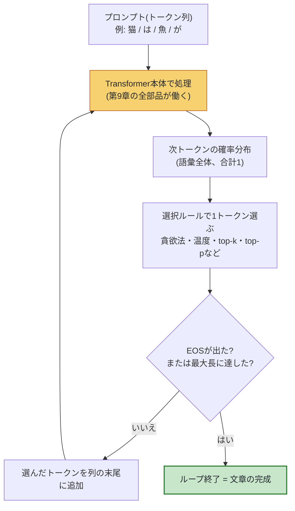

# 第14章 文章を生成する仕組み

## この章で学ぶこと

- 訓練済みモデルが出すのは「次の1トークンの確率分布」だけであり、文章にするには**ループ**が必要なこと(**自己回帰生成**)
- 通し例「猫は魚が」から、実際に1トークンずつ文章が生まれていく様子
- **貪欲法(greedy)** と、その「単調・繰り返し」という弱点
- **温度(temperature)**: 確率分布を尖らせたり平らにしたりする匙加減(第5章のsoftmaxがここで回収されます)
- **top-k / top-p(nucleus)サンプリング**: 変な単語の混入を防ぎつつ多様性を保つ工夫
- **ビームサーチ**: 翻訳など「正解が狭い」タスク向けの探索と、自由な文章生成に向かない理由
- 繰り返しペナルティ、停止条件(EOSトークン・最大長)
- **コンテキスト長**とは何か、なぜ有限か(第15章の $O(n^2)$ 問題への布石)
- 「LLMは1トークンずつしか出せない」ことの意外に深い含意と、**思考の連鎖(CoT)**

## この章の前提

- [第5章](05-neural-networks.md): softmax(この章で徹底的に再利用します)
- [第8章](08-attention.md): 因果マスク(未来を見ないattention)
- [第9章](09-transformer-architecture.md): 出力層が語彙全体の確率分布を出すこと
- [第10章](10-training.md): 次単語予測の訓練
- [第11章](11-bert-gpt-t5.md): デコーダのみモデル(GPT系)が現代の主流であること

第10章までで、Transformerは「文脈を受け取り、次のトークンの確率分布を出す」ように訓練されました。しかし、ChatGPTに質問すると返ってくるのは確率分布の表ではなく、**ひとつながりの文章**です。このギャップを埋めるのが本章です。実は、訓練済みモデルの外側に、ごく単純な「ループ」と、生成の味を決める「サンプリングの匙加減」が存在します。

---

## 14.1 モデルは「次の1トークン」しか出さない

まず出発点を正確に確認します。訓練済みの(デコーダのみ)Transformerは、突き詰めればこういう関数です。

$$
P(w_{t+1} \mid w_1, w_2, \dots, w_t) = f_\theta(w_1, w_2, \dots, w_t)
$$

**読み下し**: これまでのトークン列 $w_1$ から $w_t$ を入力すると、「次のトークン $w_{t+1}$ が語彙の各単語である確率」の一覧表(確率分布)がひとつ返ってくる。 $f_\theta$ は訓練済みパラメータ $\theta$ を持つTransformer全体。

通し例で言えば、「猫は魚が」(トークン列 `[猫, は, 魚, が]`)を入れると、返ってくるのは次のような**語彙5万語ぶんの確率の表**です(架空の数値です)。

| 候補トークン | 確率 |
|---|---:|
| 好き | 0.50 |
| 大好き | 0.20 |
| 苦手 | 0.10 |
| 食べ | 0.05 |
| 泳ぐ | 0.04 |
| …(残り約5万語) | 合計 0.11 |

これだけです。**文章は1文字も出てきません**。「じゃあ、どうやって文章に?」— 答えは拍子抜けするほど単純で、「**選んだトークンを入力の末尾にくっつけて、もう一度モデルに入れる**」を繰り返すのです。

---

## 14.2 自己回帰生成 — 出力を入力に戻すループ

### 14.2.1 ループの全体像(本章の最重要図)

この繰り返しを**自己回帰生成(autoregressive generation)** と呼びます。「自己回帰」とは「自分の出力が、次の自分の入力に回って戻ってくる」という意味です。図で示します。



ポイントは2つあります。

1. **モデル自身は1ミリも変わらない**。ループの間、パラメータ $\theta$ は固定です。文章を「書いている」ように見えるのは、外側のループがトークンを積み上げているからです
2. **「1トークン選ぶ」の選び方(選択ルール)に自由度がある**。ここが本章の主役で、同じモデルでも選び方次第で文章の味がガラリと変わります

### 14.2.2 なぜこれで文章になるのか — 確率の掛け算

「1個ずつ選ぶ」ことは、実は文章全体の確率を分解していることに対応します。第3章で学んだ条件付き確率の掛け算そのものです。

$$
P(w_1, w_2, \dots, w_n) = P(w_1) \times P(w_2 \mid w_1) \times P(w_3 \mid w_1, w_2) \times \cdots \times P(w_n \mid w_1, \dots, w_{n-1})
$$

**読み下し**: 文章全体が出てくる確率は、「1語目の確率」×「1語目を見た上での2語目の確率」×「2語目までを見た上での3語目の確率」…と、条件付き確率を順に掛け合わせたものに等しい。

つまり自己回帰生成は、この分解の右辺を**左から順に実行している**のです。第7章で導入した言語モデルの定義 $P(w_t \mid w_1, \dots, w_{t-1})$ が、ここで「文章製造機」として動き出しました。

### 14.2.3 通し例で1トークンずつ追いかける

プロンプト「猫は魚が」から、実際にループを回してみましょう。各ステップの確率分布は説明用の架空の値です。選択ルールはいちばん単純な「確率最大のものを選ぶ」(次節の貪欲法)とします。

| ステップ | モデルへの入力(トークン列) | 確率分布の上位(架空の値) | 選ばれたトークン | 出力列の状態 |
|---|---|---|---|---|
| 1 | `[猫, は, 魚, が]` | **好き 0.50**, 大好き 0.20, 苦手 0.10, 食べ 0.05, … | 好き | `猫は魚が好き` |
| 2 | `[猫, は, 魚, が, 好き]` | **だ 0.35**, です 0.25, 。 0.18, で 0.10, … | だ | `猫は魚が好きだ` |
| 3 | `[猫, は, 魚, が, 好き, だ]` | **。 0.71**, が 0.11, から 0.08, ね 0.05, … | 。 | `猫は魚が好きだ。` |
| 4 | `[猫, は, 魚, が, 好き, だ, 。]` | **EOS 0.55**, 犬 0.10, だ 0.07, 一方 0.06, … | EOS | 生成終了 |

4ステップ目に出てきた **EOS(End of Sequence)** は「文章はここでおしまい」を意味する特別なトークンです(14.9節で詳述)。これが選ばれた瞬間、ループは停止し、完成品「猫は魚が好きだ。」が返されます。

表をよく見ると、大事なことに気づきます。**ステップ2の入力には、ステップ1でモデル自身が選んだ「好き」が含まれています**。もしステップ1で「苦手」が選ばれていたら、ステップ2の分布はまったく違うものになったはずです(「猫は魚が苦手」の続きですから)。つまり**序盤の選択が、その後の文章全体を左右する**のです。この性質が、これから見る「選び方」の設計を面白くも難しくもしています。

---

## 14.3 貪欲法 — いちばん単純で、意外と問題児

### 14.3.1 定義

**貪欲法(greedy decoding)** は、毎ステップ「確率最大のトークン」を選ぶ方法です。第1章で学んだ $\arg\max$ を使えば一行で書けます。

$$
w_{t+1} = \arg\max_{w} \; P(w \mid w_1, \dots, w_t)
$$

**読み下し**: 次のトークンとして、条件付き確率を最大にする単語 $w$ を採用する。

先ほどの表(14.2.3節)はまさに貪欲法でした。決定的(同じプロンプトなら毎回同じ出力)で、実装も簡単。何が不満なのでしょうか。

### 14.3.2 問題1: 単調でつまらない

「いちばんありそうな続き」を常に選ぶとは、「**もっとも無難な文章**」を書き続けるということです。人間の生きた文章には適度な意外性がありますが、貪欲法の文章は統計的な「最頻値の連鎖」なので、平板で退屈になりがちです。物語の生成などでは致命的です。

### 14.3.3 問題2: 繰り返しの沼

貪欲法の悪名高い症状が**繰り返しループ**です。たとえばこんな出力が実際に起こります。

```text
入力:  猫は魚が
出力:  好きだ。猫は魚が好きだ。猫は魚が好きだ。猫は魚が...
```

なぜこうなるのか。「猫は魚が好きだ。」まで出た時点で、文脈に「猫は魚が」というパターンが強く存在します。モデルは訓練で「直前の文脈と似た表現は繰り返されやすい」ことも学んでいるため、同じフレーズの確率が少し上がる → 選ばれる → 文脈にそのフレーズが2回現れ、さらに確率が上がる → …という**自己強化の悪循環**に落ちるのです。一度沼にはまると、貪欲法は決定的ゆえに絶対に抜け出せません。

### 14.3.4 問題3: 局所最適

毎歩の最善が全体の最善とは限りません。ステップ1で確率0.50の「好き」を選ぶより、確率0.20の「大好き」を選んだ方が、**その先も含めた文章全体**の確率は高いかもしれない(「大好き」の続きは非常に確信度が高い、など)。貪欲法は1歩先しか見ないため、こうした「あとで効いてくる良い手」を逃します。この問題への正攻法が14.6節のビームサーチです。

そこでまず、「最大を選ぶ」のをやめて「**確率に従ってくじ引きする(サンプリングする)**」方向に進みます。確率0.50の「好き」は50%の確率で、0.20の「大好き」は20%の確率で選ばれる、という方式です。これだけで単調さと繰り返しはかなり和らぎます。ただし今度は「確率0.0001の変な単語」もごくたまに選ばれてしまう。この匙加減を調整する道具が、温度とtop-k/top-pです。

---

## 14.4 温度 — 分布を尖らせる・平らにする(第5章softmaxの回収)

### 14.4.1 softmaxの復習と温度の定義

**ここで第5章のsoftmaxが回収されます**。第9章で見たとおり、モデルの出力層は語彙の各単語に**スコア(ロジット)** $s_i$ を付け、softmaxで確率に変換するのでした。

$$
P(w_i) = \frac{e^{s_i}}{\sum_{j} e^{s_j}}
$$

**読み下し**: 単語 $w_i$ の確率は、「自分のスコアの指数関数」を「全単語のスコアの指数関数の合計」で割ったもの。全部足すと1になる。

**温度(temperature)** $T$ とは、softmaxに入れる前に**スコアを $T$ で割る**、それだけの操作です。

$$
P(w_i) = \frac{e^{s_i / T}}{\sum_{j} e^{s_j / T}}
$$

**読み下し**: 各単語のスコアを温度 $T$ で割ってからsoftmaxにかける。 $T$ が1なら元のまま。 $T$ が1より小さいとスコアの差が拡大されて分布が尖り、1より大きいと差が縮小されて分布が平らになる。

名前の由来は物理学です。温度が低いと分子は行儀よく整列し(秩序・決定的)、温度が高いと乱雑に動き回る(無秩序・ランダム)—そのアナロジーで、低温=堅実、高温=奔放な生成になります。

### 14.4.2 同じスコアに対する温度別の確率表 — 手計算で確かめる

言葉より計算です。「猫は魚が」の続きの候補が3つだけの小さな世界を考え、モデルが出したスコアを次のとおりとします。

| 候補 | スコア $s_i$ |
|---|---:|
| 好き | 2.0 |
| 大好き | 1.0 |
| 苦手 | 0.0 |

**$T = 1$(素のsoftmax)** の場合。 $e^{2.0} \approx 7.389$ 、 $e^{1.0} \approx 2.718$ 、 $e^{0.0} = 1.000$ なので、

$$
P(\text{好き}) = \frac{7.389}{7.389 + 2.718 + 1.000} = \frac{7.389}{11.107} \approx 0.665
$$

**読み下し**: 「好き」の確率は、自分の指数値 7.389 を3候補の指数値の合計 11.107 で割った約 66.5%。

同様に $P(\text{大好き}) \approx 2.718/11.107 \approx 0.245$ 、 $P(\text{苦手}) \approx 1.000/11.107 \approx 0.090$ です。これは第5章でやった計算そのものですね。

**$T = 0.5$** の場合。スコアを0.5で割るので $(4.0,\ 2.0,\ 0.0)$ になり、 $e^{4.0} \approx 54.598$ 、 $e^{2.0} \approx 7.389$ 、 $e^{0.0} = 1.000$ 、合計 $62.987$ 。

$$
P(\text{好き}) = \frac{54.598}{62.987} \approx 0.867
$$

**読み下し**: スコアの差が2倍に拡大された結果、1位の「好き」の確率が 66.5% から 86.7% に跳ね上がった。分布が尖った。

**$T = 2.0$** の場合。スコアは $(1.0,\ 0.5,\ 0.0)$ 、指数値は $2.718,\ 1.649,\ 1.000$ 、合計 $5.367$ 。 $P(\text{好き}) \approx 0.506$ 。差が縮まりました。

まとめて、**同じスコアに対する温度別の確率表**がこちらです。本章でいちばん大事な表です。

| 候補(スコア) | $T = 0.1$ | $T = 0.5$ | $T = 1.0$ | $T = 2.0$ | $T \to \infty$ |
|---|---:|---:|---:|---:|---:|
| 好き(2.0) | 99.995% | 86.7% | 66.5% | 50.6% | 33.3% |
| 大好き(1.0) | 0.005% | 11.7% | 24.5% | 30.7% | 33.3% |
| 苦手(0.0) | ほぼ0% | 1.6% | 9.0% | 18.6% | 33.3% |
| 分布のようす | ほぼ貪欲法 | かなり堅実 | モデルの素顔 | 冒険的 | 完全なくじ引き |

分布の形をASCIIで見比べると一目瞭然です。

```text
   T = 0.1(ほぼ貪欲法)     T = 1.0(素のまま)        T = 2.0(平らに)
   確率                      確率                      確率
 1.0┤█                     1.0┤                      1.0┤
    │█                        │█                        │
 0.5┤█                     0.5┤█  ▄                  0.5┤█  ▄
    │█                        │█  █  ▂                  │█  █  ▄
 0.0└┴──┴──┴─            0.0└┴──┴──┴─            0.0└┴──┴──┴─
     好き 大好き 苦手          好き 大好き 苦手          好き 大好き 苦手
```

### 14.4.3 温度の使いどころ

| 温度 | 生成の性格 | 向いている用途 |
|---|---|---|
| $T \to 0$ | 毎回同じ・最無難(貪欲法と一致) | 事実の質問応答、コード補完、再現性が欲しいとき |
| $T = 0.7$ 前後 | 自然な揺らぎ | 対話AIの既定値としてよく使われる帯 |
| $T = 1.0$ | モデルが学んだ分布そのまま | 分布の素の姿を見たいとき |
| $T = 1.5$ 〜 | 奔放・時に支離滅裂 | ブレインストーミング、詩、意外性が欲しいとき |

重要な注意: **温度はモデルを賢くも愚かにもしません**。スコア(モデルの判断)は1ビットも変わらず、変わるのは「その判断をどれくらい忠実に/大胆にくじ引きに反映するか」だけです。料理にたとえるなら、素材(スコア)は同じで、味付けの濃さを変えているのです。

---

## 14.5 top-k と top-p — 「変な単語」の混入を防ぐ

### 14.5.1 サンプリングの残る問題: 長い尾

温度付きサンプリングにはまだ弱点があります。語彙は5万語もあるので、1語1語はわずか0.001%の確率しかない「明らかに変な単語」も、**5万語ぶん集まればばかにならない確率**になります(これを分布の**長い尾(long tail)** と呼びます)。10トークンに1回でも「猫は魚が**炭酸**」のような脱線をされては困ります。そこで「くじ引きの参加資格を上位に限る」という発想が生まれました。

### 14.5.2 top-kサンプリング: 上位k個だけでくじ引き

**top-kサンプリング**は、確率上位 $k$ 個のトークンだけを残し、確率を再び合計1に**正規化**してからサンプリングします。14.1節の分布で $k = 3$ とすると:

| 候補 | 元の確率 | 上位3位で正規化後 |
|---|---:|---:|
| 好き | 0.50 | $0.50 / 0.80 = 0.625$ |
| 大好き | 0.20 | $0.20 / 0.80 = 0.250$ |
| 苦手 | 0.10 | $0.10 / 0.80 = 0.125$ |
| 食べ 以下すべて | 0.20(合計) | **0(足切り)** |

**読み下し(表の計算)**: 上位3候補の確率の合計は $0.50+0.20+0.10 = 0.80$ 。各候補の確率を 0.80 で割り直すことで、3候補だけで合計が1になるくじ引きを作る。

これで、どんなに運が悪くても4位以下の変な単語は絶対に出ません。

しかしtop-kには**kが固定である**という弱点があります。次の2つの場面を比べてください($k=3$ とします)。

- **場面A(答えがほぼ一つ)**: 「日本の首都は」→ 東京 0.95, 京都 0.02, 大阪 0.01, … このとき3位まで残すと、明らかに劣る候補までくじに入ってしまう
- **場面B(続きが何十通りもある)**: 「今日は」→ 晴れ 0.08, いい 0.07, 朝 0.06, 少し 0.05, …(なだらか)。このとき3個しか残さないと、まっとうな候補を大量に切り捨ててしまう

場面によって「残すべき個数」は違うのです。これを自動調整するのがtop-pです。

### 14.5.3 top-p(nucleus)サンプリング: 累積確率p%まで残す

**top-pサンプリング**(**nucleusサンプリング**、nucleus=核)は、確率の高い順に足していき、**累積確率が $p$ を超えたところまで**を残します。 $p = 0.85$ で先ほどの2場面を処理してみましょう。

**場面A(尖った分布)**:

| 順位 | 候補 | 確率 | 累積確率 | 判定 |
|---|---|---:|---:|---|
| 1 | 東京 | 0.95 | 0.95 | 残す(ここで既に0.85超え) |
| 2 | 京都 | 0.02 | 0.97 | 足切り |

→ 残るのは**1個だけ**。事実上の貪欲法になり、変な答えは出ません。

**場面B(平らな分布)**:

| 順位 | 候補 | 確率 | 累積確率 | 判定 |
|---|---|---:|---:|---|
| 1 | 晴れ | 0.08 | 0.08 | 残す |
| 2 | いい | 0.07 | 0.15 | 残す |
| … | … | … | … | 残す |
| 20 | 昨日 | 0.02 | 0.86 | 残す(ここで0.85超え) |
| 21 | 走る | 0.015 | 0.875 | 足切り |

→ **20個**も残ります。多様な続きが許される場面では、ちゃんと選択肢を広く保つのです。

このように、top-pは**分布の尖り具合に応じて足切りラインを自動で動かす**のが利点で、現在の対話AIでは「温度 + top-p」の組み合わせが標準的です。なお、top-kとtop-pは併用もできます(両方の条件を満たすものだけ残す)。

---

## 14.6 ビームサーチ — 「正解が狭い」タスクの探索法

### 14.6.1 発想: 有望な候補を複数並走させる

14.3.4節で見たとおり、貪欲法は「1歩先の最善」しか見ないため、文章全体として最良の列を逃すことがあります。かといって全候補を試すのは不可能です(語彙5万で10トークンなら $50000^{10}$ 通り — 第7章のn-gramで見た組み合わせ爆発の再来です)。

**ビームサーチ(beam search)** は中間案で、各ステップで**有望な候補列を $B$ 本だけ**(ビーム幅 $B$)キープして並走させます。翻訳の通し例「猫は魚が好き」→ "Cats like fish" を、ビーム幅 $B=2$ で追ってみましょう(確率は架空の値)。

```text
ステップ1: 1語目の候補
   "Cats"  P=0.5   ┐ 上位2本をキープ
   "The"   P=0.4   ┘
   "Fish"  P=0.05    → 捨てる

ステップ2: それぞれの続きを展開し、列全体の確率(掛け算)で採点
   "Cats like"    0.5 × 0.6  = 0.30  ┐ 全4候補から
   "The cat"      0.4 × 0.8  = 0.32  ┘ 上位2本をキープ
   "Cats love"    0.5 × 0.3  = 0.15    → 捨てる
   "The fish"     0.4 × 0.1  = 0.04    → 捨てる

ステップ3: さらに展開
   "The cat likes"  0.32 × 0.9 = 0.288  ┐ キープ
   "Cats like fish" 0.30 × 0.7 = 0.210  ┘ キープ
   ...

最終的に EOS まで到達した列のうち、確率最大のものを出力する。
```

注目してください。ステップ1の時点では "Cats"(0.5)が "The"(0.4)より優勢でしたが、ステップ2で "The cat"(0.32)が "Cats like"(0.30)を逆転しました。**貪欲法なら初手で "The" を捨てて逆転の芽を摘んでいた**ところを、ビームサーチは2本目のビームで拾えたわけです。

### 14.6.2 対数で掛け算を足し算に(第1章の再登場)

実装上の補足を一つ。列の確率は確率の掛け算なので、長くなるほど $0.5 \times 0.6 \times 0.7 \times \cdots$ とどんどん小さくなり、コンピュータの小数では**桁が小さすぎて表現できなくなります**(アンダーフロー)。そこで実際は確率の対数を足し合わせます。

$$
\log P(\text{列}) = \log P(w_1) + \log P(w_2 \mid w_1) + \log P(w_3 \mid w_1, w_2) + \cdots
$$

**読み下し**: 列全体の確率の対数は、各ステップの条件付き確率の対数の合計。掛け算が足し算に変わるので、いくら長い列でも数値が壊れない。

第1章で「対数は掛け算を足し算に変える。機械学習が対数だらけなのはこれが理由の一つ」と学びました。その実例がここにもあります。

### 14.6.3 なぜ自由な文章生成に向かないのか

ビームサーチは機械翻訳や要約で長年の定番です。これらは「**正解の範囲が狭い**」タスクで、「もっとも確率の高い1本」を探す価値があるからです。ところが雑談や物語のような**自由生成**でビームサーチを使うと、悪いことが2つ起きます。

1. **最尤の文章は退屈**: 「確率最大の文章」とは「もっともありきたりな文章」です。貪欲法の単調さ(14.3.2節)が、探索が賢くなったぶんさらに徹底されてしまいます
2. **繰り返しがむしろ悪化**: 繰り返しフレーズは1語1語の確率が高いため、「列全体の確率最大」を目指すビームサーチはかえって繰り返しを好みます

つまり、**「正解を当てる」タスクにはビームサーチ、「多様で自然な文章を作る」タスクには温度+top-pサンプリング**、という使い分けが基本です。「良い文章 = 確率最大の文章」ではない、というのは本章でいちばん味わい深い事実かもしれません。

---

## 14.7 繰り返しペナルティ — 沼への追加の保険

サンプリングにしてもなお繰り返しが出ることはあるため、実務では**繰り返しペナルティ(repetition penalty)** という補正がよく併用されます。仕組みは単純で、**すでに文中に登場したトークンのスコアを、softmaxの前に少し下げる**(たとえばスコアを定数で割る・引く)だけです。

- 効きすぎると副作用があります。日本語の「の」「は」や句読点まで罰してしまうと、不自然な文になります
- あくまで応急処置であり、根本的には良い訓練データとチューニングで繰り返し癖を減らすのが本筋です

軽い補正である、という位置づけだけ覚えておけば十分です。

---

## 14.8 停止条件 — 文章はいつ終わるのか

ループの終了条件は主に2つです。

**1. EOSトークン**。第6章で語彙とトークンを学びましたが、語彙には普通の単語のほかに**特別トークン(special tokens)** がいくつか含まれています。その代表が **EOS(End of Sequence)** = 「文章の終わり」を表すトークンです。訓練データの各文書の末尾にEOSを付けておくことで、モデルは「話がまとまったらEOSを出す」ことも**次単語予測の一部として**学習します(第10章の訓練と何も変わらない、というのがよくできているところです)。生成中にEOSがサンプリングされたら、そこで打ち切ります。

**2. 最大長(max tokens)**。EOSがなかなか出ない場合の保険として、「最大500トークンで強制終了」のような上限を設けます。コンテキスト長(次節)を超えられないという物理的制約もあります。対話AIの応答が時々ぷつりと途切れるのは、多くの場合この上限に達したためです。

このほか、対話AIでは「`ユーザー:`という文字列が出たら停止」(モデルが勝手にユーザーのセリフを書き始めるのを防ぐ)のような**停止文字列**も使われます。

---

## 14.9 コンテキスト長 — モデルの「視界」はなぜ有限か

### 14.9.1 コンテキスト長とは

**コンテキスト長(context length / context window)** とは、モデルが一度に見られるトークン列の最大長です。「視界の広さ」や「作業机の広さ」にたとえられます。プロンプトと生成済みトークンの合計がこれを超えると、古い部分を切り捨てるなどの対応が必要になり、モデルは**視界の外のことを一切考慮できません**。長い会話の序盤の約束を対話AIが「忘れる」現象の正体は、多くの場合これです。

### 14.9.2 なぜ有限なのか — $O(n^2)$ への布石

理由は主に2つあります。

1. **訓練時の見た長さを超えると性能が落ちる**: 位置の情報(第9章の位置エンコーディング)は訓練で見た範囲でしかうまく較正されていません
2. **attentionの計算量がトークン数の2乗で増える**: 第8章で見たとおり、self-attentionは全トークンペアの内積(スコア行列 $QK^\top$)を計算します。トークン数 $n$ に対してペア数は $n \times n$ 、つまり計算量は $n^2$ に比例します

2つ目を小さな表で体感しておきましょう(これが**第15章の主役、 $O(n^2)$ 問題への布石**です)。

| トークン数 $n$ | スコア行列の要素数 $n^2$ | $n=1000$ 比 |
|---:|---:|---:|
| 1,000 | 100万 | 1倍 |
| 2,000 | 400万 | **4倍** |
| 4,000 | 1,600万 | 16倍 |
| 10,000 | 1億 | 100倍 |

**視界を2倍にすると、計算は4倍**。これがコンテキスト長を伸ばす際の高い壁であり、第15章で学ぶFlashAttentionやKVキャッシュ、RoPEといった技術の直接の動機になります。

---

## 14.10 「1トークンずつ」の深い含意 — 計算の弱さと思考の連鎖

### 14.10.1 LLMはなぜ計算が苦手なのか

自己回帰生成の仕組みを知ると、LLMの不思議な弱点が腑に落ちます。たとえば「 $347 \times 892 = $ 」に即答させると、しばしば間違えます。理由は仕組みにあります。

- モデルは**1トークンを出すたびに、決まった量の計算(第9章のブロック $N$ 段ぶん)しかできません**。問題が難しかろうと簡単だろうと、1トークンあたりの「考える時間」は同じです
- 筆算のような**多段階の手続き**は、1回のフォワード計算に詰め込むには複雑すぎます
- さらに、答えを最初のトークンから書き始めた瞬間、**もう後戻りできません**。人間のように「書いてから見直して消す」ことが、素の生成ループにはないのです

### 14.10.2 思考の連鎖(Chain of Thought)

ここから、有名な対処法が生まれました。**思考の連鎖(Chain of Thought, CoT)** — 「途中の考え方を順番に書いてから、最後に答えを書いてください」と促す方法です。

```text
悪い聞き方: 347 × 892 = ?           → いきなり答えを出力、間違いやすい
良い聞き方: 途中式を書きながら計算して
           → 347 × 892
             = 347 × 900 − 347 × 8
             = 312300 − 2776
             = 309524                → 途中結果がコンテキストに積まれていく
```

なぜ効くのかは、本章の知識で説明できます。生成されたトークンは**入力の末尾に追加され、次のステップで参照できます**(14.2節のループ)。つまり、途中式を書かせることは**コンテキストを「メモ用紙」として使わせる**ことなのです。1トークンあたりの計算量は変えられなくても、トークン数を増やせば合計の計算量は増やせる。「書くこと自体が考えること」— 人間の筆算と同じ理屈です。

この「答えの前にたくさん考えさせる(=たくさんトークンを使わせる)ほど賢くなる」という発見は、第15章の最後で触れる**推論時スケーリング**という近年の潮流につながっていきます。

---

## 14.11 設定の早見表 — 実務でどう組み合わせるか

本章の道具は組み合わせて使います。代表的なレシピをまとめておきます(値は典型例で、絶対の正解ではありません)。

| 用途 | 温度 $T$ | top-p | その他 | ねらい |
|---|---:|---:|---|---|
| 事実の質問応答・コード生成 | 0〜0.3 | 0.9 | — | 再現性と正確さ最優先 |
| 対話AIの標準設定 | 0.7 | 0.9〜0.95 | 繰り返しペナルティ弱 | 自然さと安定のバランス |
| 物語・アイデア出し | 1.0〜1.3 | 0.95 | — | 多様性・意外性 |
| 機械翻訳・要約 | —(サンプリングせず) | — | ビームサーチ $B=4$ 程度 | 「正解」に最も近い1本 |

最後に、複数の道具を併用するときの**処理の順番**を、1ステップぶん通しで手計算してみましょう。設定は「温度 $T=2.0$ 、top-p $=0.9$ 」、モデルのスコアは 14.4.2節と同じ「好き 2.0、大好き 1.0、苦手 0.0」とします。

| 処理段階 | 好き | 大好き | 苦手 | 説明 |
|---|---:|---:|---:|---|
| ① 元のスコア | 2.0 | 1.0 | 0.0 | モデルの出力(第9章の出力層) |
| ② 温度 $T=2$ で割る | 1.0 | 0.5 | 0.0 | 差が縮む |
| ③ softmaxで確率に | 0.506 | 0.307 | 0.186 | 14.4.2節の計算どおり |
| ④ top-p 0.9 で足切り | 0.506 | 0.307(累積0.813) | 0.186(累積0.999で残留) | 累積0.9を超えるのは「苦手」まで → 3つとも残る |
| ⑤ 再正規化してくじ引き | 0.506 | 0.307 | 0.186 | 全員残ったので確率はそのまま。乱数で1語選ぶ |

もし②を $T=0.5$ にすると③は $(0.867, 0.117, 0.016)$ となり、④で「好き」1語目の累積0.867 → 2語目「大好き」で累積0.984が0.9を超えるので、**「苦手」はくじから消えます**。温度が足切りの顔ぶれまで変える — 道具が連動していることが分かります。順番は常に「**スコア → 温度 → softmax → top-k/top-p → 再正規化 → サンプリング**」です。

---

## この章のまとめ

- 訓練済みモデルの出力は「次の1トークンの確率分布」だけ。文章は、**選んだトークンを末尾に足して再入力する自己回帰ループ**が作る。モデル自体は生成中ずっと不変
- 通し例では `[猫, は, 魚, が]` → 好き → だ → 。 → EOS と、4回のループで「猫は魚が好きだ。」が完成した
- **貪欲法**(常に確率最大)は単純だが、単調・繰り返しの沼・局所最適という弱点を持つ
- **温度**はsoftmax前にスコアを $T$ で割る操作(第5章の回収)。同じスコア $(2.0, 1.0, 0.0)$ が、 $T=0.1$ ではほぼ100/0/0%、 $T=1$ では66.5/24.5/9.0%、 $T\to\infty$ では33.3%ずつになる。モデルの賢さは変えず、くじ引きの大胆さだけを変える
- **top-k**は上位 $k$ 個、**top-p**は累積確率 $p$ までに参加資格を絞る。分布の尖り具合に自動適応するtop-pが現在の主流
- **ビームサーチ**は候補列を複数並走させ「列全体の確率」で選ぶ。翻訳・要約には強いが、自由生成では退屈さと繰り返しを悪化させる。「良い文章≠確率最大の文章」
- 停止は**EOSトークン**(訓練で学習される)と**最大長**で決まる。**コンテキスト長**は有限で、その主因のひとつがattentionの $n^2$ 計算量(→第15章)
- 1トークンごとの計算量は固定 → 多段階の計算は苦手 → 途中経過を書かせてコンテキストをメモ用紙にする**思考の連鎖**が有効

## 次の章へ

生成ループの中身を知ると、気になることが出てきます。「毎ステップ、伸びた列を丸ごとモデルに入れ直すの? 同じ計算を何度もしていない?」— しています。そしてそれを防ぐのが**KVキャッシュ**です。[第15章 高速化・効率化の技術](15-efficiency.md)では、 $O(n^2)$ 問題との戦い、量子化・蒸留・LoRA・MoEなど、巨大モデルを現実のサービスとして動かすための工夫を「何が問題か→どう解くか→イメージ」の順で総ざらいします。
