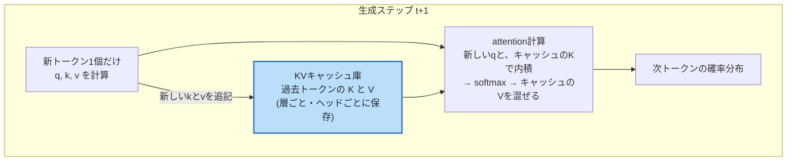
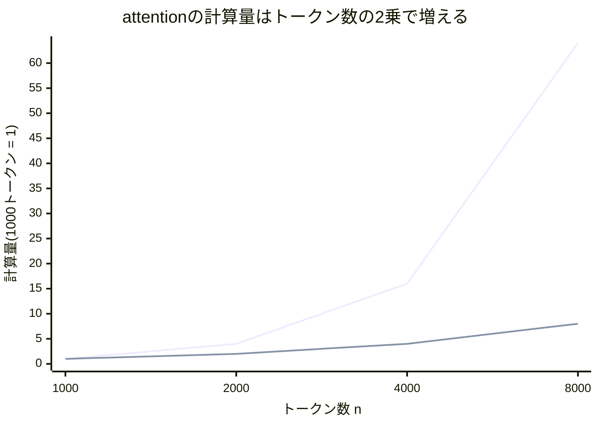
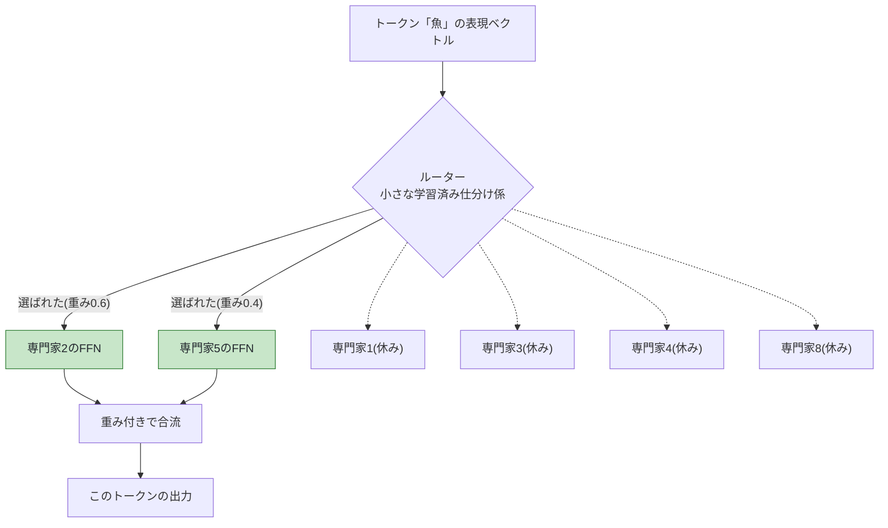

# 第15章 高速化・効率化の技術

## この章で学ぶこと

- 生成ループに潜む「同じ計算のやり直し」の無駄と、それを解消する **KVキャッシュ**
- attentionの計算量 **$O(n^2)$ 問題**(トークン数2倍で計算4倍)
- **FlashAttention**: GPUのメモリの読み書きこそがボトルネック、という視点の転換
- **MQA / GQA**: KVヘッドを共有してKVキャッシュを節約する
- 位置エンコーディングの進化: **RoPE**(回転で相対位置を表す)と **ALiBi**(距離ペナルティ)
- **量子化**: 数値の精度を落として軽くする(32bit → 8bit / 4bit)
- **蒸留**: 大きい先生モデルの出力を、小さい生徒モデルが真似る
- **LoRA**: 微調整を「低ランク行列の差分」だけで済ませる(第2章の行列がここで回収されます)
- **MoE(Mixture of Experts)**: 専門家集団に分けて、トークンごとに数人だけ働かせる
- **推論時スケーリング**: 訓練ではなく「使うとき」に計算を注ぎ込む新潮流
- 章末に「困りごと → 解決」の総まとめ表

## この章の前提

- [第2章](02-vectors-and-matrices.md): 行列積、行列の形($n \times d$)— LoRAとRoPEの理解に必須
- [第8章](08-attention.md): Q/K/V、スコア行列 $QK^\top$ 、Multi-Head Attention
- [第9章](09-transformer-architecture.md): FFN、位置エンコーディング、ブロックの積み重ね
- [第13章](13-scaling-laws.md): 推論コストという課題
- [第14章](14-text-generation.md): 自己回帰生成ループ、コンテキスト長と $n^2$ の壁

第13章で「推論コストがビジネスの生死を分ける」こと、第14章で「生成はループであり、コンテキスト長には $n^2$ の壁がある」ことを見ました。本章はその答え合わせです。巨大なTransformerを現実のサービスとして動かすための代表的な技術を、**「何が問題か → どう解くか → イメージ」** の3拍子で、ひとつずつ見ていきます。実装の細部には立ち入りません。「どういう困りごとに対する、どういう発想の解決策か」を持ち帰ってください。

---

## 15.1 KVキャッシュ — 生成ループの「計算のやり直し」をなくす

### 15.1.1 何が問題か: 毎ステップ全部計算し直している

第14章の自己回帰生成ループを思い出してください。1トークン生成するたびに、**伸びた列を丸ごと**モデルに入れ直していました。

```text
ステップ1: [猫, は, 魚, が] → 4トークンぶん計算 → 「好き」
ステップ2: [猫, は, 魚, が, 好き] → 5トークンぶん計算 → 「だ」
ステップ3: [猫, は, 魚, が, 好き, だ] → 6トークンぶん計算 → 「。」
```

おかしいと思いませんか。ステップ2で計算する「猫」「は」「魚」「が」の処理は、**ステップ1でやったのとまったく同じ**です。第8章の因果マスクを思い出してください — 各トークンは**自分より前しか見ない**ので、「猫」の計算結果は後ろに「好き」が付こうが付くまいが変わりません。つまり生成ループは、素朴にやると**過去の計算を毎回すべてやり直している**のです。100トークン目を作る頃には、1トークン目を100回計算し直している計算になります。

### 15.1.2 どう解くか: 過去のK/Vを保存して使い回す

attentionの計算で、過去のトークンから本当に必要なものは何かを整理しましょう。新しいトークン(たとえば5番目の「好き」)の処理でattentionがすることは:

1. 「好き」自身のクエリ $\mathbf{q}_5$ 、キー $\mathbf{k}_5$ 、バリュー $\mathbf{v}_5$ を作る
2. $\mathbf{q}_5$ と**過去全トークンのキー** $\mathbf{k}_1, \dots, \mathbf{k}_5$ の内積でスコアを出す
3. softmaxで重みにし、**過去全トークンのバリュー** $\mathbf{v}_1, \dots, \mathbf{v}_5$ を重み付き平均する

つまり過去のトークンについて必要なのは**キーとバリューだけ**です。そして因果マスクのおかげで、過去のトークンの $\mathbf{k}, \mathbf{v}$ は**未来永劫変わりません**。ならば答えは一つ — **一度計算したK/Vを保存(キャッシュ)しておき、次のステップでは使い回せばいい**。これが **KVキャッシュ(KV cache)** です。

図解します(本章の最重要図です)。



効果はどれくらいでしょうか。「各ステップで処理し直すトークン数」を数えて比べてみます。プロンプト4トークンから100トークン生成する場合:

| | キャッシュなし | キャッシュあり |
|---|---:|---:|
| ステップ1で処理するトークン数 | 4 | 4(初回はプロンプト全体を処理してキャッシュを作る) |
| ステップ2 | 5 | **1** |
| ステップ3 | 6 | **1** |
| … | … | … |
| ステップ100 | 103 | **1** |
| 合計(処理トークン数) | $4+5+\cdots+103 = 5{,}350$ | $4 + 99 = 103$ |

**約52倍の差**です。生成が長くなるほど差は開きます(キャッシュなしの合計はステップ数の2乗のペースで増えるため)。現代のLLMサービスで**KVキャッシュを使わない実装は事実上存在しません**。

### 15.1.3 イメージとトレードオフ: 「議事録」はタダではない

直感的には、KVキャッシュは**会議の議事録**です。毎回会議の冒頭から全員の発言をやり直す(キャッシュなし)代わりに、議事録(K/V)を残しておき、新しい発言者は議事録を読んで応答する(キャッシュあり)。

ただしタダではありません。**議事録の保管場所 = GPUメモリを食います**。どれくらい食うか、実際の規模で概算しましょう。中型モデル(層数32、 $d_{\text{model}} = 4096$)で、4096トークンの文脈を、16bit(2バイト)の数値で保持するとします。

$$
\text{キャッシュ量} = 2 \times 32 \times 4096 \times 4096 \times 2 \,\text{バイト} \approx 2.1 \,\text{GB}
$$

**読み下し**: KとVの2種類 × 32層 × 4096トークン × 1トークンあたり4096個の数値 × 1数値2バイトで、**利用者1人の1つの会話だけで約2.1ギガバイト**。

GPU 1枚のメモリは数十GBですから、数十人が同時に長い会話をするだけでメモリが尽きます。「計算時間をメモリで買う」— このトレードオフが、後述するMQA/GQA(15.4節)の直接の動機になります。

---

## 15.2 $O(n^2)$ 問題 — トークン数2倍で計算4倍

### 15.2.1 何が問題か

第14章の布石を正面から受け取ります。self-attentionはスコア行列 $QK^\top$ 、すなわち**全トークンペアの内積**を計算します(第8章)。トークン数 $n$ に対しペア数は $n^2$ 。この「入力が2倍になるとコストが4倍になる」性質を、**計算量のオーダー記法**で $O(n^2)$(オーダー・エヌ2乗)と書きます。記号は今日初めて出てきましたが、意味は「 $n$ が大きいとき、コストがだいたい $n^2$ に比例して増える」というだけです。

表で体感しましょう。1,000トークンの文書を基準にします。

| 扱いたい文脈 | トークン数 $n$(目安) | ペア数 $n^2$ | 計算量(1,000トークン比) |
|---|---:|---:|---:|
| ブログ記事1本 | 1,000 | $10^6$ | 1倍 |
| 短編小説 | 2,000 | $4 \times 10^6$ | **4倍** |
| 論文1本 | 8,000 | $6.4 \times 10^7$ | 64倍 |
| 中編小説 | 100,000 | $10^{10}$ | **10,000倍** |
| 長編小説全巻 | 1,000,000 | $10^{12}$ | 1,000,000倍 |

「本1冊をまるごと読ませたい」という自然な要望が、2乗の壁のせいで法外なコストになるのが分かります。しかもメモリも同じで、 $n \times n$ のスコア行列を素朴に持てば、10万トークンで $10^{10}$ 個の数値 — これだけでGPUメモリが吹き飛びます。

「比例($n$)」と「2乗($n^2$)」の増え方の違いを、グラフの形でも見ておきましょう。



上の急カーブが $n^2$(2乗: 加速しながら増える)、下の緩やかな線が $n$(比例: まっすぐ増える)です。FFNや埋め込みの計算はほぼ「比例」で伸びるのに対し、attentionのスコア計算だけが「2乗」で伸びる。文脈が長くなるほど、attentionが全コストの主犯になっていくのです。

### 15.2.2 どう解くか: 攻め口は複数ある

$O(n^2)$ との戦いには複数の戦線があります。本章では代表として、**計算のやり方を変える**FlashAttention(15.3節)、**キャッシュを軽くする**MQA/GQA(15.4節)、**長文でも位置情報が壊れないようにする**RoPE/ALiBi(15.5節)を見ます。このほか「全ペアではなく一部のペアだけ見る(疎なattention)」という方向もありますが、本書では名前の紹介に留めます。

---

## 15.3 FlashAttention — 「計算」ではなく「運搬」を減らす

### 15.3.1 何が問題か: GPUは計算よりメモリの読み書きが遅い

意外な事実から始めます。現代のGPUでは、**計算そのものより、データをメモリから運んでくる方が遅い**のです。GPUには2種類の記憶場所があります。

- **大きいが遅いメモリ**(HBM): 数十GB。モデルやデータの置き場
- **小さいが速いメモリ**(SRAM): 数十MB。計算装置のすぐ隣の作業台

料理にたとえると、HBMは「廊下の先の大型冷蔵庫」、SRAMは「まな板の横の小皿」です。素朴なattention実装は、 $n \times n$ の巨大なスコア行列を**いったん丸ごと冷蔵庫(HBM)に書き出し、softmaxのためにまた全部運んできて、また書き出して…** と、廊下を何往復もします。計算装置は運搬待ちで遊んでしまう。ボトルネックは計算(FLOP)ではなく**メモリの読み書き(運搬)** だったのです。

### 15.3.2 どう解くか: 小分けにして作業台の上で完結させる

**FlashAttention**(2022)の発想は、「スコア行列を丸ごと作らない」ことです。

- Q, K, Vを**小さなブロックに分割**し、1ブロックずつ作業台(SRAM)に載せる
- そのブロックに関する「スコア計算 → softmax → Vとの重み付き平均」を、**作業台の上で一気に済ませて**、結果だけを冷蔵庫に返す
- softmaxは本来「全体の合計」が要る計算ですが(第5章)、途中集計を持ち回って最後に辻褄を合わせる数学的な工夫で、ブロック分割でも**厳密に同じ答え**が出せます

### 15.3.3 イメージ

「材料を全部いっぺんに廊下から運んで床に広げる」のをやめ、「**小皿に取り分けて、まな板の上で調理まで終わらせる**」。計算の総量はほぼ同じでも、廊下の往復(メモリの読み書き)が桁で減るので、実測で数倍速くなり、しかも $n \times n$ 行列を保存しないのでメモリも $O(n^2)$ から解放されます。近似ではなく**答えは完全に同じ**、というのが実務で一気に普及した理由です。GPUの物理的な構造まで降りて考えると、数式を1つも変えずに数倍速くなる — 「効率化」の奥深さを象徴する例です。

---

## 15.4 MQA / GQA — キーとバリューのヘッドを共有する

### 15.4.1 何が問題か: KVキャッシュがメモリを食いすぎる

15.1.3節で見たとおり、KVキャッシュは1会話で数GBに達します。内訳を見ると、キャッシュ量は「ヘッド数ぶんのKとV」に比例します。第8章のMulti-Head Attentionでは、たとえば32個のヘッドそれぞれが自分専用のK/Vを持っていました。**32人の司書が、それぞれ専用の議事録を1部ずつ、合計32部保管している**状態です。

### 15.4.2 どう解くか: 議事録を共有する

- **MQA(Multi-Query Attention)**: クエリのヘッドは32個のまま、**K/Vは全ヘッドで1組だけ共有**します。議事録は1部だけ作り、32人の司書(それぞれ違う観点=クエリを持つ)が同じ議事録を読む。KVキャッシュは**32分の1**
- **GQA(Grouped-Query Attention)**: MQAだと共有が極端すぎて精度が下がることがあるため、中間を取ります。32個のクエリヘッドを8グループに分け、**グループごとに1組のK/V**(合計8組)。キャッシュは**4分の1**で、精度低下はごくわずか

| 方式 | クエリヘッド数 | K/Vの組数 | KVキャッシュ量(32ヘッド比) | 精度 |
|---|---:|---:|---:|---|
| 通常のMulti-Head(MHA) | 32 | 32 | 1倍(基準) | 基準 |
| GQA(8グループ) | 32 | 8 | 1/4 | ほぼ維持 |
| MQA | 32 | 1 | 1/32 | やや低下することがある |

### 15.4.3 イメージ

第8章で「ヘッドごとに見る観点(文法係・意味係…)が違う」と学びました。MQA/GQAの発見は、「**観点(クエリ)は多様であるべきだが、参照する資料(K/V)は共有してもさほど困らない**」ということです。15.1節のメモリ試算(2.1GB)がGQAで0.5GB程度になれば、同じGPUで4倍の利用者をさばけます。地味に見えて、サービスの経済性を直撃する技術です。

---

## 15.5 位置エンコーディングの進化 — RoPEとALiBi

### 15.5.1 何が問題か: 訓練より長い文脈で位置情報が壊れる

第9章で、attentionは語順を知らないため**位置エンコーディング**を足すと学びました(sin/cos版や学習型)。しかし従来方式には弱点があります。「位置3000番」を訓練中に一度も見ていないモデルは、3000番の位置信号をうまく扱えません。**コンテキスト長を後から伸ばしたい**(第14章)のに、位置の表現がそれを妨げるのです。また、直感的には「絶対的な番地」より「**2つのトークンがどれだけ離れているか(相対位置)**」の方が言語には本質的です。「猫は」と「好き」の関係は、それが文書の10番目にあろうが1万番目にあろうが同じはずですから。

### 15.5.2 どう解くか(1): RoPE — ベクトルを回転させる

**RoPE(Rotary Position Embedding、回転位置埋め込み)** は、現在もっとも広く使われる方式です。発想は巧妙です。

- 位置情報を「足す」のではなく、クエリとキーのベクトルを**位置に比例した角度だけ回転させます**。位置1なら10度、位置2なら20度、位置3なら30度…という具合です(角度は例えです。実際は次元のペアごとに異なる速さで回します)
- ここで第2章の内積の幾何を思い出してください。**内積は2つのベクトルのなす角で決まる**のでした。位置 $m$ のクエリを $m \times 10$ 度、位置 $n$ のキーを $n \times 10$ 度回すと、2つのなす角の変化は $(m - n) \times 10$ 度 — **差だけ**に依存します
- つまりattentionスコア(QとKの内積)が、自動的に**相対位置 $m - n$ の関数**になるのです。絶対番地は消え、「どれだけ離れているか」だけが残ります

時計の針をイメージしてください。2本の針をそれぞれ「自分の位置ぶん」回しても、**針と針の間の角度は「位置の差」だけで決まります**。

```text
【RoPEのイメージ: 回しても「間の角度」は変わらない】

  ペア1: 位置1と位置3(それぞれ10度・30度回転)

        k
       /            <- キー k は30度の向き
      /
     /______ q      <- クエリ q は10度の向き
    o
                    なす角 = 30 - 10 = 20度

  ペア2: 位置5と位置7(それぞれ50度・70度回転)

      k  q
      | /           <- キー k は70度、クエリ q は50度の向き
      |/
      o
                    なす角 = 70 - 50 = 20度

  どちらのペアも「2トークン離れている」ので、なす角(=内積への影響)は同じ。
  絶対位置(1と3か、5と7か)は消えて、相対位置(差が2)だけが残る。
```

だから、訓練で見たことのない絶対位置に置かれても、「差」が訓練範囲内なら関係は保たれます。この性質のおかげで、RoPEは長文脈化(訓練後にコンテキスト長を伸ばす改造)とも相性がよいのです。

### 15.5.3 どう解くか(2): ALiBi — 遠いほど減点する

**ALiBi(Attention with Linear Biases)** はさらに単純です。位置ベクトルを一切使わず、attentionスコアに**距離に比例したペナルティを直接引き算します**。

$$
\text{スコア}_{ij} = \mathbf{q}_i \cdot \mathbf{k}_j - m \times (i - j)
$$

**読み下し**: トークン $i$ から $j$ へのattentionスコアは、通常の内積から「傾き $m$ × 2トークンの距離」を引いたもの。遠いトークンほど減点され、softmax後の重みが小さくなる。

数値例: $m = 0.5$ で、内積がすべて2.0だったとすると、距離1のトークンへのスコアは $2.0 - 0.5 = 1.5$ 、距離4なら $2.0 - 2.0 = 0$ 。「基本は近くを見る、ただし内積が強ければ遠くも見る」という自然な傾向が生まれます。仕組みが単純なぶん、訓練より長い文脈への外挿に強いのが持ち味です。

### 15.5.4 イメージ

両者に共通する考え方は「**絶対番地をやめ、相対関係を直接扱う**」です。住所(絶対位置)ではなく「隣の家」「3軒先」(相対位置)で考えれば、どんなに長い通りでも同じルールが使えます。

---

## 15.6 量子化 — 数値の精度を落として軽くする

### 15.6.1 何が問題か: モデルが大きすぎてGPUに載らない

パラメータ数 $N$ のモデルは、1パラメータを32bit(4バイト)の小数で持つと $4N$ バイトのメモリを占めます。70億(7B)パラメータの中型モデルでも:

$$
7 \times 10^9 \times 4 \,\text{バイト} = 28 \,\text{GB}
$$

**読み下し**: 70億パラメータ × 4バイトで28ギガバイト。家庭用GPU(メモリ8〜24GB)にはこの時点で載らない。

### 15.6.2 どう解くか: 1個あたりのビット数を削る

**量子化(quantization)** は、パラメータの数値の**表現精度を粗くする**ことでメモリを削ります。

- 32bit浮動小数点(約7桁の精度)→ **8bit整数**(256段階)→ **4bit**(16段階)
- 7Bモデルなら 28GB → 7GB → **3.5GB**。ノートPCでも動く大きさになります
- 単に丸めるだけでなく、「値の分布に合わせて段階の割り当てを最適化する」「重要な一部のパラメータだけ高精度で残す」などの工夫で、精度低下を最小限にします

小数の桁数の比喩がぴったりです。円周率を 3.14159265(32bit)ではなく 3.14(8bit)や 3(4bit)で覚えるようなものです。設計図の寸法なら3.14で十分な場面は多い — LLMのパラメータも同様で、**多少粗くても答えはほとんど変わらない**ことが実験的に分かっています。数億個のパラメータの「合議」で答えが決まるので、1個1個の細かい端数はノイズに埋もれるのです。

具体的に丸めてみましょう。ある重み行列の一部が次の値だったとします。4bit量子化では、たとえば「 $-1.0$ から $+1.0$ を16等分した目盛(幅0.125)」のうち、いちばん近いものに各値を吸着させます。

| 元の値(32bit) | 4bit量子化後(0.125刻み) | 誤差 |
|---:|---:|---:|
| 0.7231 | 0.750 | +0.027 |
| −0.4867 | −0.500 | −0.013 |
| 0.0912 | 0.125 | +0.034 |
| −0.9105 | −0.875 | +0.036 |

1個1個には最大0.06程度の誤差が入りますが、誤差の向きはバラバラなので、第2章で学んだ内積(掛けて足す)を取ると**プラスとマイナスの誤差が打ち消し合い**、層の出力はほとんど変わりません。これが「桁を削っても合議の結論は変わらない」ことの数値的な正体です。

| 精度 | 1パラメータ | 7Bモデルの重さ | 品質の目安 |
|---|---:|---:|---|
| 32bit(訓練時の標準) | 4バイト | 28 GB | 基準 |
| 16bit | 2バイト | 14 GB | ほぼ劣化なし(推論の事実上の標準) |
| 8bit | 1バイト | 7 GB | わずかな劣化 |
| 4bit | 0.5バイト | 3.5 GB | 用途によっては体感できる劣化 |

おまけに、メモリが減ると**速度も上がります**。15.3節で見たとおりボトルネックは運搬なので、運ぶデータが半分になれば読み書きも速くなるのです。

---

## 15.7 蒸留 — 先生の「迷い方」ごと真似る

### 15.7.1 何が問題か: 大きいモデルは賢いが、運用が高くつく

第13章で見たとおり、賢さは規模から来ます。しかし推論コストも規模に比例します。「大きいモデルの賢さを、小さいモデルの値段で」使えないでしょうか。

### 15.7.2 どう解くか: 先生の確率分布を教材にする

**蒸留(distillation)** では、訓練済みの大きい**先生モデル(teacher)** の出力を、小さい**生徒モデル(student)** の訓練データにします。鍵は「答え」だけでなく**確率分布ごと**教えることです。

「猫は魚が」の次を予測させたとき:

| | 好き | 大好き | 苦手 | 食べ |
|---|---:|---:|---:|---:|
| 普通の正解ラベル(one-hot) | 1 | 0 | 0 | 0 |
| 先生モデルの出力分布 | 0.50 | 0.20 | 0.10 | 0.05 |

普通の訓練(第10章)は上の行 — 「正解は『好き』、他は全部ダメ」しか教えません。蒸留は下の行を教えます。そこには「**『大好き』もかなりあり得る。『苦手』も文法的には成立する**」という、先生が長い訓練で獲得した**単語同士の関係の知識**が丸ごと写っています。生徒は「先生の分布に自分の分布を近づける」ように訓練され(距離の測り方は第5章の交差エントロピーの親戚です)、正解ラベルだけから学ぶより効率よく賢くなります。

### 15.7.3 イメージ

名人の将棋を学ぶとき、「最善手はこれ」という結果だけの棋譜より、「**この手が7割、あの手も2割はあった**」という迷い方まで聞ける弟子の方が早く強くなる — 蒸留はそういう技術です。実務では、旗艦モデルの品質をスマホやエッジ機器に運ぶ標準手段になっています。

---

## 15.8 LoRA — 微調整を「細長い行列の差分」で(第2章の回収)

### 15.8.1 何が問題か: 微調整のたびにモデル丸ごと1個ぶんのコストがかかる

第12章で学んだSFTなどの**微調整**は、全パラメータを更新します。すると:

- 訓練時、全パラメータぶんの勾配や最適化の作業領域が必要(メモリ大)
- 用途ごと(法律用・医療用・社内用…)に微調整すると、**用途の数だけモデル丸ごとのコピー**(7Bなら各14GB〜)を保存する羽目になる

### 15.8.2 どう解くか: 更新ぶんを「細長い行列2枚の積」で表す

**ここで第2章の行列の知識がフルに回収されます**。微調整によるパラメータの変化を、元の重み行列 $W$ への**差分** $\Delta W$(デルタW)と書くと、微調整後の重みは $W + \Delta W$ です。**LoRA(Low-Rank Adaptation、低ランク適応)** の賭けはこうです。

> [!NOTE]
> 微調整で必要な変化 $\Delta W$ は、実はごく単純な構造しか持たないのではないか。ならば $\Delta W$ を**2枚の細長い行列の積**で近似できるはずだ。

$$
W' = W + BA
$$

**読み下し**: 微調整後の重み $W'$ は、元の重み $W$(凍結して動かさない)に、行列 $B$ と $A$ の積を足したもの。 $W$ が $d \times d$ の正方形なら、 $B$ は $d \times r$ の縦長、 $A$ は $r \times d$ の横長で、 $r$(ランク)は8や16などの小さい数。

第2章で学んだ行列積の形を確認しましょう。 $d \times r$ 行列と $r \times d$ 行列の積は、ちゃんと $d \times d$ 行列になります(掛け算できる条件「内側の次元が一致」もOK)。つまり $BA$ は $W$ と同じ形で、堂々と足し算できます。

```text
          W               B          A                BA
  +---------------+      +--+   +----------+   +---------------+
  |               |      |  |   |          |   |               |
  |  4096 x 4096  |  +   |  | x | 8 x 4096 | = |  4096 x 4096  |
  |               |      |  |   +----------+   |               |
  +---------------+      +--+                  +---------------+

  W  = 元の重み。4096 x 4096 = 約1678万個(凍結して動かさない)
  B  = 縦長で薄い行列(4096 x 8)
  A  = 横長で薄い行列(8 x 4096)
  BA = W と同じ形(4096 x 4096)だが中身は単純
  学習するのは B と A の中身だけ(合計 約6.6万個)
```

パラメータ数を数えます。 $d = 4096$ 、 $r = 8$ とすると:

- 元の $W$: $4096 \times 4096 = 16{,}777{,}216$ 個(約1678万)
- $B$: $4096 \times 8 = 32{,}768$ 個、 $A$: $8 \times 4096 = 32{,}768$ 個、合計 $65{,}536$ 個

$$
\frac{65{,}536}{16{,}777{,}216} \approx 0.39\%
$$

**読み下し**: 学習するパラメータは元の**0.4%未満**。それでも多くの微調整タスクで、全パラメータ更新に匹敵する品質が出る。

### 15.8.3 イメージとうれしい性質

直感的には、LoRAは「**分厚い辞書(W)には手を入れず、薄い正誤表・追補(BA)だけを挟む**」方法です。微調整で変えたいことは「口調を丁寧に」「社内用語を覚える」など、元の知識の総量に比べれば**低次元の変化**なので、薄い追補で足りるのです。

うれしい性質が3つあります。

1. **保存が軽い**: 用途ごとに保存するのは $B, A$ だけ(数十MB)。7Bモデル100用途でも、本体1個+薄い差分100枚で済む
2. **推論時の追加コストをゼロにできる**: 配備時に $W' = W + BA$ を先に足し込んで1枚の行列にしてしまえば、通常のモデルと完全に同じ速度で動く
3. **付け替え自由**: 差分だけ差し替えれば、同じ本体を法律用にも医療用にも変身させられる

量子化した本体にLoRAを組み合わせる手法(QLoRA)により、「家庭用GPU1枚でLLMを微調整する」ことすら現実になりました。第2章の「行列の形と積の定義」という地味な知識が、巨大モデルの民主化を支えている — 本書でも特に印象的な回収です。

---

## 15.9 MoE — 専門家集団に分けて、数人だけ働かせる

### 15.9.1 何が問題か: パラメータを増やすと計算も比例して増える

第13章のスケーリング則は「パラメータを増やせば賢くなる」でした。しかし普通のTransformerは**全パラメータが全トークンの処理に参加する**ため、賢さ(パラメータ)を増やすと計算コストも比例して増えます。「知識はたくさん持ちたい、でも1トークンあたりの計算は増やしたくない」— 虫のいい願いですが、叶える方法があります。

### 15.9.2 どう解くか: FFNを専門家に分割し、ルーターで振り分ける

第9章で「FFNは知識を蓄え、引き出す係」と学びました。**MoE(Mixture of Experts、専門家混合)** は、このFFNを**複数の専門家(expert)FFNに分割**し、トークンごとに**ルーター(router)** という小さな学習済みの仕分け係が「どの専門家に処理させるか」を選びます。



たとえば「8人の専門家から2人だけ選ぶ」設計なら:

- **パラメータ総数**: FFN 8個ぶん(たっぷり) — モデルが「知っていること」は多い
- **1トークンの計算量**: FFN 2個ぶんだけ — 働くのは選ばれた2人だけ

実例として、公開モデルMixtral 8x7Bは総パラメータ約467億に対し、1トークンの処理に使われるのは約129億ぶん — **4分の1程度の計算コストで、総パラメータぶんに近い知識量**を実現しています。GPT-4もMoE構成だと広く推定されています(非公開)。

### 15.9.3 イメージと代償

直感的には**大病院**です。病院全体には何百人もの専門医がいます(巨大な知識)が、あなたが受診するのは症状に応じた2人だけ(小さい計算)。全員があなたを診る必要はないのです。

代償も正直に: 選ばれない専門家のぶんも**メモリには全員載せておく**必要があります(計算は節約できてもメモリは節約できない)。また、ルーターが特定の専門家ばかり指名しないよう、訓練に「仕事を均等に配る」工夫が要ります。

---

## 15.10 推論時スケーリング — 「使うとき」に計算を注ぎ込む

最後に、本章のここまでと逆向きの潮流に触れます。ここまでは「同じ賢さをより安く」でした。近年は「**推論時に計算を追加で使って、より賢く**」という方向(**推論時スケーリング / test-time scaling**)が注目されています。

- **長く考えさせる**: 第14章の思考の連鎖(CoT)を長く伸ばし、答えの前に大量の検討トークンを生成させる
- **たくさん作って選ぶ**: 同じ問題への答えをサンプリングで多数生成し、多数決や検証器(答えを採点する別モデル)で選ぶ
- 第13章のスケーリング則が「訓練の計算量と性能」の法則だったのに対し、こちらは「**推論の計算量と性能**」にも同様のスケーリングが見られる、という発見です

「即答させれば1円、じっくり考えさせれば10円、ただし正答率は大きく上がる」— 賢さが訓練時に固定されるのではなく、**使うときに計算量で買える**ようになりつつある。効率化(安くする)と推論時スケーリング(あえて使う)は、同じ「推論計算」という資源の配分問題の裏表です。概要の紹介に留めますが、本書執筆時点でもっとも動きの速い研究領域の一つです。

---

## 15.11 総まとめ — 困りごとと解決の対応表

本章の技術を「困りごと → 解決」の形で一覧にします。この表が本章の要約です。

| 困りごと | 解決技術 | 一言でいうと | 主な代償 |
|---|---|---|---|
| 生成のたびに過去の計算をやり直している | **KVキャッシュ** | 過去のK/Vは不変なので保存して使い回す | GPUメモリを食う |
| トークン数2倍で計算4倍($O(n^2)$) | **FlashAttention** など | スコア行列を丸ごと作らず小分けに処理、メモリ往復を削減 | 実装が複雑(答えは厳密に同じ) |
| KVキャッシュがメモリを食いすぎる | **MQA / GQA** | K/Vをヘッド間で共有(議事録の共有) | 極端に共有すると精度低下 |
| 訓練より長い文脈で位置情報が壊れる | **RoPE / ALiBi** | 絶対番地をやめ、回転や距離ペナルティで相対位置を表す | — |
| モデルがGPUに載らない・運搬が遅い | **量子化** | 数値の桁数を削る(32bit→8/4bit) | 粗くしすぎると品質低下 |
| 大モデルは賢いが運用が高い | **蒸留** | 先生の確率分布ごと小モデルに写す | 先生の実行コスト、品質上限は先生まで |
| 微調整のたびにモデル丸ごとのコスト | **LoRA** | 差分を細長い行列2枚($W + BA$)で学習 | 大改造には向かない |
| 知識を増やすと計算も比例して増える | **MoE** | 専門家に分けて数人だけ働かせる | メモリは全員ぶん必要、訓練が難しい |
| もっと賢い答えがほしい(コスト許容) | **推論時スケーリング** | 生成時に長考・複数案・検証で計算を追加投入 | 応答が遅く高くなる |

---

## この章のまとめ

- 効率化の議論は常に「**何がボトルネックか**」の特定から始まる。計算量とは限らず、メモリ容量(KVキャッシュ、量子化)、メモリの読み書き速度(FlashAttention)、保存コスト(LoRA)がボトルネックのこともある
- **KVキャッシュ**は生成ループの計算のやり直しをなくす必須技術。因果マスクのおかげで過去のK/Vが不変であることが根拠。代償はメモリで、それを**MQA/GQA**(K/V共有)が軽くする
- attentionの**$O(n^2)$**は長文脈化の最大の壁。**FlashAttention**は数式を変えずにGPUの運搬を減らして数倍速くする
- **RoPE**は回転の幾何(内積は角度差で決まる — 第2章)で相対位置を表し、**ALiBi**は距離ペナルティで代替する
- **量子化**(桁を削る)・**蒸留**(先生の分布を写す)・**LoRA**($W+BA$ 、学習は元の1%未満 — 第2章の行列積の回収)・**MoE**(専門家の一部だけ稼働)が、巨大モデルを現実のコストに収める
- 逆向きの潮流として、推論時に計算を注ぎ込んで賢さを買う**推論時スケーリング**が台頭している

## 次の章へ

これで、本書で予定していた技術の解説はすべて終わりです。数の並べ方(第2章)から始まり、attentionの発明(第8章)、訓練(第10章)、対話AI化(第12章)、規模の法則(第13章)、生成(第14章)、そして現実に動かす工夫(本章)まで — ばらばらに見えた部品が、いまやあなたの中で1本につながっているはずです。[第16章 まとめと次の一歩](16-conclusion-and-next-steps.md)では、全16章を1枚の地図として振り返り、よくある質問に答え、この先の学習ロードマップと用語集をお渡しします。
