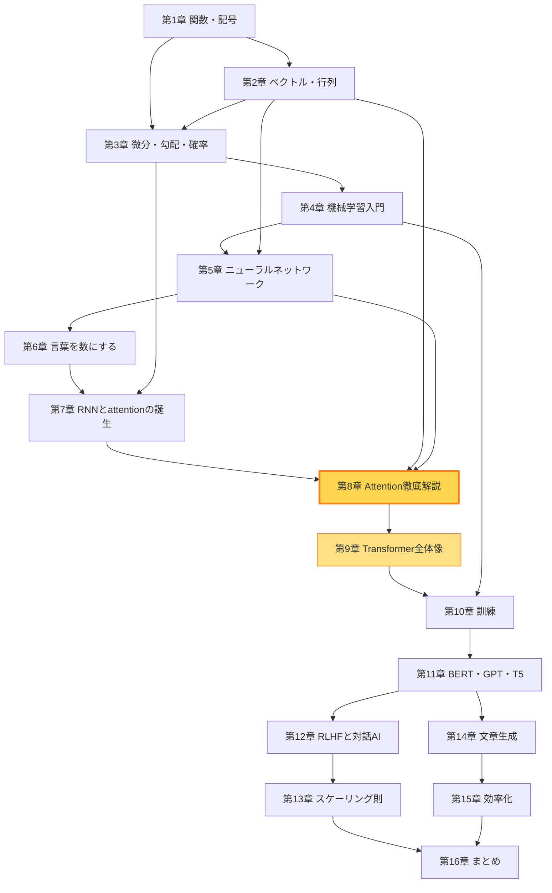
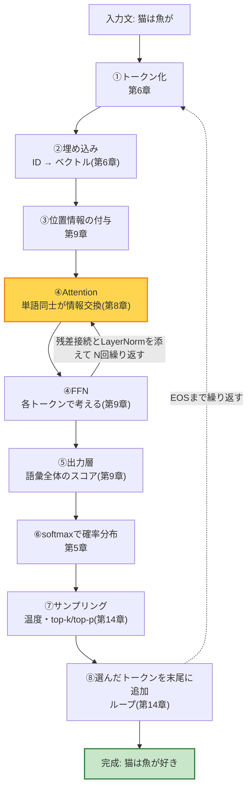

# 第16章 まとめと次の一歩 + 用語集

## この章で学ぶこと

- 全16章の旅の振り返り: 知識依存マップの再掲と、各章が「何のためにあったか」の総復習
- **「1枚で振り返るTransformer」**: 入力文からサンプリングまでの全行程を、1つの図と1つのストーリーで
- よくある質問(FAQ): 「Transformerは意味を理解しているの?」など、学び終えた今だからこそ答えられる問い
- ここから先の学習ロードマップ(原論文・定番教材・実装入門、URL付き)
- **用語集**: 本書に登場した用語の1〜2行定義(困ったときの索引として)

## この章の前提

本書の全章([第1章](01-functions-and-symbols.md)〜[第15章](15-efficiency.md))。この章は新しいことをほとんど教えません。あなたがすでに持っている知識を、棚卸しして、地図にして、お渡しする章です。

---

## 16.1 旅の振り返り — 知識依存マップと各章の役割

### 16.1.1 知識依存マップ(再掲)

本書の冒頭(README)で示した地図を、もう一度掲げます。あのときは「これから登る山の見取り図」でしたが、いまのあなたには「歩いてきた道の記録」として見えるはずです。



テキスト版の地図も再掲します(Mermaidが表示されない環境の読者のため。内容は同じです)。

```text
【第I部 基礎編】                【第II部 入門編】           【第III部 応用編】

 第1章 関数・記号
   ├──> 第2章 ベクトル・行列 ──┬──────────────┐
   └──> 第3章 微分・勾配・確率 │              │
              │               │              │
              v               │              │
        第4章 機械学習 ────────┼──────┐       │
              │               │      │       │
              v               │      │       │
        第5章 ニューラルネット ─┘      │       │
              │                      │       │
              v                      │       v
        第6章 言葉を数にする ─> 第7章 RNN ─> ★第8章 Attention★
                                             │
                                             v
                                      第9章 Transformer全体像
                                             │
              ┌──────────────────────────────┘
              v
        第10章 訓練 ─> 第11章 BERT/GPT/T5 ─> 第12章 RLHF ─> 第13章 スケーリング則
                              │                                      │
                              └─> 第14章 文章生成 ─> 第15章 効率化 ──┴─> 第16章 まとめ(本章)
```

### 16.1.2 各章は何のためにあったか — 1〜2行ずつの総復習

**第I部 基礎編 — 数学と機械学習の土台**

- **[第1章 関数と記号](01-functions-and-symbols.md)**: $f(x)$・指数・対数・$\Sigma$・$\arg\max$ という「読み書きの道具」を揃えました。対数は第5章の交差エントロピーと第13章の両対数グラフで、関数合成は第3章の連鎖律と第5章の多層NNで効きました。
- **[第2章 ベクトルと行列](02-vectors-and-matrices.md)**: 「**内積 = 類似度**」という本書最重要の直感を手に入れました。これが第8章のQとKの内積、第6章の埋め込みの近さ、第15章のLoRA($W+BA$)とRoPEを支えました。
- **[第3章 微分・勾配・確率](03-derivatives-gradients-probability.md)**: 「傾きを下れば谷底に着く」(勾配)、「合成関数の変化率は掛け算」(連鎖律)、「次の単語は確率分布」という3つの見方を獲得。それぞれ第4章・第5章・第7章以降の主役になりました。
- **[第4章 機械学習入門](04-machine-learning-basics.md)**: 「学習 = 損失関数を勾配降下法で下げる良いパラメータ探し」という枠組み。過学習の常識は、第13章で「破られる常識」として再登場しました。
- **[第5章 ニューラルネットワーク](05-neural-networks.md)**: 層・活性化関数・**softmax**・交差エントロピー・逆伝播。softmaxは第8章のattention重みと第14章の温度で、二度主役を張りました。

**第II部 入門編 — 言葉を数にしてTransformerへ**

- **[第6章 言葉を数にする](06-words-to-numbers.md)**: トークン化(サブワード)と**埋め込み**。「意味が近い単語はベクトルも近い」により、言葉が第2章の数学の土俵に乗りました。
- **[第7章 Transformer前夜](07-before-transformer.md)**: 言語モデルの定義、RNNの逐次処理と勾配消失、seq2seqのボトルネック、そしてattentionの誕生。「なぜTransformerが必要だったか」の歴史的必然を学びました。
- **[第8章 Attention徹底解説](08-attention.md)**: 本書の山場。Q/K/V、$\mathrm{softmax}(QK^\top/\sqrt{d_k})V$、Multi-Head、因果マスク。「各単語が他の単語から情報を集める」仕組みを手計算で完全に追いました。
- **[第9章 Transformerの全体像](09-transformer-architecture.md)**: 位置エンコーディング・残差接続・LayerNorm・FFNを加えて、ブロックを $N$ 段積む全体像が完成。「attentionが混ぜ、FFNが考える」役割分担も学びました。

**第III部 応用編 — LLMの世界へ**

- **[第10章 Transformerを訓練する](10-training.md)**: 次単語予測という**自己教師あり学習**により「Webの全文章が教材になる」革命。教師強制と因果マスクで全位置同時に採点できることも学びました。
- **[第11章 三つの系譜](11-bert-gpt-t5.md)**: エンコーダのみ(BERT)・デコーダのみ(GPT)・両方(T5)。生成できてスケールしやすいデコーダのみが主流となり、「LLM = 巨大なデコーダのみTransformer」に着地しました。
- **[第12章 LLMから対話AIへ](12-from-llm-to-chat-ai.md)**: 「続きを書く機械」を、SFTとRLHF(報酬モデル+強化学習)で「指示に従う助手」に仕立てる方法。幻覚とアライメントという課題も導入しました。
- **[第13章 スケーリング則と創発](13-scaling-laws.md)**: 損失はべき乗則で予測可能に下がる(両対数グラフで直線)。Chinchilla則「モデルを小さくデータを増やせ」と、創発をめぐる論争を公平に見ました。
- **[第14章 文章を生成する仕組み](14-text-generation.md)**: 自己回帰ループ、貪欲法・温度・top-k/top-p・ビームサーチ。「良い文章 ≠ 確率最大の文章」という発見と、思考の連鎖まで。
- **[第15章 高速化・効率化の技術](15-efficiency.md)**: KVキャッシュ・FlashAttention・MQA/GQA・RoPE・量子化・蒸留・LoRA・MoE。「何がボトルネックか」から出発する工学の考え方を学びました。

---

## 16.2 1枚で振り返るTransformer

### 16.2.1 全行程の図(本章の最重要図)

「猫は魚が」と入力してから「好き」が返ってくるまで — 本書で学んだすべてを、1枚に圧縮します。まずASCIIで。

```text
┌─────────────────────────────────────────────────────────────────┐
│                「猫は魚が」→「好き」ができるまで                     │
└─────────────────────────────────────────────────────────────────┘

  入力文 「猫は魚が」
     │
     v
 ①トークン化(第6章) ─────────  [猫][は][魚][が] → ID列 [3049, 12, 887, 30]
     │
     v
 ②埋め込み(第6章) ──────────  各IDを埋め込み行列Eの行に変換
     │                          → 4本のベクトル(n × d_model の行列 X)
     v
 ③位置情報を付与(第9章) ────  「何番目か」の情報を混ぜ込む
     │                          (sin/cos、学習型、またはRoPE)
     v
 ┌───────────────────────────────────┐
 │ ④Transformerブロック(第8・9章)   │ ×N段(数十回)繰り返す
 │                                   │
 │   Multi-Head Attention(因果マスク付き)│ ← 単語同士が情報を交換
 │     + 残差接続 + LayerNorm         │    「が」が「魚」「猫」を見る
 │            │                      │
 │            v                      │
 │   FFN(各トークン独立の2層NN)      │ ← 集めた情報で「考える」
 │     + 残差接続 + LayerNorm         │    知識を引き出す
 └───────────────────────────────────┘
     │
     v
 ⑤出力層(第9章) ────────────  最後のトークン「が」の位置のベクトルを
     │                          線形層で語彙5万個のスコアに変換
     v
 ⑥softmaxで確率分布(第5章)──  好き:0.50 大好き:0.20 苦手:0.10 …
     │
     v
 ⑦サンプリング(第14章) ─────  温度・top-k/top-p のくじ引きで1個選ぶ
     │                          → 「好き」
     v
 ⑧末尾に追加してループ(第14章)  [猫,は,魚,が,好き] → ④へ戻る
                                 (EOSが出たら文章完成)

  ※ この全行程で使われる重み(E, W_Q, W_K, W_V, W_O, FFNのW₁W₂ …)は
    すべて第10章の次単語予測 + 第12章のSFT/RLHFで学習済み。
    生成中は1ミリも変わらない。
```

同じ流れをMermaidでも示します。



### 16.2.2 同じ行程を、ことばのストーリーで

数式抜きで、この図を物語として語り直します。これがあなたの持ち帰る「Transformerの一言サマリー」です。

> 文章はまず**部品(トークン)に割られ、それぞれが数百個の数の並び(ベクトル)になる**。ベクトルには「何番目にいたか」の印が付けられる。ここからが本番で、**attentionによって単語たちは互いを見合い、「自分に関係の深い単語」から情報を集めて自分の意味を更新する**(「が」は「魚」と「猫」を見て、「魚についての好みの話が来るぞ」という文脈を吸い込む)。集めた情報をFFNが咀嚼する。この「見合って、考える」を数十回繰り返すと、最後のトークンのベクトルには**文脈全体のエッセンス**が詰まっている。それを語彙全体と照合して **「次に来る単語の確率分布」** を作り、くじ引きで1語選ぶ。選んだ語を文末に足して、同じことを繰り返す — ただそれだけの装置が、Webの全文章で「次の単語当て」を数兆回練習した結果、翻訳も要約も対話もこなすようになった。

「ただの次単語当てがなぜここまで?」という驚きは、本書を読み終えた今も残っていていいのです。それは世界中の研究者にとっても、いまだ完全には説明のついていない驚きなのですから。

### 16.2.3 本書全体を貫く問いへの、あなたの答え

本書の冒頭(README)で、こう約束しました。

> **「猫は魚が___」の空欄に入る言葉を、機械はどうやって予測するのか?** — この問いに完全に答えられるようになったとき、あなたはTransformerを理解しています。

いま、答え合わせができます。模範解答は16.2.1の図そのものですが、一段掘り下げた各論への答えも、あなたはすべて持っています。

| 問いの分解 | 答え(学んだ章) |
|---|---|
| 「猫」「は」…を機械はどう受け取る? | サブワードに割ってID化し、埋め込みベクトルにする(第6章) |
| 「魚が」の意味が文脈で変わることにどう対応? | attentionで他の単語から情報を集め、ベクトルを文脈化する(第8章) |
| 語順はどこで考慮される? | 位置エンコーディング(第9章)またはRoPE(第15章) |
| 「予測」とは数学的に何をすること? | 語彙全体にわたる条件付き確率分布 $P(w \mid \text{文脈})$ を出すこと(第3・7章) |
| その確率分布はどう作られた? | Web規模の次単語予測を勾配降下法で訓練(第4・10章) |
| 分布から1語をどう選ぶ? | 温度・top-k/top-pのサンプリング(第14章) |

この表を白紙から自力で再現できたら、本書の目標は完全に達成されています。

---

## 16.3 よくある質問(FAQ)

学び終えた今だからこそ、解像度高く答えられる質問集です。

### Q1. Transformerは言葉の「意味」を理解しているのですか?

「理解」の定義によります、というのが誠実な答えです。**事実として言えること**: モデルの中に辞書や文法書はなく、あるのは第10章で学習された数億〜数兆個のパラメータだけです。一方で、埋め込み空間では意味の近い単語が近くに配置され(第6章)、attentionは「それ」が何を指すかを一貫して解決します(第8章)。「人間と同じ理解」ではないが「統計的なオウム返し」と切り捨てるには構造が豊かすぎる — 現在の科学は、この中間のどこかを測りかねている段階です。

### Q2. なぜ日本語も英語もプログラムコードも、同じ仕組みで扱えるのですか?

Transformerが**言語について何も決め打ちしていない**からです。本書を振り返ると、日本語の文法に依存した部品は一つもありませんでした。あるのは「トークン列を受け取り、次のトークンの分布を出す」という枠組みだけ(第6・10章)。トークンにできるものなら、英語でもコードでも楽譜でも、同じ機械に流し込めます。言語ごとの違いは、すべて**データからパラメータへ**吸収されます。

### Q3. 「パラメータ」って、結局のところ何なのですか?

モデルの中の**学習で決まった数値**の総称です(第4章 $\theta$)。具体的な置き場所は第9章で一覧にしました: 埋め込み行列 $E$、各層の $W_Q, W_K, W_V, W_O$、FFNの $W_1, W_2$、LayerNormの微調整係数、出力層。 「7Bモデル」とは、これらの数値が合計70億個ある、という意味です。知識も文法も推論の癖も、すべてこの数値の集まりとして保存されています。

### Q4. ChatGPTとTransformerはどういう関係ですか?

Transformerは**設計図(アーキテクチャ)**、ChatGPTは**その設計図で作られた製品**です。正確には、①デコーダのみ構成のTransformer(第11章)を、②Web規模の次単語予測で事前学習し(第10章、これがGPT)、③SFTとRLHFで対話用に仕立て(第12章)、④サンプリング付きの生成ループ(第14章)と効率化技術(第15章)を載せてサービス化したもの、が ChatGPT を含む対話AIの標準的な作りです。

### Q5. 同じ質問なのに、毎回ちがう答えが返ってくるのはなぜ?

第14章の**温度付きサンプリング**が理由です。モデルの出す確率分布は毎回同じでも、そこからの「くじ引き」の結果が毎回違うのです。温度を0にすれば(貪欲法)ほぼ毎回同じ答えになりますが、文章は無難で単調になります。ゆらぎはバグではなく、意図された仕様です。

### Q6. LLMはなぜ自信満々に嘘をつく(幻覚を起こす)のですか?

仕組みを思い出してください。モデルは「**それらしい続きを出す**」ように訓練されており(第10章)、「知らないときに黙る」ようには訓練されていません。確率分布は常に何かを出力しますし、サンプリングはそこから必ず1語選びます(第14章)。「知識がない」状態と「もっともらしい語の連なり」の区別が、仕組みのどこにも組み込まれていないのです。RLHF(第12章)で「分かりませんと言う」方向に矯正はできますが、根治はしていません(第13章)。

### Q7. 計算や文字数えが苦手なのはなぜですか? 電卓より高性能なコンピュータで動いているのに。

理由は2つあります。①トークン化(第6章)の副作用: 第6章で学んだサブワード分割は数字にも容赦なく適用されるため、モデルは「12345」を数字5個の並びではなく1〜2個の塊として見ており、桁の構造が見えにくいのです(数字の扱いは本書では詳しく触れませんでしたが、トークン化の仕組みからの自然な帰結です)。②1トークンあたりの計算量が固定(第14章で学びました): 何段もの筆算をひと呼吸で終えることはできない。だからこそ途中式を書かせる思考の連鎖(CoT)が効くのでした。「コンピュータの上で動いているのに計算が苦手」なのではなく、「**計算機の上に、計算とは別の目的の統計的機械が載っている**」のです。

### Q8. 会話の内容をモデルは「学習」しているのですか?

生成中、パラメータは一切変わりません(第14章)。会話の文脈は**コンテキスト(第14章)に一時的に置かれているだけ**で、コンテキストから消えれば忘れます。「学習」(パラメータの更新、第10・12章)と「文脈の参照」(コンテキスト内の情報を使うこと、第12章のin-context learning)は、仕組みとしてまったくの別物です。この区別は、AIのプライバシーや挙動を考えるうえで実用上も重要です。

### Q9. Attentionは人間の脳の「注意」と同じものですか?

名前は借り物で、仕組みは別物です。attentionの実体は「**クエリとキーの内積 → softmax → バリューの重み付き平均**」という数学的操作でした(第8章)。人間の注意との共通点は「全部を均等にではなく、関係の深いところに重みを置く」という機能面の類似だけです。脳を模倣したのではなく、機械翻訳の困りごと(第7章のボトルネック問題)を解くために発明された道具が、たまたま似た名前をもらったと考えるのが正確です。

### Q10. モデルをどんどん大きくすれば、いずれ何でもできるようになりますか?

第13章の答えは「イエスでもありノーでもある」でした。損失はべき乗則で下がり続けます(その範囲では実験と一致)が、データ枯渇・費用・電力という現実の壁があり、幻覚のような仕組み由来の問題は規模では消えません。また「損失が下がること」と「私たちが望む能力が伸びること」の間には評価指標というレンズが挟まっています(創発論争)。規模は強力な、しかし万能ではない一本の軸です。

### Q11. 本書の知識で、最新のAIニュースはどこまで読めるようになりますか?

かなりの部分が読めるはずです。「コンテキスト長を100万トークンに拡大」(第14・15章: $O(n^2)$との戦い)、「MoE採用で推論コスト削減」(第15章)、「RLHFに代わる新手法」(第12章)、「スケーリングの限界説」(第13章)、「推論時スケーリングの新モデル」(第15章) — これらの見出しの裏にある技術的な文脈を、あなたはもう知っています。分からない単語が出てきたら、本章末尾の用語集と各章に戻ってください。

---

## 16.4 ここから先の学習ロードマップ

本書は「地図」を渡しました。ここから先は、目的に応じて次の教材へ進んでください。おすすめの順序で並べます。

### ステップ1: 定番の視覚的解説で復習する

- **The Illustrated Transformer**(Jay Alammar)
  <https://jalammar.github.io/illustrated-transformer/>
  世界でもっとも読まれているTransformer図解。本書を読み終えたあなたなら、英語でもすらすら追えるはずです。「同じ内容を別の図で見る」ことは、理解を立体化させる最良の復習です。

### ステップ2: 原典を読む

- **Attention Is All You Need**(Vaswani et al., 2017)
  <https://arxiv.org/abs/1706.03762>
  すべての始まりの論文。わずか10ページ強で、第8・9章で学んだ内容がほぼそのまま書かれています。「原論文が読めた」という体験は大きな自信になります。Figure 1(全体図)とSection 3.2(attention)から読むのがおすすめです。
- **The Annotated Transformer**(Harvard NLP)
  <https://nlp.seas.harvard.edu/annotated-transformer/>
  原論文を1行ずつコードと対応させながら読める名教材。論文とコードの橋渡しに最適です。

### ステップ3: 手を動かして作る

- **Neural Networks: Zero to Hero**(Andrej Karpathy)
  <https://karpathy.ai/zero-to-hero.html>(動画: <https://www.youtube.com/@AndrejKarpathy>)
  元OpenAI/Teslaの研究者による伝説的な動画シリーズ。微分の実装から始めて、最終的にGPTをゼロから書き上げます。本書の第3〜10章を「コードで追体験」できます。特に「Let's build GPT」の回は必見です。
- **nanoGPT**(Andrej Karpathy)
  <https://github.com/karpathy/nanoGPT>
  数百行で書かれたGPTの訓練コード。第9章のパラメータ一覧が、そのまま変数名として現れるのを確認してください。

### ステップ4: 実際のモデルを使い倒す

- **Hugging Face**(モデルの公開ハブと無料講座)
  <https://huggingface.co/> / 講座: <https://huggingface.co/learn>
  世界中の訓練済みモデルが公開されているプラットフォーム。無料のLLMコースでは、トークナイザから微調整・RLHFまで、本書の第6〜12章に対応する内容を実際のコードで学べます。

### ステップ5: 数学的な足腰をさらに鍛える(任意)

- **3Blue1Brown: Neural networks / Transformers シリーズ**
  <https://www.3blue1brown.com/topics/neural-networks>
  美しいアニメーションで、逆伝播やattentionを幾何的に描く動画群。本書の第3・5・8章の内容を、目で見て納得し直せます(日本語字幕あり)。

### 進み方の指針

| あなたの目的 | おすすめの経路 |
|---|---|
| 概念の理解を固めたい | ステップ1 → 2 → 5 |
| エンジニアとして作りたい | ステップ3 → 4(1・2は並行して) |
| AIニュースを深く追いたい | ステップ1 → 2 のあと、arXivの新着とモデルの技術報告書へ |

### 困ったときに戻る章の早見表

次の教材で詰まったとき、本書のどこに戻ればよいかの索引です。

| 詰まったポイント | 戻る章 |
|---|---|
| $\Sigma$ や $\arg\max$ などの記号が読めない | [第1章](01-functions-and-symbols.md) |
| 行列のかけ算・転置・内積で手が止まる | [第2章](02-vectors-and-matrices.md) |
| gradient / 勾配・微分の記号 $\partial$ が出てきた | [第3章](03-derivatives-gradients-probability.md) |
| loss・過学習・学習率などの訓練用語 | [第4章](04-machine-learning-basics.md) |
| softmax・交差エントロピー・逆伝播 | [第5章](05-neural-networks.md) |
| トークナイザ・embedding・語彙 | [第6章](06-words-to-numbers.md) |
| RNN・LSTMとの比較の文脈が分からない | [第7章](07-before-transformer.md) |
| Q/K/V・attentionの式・因果マスク | [第8章](08-attention.md) |
| residual・LayerNorm・FFN・位置エンコーディング | [第9章](09-transformer-architecture.md) |
| 事前学習・パープレキシティ・バッチ | [第10章](10-training.md) |
| encoder-only / decoder-only という分類 | [第11章](11-bert-gpt-t5.md) |
| SFT・RLHF・報酬モデル・DPO | [第12章](12-from-llm-to-chat-ai.md) |
| scaling law・Chinchilla・創発 | [第13章](13-scaling-laws.md) |
| temperature・top-p・ビームサーチ | [第14章](14-text-generation.md) |
| KVキャッシュ・量子化・LoRA・MoE | [第15章](15-efficiency.md) |

---

## 16.5 用語集

本書に登場した主要用語を、**英字(アルファベット順)→ 日本語(五十音順)** で並べます。かっこ内は主に扱った章です。1〜2行の思い出しトリガーとして使ってください。

### 英字

- **Adam**(第10章): 勾配降下法の改良版。勾配の「勢い」と「大きさのばらつき」を自動調整して安定に学習する、LLM訓練の標準最適化手法。
- **ALiBi**(第15章): 位置ベクトルを使わず、attentionスコアから「距離×傾き」を引くことで位置を扱う方式。長い文脈への外挿に強い。
- **Attention(注意機構)**(第7・8章): 各トークンが、関連の深い他のトークンから重み付き平均で情報を集める仕組み。重みはクエリとキーの内積から作る。
- **BERT**(第11章): エンコーダのみのTransformer。マスク言語モデル(穴埋め)で訓練され、双方向に文脈を見る。理解タスク向きで生成はできない。
- **BPE(バイトペア符号化)**(第6章): よく現れる文字の並びを繰り返し併合してサブワード語彙を作るトークン化アルゴリズム。
- **Chinchilla則**(第13章): 計算予算が同じなら、パラメータ数とデータ量をバランスよく(目安1:20)増やすのが最適という法則。「小さく作って多く読ませろ」。
- **Constitutional AI / RLAIF**(第12章): 人間の代わりにAI自身(と原則リスト)がフィードバックを与えてモデルを整える方法。
- **CoT(思考の連鎖)**(第14章): 途中の推論を書かせてから答えさせる促し方。コンテキストをメモ用紙にすることで多段階の問題に強くなる。
- **cross-attention**(第8・9章): クエリをデコーダから、キーとバリューをエンコーダから取るattention。翻訳で「入力文を見に行く」働き。
- **DPO**(第12章): 報酬モデルを介さず、人間の好みペア(良い応答/悪い応答)から直接モデルを調整する手法。RLHFの簡略版。
- **EOSトークン**(第14章): 「文章の終わり」を表す特別トークン。これが生成されたら生成ループを停止する。
- **FFN(フィードフォワード網)**(第9章): 各トークンに独立に適用される2層NN。attentionが「混ぜる」係なら、FFNは「考える・知識を引き出す」係。
- **FLOP**(第13章): 浮動小数点演算1回を表す計算量の単位。訓練の総計算量は $C \approx 6ND$ で概算できる。
- **FlashAttention**(第15章): スコア行列を丸ごと作らず小分けに処理して、GPUメモリの読み書きを削減する厳密な高速化。
- **few-shot / in-context learning**(第12章): プロンプトに例を数個入れると、パラメータを変えずにその場でタスクを真似る能力。
- **GELU**(第5・9章): ReLUをなめらかにした活性化関数。Transformerで広く使われる。
- **GPT**(第11章): デコーダのみのTransformer。次単語予測(自己回帰)で訓練され、生成が得意。現代LLMの主流形式。
- **GPU**(第5・10章): 行列計算を大量並列で行う演算装置。深層学習の訓練・推論の主戦力。
- **GQA**(第15章): クエリヘッドをグループ分けし、グループごとにK/Vを共有する方式。KVキャッシュを数分の1に抑えつつ精度をほぼ維持。
- **KVキャッシュ**(第15章): 生成中、過去トークンのキーとバリューは不変なので保存して使い回す仕組み。計算を大幅に削る代わりにメモリを使う。
- **LLM(大規模言語モデル)**(第11章以降): Web規模のテキストで次単語予測を訓練した巨大な(主にデコーダのみ)Transformer。
- **LoRA**(第15章): 微調整の差分を細長い行列2枚の積($W + BA$)で表し、元の1%未満のパラメータだけ学習する省コスト微調整。
- **LSTM**(第7章): ゲート機構で記憶を守るRNNの改良版。Transformer以前の主力だった。
- **MoE(専門家混合)**(第15章): FFNを複数の専門家に分け、ルーターがトークンごとに少数だけ選んで動かす。パラメータは多く、計算は少なく。
- **MQA**(第15章): 全クエリヘッドでK/Vを1組だけ共有する方式。KVキャッシュを劇的に節約する。
- **Multi-Head Attention**(第8章): attentionを複数の「ヘッド」で並行して行い、文法・意味など異なる観点の関係を同時に捉える仕組み。
- **n-gram**(第7章): 直前 $n-1$ 単語だけから次を予測する古典的言語モデル。組み合わせ爆発と長距離依存が弱点。
- **one-hotベクトル**(第6章): 該当位置だけ1で残りが0の巨大ベクトル。どの2単語も内積0(無関係)になるのが弱点で、埋め込みへの動機となった。
- **PPO**(第12章): RLHFで使われる強化学習アルゴリズム。報酬を上げる方向に、元のモデルから離れすぎない制約付きで少しずつ更新する。
- **ReLU**(第5章): 負の入力を0にし、正はそのまま通す活性化関数。単純で勾配が消えにくい。
- **RLHF**(第12章): 人間のランキングから報酬モデルを作り、その点数を最大化するようLLMを強化学習で調整する手法。ChatGPTの鍵。
- **RNN**(第7章): トークンを1個ずつ読み、隠れ状態(メモ)を更新していくネットワーク。逐次処理ゆえ並列化できず、長距離依存も苦手だった。
- **RoPE(回転位置埋め込み)**(第15章): クエリとキーを位置に応じた角度で回転させ、内積が相対位置だけに依存するようにした位置表現。
- **self-attention**(第8章): 同じ文の中のトークン同士が互いに注意を向け合うattention。Transformerの中核。
- **seq2seq**(第7章): エンコーダで入力文を読み、デコーダで出力文を作る枠組み。固定長ベクトルに全文を押し込むボトルネック問題を抱えていた。
- **SFT(教師あり微調整・指示チューニング)**(第12章): 「指示→良い応答」のお手本データで事前学習済みモデルを追加訓練すること。
- **softmax**(第5章): スコアの列を「全部正・合計1」の確率分布に変換する関数。指数関数で差を強調する。attention重みと出力層の二大場面で活躍。
- **T5**(第11章): エンコーダ・デコーダ型のTransformer。「すべてのタスクをテキスト→テキストに」という統一思想で訓練された。
- **top-k / top-p(nucleus)サンプリング**(第14章): くじ引きの参加資格を確率上位 $k$ 個/累積確率 $p$ までに絞る方法。変な単語の混入を防ぎつつ多様性を保つ。
- **Transformer**(第9章): attentionを中心に、埋め込み・位置情報・FFN・残差接続・LayerNormを組み合わせた、並列処理可能な系列処理アーキテクチャ。
- **word2vec**(第6章): 「周りの単語から中央の単語を当てる」訓練で単語ベクトルを学ぶ古典的手法。「王 − 男 + 女 ≈ 女王」で有名。

### 日本語(五十音順)

- **アライメント**(第12章): AIの目標や振る舞いを、人間の意図や価値観に沿わせること(またはその研究分野)。
- **位置エンコーディング**(第9章): 語順を知らないattentionに「何番目か」を伝えるためにベクトルへ加える位置情報。sin/cos型・学習型・RoPEなど。
- **因果マスク(causal mask)**(第8章): 未来のトークンへのattentionスコアを $-\infty$ にして、softmax後の重みを0にする仕組み。次単語予測のカンニング防止。
- **埋め込み(embedding)**(第6章): 単語(トークン)を低次元の密なベクトルで表したもの。意味が近い単語はベクトルも近くなるように学習される。
- **エポック**(第10章): 訓練データ全体を1周すること。LLMの事前学習では1〜数周しかしないことが多い。
- **温度(temperature)**(第14章): softmax前にスコアを割る値。小さいと分布が尖り(堅実)、大きいと平らになる(冒険的)。
- **過学習**(第4章): 訓練データを丸暗記してしまい、新しいデータで成績が落ちること。丸暗記 vs 理解。
- **学習率($\eta$)**(第4章): 勾配降下法の1歩の大きさ。大きすぎると発散、小さすぎると進まない。
- **確率分布**(第3章): 起こりうる結果それぞれに確率(合計1)を割り当てたもの。本書では「次の単語の分布」が主役。
- **活性化関数**(第5章): ニューロンの出力に掛ける非線形の関数(ReLU、シグモイド、GELUなど)。これがないと何層重ねても1枚の線形変換に潰れる。
- **記号 $\arg\max$**(第1章): 「値を最大にする引数(場所)」。貪欲法は確率の $\arg\max$ を選ぶ。
- **期待値**(第3章): 確率で重み付けした平均値。
- **教師強制**(第10章): 訓練時、モデル自身の出力ではなく正解の続きを入力に使うこと。全位置の同時採点を可能にする。
- **行列**(第2章): 数を長方形に並べた表。ベクトルの変換機であり、行列積は変換の合成。
- **計算量のオーダー $O(n^2)$**(第14・15章): トークン数 $n$ に対し計算コストがおよそ $n^2$ に比例して増えること。長文脈化の最大の壁。
- **勾配($\nabla L$)**(第3章): すべてのパラメータについての偏微分を並べたベクトル。「最も急な上り方向」を指し、逆向きに進めば損失が下がる。
- **勾配降下法**(第4章): $\theta \leftarrow \theta - \eta \nabla L$ を繰り返して損失の谷を下る学習法。深層学習の心臓部。
- **勾配消失**(第7章): 深い(長い)計算の連鎖で勾配が指数的に小さくなり、学習が届かなくなる現象。RNNの宿痾で、残差接続の動機。
- **交差エントロピー**(第5章): 「正解に割り当てた確率の対数にマイナス」を付けた損失関数。自信を持って外すほど大きく罰する。
- **語彙(vocabulary)**(第6章): モデルが扱うトークンの一覧。各トークンにIDが振られる。
- **コサイン類似度**(第2章): 2つのベクトルのなす角のコサイン。長さによらず「向きの近さ」だけを測る類似度。
- **コンテキスト長**(第14章): モデルが一度に見られるトークン数の上限。attentionの $O(n^2)$ がこれを制約する主因の一つ。
- **サブワード**(第6章): 単語より小さく文字より大きいトークンの単位。未知語に強く、語彙サイズも抑えられる。
- **残差接続**(第9章): 層の出力を $\mathbf{x} + f(\mathbf{x})$ とし、入力を素通りさせる道を作る仕組み。深い網でも勾配が届く「高速道路」。
- **シグモイド関数**(第5章): 実数を0〜1に押し込むS字の活性化関数。
- **自己回帰生成**(第14章): 出したトークンを入力の末尾に足して次を予測する、を繰り返す文章生成方式。
- **自己教師あり学習**(第10章): データ自体から問題と答えを作る学習。次単語予測はラベル付け不要で、Web全体が教材になった。
- **指数関数**(第1章): $2^x$ のように変数が肩に乗る関数。爆発的な増加。softmaxの部品。
- **事前学習**(第10〜12章): 大規模データでの最初の訓練(次単語予測)。その後の微調整と対になる言葉。
- **条件付き確率 $P(A \mid B)$**(第3章): 「Bが分かっているときのAの確率」。言語モデルの定義そのもの。
- **蒸留**(第15章): 大きい先生モデルの出力分布を小さい生徒モデルに真似させ、賢さを軽いモデルに写す技術。
- **推論時スケーリング**(第15章): 訓練ではなく生成時に計算(長考・複数案・検証)を注ぎ込んで性能を上げる方向性。
- **スケーリング則**(第13章): 損失がパラメータ数・データ量・計算量のべき乗則で予測可能に下がるという経験則。両対数グラフで直線。
- **正規化(層正規化・LayerNorm)**(第9章): ベクトルの値を平均0・分散1に整えて学習を安定させる部品。
- **創発**(第13章): 規模がある閾値を超えると急に現れる(ように見える)能力。「測り方が生む見かけ」との反論もあり論争中。
- **損失関数($L$)**(第4章): モデルの外し具合を1つの数にする関数。学習とはこれを最小化するパラメータ探し。
- **対数($\log$)**(第1章): 指数の逆演算。掛け算を足し算に変え、桁違いの数を扱いやすくする。交差エントロピー・両対数グラフ・ビームサーチで活躍。
- **転置($X^\top$)**(第2章): 行列の行と列を入れ替える操作。attentionのスコア計算 $QK^\top$ に登場。
- **トークン / トークン化**(第6章): モデルが扱う文章の最小単位/文章をその列に割ること。
- **貪欲法(greedy)**(第14章): 毎ステップ確率最大のトークンを選ぶ生成法。単純だが単調・繰り返しの沼・局所最適が弱点。
- **内積**(第2章): 対応する成分を掛けて足す演算。向きが揃うほど大きい=**類似度**。本書最重要の演算。
- **ニューラルネットワーク**(第5章): 「重み付き和+活性化関数」のニューロンを層状に重ねた関数。深層学習の基本形。
- **ノルム**(第2章): ベクトルの長さ。
- **パープレキシティ**(第10章): 言語モデルが「平均で何択に迷っているか」を表す指標。小さいほど良い。
- **バイアス($\mathbf{b}$)**(第5章): ニューロンの重み付き和に足される定数項。しきい値の調整役。
- **ハルシネーション(幻覚)**(第12章): モデルがもっともらしい誤情報を自信満々に生成する現象。次単語予測という仕組みに根ざす。
- **パラメータ($\theta$)**(第4章): 学習で決まるモデル内の数値の総称。埋め込み行列、$W_Q$ など全部の総称。
- **ビームサーチ**(第14章): 有望な候補列を複数本キープしながら「列全体の確率」最大を探す生成法。翻訳・要約向き。
- **微分 / 偏微分**(第3章): 変化率=グラフの傾き/多変数のうち1つだけ動かしたときの変化率。
- **フィードフォワード網** → FFN(英字の部を参照)
- **べき乗則**(第13章): $y = c \cdot x^{-\alpha}$ の形の関係。両対数グラフで直線になる。
- **ベクトル**(第2章): 数の並び。矢印(向きと大きさ)としても読める。単語の意味の入れ物。
- **報酬モデル**(第12章): 応答の「良さ」を点数化するために人間のランキングから訓練された、もう一つのTransformer。
- **ボトルネック問題**(第7章): seq2seqで文全体を1本の固定長ベクトルに押し込むことによる情報の詰まり。attention誕生の直接の動機。
- **マスク言語モデル**(第11章): 文中の隠した単語を当てる訓練方式(BERT)。双方向に文脈を見られる。
- **ミニバッチ**(第10章): 訓練データを小分けにした束。1回のパラメータ更新に使う単位。
- **量子化**(第15章): パラメータの数値精度を32bitから8bit/4bitなどに落とし、メモリと転送量を削る技術。
- **連鎖律**(第3章): 合成関数の微分は各段の変化率の掛け算、という法則。逆伝播の数学的正体。

---

## この章のまとめ

- 本書の16章は「内積=類似度」(第2章)と「次の単語は確率分布」(第3章)という2つの直感を土台に、attention(第8章)で山を越え、訓練(第10章)・対話AI化(第12章)・規模(第13章)・生成(第14章)・効率化(第15章)へと一本道でつながっていた
- Transformerの全行程は1枚に描ける: **トークン化 → 埋め込み → 位置情報 → (Attention + FFN) × N → 確率分布 → サンプリング → ループ**
- 「意味を理解しているか」「なぜ幻覚が起きるか」といった問いには、仕組みに基づいて自分の言葉で答えられるようになった
- 次の一歩は、視覚的復習(Illustrated Transformer)→ 原論文 → 手を動かす(Karpathy、nanoGPT)→ 実際のモデル(Hugging Face)の順がおすすめ

## 旅の終わりに — 読者のみなさんへ

第1章で $f(x)$ の読み方から始めたことを、覚えているでしょうか。あのときのあなたにとって、$\mathrm{softmax}(QK^\top / \sqrt{d_k})V$ は呪文だったはずです。それが今では、「クエリとキーの内積で類似度を測り、大きすぎないよう $\sqrt{d_k}$ で割り、softmaxで重みにして、バリューを混ぜる」— そう**読める**ようになっています。これは小さなことではありません。世界中で毎日話題になる技術の心臓部を、あなたは部品から組み立て直せるのです。

本書で学んだ機械は、突き詰めれば「次の単語を当てる」だけの装置でした。しかしその単純な仕組みが、十分な規模と工夫を得たとき、翻訳し、要約し、対話し、詩を書くようになった — この事実の不思議さは、学び終えた今のほうがむしろ鮮明になっていると思います。分かったことの先に、まだ誰にも分かっていないことが広がっている。それを「怖い」ではなく「面白い」と感じられる場所まで、あなたはもう来ています。

ここから先、新しい技術が次々に現れるでしょう。しかしそれらの多くは、本書で学んだ部品 — 埋め込み、attention、損失関数、勾配降下、サンプリング — の新しい組み合わせです。地図はもう、あなたの手の中にあります。

ようこそ、理解する側の世界へ。良い旅を!
