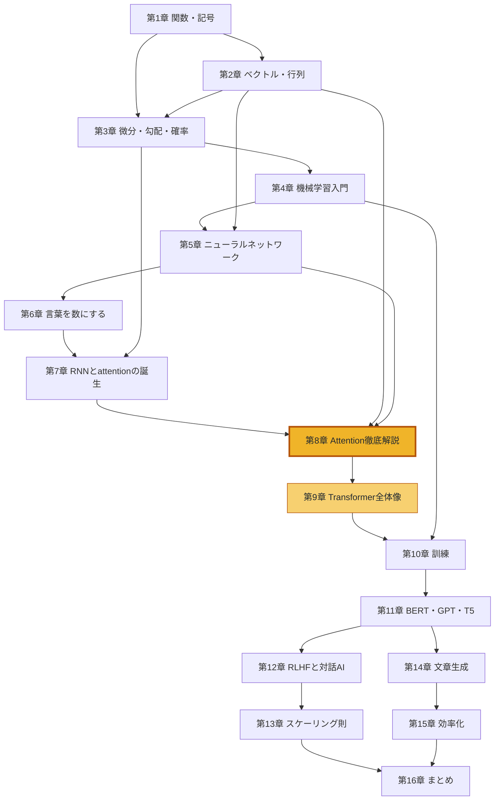

# ゼロから理解するTransformer — 予備知識なしで読めるLLMの仕組み

本書は、ChatGPTなどの **大規模言語モデル(LLM: Large Language Model)** の中核にある **Transformer(トランスフォーマー)** という仕組みを、**数学・統計・機械学習の予備知識がない人でも理解できる**ように書いた解説書です。

## 本書の方針

Transformerの解説は世の中にたくさんありますが、多くは「ベクトルの内積は知ってますよね」「勾配降下法は前提です」という調子で始まります。本書は逆に、**「その知識を理解するには何が必要か」を芋蔓式に遡り、必要な知識をすべて手前の章で解説してから先に進みます**。

- 前提とするのは **中学数学 + 文系高校数学の基礎** だけです
- ベクトル・行列・微分・対数・確率分布は、本書の中でゼロから解説します
- すべての数式に **日本語の読み下し** と **小さな数値での手計算例** を付けます
- 文字だけでなく **図・表・数式** で視覚的に説明します
- 分量よりも「理解できること」を優先しています。急がず順番に読んでください

> [!NOTE]
> 本書の図は Mermaid 記法を基本とし、構成図はフローチャート、関数のグラフや確率分布は折れ線・棒グラフ(xychart)で描いています。ベクトルの矢印や行列のレイアウトなど、Mermaid で表現しにくい一部の図だけテキストの図で載せています。数式は LaTeX 記法(`$$ ... $$`)で、数式として表示されます。

## 目次

### 第I部 基礎編 — 数学と機械学習の土台

| 章 | タイトル | 主な内容 |
|---|---|---|
| [第1章](01-functions-and-symbols.md) | 数学の準備(1)— 関数と記号に慣れる | 関数 $f(x)$ 、指数・対数、 $\Sigma$ 記法 |
| [第2章](02-vectors-and-matrices.md) | 数学の準備(2)— ベクトルと行列 | ベクトル、**内積=類似度**、行列積 |
| [第3章](03-derivatives-gradients-probability.md) | 数学の準備(3)— 微分・勾配・確率 | 傾き、勾配、連鎖律、確率分布 |
| [第4章](04-machine-learning-basics.md) | 機械学習入門 | 損失関数、勾配降下法、過学習 |
| [第5章](05-neural-networks.md) | ニューラルネットワーク | 層、活性化関数、softmax、交差エントロピー |

### 第II部 入門編 — 言葉を数にしてTransformerへ

| 章 | タイトル | 主な内容 |
|---|---|---|
| [第6章](06-words-to-numbers.md) | 言葉を数にする | トークン化、埋め込みベクトル |
| [第7章](07-before-transformer.md) | Transformer前夜 — RNNの栄光と限界 | 言語モデル、RNN、seq2seq、attentionの誕生 |
| [第8章](08-attention.md) | **Attention徹底解説【本書の山場】** | Q/K/V、self-attention、multi-head、マスク |
| [第9章](09-transformer-architecture.md) | Transformerの全体像 | 位置エンコーディング、残差接続、LayerNorm、FFN |

### 第III部 応用編 — LLMの世界へ

| 章 | タイトル | 主な内容 |
|---|---|---|
| [第10章](10-training.md) | Transformerを訓練する | 自己教師あり学習、次単語予測、パープレキシティ |
| [第11章](11-bert-gpt-t5.md) | 三つの系譜 — BERT・GPT・T5 | エンコーダ型/デコーダ型/両方型の使い分け |
| [第12章](12-from-llm-to-chat-ai.md) | LLMから対話AIへ | 指示チューニング、RLHF、DPO |
| [第13章](13-scaling-laws.md) | スケーリング則と創発 | べき乗則、Chinchilla、創発的能力 |
| [第14章](14-text-generation.md) | 文章を生成する仕組み | 自己回帰生成、温度、top-k/top-p |
| [第15章](15-efficiency.md) | 高速化・効率化の技術 | KVキャッシュ、RoPE、量子化、LoRA、MoE |
| [第16章](16-conclusion-and-next-steps.md) | まとめと次の一歩 + 用語集 | 全体の振り返り、FAQ、学習ロードマップ |

## 知識の依存マップ — なぜこの順番なのか

本書の章立ては「その章を理解するのに必要な知識が、必ず手前の章で手に入っている」ように設計されています。矢印は「→の先を理解するために必要」という意味です。

## 読み方のガイド

- **初心者の方**: 第1章から順番に読んでください。飛ばさないことを強くおすすめします。各章は前の章の知識を当然のように使います。
- **高校理系数学(ベクトル・微分)に自信がある方**: 第1〜3章は流し読みで、第4章から本格的に読み始めても大丈夫です。ただし第2章の「内積=類似度」の節だけは必ず読んでください。この見方は本書全体で繰り返し使います。
- **機械学習の経験がある方**: 第6章または第7章から読み始められます。
- **とにかくTransformer本体だけ知りたい方**: 第8章・第9章が本体ですが、第2章(内積)・第5章(softmax)・第6章(埋め込み)の知識を前提とします。

各章の冒頭には「この章で学ぶこと」「この章の前提」が、末尾には「この章のまとめ」「次の章へ」があります。迷子になったら章冒頭の前提リンクを辿って戻ってください。

## 本書全体を通しての問い

どの章も、最終的には次の一つの問いに答えるためにあります。

**「猫は魚が___」の空欄に入る言葉を、機械はどうやって予測するのか?**

この問いに自分の言葉で答えられるようになれば、Transformerを理解できたと言えます。それでは、第1章から始めましょう。

→ [第1章 数学の準備(1)— 関数と記号に慣れる](01-functions-and-symbols.md)
