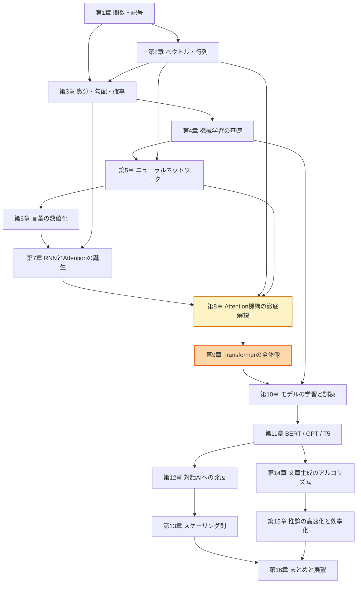

# ゼロから理解するTransformer — 基礎から学ぶLLMの仕組み

本書は、ChatGPTなどの大規模言語モデル（LLM）の中核技術である **Transformer** の仕組みを、数学や機械学習の専門的な前提知識がなくても理解できるように解説したテキストです。

---

## 本書の特徴

多くの解説では省略されがちな「前提となる数学や基礎理論」から丁寧に紐解き、無理なくステップアップできる構成にしています。

- **段階的なアプローチ**: ベクトル、行列、微分、確率などの数学の基礎から順を追って解説します。
- **直感的な理解**: すべての数式に日本語による意味付けと、具体的な手計算の例を掲載しています。
- **視覚的な解説**: 構造やデータの流れを Mermaid による図解やフローチャートで整理しています。

---

## 知識のロードマップ

前の章で扱った知識を次の章で活用する構成になっているため、順を追って読み進めることで自然に理解が深まります。

```mermaid
graph TD
    C1["第1章 関数・記号"] --> C2["第2章 ベクトル・行列"]
    C1 --> C3["第3章 微分・勾配・確率"]
    C2 --> C3
    C3 --> C4["第4章 機械学習の基礎"]
    C4 --> C5["第5章 ニューラルネットワーク"]
    C2 --> C5
    C5 --> C6["第6章 言葉の数値化"]
    C6 --> C7["第7章 RNNとAttentionの誕生"]
    C3 --> C7
    C7 --> C8["第8章 Attention機構の徹底解説"]
    C2 --> C8
    C5 --> C8
    C8 --> C9["第9章 Transformerの全体像"]
    C9 --> C10["第10章 モデルの学習と訓練"]
    C4 --> C10
    C10 --> C11["第11章 BERT / GPT / T5"]
    C11 --> C12["第12章 対話AIへの発展"]
    C12 --> C13["第13章 スケーリング則"]
    C11 --> C14["第14章 文章生成のアルゴリズム"]
    C14 --> C15["第15章 推論の高速化と効率化"]
    C13 --> C16["第16章 まとめと展望"]
    C15 --> C16

    style C8 fill:#fef3c7,stroke:#d97706,stroke-width:2px
    style C9 fill:#fed7aa,stroke:#ea580c,stroke-width:2px
```

---

## 目次

### 第I部 基礎編 — 数学と機械学習の土台

| 章 | タイトル | 主な内容 |
|---|---|---|
| [第1章](01-functions-and-symbols.md) | 数学の準備(1) — 関数と記号に慣れる | 関数 $f(x)$、指数・対数、$\Sigma$ 記法 |
| [第2章](02-vectors-and-matrices.md) | 数学の準備(2) — ベクトルと行列 | ベクトル、内積（類似度）、行列積 |
| [第3章](03-derivatives-gradients-probability.md) | 数学の準備(3) — 微分・勾配・確率 | 微分、勾配降下法、確率分布の基礎 |
| [第4章](04-machine-learning-basics.md) | 機械学習の基本概念 | 損失関数、最適化、過学習とその対策 |
| [第5章](05-neural-networks.md) | ニューラルネットワークの仕組み | 層の構造、活性化関数、Softmax、交差エントロピー |

### 第II部 入門編 — 言語の数値化とTransformer

| 章 | タイトル | 主な内容 |
|---|---|---|
| [第6章](06-words-to-numbers.md) | 言葉を数にする | トークン化、単語の埋め込みベクトル |
| [第7章](07-before-transformer.md) | Transformer前夜 — RNNの功績と課題 | 言語モデルの歴史、RNN、seq2seq、Attentionの萌芽 |
| [第8章](08-attention.md) | Attention機構の徹底解説 | Query/Key/Value、Self-Attention、Multi-Head Attention |
| [第9章](09-transformer-architecture.md) | Transformerのアーキテクチャ全体像 | 位置エンコーディング、残差接続、LayerNorm、FFN |

### 第III部 応用編 — LLMへの発展と最新技術

| 章 | タイトル | 主な内容 |
|---|---|---|
| [第10章](10-training.md) | モデルの訓練 | 自己教師あり学習、次単語予測、パープレキシティ |
| [第11章](11-bert-gpt-t5.md) | 三大アーキテクチャ — BERT・GPT・T5 | エンコーダ型、デコーダ型、エンコーダ・デコーダ型 |
| [第12章](12-from-llm-to-chat-ai.md) | 対話型AIへの進化 | 指示チューニング、RLHF、DPO |
| [第13章](13-scaling-laws.md) | スケーリング則とモデルの創発 | 計算量と精度の関係、創発的能力 |
| [第14章](14-text-generation.md) | テキスト生成の仕組み | 自己回帰生成、サンプリング戦略（Temperature, Top-p） |
| [第15章](15-efficiency.md) | 高速化と軽量化の技術 | KVキャッシュ、量子化、LoRA、MoE |
| [第16章](16-conclusion-and-next-steps.md) | まとめと学習のロードマップ | 全体の振り返り、よくある疑問、今後の学習指針 |

---

## 読み進め方の目安

- **初学者の方**: 第1章から順に読み進めることを推奨します。各章で登場する概念が以降の章の土台となります。
- **数学（線形代数・微積分）の基礎がある方**: 第1〜3章を軽く確認した上で、第4章（機械学習の基礎）または第6章（言語の数値化）から進めることができます。
- **Attention機構を重点的に学びたい方**: 第8章・第9章がTransformerの核心部です。必要に応じて第2章（内積）や第5章（Softmax）を参照してください。
